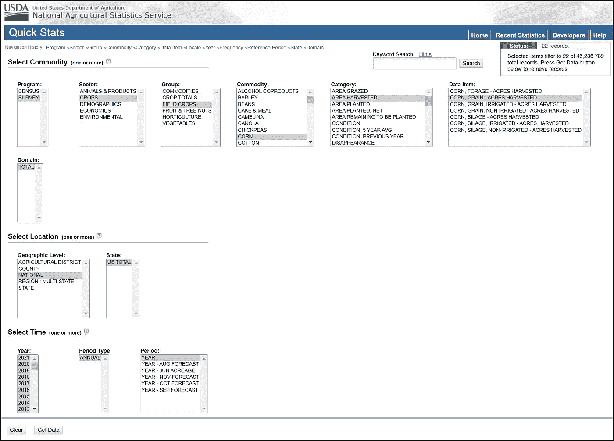
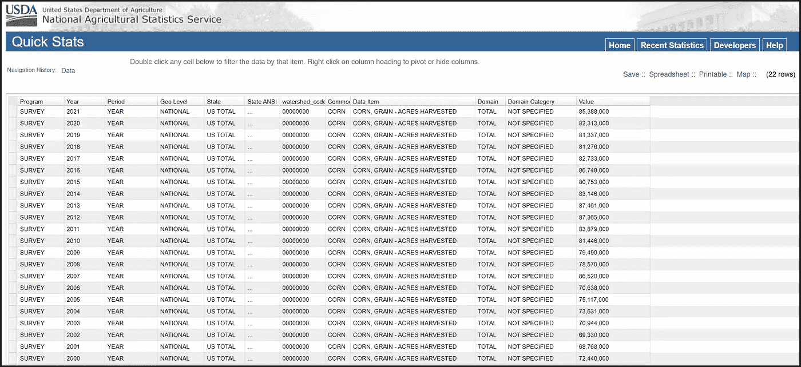
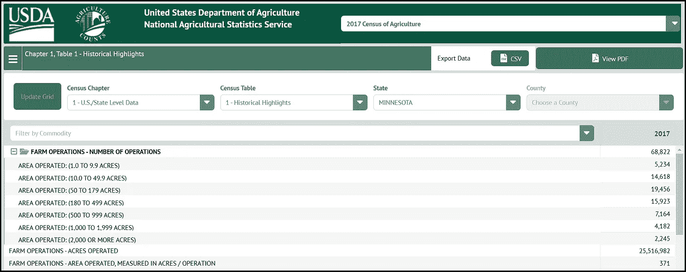
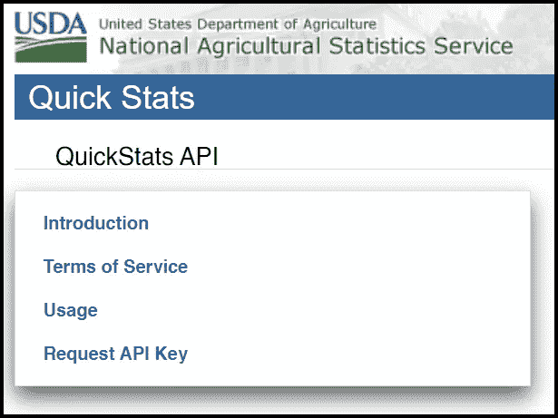
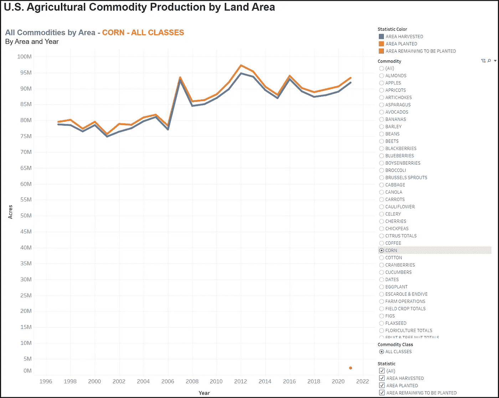
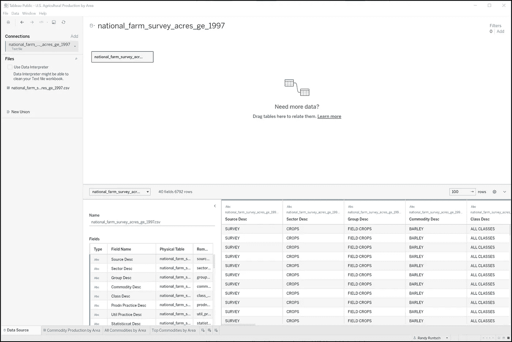
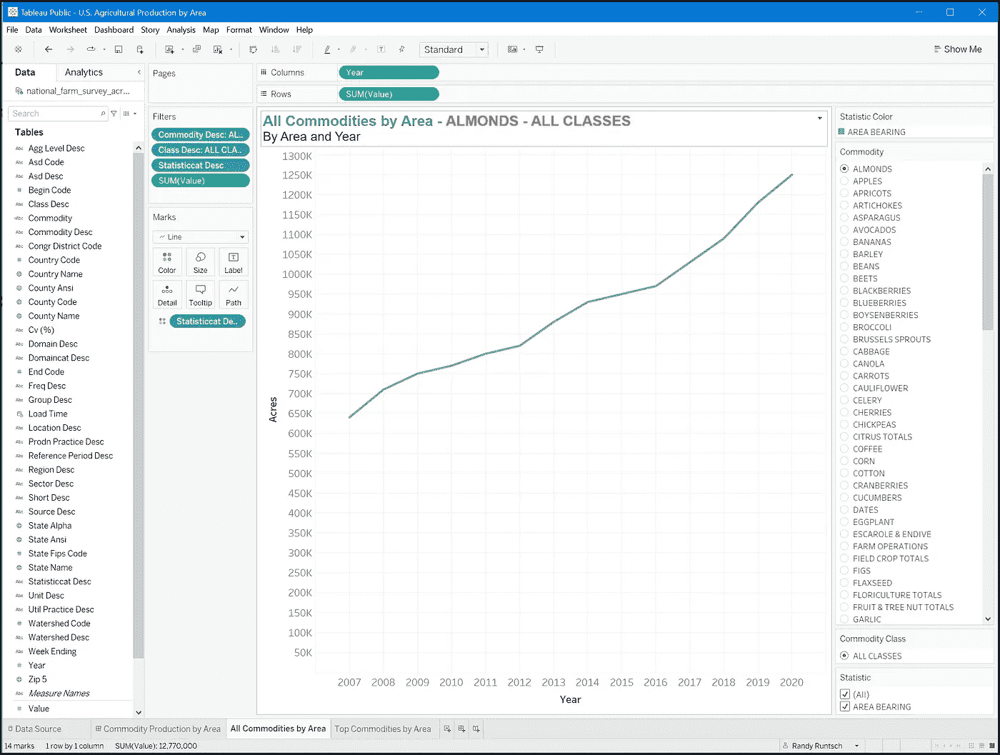

# 使用美国农业部 NASS API、Python 和 Tableau 采集和分析农业数据

> 原文：<https://towardsdatascience.com/harvest-and-analyze-agricultural-data-with-the-usda-nass-api-python-and-tableau-a6af374b8138>

## 数据工程、数据分析、农业和 Tableau

## 这篇教程文章将向您展示如何

照片由 [Scott Goodwill](https://unsplash.com/@scottagoodwill?utm_source=unsplash&utm_medium=referral&utm_content=creditCopyText) 在 [Unsplash](https://unsplash.com/s/photos/farm?utm_source=unsplash&utm_medium=referral&utm_content=creditCopyText) 上拍摄

美国有幸拥有肥沃的土壤和庞大的农业产业。客观来看，2021 年，超过 200 万个农场在超过 9 亿英亩(3.64 亿公顷)的土地上运营。这相当于平均每个农场经营近 450 英亩。数据科学家、分析师、工程师和任何公众成员都可以自由地利用美国农业部(USDA)管理的超过 4600 万条农业相关数据记录。

> 本文“将向您展示如何使用 Python 通过 NASS 快速统计 API 检索农业数据。”—作者

美国农业部国家农业统计局(NASS)通过报告、地图、搜索工具和 NASS 快速统计 API，在[的网站](https://www.nass.usda.gov/Data_and_Statistics/index.php)上向公众提供农业部的农业数据。这篇文章将为您提供 NASS 网页上可用数据的概述。然后，它将向您展示如何使用 Python 通过 NASS 快速统计 API 检索农业数据。最后，它将解释如何使用 Tableau Public 来可视化数据。

# NASS 数据概述

NASS 在国家、州和县一级收集和管理不同类型的农业数据。以下是它存储和提供的一些数据类型:

*   农作物和植物
*   人口统计数据
*   经济和价格
*   环境的
*   家畜和动物
*   研究、科学和技术

NASS 通过 CSV 和 PDF 文件、图表和地图、可搜索的数据库、预定义的查询和快速统计 API 提供数据。它收集数据的一种方式是通过农业普查，对普查年度内生产或销售的产品达到或超过 1000 美元的所有农业活动进行调查。人口普查每五年进行一次，下一次将于 2022 年完成。

# 搜索 NASS 数据集

## 快速统计

NASS 让任何人都可以很容易地通过其快速统计数据库搜索网页检索它捕获的大部分数据。在下面的例子中，我使用 Quick Stats 构建了一个查询来检索美国从 2000 年到 2021 年收获的玉米英亩数。我只是通过从一系列动态下拉菜单中选择一个或多个项目来构建查询。

提示:点击图片查看完整尺寸的可读版本。

使用快速统计创建玉米查询。Randy Runtsch 截图。

从快速统计中的玉米查询得到的数据。Randy Runtsch 截图。

玉米产量数据可以追溯到 1866 年，就在美国内战结束一年后。然而，并不是所有的 NASS 数据都可以追溯到那么久以前。

NASS 还开发了 [Quick Stats Lite](https://www.nass.usda.gov/Quick_Stats/Lite/index.php) 搜索工具来搜索其数据库中的商品。虽然它不能通过快速统计访问所有可用的数据，但您可能会发现它更容易使用。

## 普查数据查询工具

Quick Stats 和 Quick Stats Lite 检索农业调查数据(每年收集)和人口普查数据(每五年收集一次)，而[人口普查数据查询工具](https://www.nass.usda.gov/Quick_Stats/CDQT/chapter/1/table/1)更容易使用，但只能检索人口普查数据。它可以为 77 个不同的表返回国家、州和地方级别的 2012 年和 2017 年人口普查数据。每个表都包含不同类型的数据。

在下面显示的示例中，我选择了人口普查表 1-明尼苏达州 2017 年农业普查的历史亮点。报告显示，在 2017 年的人口普查中，明尼苏达州有 68，822 个农场，占地 25，516，982 英亩。

明尼苏达州的农场经营。Randy Runtsch 截图。

# NASS 快速统计 API 简介

现在你已经对 NASS 数据库中的可用数据有了基本的了解，你可以学习如何通过 [NASS 快速统计 API](https://quickstats.nass.usda.gov/api) 在你的项目中获得它的好处。通过快速统计应用程序编程接口(API)，您可以使用编程语言(如 Python)从快速统计数据库中检索数据。事实上，您可以使用 API 来检索通过 Quick Stats search 工具和 Census Data Query 工具获得的相同数据，这两个工具在上面都有描述。

在开始使用 Quick Stats API 之前，请熟悉它的服务条款和用法。在使用 API 之前，您需要请求一个免费的 API 密钥，您的程序将在使用 API 的每个调用中包含这个密钥。

从 [Quick Stats API 菜单](https://quickstats.nass.usda.gov/api)，您可以访问开始使用所需的一切。Randy Runtsch 截图。

API 使用页面提供了其使用说明。虽然有三种类型的 API 查询，但本教程主要关注最灵活的查询，即“GET /api/api_GET”查询。它接受“what”、“where”和“when”参数的组合来搜索和检索感兴趣的数据。

虽然 Quick Stats 数据库包含超过 5200 万条记录，但是任何使用 GET /api/api_GET 查询的调用都被限制为 50，000 条记录的结果集。会返回更多记录的查询会返回错误，并且不会继续。

# 构建示例快速统计 API URL

下面是本文示例中将使用的基本 URL 的格式:

> **关键字&{参数…参数} &格式={json | csv | xml}**

*请参见 [Quick Stats API“使用”页面](https://quickstats.nass.usda.gov/api)了解该 URL 和其他两个 URL。*

*在示例程序中，“ **api 键**的值将被替换为我的 api 键。此外，参数值可以用特定的参数值对来替换，以搜索所需的数据。最后，**格式**将被设置为“csv”，这是一种在 Tableau Public 中工作良好的数据文件格式类型。上面的例子中没有显示回调函数参数的使用，这超出了本文的范围。*

*下一节中展示的示例 Python 程序将调用带有一系列参数的快速统计数据。从服务器接收到 CSV 格式的数据后，它会将数据写入一个文件，每行一条记录。然后，该文件将被导入 Tableau Public，以显示数据的可视化效果。*

*该程序将使用 API 来检索从 1997 年到 2021 年全国范围内每种商品(一种作物，如玉米或大豆)使用的英亩数。下面是它将在 API 调用中提交以检索该数据的参数和值对:*

*   *资料来源 _desc =调查*
*   *部门 _desc =农场&土地&资产*
*   *商品 _desc =农场经营*
*   *单位 _desc =英亩*
*   *desc 频率=年度*
*   *参考 _ 期间 _desc =年*
*   *Year__GE = 1997(大于或等于 1997 的所有年份)*
*   *State_name =美国总计*
*   *格式= CSV*

*下面是完整编码的 URL，下面的程序用 Quick Stats API 创建并发送。请注意，值“PASTE_YOUR_API_KEY_HERE”必须替换为您的个人 API 密钥。*

> **http://quickstats.nass.usda.gov/api/api_GET/?KEY = PASTE _ YOUR _ API _ KEY _ HERE&source _ desc = SURVEY&sector _ desc % 3d farms % 20% 26% 20 lands % 20% 26% 20 资产&商品 _ desc % 3d farm % 20 operations&statistics cat _ desc % 3d area % 20 operated&unit _ desc = ACRES&freq _ desc = ANNUAL&reference _ period _ desc = YEAR&YEAR _ _ GE = 1997&agg**

*每个参数都在“快速统计使用”页面的“快速统计列定义”表中进行了描述，如下所示。对于大多数列名或标题名值，第一个小写的值是 API 参数名，如上所示。括号中的名称是快速统计查询工具中使用的相同值的名称。例如，在上面显示的 API 参数列表中，参数“source_desc”等同于快速统计查询工具中的“程序”。*

**

*“快速统计 API 用法”页面上的“快速统计列定义”表命名并描述了可用于查询和结果的每个参数。作者截图。*

# *调用快速统计 API 的 Python 程序*

## *Python 编程工具*

*虽然我使用免费的 Microsoft Visual Studio 社区 2022 集成开发 ide (ide)来编写和运行本教程的 Python 程序，但请随意使用您最喜欢的代码编辑器或 IDE。如果你有兴趣尝试 Visual Studio 社区，可以[安装在这里](https://visualstudio.microsoft.com/vs/community/)。如果使用它，一定要安装它的 Python 应用支持。安装 Visual Studio 后，可以随时添加语言功能集。*

## *Python 代码*

*调用 NASS 快速统计 API 来检索农业数据的 Python 程序包括以下两个代码模块(文件):*

*   ***c_usad_quick_stats.py** —该文件包含 c_usda_quick_stats 类，该类封装了使用快速状态 API 所需的代码。它的 get_data()函数调用 API，检索结果数据集，并将数据集写入 CSV 文件。*
*   ***run _ USDA _ Quick _ Stats . py**—这个文件为快速统计 API 的调用准备参数。然后，它创建 c_usa_quick_stats 类的一个实例。最后，它使用参数和文件名调用实例，生成的农业数据 CSV 文件将保存在该文件中。*

*向下滚动查看两个模块的代码。以下伪代码描述了程序的工作原理:*

1.  *在文件 run_usda_quick_stats.py 中创建 parameters 变量，该变量包含用于从快速统计数据库中选择数据的参数和值对。*
2.  *创建 c_usda_quick_stats 类的一个名为 stats 的实例。这将调用其初始化器(__init__())函数，该函数设置 API 键、Quick Stats API 的基本 URL 以及该类将在其中写入包含农业数据的输出 CSV 文件的文件夹的名称。*
3.  *使用参数字符串和输出文件的名称(不带扩展名)调用函数 stats.get_data()。*
4.  *在 c_usd_quick_stats 的 get_data()函数中，创建完整的 URL。*
5.  *从快速统计服务器检索数据。*
6.  *解码 utf8 格式的数据快速统计数据。*
7.  *创建完整的输出文件名。*
8.  *打开输出文件。*
9.  *将 CSV 数据写入输出文件。*
10.  *关闭输出文件。*

*注意在步骤 1 中创建参数字符串时使用了 urllib.parse.quote()函数。该函数用转义码替换文本中的空格和特殊字符，转义码可以作为完整 URL 的一部分传递给 Quick Stats web 服务器。*

*还要注意，我是在 Windows PC 上编写这个程序的，它在文件名和文件夹名中使用反斜杠(" \ ")。因此，如果要在 Mac OS 或 Linux 上运行代码，可能需要更改文件路径值的格式，例如:self . output _ file _ path = r ' c:\ \ USDA _ quick stats _ files \ \ '。*

*以下是使用 Quick Stats API 检索农业数据的两个 Python 模块:*

*该计划检索数据与快速统计 API，并将其存储在一个 CSV 文件。由 Randy Runtsch 编写的代码。*

# *运行程序*

*要运行这个程序，你需要安装 Python *requests* 和 *urllib* 包。在某些环境中，您可以使用 PIP 安装实用程序来完成此操作。如果你使用 Visual Studio，你可以按照微软的指示，通过 IDE 的菜单[安装它们。](https://docs.microsoft.com/en-us/visualstudio/python/tutorial-working-with-python-in-visual-studio-step-05-installing-packages?view=vs-2022)*

*此外，在运行程序之前，在 c_usda_quick_stats 类的 __init__()函数中创建 self.output_file_path 变量中指定的文件夹。您也可以随意更改路径名的值。*

*如果您使用的是 Visual Studio，则将启动文件设置为 run_usda_quick_stats.py 文件，方法是在解决方案资源管理器中右键单击文件名，然后从弹出菜单中单击[设置为启动文件]。然后，当您单击[运行]时，它将首先使用该文件开始运行程序。*

*记得请求您的个人 Quick Stats API 密钥，并将其粘贴到 c_usda_quick_stats 类的 __init__()函数中 self.api_key 的值中。*

*完成上面列出的步骤后，运行程序。如果一切正常，那么它应该在几秒钟内完成，并将指定的 CSV 文件写入输出文件夹。*

# *示例 Tableau 仪表板*

*为了演示使用 Quick Stats API 获得的农业数据，我在 Tableau Public 中创建了一个简单的仪表板。Tableau Public 是商业 Tableau 数据可视化工具的免费版本。它的主要限制是 1)它只能将可视化项目保存到 Tableau 公共服务器，2)世界上的任何人都可以看到所有的可视化项目，3)它只能处理少量的输入数据类型。*

**

*为本文创建的 Tableau 仪表板中的两个工作表中的第一个。使用 Quick Stats API 检索的数据，它显示了美国农场每年种植的商品(作物—本例中显示的是玉米)的种植面积。由 Randy Runtsch 创建的 Tableau 仪表板。*

**

*为本文创建的 Tableau 仪表板中的两个工作表中的第二个。使用 Quick Stats API 检索的数据，它显示了每年种植八种商品(作物)的面积，这八种商品消耗了美国最大的农田面积。由 Randy Runtsch 创建的 Tableau 仪表板。*

*样本 Tableau 仪表盘名为 [**美国按土地面积划分的农业商品产量**](https://public.tableau.com/shared/X75H4N5GN?:display_count=n&:origin=viz_share_link) 。请随意下载并在 Tableau 公共桌面应用程序中修改它，以了解如何创建和发布 Tableau 可视化。*

*如何使用 Tableau Public 的说明超出了本教程的范围。但是，以下是安装 Tableau Public 并构建和发布仪表板的基本步骤:*

1.  *[在 Windows 或 Mac OS 机器上安装 Tableau Public](https://public.tableau.com/en-us/s/) Desktop。如果有兴趣学习如何使用 Tableau，请点击查看[免费互动培训视频。](https://public.tableau.com/en-us/s/resources)*
2.  *打开 Tableau Public Desktop，并通过上述 Python 程序将其连接到使用 Quick Stats API 检索的农业 CSV 数据文件。*
3.  *创建一个工作表，允许用户选择一种商品(玉米、大豆，选择的)并查看从 1997 年到 2021 年种植或收获的英亩数。*
4.  *创建一个工作表，显示从 1997 年到 2021 年顶级商品的收获英亩数。*
5.  *将这两个工作表添加到仪表板中。*
6.  *将仪表板发布到 Tableau 服务器。*

**

*这张来自 Tableau Public Desktop 的截图显示了与文件 national _ farm _ survey _ acres _ ge _ 1997 . CSV 的连接，该文件是由本文中描述的 Python 程序创建的。屏幕显示文件中的样本记录。Randy Runtsch 截图。*

**

*这张来自 Tableau Public Desktop 的屏幕截图显示了名为“所有商品(按区域)”的工作表是如何创建的。请注意左侧 CSV 文件中的字段名称。Randy Runtsch 截图。*

# *摘要*

*完成本教程后，您应该对以下内容有了大致的了解:*

*   *存储在 FDA 快速统计数据库中的农业数据类型。*
*   *如何查询数据库？*
*   *如何编写 Python 程序通过 Quick Stats API 查询 Quick Stats 数据库？*
*   *如何安装 Tableau Public 并了解它，如果您想尝试使用它来可视化农业数据或将其用于其他项目。*

*我可以想象许多使用 Quick Stats 数据库数据的项目用例。收集丰富的数据集为理解和发展提供了机会。*