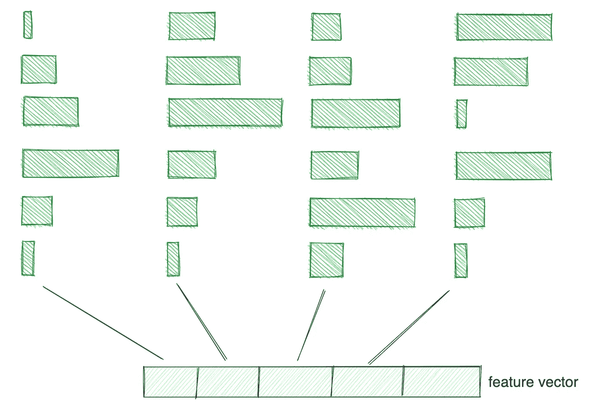
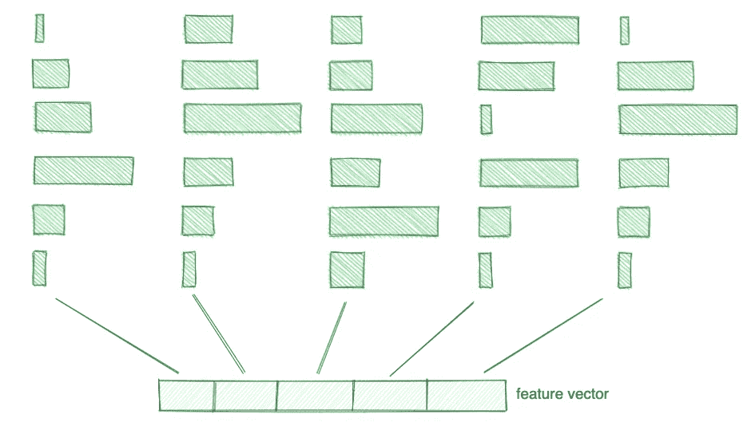
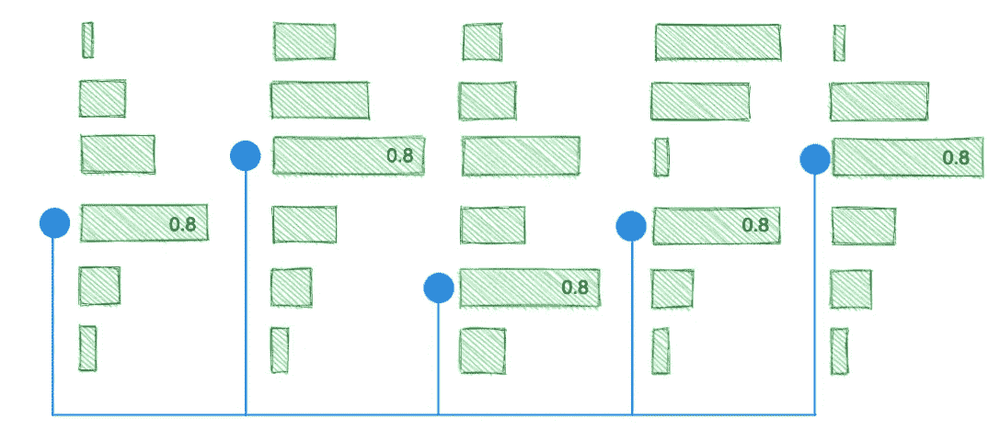
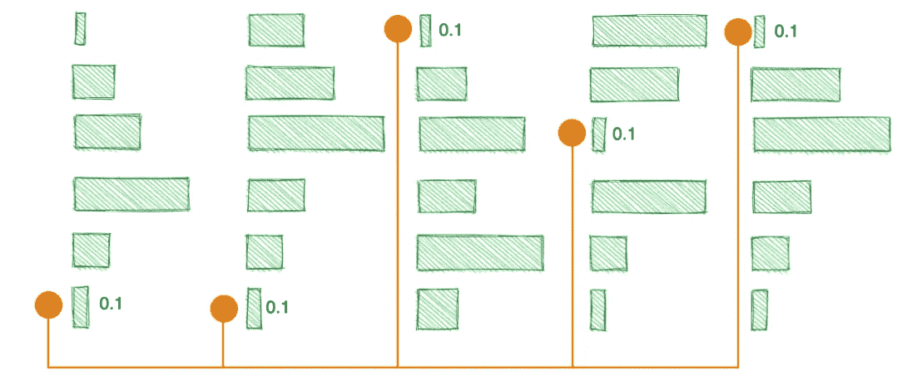
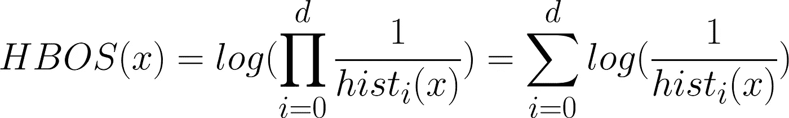
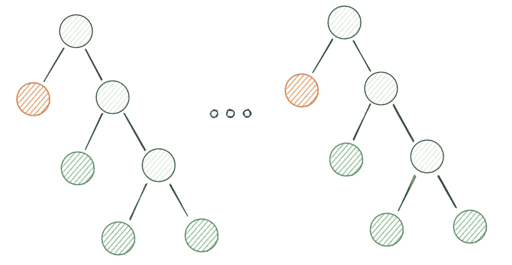

# 用 Python 实现快速异常检测

> 原文：<https://towardsdatascience.com/hbos-vs-iforest-on-macbook-pro-m1-c258d2b5fe6b>

## M1 MacBook Pro 上的 HBOS vs iForest

HBOS 算法图解(图片由作者提供)

在这篇博文中，我们将比较基于直方图的异常值分数(HBOS ),一种基于邻近度的异常值检测算法，该算法被证明是快速的，具有线性时间复杂度，以及一种称为隔离森林的集成方法。

我们将讨论这两种算法背后的工作原理，以及它们在 MacBook Pro M1 上针对 17 个不同数据集的各自性能。

[异常检测数据集(ODDS)](http://odds.cs.stonybrook.edu/) 组公开提供可用于测试异常检测算法的数据集。它们为几个领域提供不同种类的数据，并且总是提供我们可以用来评估异常值检测项目的基础事实。

# HBOS

基于直方图的异常值分数(HBOS)是一种识别数据异常值的机器学习算法。该算法于 2012 年由 Goldstein、Markus 和 Andreas Dengel 在一篇名为“基于直方图的异常值得分(HBOS):一种快速无监督异常检测算法”的论文中发表[1].

> 这是通过为每个维度创建数据的直方图，然后基于特定数据点落入每个维度的直方图区间的可能性来计算分数来实现的。

每个维度的直方图分布(图片由作者提供)

> 分数越高，数据点越有可能是异常值。

为了计算一个实例(一个数据点)的得分，我们查看该实例属于哪个箱。大多数情况下，特征向量将占用非常可能的条柱，如下图所示。

推导过程中获得的非常可能的特征向量的图示(图片由作者提供)

另一方面，来自异常的特征向量将在其一个或几个维度中占据不太可能的面元，如下图所示。

推导过程中获得的非常不可能的特征向量的图示(图片由作者提供)

原始论文[1]中提出的计算异常分数的指标如下:

HBOS 方程(来源:[1])

> 想法是将每个特征向量维度的结果二进制数的倒数相乘。

根据我们之前的示例，描述落入非常不可能的箱中的异常值的第一个特征向量的分数明显更高:

异常示例的 HBOS 异常分数(图片由作者提供)

并且更可能的特征向量将具有较低的分数:

无异常示例的 HBOS 异常分数(图片由作者提供)

你可能想知道为什么 HBOS 方程使用*对数*函数？

应用日志的目标是获得对极小 bin 值不太敏感的异常分值，以及由于浮点精度不可避免的误差而可能带来的误差。

> *对数*是单调递增的，因此不会改变分数的顺序。

HBOS 可以有效地识别低维和高维数据中的异常值。然而，每个维度的直方图的宁滨方法将影响时间复杂度。在固定宁滨方法的情况下(如上图所示)，面元具有相等的大小，并且时间复杂度是线性的，即 O(n)。

如果我们不知道每个维度的分布，或者如果我们面临长尾分布，那么动态绑定方法也是可能的，并且受到鼓励。但那样的话，时间复杂度就变成 O(n log(n))。

# iForest

隔离森林(iForest)是一种异常检测算法，其工作原理是隔离样本，并根据样本隔离的难易程度为其分配一个分数。2008 年，刘、和在一篇名为“隔离森林”的论文中首次提出了该算法[2]。

iForest 算法实现简单，可用于任何类型的数据(数值型、分类型等)。).

隔离树算法的图示(图片由作者提供)

通过递归分割数据来构建隔离树。例如，要在 100 个数据点上构建一个具有 10 个维度的决策树，我们首先将这 100 个数据点分成两部分，然后将分开的部分再分成其他部分，以此类推。

> 要拆分数据点，我们只需从 10 个维度中选择一个随机属性，并根据所选属性上设置的随机值拆分数据。

即使在选择用于分割数据的属性和值时涉及到许多随机过程，也更有可能在早期分割异常值。

比如说我们要建一个隔离树，把人民按照财富来隔离。埃隆·马斯克预计将成为世界上第一个亿万富翁。因此，该属性的可能值范围是 0 到 1 万亿。我们从 0 到 1 万亿中随机选择一个数字——比如 25 亿——我们已经把拥有财富少于 1 万亿的人群从富人中分离出来。

> 事实上，离群值最终出现在隔离树中较短的路径上。路径越小，数据点越有可能是异常值，异常值越高。

最后，iForest 算法构建一组隔离树，输出异常分数，并计算所有隔离树之间的平均异常分数。

# MacBook Pro M1 的结果

在这篇博文中，我们使用了 [Pyod](https://pyod.readthedocs.io/en/latest/) 库来测试异常值检测算法。

它提供了一种简单的方法来比较不同的算法，并为给定的数据集选择最佳的算法。PyOD 还提供了多种功能，方便研究和生产。如果您想在不同的机器上运行相同的基准测试，这里有他们网站的链接:

 [## 基准— pyod 1.0.2 文档

### 对于每个数据集，首先将其分为 60%用于训练，40%用于测试。所有实验重复 10 次…

pyod.readthedocs.io](https://pyod.readthedocs.io/en/latest/benchmark.html) 

关于测试的设置，基准测试是通过以下配置完成的:

*   型号名称:MacBook Pro
*   芯片:苹果 M1
*   最大值 CPU 时钟速率:3.2 GHz
*   内核总数:8 (4 个性能和 4 个效率)
*   内存:16 GB

这是 10 次独立试验的平均结果:

10 次独立试验的平均执行时间(源代码: [PyOD](https://pyod.readthedocs.io/en/latest/benchmark.html)

10 次独立试验的平均 ROC 性能(源代码: [PyOD](https://pyod.readthedocs.io/en/latest/benchmark.html)

10 次独立试验的 N 个样本的平均精度(源代码: [PyOD](https://pyod.readthedocs.io/en/latest/benchmark.html)

# 结论

在异常检测领域，有许多竞争者，但是对于这篇博文，我们决定比较 HBOS 和 iForest。这两种方法在实时应用中都被证明是有效的，但是哪一种更好呢？

> 总的来说，HBOS 通常是一种更快的方法，但它可能没有 iForest 准确，这取决于数据集的类型。

所以，这真的取决于你的需要，至于哪种方法更好。如果速度更重要，那么 HBOS 是最好的选择。但是，如果准确性是最重要的，并且您正在使用高维特征向量，那么您可能希望使用 iForest。

好奇想了解更多关于 Anthony 的工作和项目吗？在[中](https://medium.com/@anthonycvn)、 [LinkedIn](https://www.linkedin.com/in/anthonycavin/) 、 [Twitter](https://twitter.com/Anthony66333223) 上关注他。

*需要技术写手？将您的请求发送到*[*https://amigo CCI . io*](https://amigocci.io/blog/mlops-at-medium-scale/)*。*

[1]戈尔茨坦、马库斯和安德烈亚斯·登格尔。"基于直方图的异常值分数(hbos):一种快速无监督异常检测算法." *KI-2012:海报和演示音轨* 9 (2012)。

[2]刘，费托尼，，丁，.“隔离林。” *2008 年第八届 ieee 数据挖掘国际会议*。IEEE，2008 年。