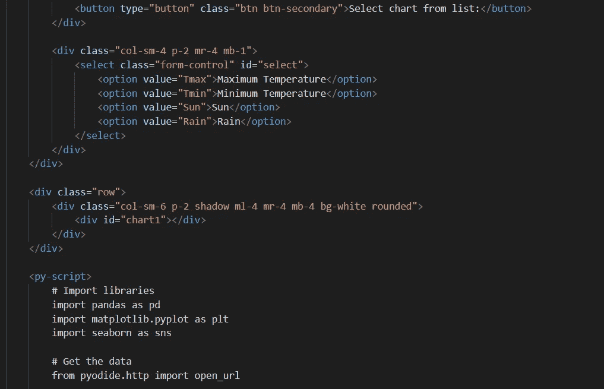

# 你好 PyScript

> 原文：<https://towardsdatascience.com/hello-pyscript-goodbye-javascript-c8d8fb83a93a>

## 意见

## 既然浏览器中有了新的脚本语言，JavaScript 会发生什么变化

作者图片

未来的 web 应用会全部用 PyScript 编写吗？Python 拥有现代编程语言的所有属性和支持大量应用程序类型的大量库，所以如果可以选择，为什么要使用 Javascript 呢？

好吧，等一下。

对于许多投入大量时间和精力学习 Python 语言和各种库(Numpy、Pandas、Matplotlib、SciPy、Plotly……)的数据科学家来说，在浏览器中使用 python 无疑是一个好主意。例如，我们这些花了很长时间在 Jupyter 笔记本上编写数据可视化代码的人，现在可以直接将我们的工作发布到网络上，而无需担心 Django 或 Flask 等服务器框架，也无需配置服务器或担心如何在 Heroku 或 AWS 或 Azure 上部署应用程序。

PyScript 应用只是网页。

但是在 Javascript 开发方面也有大量的投资，大多数基于 JavaScript 的 web 应用程序并不关心数据科学。JavaScript 也有大量用于各种目的的库，并且与早年稍显古怪和实现不一致的版本不同，JavaScript 还是一种现代的全功能编程语言。

例如，如果您是 React.js 程序员，您肯定不会张开双臂欢迎对 PyScript 的更改。部署也很容易，因为 JavaScript 应用程序也只是网页。

那么 PyScript 适合做什么呢？如果不是 JavaScript 的替代品，那是什么？

到目前为止，Python 代码被归入服务器。老实说，这并不是什么坏事。Python 代码在功能强大的服务器上的运行速度要比在笔记本电脑的浏览器上快得多，因此，如果有大量的处理工作要做，服务器是最好的地方。

那么，问题来了: PyScript 擅长什么 ***？***

我目前的答案是:如果有合适的库，轻量级应用程序可以用 Javascript 编写。这些主要是面向科学和数据科学的应用。以及不需要大量处理(在浏览器环境中可能会很慢)和作者已经熟悉 Python 的应用程序。

目前，PyScript 处于 alpha 开发阶段，所以它只会不断改进，但目前它的进展有点慢。这当然取决于运行它的硬件的能力。我尝试在一台 2g 内存的 Windows 10 平板电脑上运行我编写的应用程序(见下文),在应用程序开始工作之前，加载和初始化需要大约两分钟——这是一段很长的时间。另一方面，在一台典型的家用笔记本电脑上，这个过程不到 30 秒——我见过许多网站在同一台机器上完全加载需要那么长时间。

PyScript 目前还缺乏某些功能，例如，您可能会发现您必须使用 PyScript 特定的函数来从服务器加载数据，尽管从积极的方面来看，它与 DOM 和 Javascript 函数的交互非常好，这是标准 Python 的附加功能。

那么，PyScript 是 JavaScript 的威胁吗？不会。它会成为科学家和数据科学家构建轻量级 web 应用的有用方式吗？我想是的，但是还有很多工作要做。

我写了一篇关于 PyScript 入门的教程——点击下面的链接，看看吧。

*更新:*[*PyScript 新特性*](https://alan-jones.medium.com/whats-new-in-pyscript-dfdf25538281) *查看截至 2023 年初对 PyScript 进行的一些重大更改。*

</create-an-interactive-web-app-with-pyscript-and-pandas-3918ad2dada1>  

你可以在我的[网页](http://alanjones2.github.io)上找到更多我的工作和工作代码的链接。

<https://alanjones2.github.io> 