# 异质处理效应与元学习者

> 原文：<https://towardsdatascience.com/heterogeneous-treatment-effect-and-meta-learners-38fbc3ecc9d3>

## 使用 S 学习器、T 学习器和 X 学习器的因果推理

[活动发起人](https://unsplash.com/@campaign_creators?utm_source=medium&utm_medium=referral)在 [Unsplash](https://unsplash.com?utm_source=medium&utm_medium=referral) 上的照片

到目前为止，在我们之前的文章[***因果推断入门***](/getting-started-with-causal-inference-5cb61b707740) 和 [***因果推断方法中，我们谈到了平均治疗效果，这有助于我们理解是否应该给予特定的治疗，例如，我们是否应该推出特定的营销活动，或者我们是否应该提高产品的价格(**我们是否应该治疗**)等。但它没有告诉我们应该为谁推出或提高价格，因为治疗的效果因人而异(**我们为谁治疗**)，如果我们为此进行优化，那么我们就有更好的机会提高我们的投资回报率。我们现在希望超越我们在以前的博客中讨论的平均治疗效果(ATE ),并估计条件平均治疗效果 **(CATE)** 或异质治疗效果，以更好地个性化治疗方案，并了解治疗效果如何因人而异***](/methods-for-inferring-causality-52e4144f6865)

机器学习模型在估计 E[Y|X]方面做得很好，因为在预测宇宙中，我们是被动的观察者，在给定一组特征 X 的情况下预测结果 Y，比如销售。但在行业中，我们希望调整某些杠杆来增加销售，我们对 E[Y|X，T]更感兴趣，其中 X 是我们不能或不想控制的一组特征，T 是我们希望干预以增加销售的治疗变量。异质处理效应是在 Xᵢ.的背景下，估计 Tᵢ对 Yᵢ的因果关系的过程

大多数情况下的因果推断涉及根据治疗效果对单位进行排序，例如，寻找更有可能对治疗做出积极反应的单位/个人。在进入**元学习者**之前，让我们用一个价格弹性的例子来理解美食，使用我们知道的最简单的模型，回归。假设一家果汁店想知道他们如何在不损失销售额的情况下改变价格，即价格相对于温度或星期几的弹性，等等。这是同样的玩具数据集。

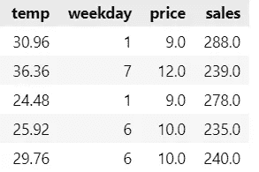

让我们建立一个简单的模型来获得价格弹性，即价格的单位变化如何影响销售。这正是回归系数给我们的。

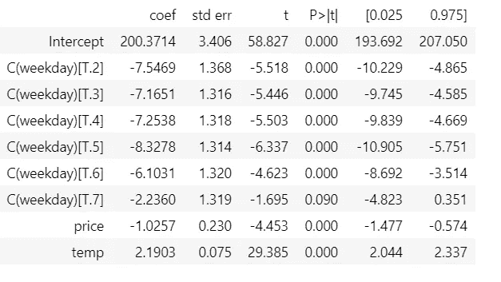

我们看到价格的平均治疗效果(ATE)为-1.025，这对于所有单位都是不变的。但更有用的是价格弹性如何随温度变化，因为这将使我们能够在某些日子改变价格，而不会损失大量销售。我们可以通过回归在方程中引入一个相互作用项来做到这一点

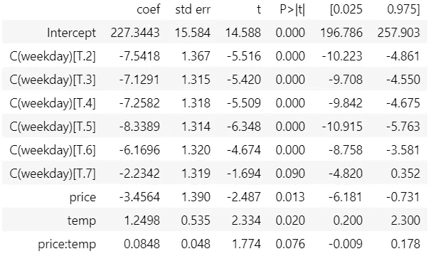

这里价格弹性由-3.45 + 0.0848 *temp 给出。价格对销售的影响随着我们果汁品牌温度的升高而降低。这是一个非常简单的例子，仅仅用来介绍**美食**的概念。现在，让我们深入研究元学习者和更多行业使用的 CATE 案例。

# 元学习者

**元学习器是一组建立在随机森林、Xgboost 或神经网络等机器学习算法之上的算法，用于帮助估计 CATE。** [【昆泽尔】](https://arxiv.org/pdf/1706.03461v3.pdf)

## s 学习者

在 S 学习器或单估计器学习器中，治疗指示符作为一个特征被包括，类似于所有其他特征，而该指示符没有被赋予任何特殊的作用。然后我们在不同的状态下进行预测，预测的差异就是我们的 CATE 估计。

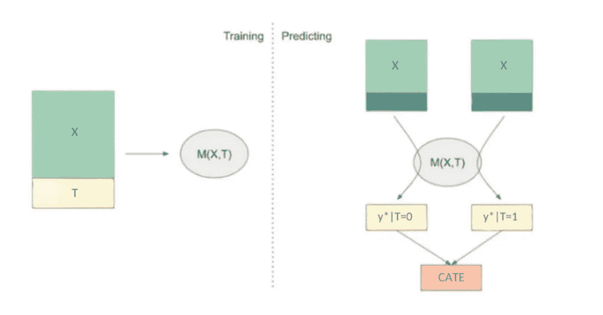

作者图片

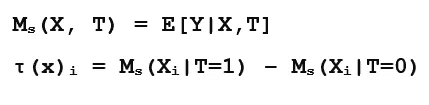

我们将始终使用这个示例，其中 w 是我们的处理方式，可以是任何形式的干预，例如，发送给银行客户的电子邮件。

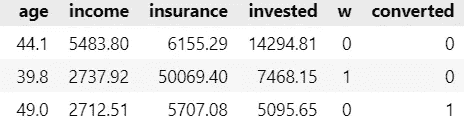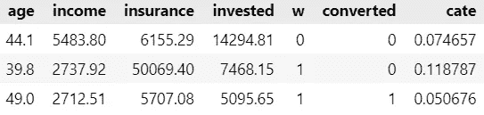

的学习器是一个非常简单的模型，它可能对某些数据集工作得很好，但是由于它部署了单个 ML 模型，该模型通常是一个正则化的模型，它倾向于将处理效果偏向零。如果处理效果在解释结果方面很弱，学习者可以完全忽略处理变量。下一个学习者克服了这个问题。

## t 学习者

T 学习器通过为每个治疗值建立一个模型来克服完全忽略治疗效果的问题，对于二元治疗，开发了两个模型，因此命名为 T 学习器

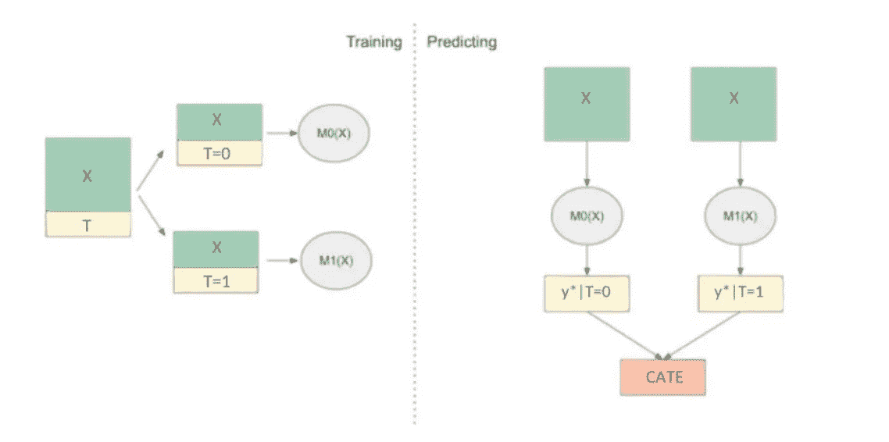

作者图片

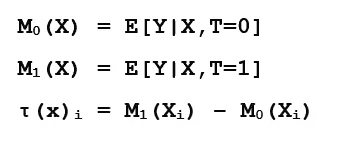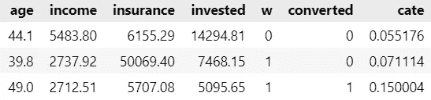

t 学习者避免不拾取弱的处理效果，但是仍然遭受正则化。考虑来自 Künzel 等人 2019 年的这篇[论文中的例子。假设治疗效果是恒定的，并且我们在结果 Y 中有一些非线性，并且治疗单位的数量远少于对照单位](https://arxiv.org/pdf/1706.03461v3.pdf)

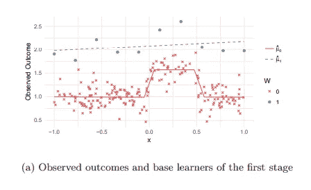

来源:https://arxiv.org/pdf/1706.03461v3.pdf

因为我们只有几个经过处理的观测值，M₁将是一个简单的线性模型，而 M₀将更加复杂，但由于我们有更多的控制单元数据，它不会过度拟合。然而，当我们估计 M₁(x)-M₀(x 的凯特时，从 M₁的线性中减去 M₀的非线性，将得到非线性的凯特，这是错误的，因为凯特在这种情况下是常数 1。为了克服这个问题， [**昆泽尔**](https://arxiv.org/pdf/1706.03461v3.pdf) 在同一篇论文中提出了 X 学习者。

## x 学习者

X 学习者使用来自对照组的信息来为治疗组开发更好的估计器，反之亦然。它有三个步骤，其中之一是倾向得分模型。

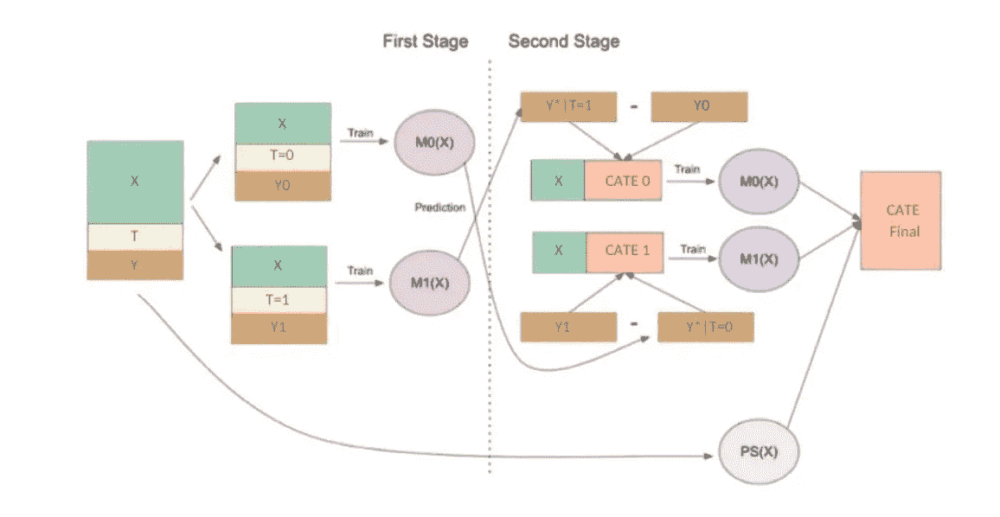

作者图片

使用与上面相同的数据，[**künzel**](https://arxiv.org/pdf/1706.03461v3.pdf)**解释 X 学习者如何克服 T 学习者的弊端。在第一阶段，我们开发了两个类似于 T 型学习者的模型。在第二阶段，我们计算 **τ(X，T=0)** ，其中是对未治疗者的估算治疗效果，基于 **τ(X，T=0)** 的模型不好，因为 M₁是使用较少数据建立的简单模型，它没有捕捉 y 中的非线性，因此 **τ(X，T=0)** 是非线性的。 **τ(X，T=0)是用红点表示的**，而 **Mτ0(X)是用红色虚线表示的**。**

**用蓝点表示的处理过的 **τ(X，T=1)** 的估算处理效果，使用在较大的未处理模型上训练的 M₀来估计，并且由于其估算处理效果是正确的，我们能够获得正确的 **Mτ1(X)** 模型。**

**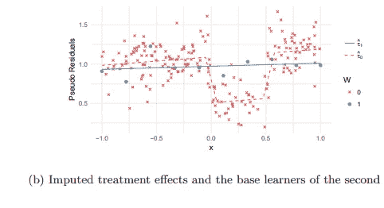**

**[https://arxiv.org/pdf/1706.03461v3.pdf](https://arxiv.org/pdf/1706.03461v3.pdf)**

**因此，我们有两个模型，一个具有基于大量未处理数据的正确估算处理效果，另一个具有不正确的估算处理效果。我们结合这些第二阶段模型使用倾向得分**

**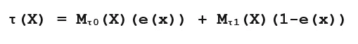**

**e(x)是倾向得分模型，并且由于我们有很少的处理单元，e(x)很小，给不正确的模型 **Mτ0(X)** 较小的权重，给正确的模型 **Mτ1(X)** 较大的权重 1-e(x)**

**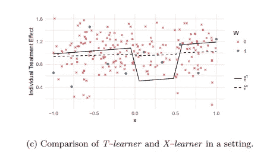**

**【https://arxiv.org/pdf/1706.03461v3.pdf **

**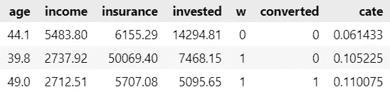**

**我们不必自己实现这些学习器。 ***异构处理效果*** *有两个因果学习库，一个来自优步，名为****CausalML****，另一个来自微软，名为****EconML****，也提供了特征重要性和 Shapley 值的函数***

**使用 causalml 实现 X 学习器。**

**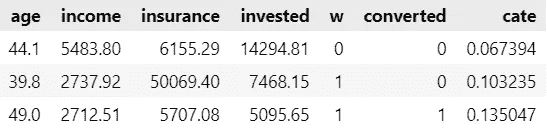**

**X 学习器的 EconML 实现**

****

***我强烈建议浏览一下*[*CausalML*](https://github.com/uber/causalml)*和*[*EconML*](https://econml.azurewebsites.net/spec/estimation/metalearners.html)*文档中的元学习器和附加支持函数。***

**元学习者通常在行业中用于提升建模。下面是几个来自 Booking.com 优步和瑞士的案例研究，元学习者被用来解决与行业相关的问题。**

## **案例学习和研究:使用元学习者的提升建模**

**[在**优步**使用元学习者](https://arxiv.org/pdf/1908.05372.pdf)进行多种处理成本优化的提升建模**

**[提升教程:从因果推理到个性化**Booking.com**](https://drive.google.com/file/d/1X5VbiJvf-G9GBhMJPM-npdL68QlqYLXl/view)**

**[隆起建模又名**swi ggy**处的非均质处理评估](https://bytes.swiggy.com/uplift-modeling-aka-heterogeneous-treatment-effects-evaluation-ad4e3fcf1d76)**

**在本文中，我们将元学习者视为评估 CATE 的方法之一。然而，元学习者不能进行连续的治疗。在下一篇文章中，我们将看看另一种称为[双机器学习](/heterogeneous-treatment-effect-using-double-machine-learning-65ab41f9a5dc)的方法，它对连续和离散处理都有效。**

# **参考**

*   **[https://matheusfacure.github.io/python-causality-handbook/](https://matheusfacure.github.io/python-causality-handbook/landing-page.html)**
*   **https://arxiv.org/pdf/1706.03461v3.pdf**
*   **https://www.youtube.com/watch?v=88WHWv5QSWs&list = ploazktcs 0 rzb 6b 9 l 508 cyj 1z-u 9 iwka 0&index = 44**
*   **[https://econml . azure websites . net/spec/estimation/metal leakers . html](https://econml.azurewebsites.net/spec/estimation/metalearners.html)**
*   **[https://causalml . readthedocs . io/en/latest/methodology . html # x-learner](https://causalml.readthedocs.io/en/latest/methodology.html#x-learner)**