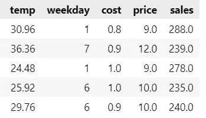
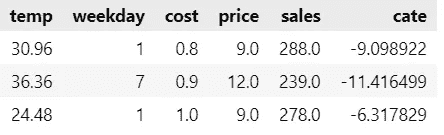
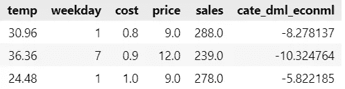
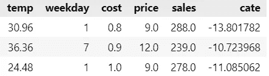

# 基于双机学习的异构处理效果

> 原文：<https://towardsdatascience.com/heterogeneous-treatment-effect-using-double-machine-learning-65ab41f9a5dc>

## 使用双机器学习的因果推理

马库斯·温克勒在 [Unsplash](https://unsplash.com?utm_source=medium&utm_medium=referral) 上的照片

本文是下面链接的因果推理系列的延续。如果你是因果推理空间的新手，我强烈建议你先浏览下面的文章。

1 .[因果推理入门](/getting-started-with-causal-inference-5cb61b707740)

2.[推断因果关系的方法](/methods-for-inferring-causality-52e4144f6865)

3.[使用元学习者的异质治疗效果](https://medium.com/towards-data-science/heterogeneous-treatment-effect-and-meta-learners-38fbc3ecc9d3)

**双机器学习(DML)** 是估计异质治疗效果的方法，尤其是当我们有大量混杂因素时。与我们在上一篇文章中讨论的[元学习者](https://medium.com/towards-data-science/heterogeneous-treatment-effect-and-meta-learners-38fbc3ecc9d3)不同，它也适用于**连续治疗**。该方法在获得 2020 年诺贝尔经济学奖的论文[中介绍了治疗和因果参数](https://arxiv.org/pdf/1608.00060v1.pdf)。

> DML 基于这种很酷的回归概念，即如果您有两组特征 X₁和 X₂，您使用线性回归估计模型参数β₁和β₂**y =β₁x₁+β₂x₂，**然后通过以下步骤可以获得相同的参数集β₁can

1.  回归 y 的第二组特征 Y₁ᵣ= γ₁X₂
2.  在第二组要素上回归第一组要素 X₁ᵣ = γ₂ X₂
3.  获取残差 Yᵣ = Y- Y₁ᵣ，xᵣ=x₁-x₁ᵣ
4.  回归特征残差的结果残差 Yᵣ = α+ β₁Xᵣ

我们将通过一起回归所有要素来获得相同的β₁as。很酷吧。第一组特征(上面的 X₁)可以是我们的治疗方法，第二组特征可以是混杂因素，其对结果的影响可以单独估计。

## 双/去偏置机器学习

DML 使用上面解释的这个非常简单的想法，但是它使用 ML 模型而不是线性回归，因此我们可以在估计结果和治疗残差时处理非线性和相互作用。

**yᵢ-mᵧ(xᵢ)=τ(tᵢ-mₜ(xᵢ))+εᵢ**

Mᵧ(Xᵢ)是通过对 x 回归 y 获得的结果，而 Mₜ(Xᵢ)是通过对 x 回归 t 获得的结果。 **τ** 是在控制混杂因素后治疗对结果的影响，但它是一个常数，而不是任何协变量的函数，也就是说，它代表**吃了**(平均治疗效果在以前的文章中详细讨论过 [***因果推断入门***](/getting-started-with-causal-inference-5cb61b707740) 和[***推断方法***](/methods-for-inferring-causality-52e4144f6865/)

我们还可以估计 CATE，其中允许 **τ** 随单位的协变量而变化

**yᵢ-mᵧ(xᵢ)=τ(xᵢ)(tᵢ-mₜ(xᵢ))+εᵢ**

为了使用 DML 估计 CATE，我们将使用治疗和结果的残差，但现在我们将使用其他协变量来处理残差。

**Yᵣ = β₁ + β₂XᵢTᵢᵣ**

DML 可能遇到的一个问题是过度拟合。如果 Mᵧ模型过度拟合，剩余 Yᵣ将比它应该的要小，捕捉到的不仅仅是 x 和 y 之间的关系，还有 t 和 y 之间的关系，这将使因果估计(剩余回归)偏向于零。如果 Mₜ过度拟合，治疗残差的方差将小于它应有的方差。似乎每个人的治疗都是一样的，这使得很难估计在不同的治疗方案下会发生什么。因此，建议在结果和治疗模型中使用**交叉验证**

让我们编写代码，通过一个例子来理解这一点。我们将使用一个果汁品牌的合成销售数据。我们的目标是预测价格对温度的弹性。

让我们现在使用微软开发的 EconML 库中的 DML 函数，而不是开发我们自己的 DML 函数。我强烈建议浏览一下关于 DML 的 [***EconML 文档***](https://econml.azurewebsites.net/spec/estimation/dml.html) ***，因为他们的库中有不同版本的 DML。***

## 非参数 DML

在上述设置中，我们对残差使用线性模型，这意味着我们假设治疗对结果的影响是线性的，这种假设可能不总是成立的。

我们已经看到了这个等式

**yᵢ-mᵧ(xᵢ)=τ(xᵢ)(tᵢ-mₜ(xᵢ)+εᵢ**

如果我们重新排列，我们得到的误差项为

**εᵢ=(yᵢ-mᵧ(xᵢ))—τ(xᵢ)(tᵢ-mₜ(xᵢ)**

> 这就是我们所说的**因果损失函数**，我们可以将其最小化以获得τ(Xᵢ)，我们的美食。

**lₙ(τ(x))= 1/nσ((yᵢ-mᵧ(xᵢ))—τ(xᵢ)(tᵢ-mₜ(xᵢ))**

利用剩余项，我们得到这个

**lₙ(τ(x))= 1/nσ(yᵢᵣ—τ(xᵢ)tᵢᵣ)**

除掉 Tᵢᵣ，孤立τ(Xᵢ)

**lₙ(τ(x))= 1/nσtᵢᵣ(yᵢᵣ/tᵢᵣ——τ(xᵢ)**

我们可以通过最小化括号内的内容并使用 Tᵢᵣ作为权重来最小化上述损失。以下是步骤

1.  创造 Tᵢᵣ
2.  创造 Yᵢᵣ/Tᵢᵣ
3.  使用任何最大似然模型预测 Yᵢᵣ/Tᵢᵣ，使用 Tᵢᵣ作为权重。

让我们使用非参数 DML 来预测上述示例的 cate。

DML 通常用于解决行业中的价格弹性问题，因为它可以很好地处理连续处理。下面是一些双机器学习被用来解决行业相关问题的案例研究

# 个案研究

[在线媒体公司使用 DML 进行客户细分](https://github.com/microsoft/EconML/blob/main/notebooks/CustomerScenarios/Case%20Study%20-%20Customer%20Segmentation%20at%20An%20Online%20Media%20Company.ipynb)

[采用 DML 方法进行因果推断的定价](https://slideplayer.com/slide/12643674/)

[基于机器学习的异构治疗效果的其他客户场景](https://econml.azurewebsites.net/spec/motivation.html#)

# 参考

*   [https://matheusfacure.github.io/python-causality-handbook/](https://matheusfacure.github.io/python-causality-handbook/landing-page.html)
*   [https://econml.azurewebsites.net/spec/estimation/dml.html](https://econml.azurewebsites.net/spec/estimation/dml.html)
*   [双机治疗及因果参数](https://arxiv.org/pdf/1608.00060v1.pdf)