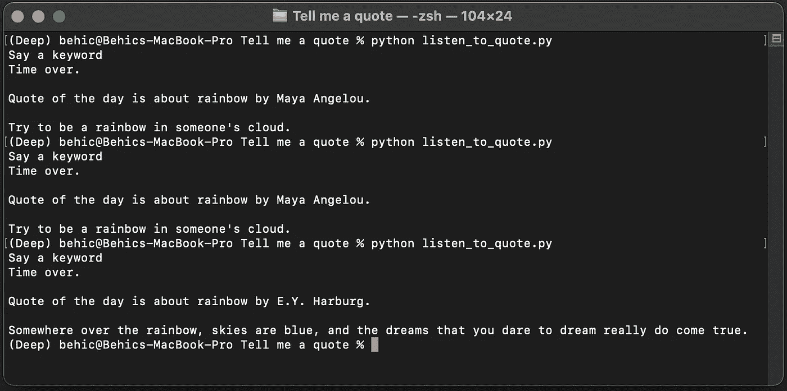

# 嘿，艾——给我讲一段关于彩虹的话

> 原文：<https://towardsdatascience.com/hey-ai-tell-me-a-quote-about-rainbow-f351340ffb45>

# 嘿，艾——给我讲一段关于彩虹的话

## 一个动手的人工智能项目


由[作者](https://sonsuzdesign.blog)设计。照片由[欧文比尔德](https://unsplash.com/@owenbeard?utm_source=unsplash&utm_medium=referral&utm_content=creditCopyText) & [阿比盖尔基南](https://unsplash.com/@akeenster?utm_source=unsplash&utm_medium=referral&utm_content=creditCopyText)在 [Unsplash](https://unsplash.com/?utm_source=unsplash&utm_medium=referral&utm_content=creditCopyText)

在这篇文章中，我们将学习如何建立一个人工智能程序，与我们分享特定的报价。该计划有不同的层次:语音识别，生成报价，并将文本转换为语音。在我以前的文章中，我已经讨论了[语音识别](/building-a-speech-recognizer-in-python-2dad733949b4)和[文本到语音转换](/convert-text-to-speech-in-5-lines-of-code-1c67b12f4729)的主题。

当我决定写一篇关于报价生成的文章时，我说为什么不通过添加人工智能来增加一点趣味呢。这是一个非常有趣的项目。关于这个话题，我有更多的想法，希望以后能写出来。

在不损失任何时间的情况下，我们开始吧。

## 目录

*   *入门*
*   *第一步——库*
*   *步骤 2 —语音识别*
*   *步骤 3 —报价生成*
*   *最后一步—人工智能阅读报价*

# 入门指南

让我首先列出这个项目的组成部分。我们只需要三个 python 库，分别是: *quote，pyttsx3 和语音识别*。

[Quote](https://pypi.org/project/quote/) 是 Goodreads quote API 的 python 包装器。

[Pyttsx3](https://pypi.org/project/pyttsx3/) 是一个文本到语音的 python 库。使用这个模块的一个很大的好处是，它可以离线工作，不需要互联网连接。

[语音识别](https://pypi.org/project/SpeechRecognition/)是一个语音到文本的 python 库。它支持多种语音识别引擎，例如:

*   Microsoft Bing 语音识别 API
*   IBM 语音转文本 API
*   谷歌云语音 API
*   还有更多。

现在我们对我们需要的包有了一个想法。为了能够使用它们，我们必须使用 *pip* 安装它们。PIP 是一个 python 库管理器工具。帮助组织库和包。我们将在终端窗口中运行下面一行来开始安装:

```
pip install quote pyttsx3 speechrecognition
```

# 步骤 1 —库

现在我们已经安装了库。我们可以将它们导入到我们的程序中。请随意使用任何类型的文本编辑器。

```
from quote import quote
import pyttsx3
import speech_recognition as sr
```

我已经在*入门*部分分享了每个包的文档。如果你想更多地了解它们是如何工作的，你可以检查它们。

# 步骤 2 —语音识别

在这一步，我们将学习如何使用 python 来识别语音。识别是直接通过麦克风进行的。它一直听到你停止说话，然后把它转换成文本。我挑的是谷歌的识别器引擎，基本使用不需要 API 键。但是如果您想使用不同的识别器引擎，请随意。

*dynamic_energy_threshold* 是我们定义麦克风在静音时应该停止监听的地方。我选择这个设置是因为用户可能会做一个很长的演讲，我不想被一个设定的持续时间所限制。

演讲大概是这样的"*嘿，AI，给我讲一段关于彩虹的话。*“关键词必须在演讲的结尾。我们要做的是将识别出的单词拆分成一个列表，并将最后一项作为我们的关键字。

**这里是代码:**

```
r = sr.Recognizer()
r.dynamic_energy_threshold = Falsewith sr.Microphone() as source:
    print("Say a keyword: ")

    audio_text = r.listen(source)

    print("Time is over.")

s = r.recognize_google(audio_text)words = s.split()keyword = str(words[-1])
```

# 第 3 步—报价生成

```
keyword = str(keyword)result = quote(keyword, limit=3)
```

这里没什么复杂的。

我们只是将关键字转换成一个字符串。然后将它传递给 *quote* 函数，这是我们之前安装和导入的包。

它有两个参数，第一个是关键字，另一个是我们想要得到的报价数量。报价函数将我们连接到 Goodreads 的报价 API。

```
r = (random.randint(0, 2))quote_ = result[r]['quote']
author_ = result[r]['author']
```

在上面的代码中，我们将结果的值赋给两个不同的变量。返回的结果是一个字典，它现在存储着 3 个不同的报价。我喜欢做不止一个，这样当我们使用相同的关键字时，我们可以得到不同的报价，而不是同一个。

从中获得*引用*和*作者*值后，我们要放入一个句子。它必须是一个写得很好的句子，因为在下一步，我们将要求机器为我们读它。

这是我写的句子格式:

```
text = ("Quote of the day is about " + keyword + " by " + author_ + ". \n\n " + quote_)print(text)
```

以下是我们运行该程序时的一些引用示例:



图片由作者提供。

# 最后一步—人工智能阅读报价

在这最后一步，我们将定义我们的文本到语音转换引擎。我们使用的是 pyttsx3 库。这个库为不同的语言提供了许多不同的语音引擎。如果您想尝试不同的语音引擎，请查看我在简介中分享的文章。

**代码如下:**

```
engine = pyttsx3.init()en_voice_id = "com.apple.speech.synthesis.voice.Alex"engine.setProperty('voice', en_voice_id)engine.say(text)engine.runAndWait()
```

是时候看看代码是如何运行的了。

将文本文件保存为 python 文件。我把我的名字命名为: *listen_to_quote.py*

现在，让我们打开用来安装库的终端窗口。然后，我们将转到保存 python 代码的文件夹。然后我们会运行它。

由[作者](https://www.youtube.com/channel/UCmo4tnTcj92DlzES5hvlWwQ)制作的视频演示。

## 结论

恭喜你。在这个实践教程中，我们学习了如何构建一个程序来读取与特定关键字相关的引用。我们在语音转文本和文本转语音库方面也有一些经验。我喜欢创建和从事这类项目，因为它们是机器学习和人工智能在我们日常生活中的伟大应用。

> 我是贝希克·居文，我喜欢分享关于编程、教育和生活的故事。[订阅](https://lifexplorer.medium.com/membership)我的内容，保持灵感。泰，

**如果你想知道我写什么样的文章，这里有一些:**

*   [使用 Python 构建人脸识别器](/building-a-face-recognizer-in-python-7fd6630c6340)
*   [使用 Python 实现实时语音识别](/speech-recognition-in-real-time-using-python-fbbd62e6ff9d)
*   [使用 Python 构建语音情感识别器](/building-a-speech-emotion-recognizer-using-python-4c1c7c89d713)