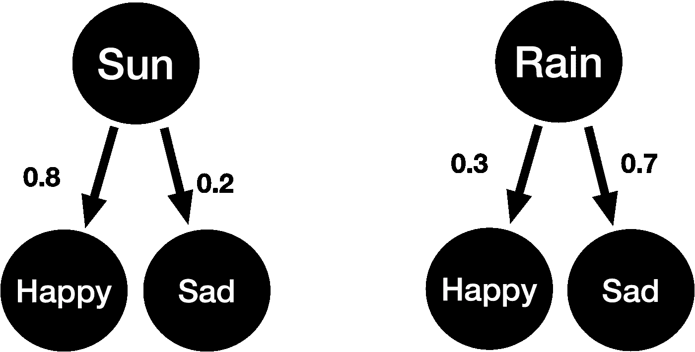
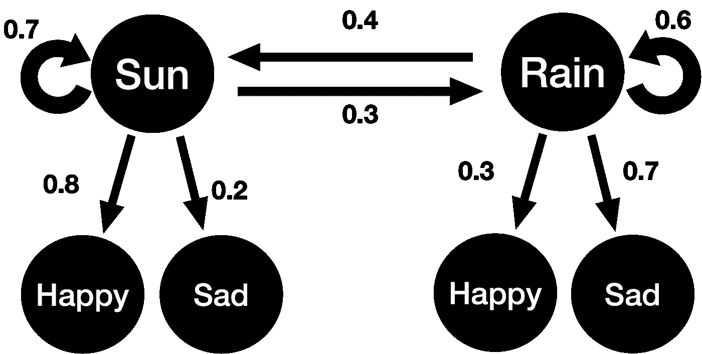
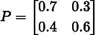
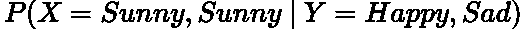
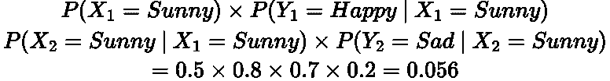

# 隐马尔可夫模型简单解释

> 原文：<https://towardsdatascience.com/hidden-markov-models-simply-explained-d7b4a4494c50>

## 隐马尔可夫模型及其相关计算的简单解释

由 [Unsplash](https://unsplash.com?utm_source=medium&utm_medium=referral) 上的 [Pietro Jeng](https://unsplash.com/@pietrozj?utm_source=medium&utm_medium=referral) 拍摄

# 介绍

在我的马尔可夫链系列的最后一篇文章中，我们将讨论**隐马尔可夫模型(HMM)。**这些出现在数据科学和机器学习的许多方面，特别是**自然语言处理**和**强化学习**，因此绝对值得了解。

在本文中，我假设读者已经对**马尔可夫性质**和**马尔可夫链、**以及**平稳分布背后的思想有了一些基本的了解。**如果没有，请参考我之前关于这些主题的帖子:

 [## 马尔可夫链简单地解释了

### 马尔可夫性和马尔可夫链的直观而简单的解释

towardsdatascience.com](/markov-chains-simply-explained-dc77836b47e3)  [## 马尔可夫链:平稳分布

### 用 Python 模拟解释和推导马尔可夫链的平稳分布

towardsdatascience.com](/markov-chains-stationary-distribution-bedd67140112) 

# 直觉和范例模型

在一个规则的马尔可夫链中，我们能够看到状态和它们相关的转移概率。然而，在一个**隐马尔可夫模型(HMM)** 中，马尔可夫链是**隐**但是我们可以通过它给定的**观察状态来推断它的性质。**

> 注意:隐马尔可夫模型本身并不是马尔可夫链，它是马尔可夫过程/模型列表中的另一个模型。

让我们通过一个例子来获得一些理解:

*   如果天气晴朗，我有 90%的几率快乐，10%的几率悲伤。
*   如果天气**下雨**，我有 **30%** 的几率快乐，有 **70%** 的几率悲伤。

由作者生成的图像。

这些**观察状态**(快乐、悲伤)的关联概率被称为**发射概率。**

现在，假设我的朋友想从我的情绪中推断天气。所以，对于给定的一周，比方说，我: ***悲伤、快乐、表示快乐、悲伤、开心、难过。*** 因此，我的朋友会推断天气一直: ***下雨，晴天，下雨，晴天，下雨，晴天，下雨。*** 这是一种直观的方法，然而天气不太可能如此变化无常。因此，我们需要在我们的**隐藏状态之间加上**转移概率**。**

由作者生成的图像。

上面的情节就是我们的**隐马尔可夫模型！**我们现在将使用我们的模型进行一些基本计算！

# 晴天的概率？

随机一天是晴天还是雨天的概率有多大？这个问题由马尔可夫链的**平稳分布**来回答。这告诉我们长期处于给定状态的概率，或者称为**马尔可夫链的均衡。**

平稳分布是一个给定的分布，如果你应用**转移矩阵， *P*** ，结果分布是和以前一样的**:**

****

**LaTeX 中生成的方程。**

****

**LaTeX 中生成的方程。**

**其中 ***π*** 为平稳分布。这个分布可以通过**找到 *P* 的特征值为 1 的特征向量来导出。**在本文中，我不会推导整个特征值分解过程，因为它是详尽的，但是它在我之前关于平稳分布的[文章中有所涉及。](/markov-chains-stationary-distribution-bedd67140112)**

**尽管如此，在对上述 HMM 应用特征值分解后，我们发现**平稳分布为 *{0.5，0.5}。*** 换句话说，一个随机的日子是**同样可能是晴天或雨天！****

# **评估序列可能性**

***我们如何计算一系列隐藏的和观察到的状态出现的概率？***

**例如，让我们说昨天我是**快乐的**并且它是**晴朗的**并且今天我是**悲伤的**并且它也是**晴朗的。**这个序列的概率是多少？**

**数学上，我们想计算:**

****

**LaTeX 中生成的方程。**

**我们可以使用上面的 HMM 图中显示和导出的**发射、跃迁和稳态分布概率**通过蛮力做到这一点。我们将其分解为以下概率:**

****

**LaTeX 中生成的方程。**

****所以上面序列的概率是 0.056！****

> **眼尖的人可能已经注意到我们在上面的计算中间接使用了**贝叶斯定理**！**

# **解码最可能的序列**

***产生一个可观测的(情绪)序列的最可能的隐藏状态(天气)序列是什么？***

**这个答案可以通过简单地**计算所有可能的隐藏状态组合**并选择具有最高概率的**来实现。这被称为最大似然估计。****

**然而，组合的数量可以很快变得非常大。对于*n 个隐藏状态和一个观测序列的*个观测值，我们有(***【n^t】)***个可能的组合。在实践中， ***N*** 和 ***T*** 会很大，因此**计算每个隐藏状态组合在计算上是不可行的**。****

****为了解决这个复杂性问题，我们使用**维特比算法或前向算法**，其使用按照 *O(N )* 的顺序工作的**动态编程。我将把这些算法的解释留到以后的博客上，因为它相当密集。然而，请自行研究！******

# ****结论****

****希望你喜欢这篇关于隐马尔可夫模型的文章！这个统计算法的领域相当大，所以这只是一个基本的介绍，以及一些你可以用它做的事情。****

# ****和我联系！****

*   ****要在媒体上阅读无限的故事，请务必在这里注册！ 💜****
*   ****[T49*😀*](/subscribe/@egorhowell)****
*   ****[*领英*](https://www.linkedin.com/in/egor-howell-092a721b3/) 👔****
*   ****[*推特*](https://twitter.com/EgorHowell) 🖊****
*   ****[*github*](https://github.com/egorhowell)*🖥*****
*   *******🏅*******

> *****(所有表情符号都是由 [OpenMoji](https://openmoji.org/) 设计的——开源的表情符号和图标项目。执照: [CC BY-SA 4.0](https://creativecommons.org/licenses/by-sa/4.0/#)*****