# 国家数据的层次聚类和 K-均值聚类

> 原文：<https://towardsdatascience.com/hierarchical-clustering-and-k-means-clustering-on-country-data-84b2bf54d282>

## 概述两种聚类技术并比较结果

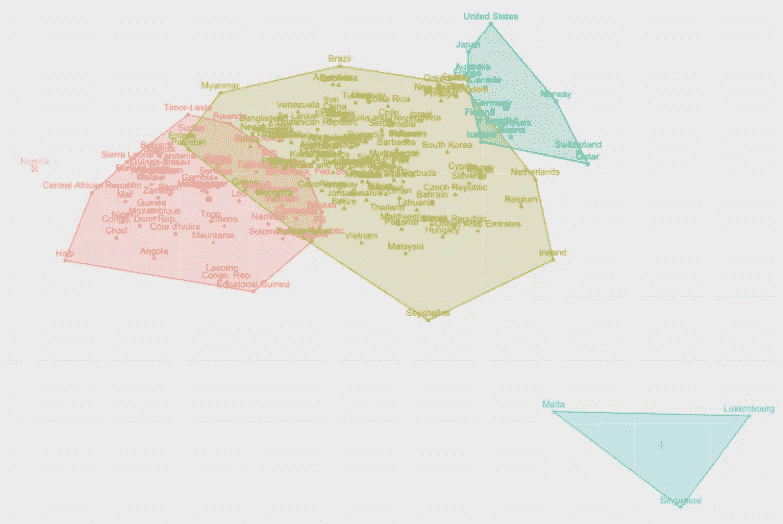

作者图片

聚类分析是一种无监督的技术，它试图在某些特征方面彼此相似的观察值中识别亚组。像[主成分分析](/principal-component-analysis-fbce2a22c6e0)一样，聚类通过使用数据的某些摘要来简化数据。虽然 PCA 减少了数据的维数(特征),但是聚类识别了观察值中的相似组。

所有聚类技术都旨在将观测值分组为子组/聚类，以便:

*   每个聚类包含彼此相似的观察值。就某些群集特征而言，群集应该是同质的。
*   一个集群的观测值不同于其他集群的观测值。每个集群在相同的特征方面不同于其他群组。

相似性的定义必须针对特定的聚类任务来定义，并且通常需要一些关于数据的领域特定的知识。两个相似的观察结果意味着什么也取决于研究的目的。

在本文中，我将使用 k-means 进行两种类型的聚类，一种是层次聚类，一种是非层次聚类，并比较结果。分层聚类不需要事先知道适当的聚类数。它创建了一个称为树状图的类似树的聚类可视化，并提供了整个聚类的良好概览。把树砍到一定的高度会产生不同数量的簇。另一方面，K-means 要求我们指定聚类的数量。

我使用了在 [Kaggle](https://www.kaggle.com/datasets/rohan0301/unsupervised-learning-on-country-data) 可获得的国家数据集。

在分别研究层次聚类和 k-means 聚类之前，我想提一下聚类分析的总体步骤，以及无论选择哪种方法都需要考虑的几个重要方面。

## 进行聚类分析的 4 个步骤

1.  选择相似性/距离(有些人更喜欢说不相似性)和缩放的度量。
2.  选择聚类技术的类型，分层或非分层。
3.  选择聚类方法的类型(即层次聚类中的平均或完全链接方法)。
4.  决定一些集群。

## 选择距离/相似性和缩放的度量

距离/相似性的度量以及数据的缩放对结果有很大的影响。因此，根据研究的目的和数据的类型，我们需要考虑如何衡量相似性以及如何调整数据。

*   欧几里德距离:平方差之和的平方根，这是最常见的。曼哈顿、最大值和闵可夫斯基是您可以研究的其他指标。
*   基于相关性的距离:测量相关性将强调观察的形状，而不是它们的大小。特征高度相关的两个观察值将被认为是相似的，即使它们以欧几里德距离度量相距很远。
*   变量的缩放:决定标准差/方差是否应该为 1。具体选择取决于您希望按何种模式/相似性对观察值进行聚类。如果你想给每个特性同等的重要性，你应该让 std/var 等于 1。如果在不同的比例下测量要素，您可能希望缩放数据，使其具有 std/var 1。

# 分层聚类

分层聚类以分层的方式形成子组。分层聚类可以以聚集或分割的方式执行。

*   **聚集**(“自下而上”)聚类从每个观察值成为自己的聚类开始。当我们沿着树向上移动时，它们合并成子群。
*   **分裂**(“自上而下”)聚类从所有观察值的一个聚类开始。当我们沿着树向下移动时，集群被分成子组。

## 层次聚类的步骤:

*   选择距离/相似性和缩放的度量。
*   选择链接方法。
*   n 个观测值中的每一个本身都被视为一个聚类。彼此最相似的聚类形成一个聚类，在第一次迭代之后留下 n-1 个聚类。该算法迭代进行，直到所有的观察值都属于一个聚类，该聚类用树状图表示。
*   决定集群的数量

## 链接方法:

*   **最近邻法或单链法**:两个亚组之间的距离用这两个亚组中所有可能的观测值对之间的最小距离来表示。
*   **最近邻法或完全连锁法**:与上述方法相反。两个子组之间的距离由两个子组中所有可能的观察值对之间的最大距离表示。
*   **平均连锁法**:在这种方法中，两个亚组之间的距离用两个亚组中所有可能的观察值对的平均值来表示。
*   **质心法**:每个聚类被一个作为该组质心的平均主体所代替。
*   **沃德方法**:该方法通过最大化类内同质性来形成类，测量类内平方和。

## 如何评估结果/选择聚类数

*   类内平方和
*   观察结果在树状图(树)和散点图中的可视化表示

让我们看看如何使用 r 进行层次聚类。

## 读出数据

我们将对两种聚类技术使用相同的数据集，您可以看到数据的第一行，以及下面变量的平均值和方差表。

```
library(tidyverse) # data manipulation and ggplot2 
library(factoextra) # multivariate package# Read data
data_raw <- read.csv("Country-data.csv") # keeping countries as column
countries <- data_raw[, 1]
data <- read.csv("Country-data.csv", row.names = "country") # set countries as index# View first rows
head(data)
```

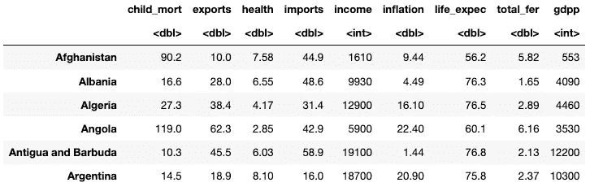

作者图片

```
# Check variance and mean of the numeric variables
variance <- as.data.frame(apply(data_raw[, 2:10], MARGIN = 2, FUN = var))
means <- as.data.frame(apply(data_raw[,2:10], 2, mean))# Store mean and variance in one data frame
mean_variance_df <- cbind(means, variance)
colnames(mean_variance_df) <- c('Mean', 'Variance')
round(mean_variance_df, digits = 2)
```

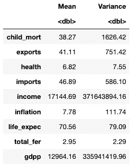

作者图片

```
# Standardize the data (mean 0, std 1)
data_std <- as.data.frame(scale(data))
```

## 创建集群

用`hclust()`函数进行层次聚类。它以距离矩阵为输入数据，采用链接法。距离矩阵可以用`dist()`函数或`get_dist()`函数计算。后者允许相关性作为距离度量。

```
### Hierarchical clustering with hclust()
# hclust() takes a distance matrix as data input, use dist() or get_dist() for this
# Choose linkage method with method argument# Hierarchical clustering on standardized data using Euclidean distance measure
complete <- hclust(get_dist(data_std, method = 'euclidean'), method = 'complete')
```

## 显示树状图

```
# Plot the dendrogram, showing the entire clustering result# Show dendrogram, pass cluster object as first argument
plot(complete, main = 'Complete Linkage', xlab = "",
     sub = "", cex = 0.8)# Add rectangle around clusters, choose how many clusters with k, color in border
rect.hclust(complete, k = 5, border = 3:6)
```

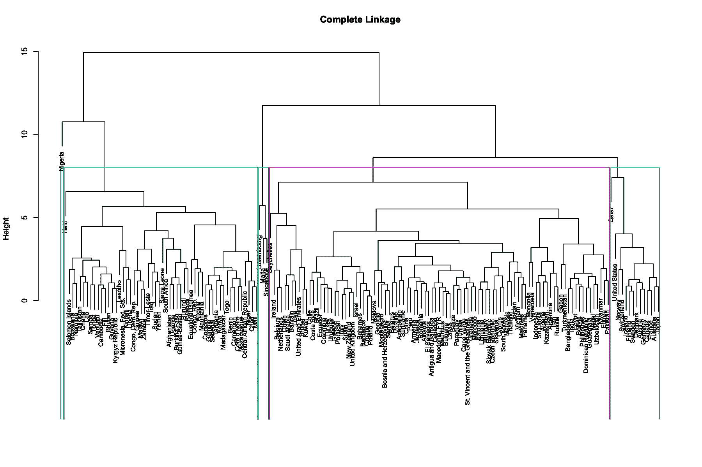

作者图片

**旁注:**我尝试了几种聚类方法(完全、平均、单一、沃德)，在所有聚类中，尼日利亚、海地和卡塔尔单独表现突出，卢森堡、马耳他和新加坡也很接近。这表明这些国家在某些方面不同于所有其他国家。此外，平均和单一的联系将几乎所有国家放在一个大的集群中，考虑到这些变量以及这些国家在这些变量上的差异，这是不合适的。

## 显示树状图的特定分支/簇

对于较大的数据集，树状图很快变得难以概括，但是可以通过在一定高度切割树并绘制它们来查看特定的分支/簇。高度是距离测量和连接方法的结果。低于特定高度的聚类的观测值在其聚类内具有小于该特定高度的最大距离和关联。

例如，如果我们想要查看用蓝色标记的聚类，我们在高度 8 处切割树，这将导致五个聚类。我们可以通过绘制切口上方的分支来查看簇的数量。为了显示每个分支/簇包含的内容，我们在切割下绘制树状图，并指定哪个分支/簇。看看哪些国家属于第二组，它们似乎是欠发达国家。

```
# Store cluster object as a dendrogram
complete_dend <- as.dendrogram(complete)# Plot full dendrogram
plot(complete_dend, main="Full Dendrogram")
rect.hclust(complete, k = 5, border = 3:6) # Plot branches above the cut
plot(cut(complete_dend, h=8)$upper, 
     main="Upper tree of cut at h=10")# Plot selected branch below the cut
plot(cut(complete_dend, h=8)$lower[[2]], # Change value in 'lower[]' to view different branches/clusters
     main="Second branch of lower tree with cut at h=8")
```

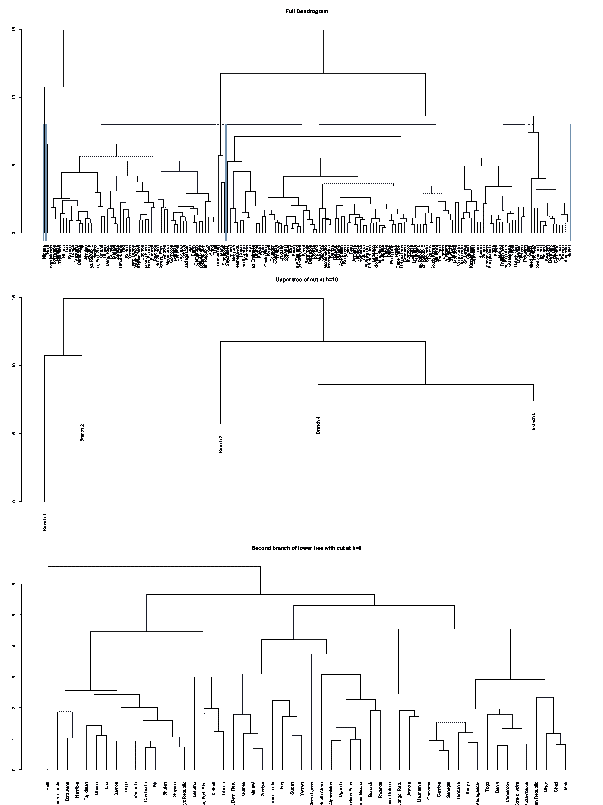

作者图片

## 如何解读树状图

在树的底部，每个观察值是一片树叶，当我们沿着树向上移动时，观察值融合成树枝。沿着树向上延伸，树枝与其他树枝或树叶融合在一起。叶/枝融合越早，观察结果越相似。重要的是要记住，相似性是基于水平轴，而不是垂直轴。在树的底部早期融合的观察结果比在树的更高处融合的观察结果/分支更相似(后者实际上可能非常不同)。

## 使用 cutree()提取集群分配

我们可以在一个选定的高度砍下这棵树，这将给我们 k 个簇。然后，我们可以将聚类 id 存储在数据框中，并在散点图中绘制聚类。

```
# Cut the dendrogram at a certain height giving a specific number of clusters with cutree(). 
clusters_complete <- cutree(complete, k = 5) # ok cluster with 6 too# Append the cluster result to the dataset so that we can plot the clusters with different colors 
complete_df <- data_raw %>% 
                mutate(cluster = clusters_complete) %>%
                relocate(cluster, .after = country)# Filter cluster of choice too see the countries in that cluster
complete_df %>% filter(cluster == 3)
```

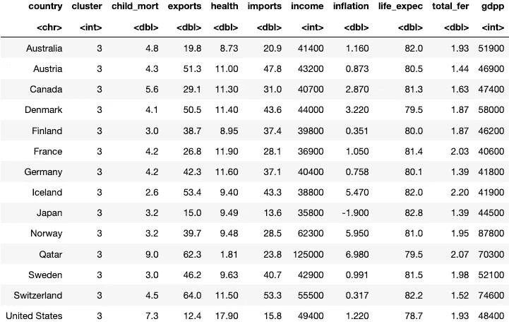

作者图片

## 聚类散点图

`fviz_cluster()`函数将聚类可视化，如果变量的数量超过两个，则应用主成分。

```
# Plot the clusters. Number of clusters as chosen in cutree() and stored in clusters_complete# Print clusters. The clusters make sense
fviz_cluster(list(data = data_std, cluster = clusters_complete), 
             main = 'Complete Linkage, euclidean distance')
```

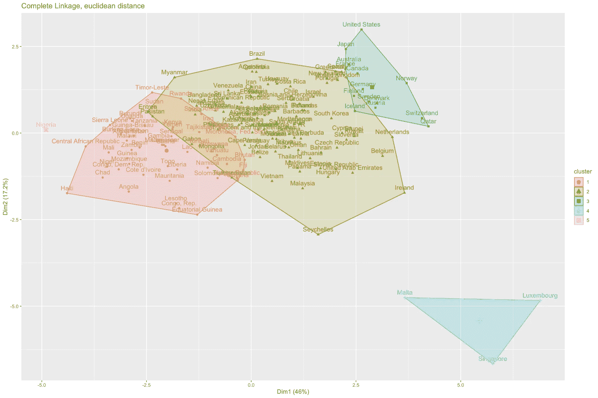

作者图片

我们还可以根据一些变量绘制国家图，并用颜色分类，看看这些分类对特定变量是否有意义。

```
# Plot gpdp and life expectancy and color by clusters. As expected, life expectancy increases as gdp increases. 
# Clusters ok. The outliers integrates with other clusters for these variables. ggplot(complete_df, aes(x=gdpp, y = life_expec, col = as.factor(cluster), label = country)) + 
        geom_point() +
        geom_text() +
        ggtitle('GDP and Life Expectancy') +
        xlab('GDPP') +
        ylab('Life Expectancy') +
        scale_x_log10() 
```

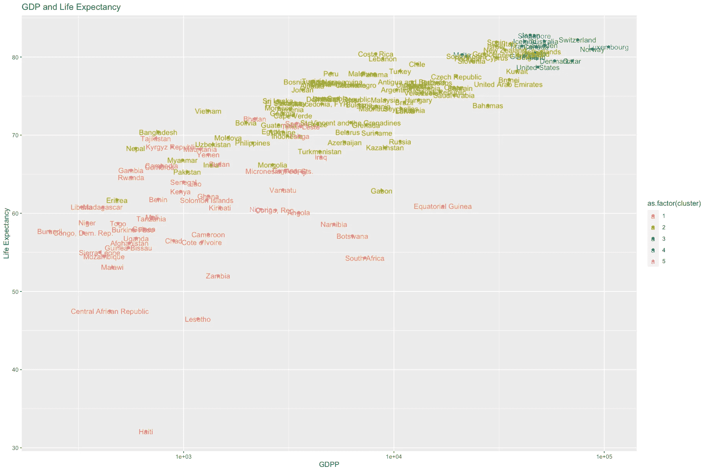

作者图片

```
# Plot gpdp and child_mort. Child mortality decreases as dgp increases.ggplot(complete_df, aes(x=gdpp, y = child_mort, col = as.factor(cluster), label = country)) + 
        geom_point() +
        geom_text() +
        ggtitle('GDPP and Child Mortality') +
        xlab('GDPP') +
        ylab('Child Mortality') +
        scale_x_log10() +
        scale_y_log10()
```

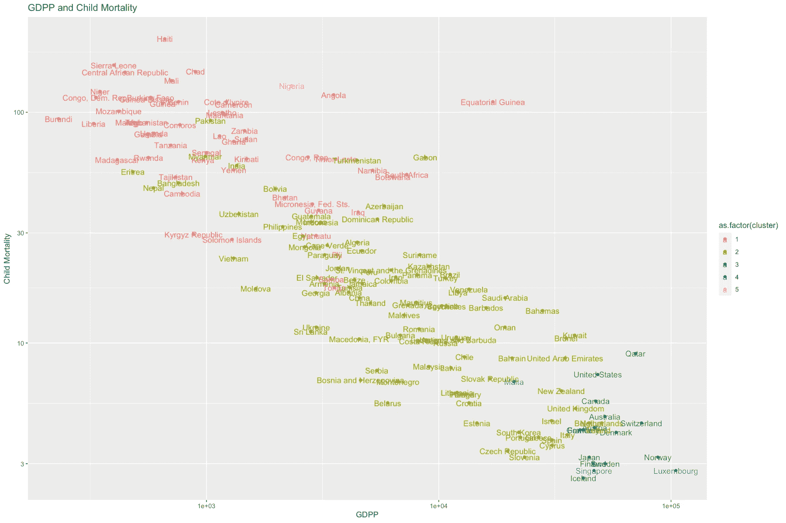

作者图片

# k-means(非层次聚类)

非层次聚类要求聚类的起始分区/数目是先验已知的。我们希望将数据点划分为 k 个聚类，以便所有聚类的类内变化尽可能小。有不同的非层次聚类方法，大多数主要在以下方面有所不同:

*   用于设置初始聚类质心的方法。
*   在每次迭代中重新分配观测值的规则。

我们将使用 K-means 方法进行非层次聚类。

## k 均值聚类的步骤

*   选择 k 个集群。
*   通过将每个观察值随机分配给 k 个聚类中的一个来初始化。
*   重复以下两个步骤，直到集群分配停止变化:
*   计算每个聚类的质心
*   将每个观察值分配/重新分配给质心最近的聚类。

## 如何评估结果/选择聚类数

为了帮助决定使用多少个集群，我们可以使用以下两种方法。

*   **肘图**:针对不同数量的聚类，绘制每个聚类的平方和内图。随着每一个额外的聚类，平方和内将减少，但是我们将寻找肘部，在那里平方和内从先前的聚类数减少最多，然后对于额外的聚类变平。
*   **剪影分析**:查看每个观察值被分配到一个集群的情况。

我们现在将看到 k-means 是如何使用 r 实现的。

## 使用 k-means 创建任意数量的聚类

```
# Perform k-means with arbitrary number of clusters to obtain the object
k_means <- kmeans(data_std, centers = 3)# Look at what k_means model object contains
str(k_means)List of 9
 $ cluster     : Named int [1:167] 3 1 1 3 1 1 1 1 1 1 ...
  ..- attr(*, "names")= chr [1:167] "Afghanistan" "Albania" "Algeria" "Angola" ...
 $ centers     : num [1:3, 1:9] -0.649 0.483 0.941 0.281 -0.278 ...
  ..- attr(*, "dimnames")=List of 2
  .. ..$ : chr [1:3] "1" "2" "3"
  .. ..$ : chr [1:9] "child_mort" "exports" "health" "imports" ...
 $ totss       : num 1494
 $ withinss    : num [1:3] 625 34.7 306.3
 $ tot.withinss: num 966
 $ betweenss   : num 528
 $ size        : int [1:3] 98 3 66
 $ iter        : int 2
 $ ifault      : int 0
 - attr(*, "class")= chr "kmeans"# After getting cluster assignment we can append them to data frame
data_kmeans <- data_raw %>% 
                   mutate(cluster = k_means$cluster)
```

## 每个聚类的平方和内肘图

这里我们创建了一个函数，它对 1 到 8 个聚类执行 k-means 聚类，并存储每个聚类的平方和，以便我们可以绘制肘图。

```
# Use sapply to get wihtin sum of squares for k = 1:8
tot_withinss <- sapply(1:8, function(k){
    km_mod <- kmeans(x = data_std, centers = k)
    km_mod$tot.withinss
})# Run function and store within sum-of-squares in a dataframe
tot_withinss_df <- data.frame(k = 1:8, tot_withinss = tot_withinss)# Plot elbow plot
ggplot(tot_withinss_df, aes(x = k, y = tot_withinss)) +
    geom_point() +
    geom_line() +
    scale_x_continuous(breaks = 1:8) +
    ggtitle('Elbow plot of Within Sum of Squares') + 
    ylab('Within Sum of Squares') + 
    xlab('k = number of clusters')
```

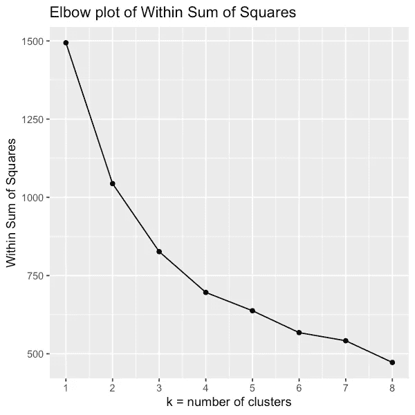

肘形图没有给出明确的聚类数。也许三个或六个？我们稍后将绘制聚类图，并评估有多少聚类给出了合理的结果。

## 轮廓分析—观察水平

我们也可以创建一个小函数，手动绘制轮廓图，但是 factoextra 包有一个用于轮廓图的内置函数。

```
# Quickest to use factoextra package and use this plot
fviz_nbclust(data_std, kmeans, method= 'silhouette')
```

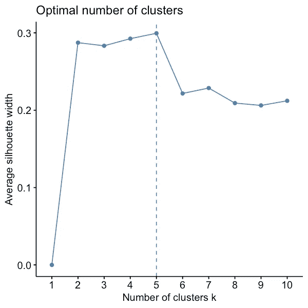

作者图片

## 评估 3-6 个聚类的 k 均值聚类

肘部和轮廓图没有给出明确的答案，因此我们可以对 3-6 个聚类进行 k-means 聚类，并查看每个聚类的结果，以确定哪个数量的聚类有意义。我们还会将结果与层次聚类进行比较。

```
# Run k-means clustering with 3-6 clusters
k_means_3 <- kmeans(data_std, centers = 3)
k_means_4 <- kmeans(data_std, centers = 4)
k_means_5 <- kmeans(data_std, centers = 5)
k_means_6 <- kmeans(data_std, centers = 6)# Add cluster assignments to data frame
data_kmeans_3 <- data_raw %>% 
                   mutate(cluster = k_means_3$cluster) data_kmeans_4 <- data_raw %>% 
                   mutate(cluster = k_means_4$cluster) data_kmeans_5 <- data_raw %>% 
                   mutate(cluster = k_means_5$cluster) data_kmeans_6 <- data_raw %>% 
                   mutate(cluster = k_means_6$cluster)
```

## 可视化 k 均值聚类

```
# Plot the clusters from k-means with x clusters# Print clusters. Here 3 clusters. 
# Change digit in "k_means_x$clusters" to look at different number of clusters
fviz_cluster(list(data = data_std, cluster = k_means_3$cluster), main = 'K-means, 4 clusters')
```

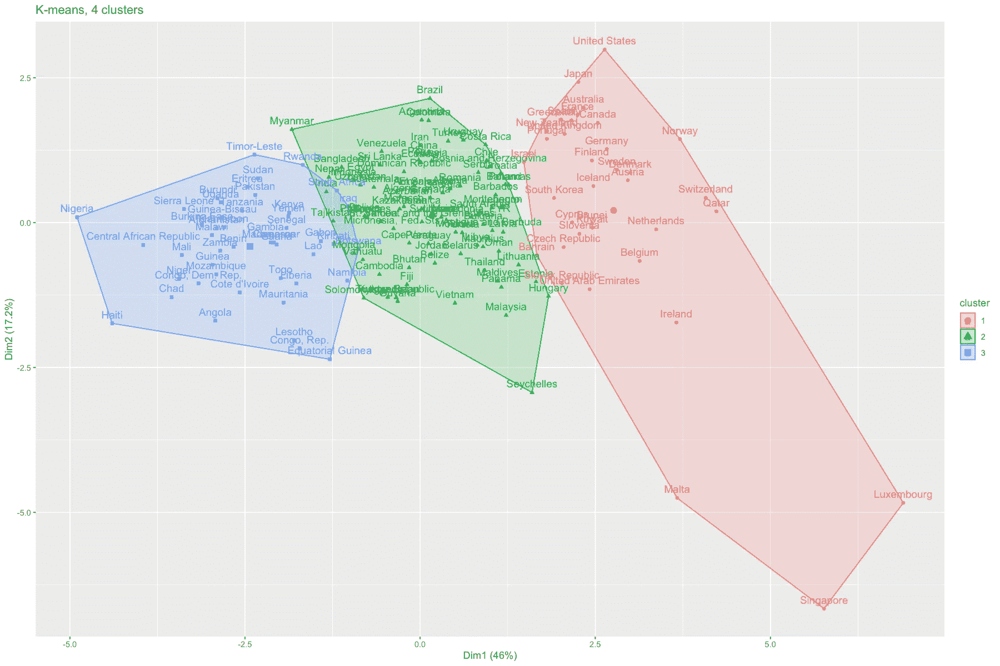

作者图片

```
# Plot the clusters from k-means with 4 clusters
fviz_cluster(list(data = data_std, cluster = k_means_4$cluster), main = 'K-means, 4 clusters')
```

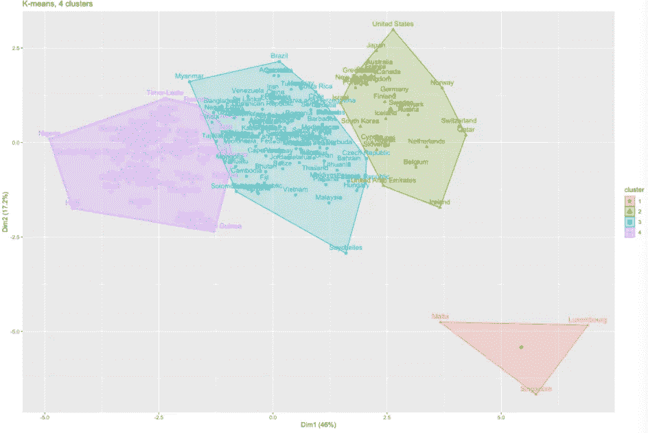

作者图片

```
# Plot the clusters from k-means with 5 clusters
fviz_cluster(list(data = data_std, cluster = k_means_5$cluster), main = 'K-means, 4 clusters')
```

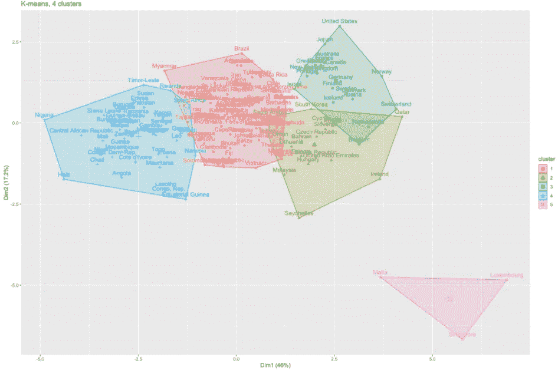

作者图片

## 用 k 均值聚类分析变量

正如我们对层次聚类所做的那样，我们可以在聚类后观察一些变量和颜色。

```
# Plot gpdp and life expectancy and color by clusters. Life_expectancy increases as gdp increases. 
# Clusters ok. The outliers integrates with other clusters for these variables. 
ggplot(data_kmeans_4, aes(x = gdpp, y = life_expec, col = as.factor(cluster), label = country)) + 
        geom_point() +
        geom_text() +
        ggtitle('GDP and Life Expectancy') +
        xlab('GDPP') +
        ylab('Life Expectancy') +
        scale_x_log10() 
        #scale_y_log10()
```

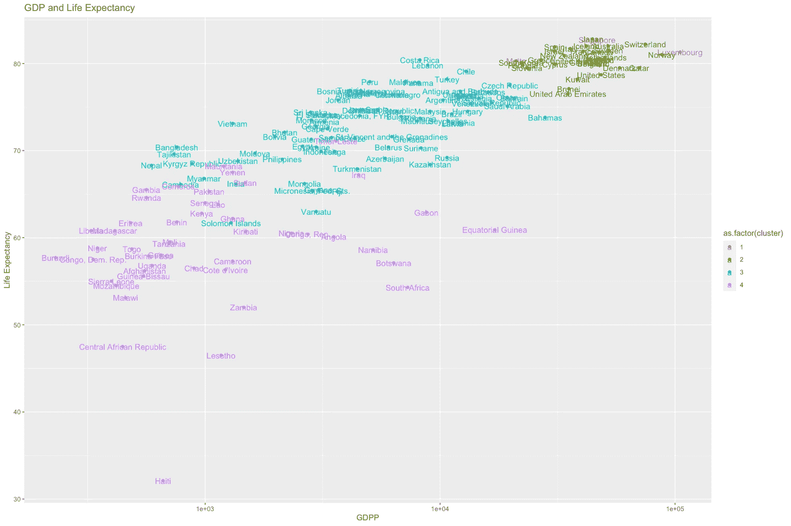

作者图片

```
# Plot gpdp and child_mort. As expected, child mortality decreases as dgp increases. Clusters ok.
ggplot(data_kmeans_4, aes(x=gdpp, y = child_mort, col = as.factor(cluster), label = country)) + 
        geom_point() +
        geom_text() +
        ggtitle('GDPP and Child Mortality') +
        xlab('GDPP') +
        ylab('Child Mortality') +
        scale_x_log10() +
        scale_y_log10()
```

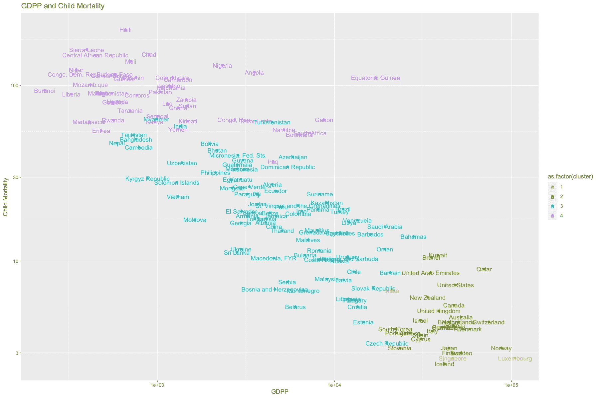

作者图片

# 比较层次聚类和 k-means 聚类的结果

用 3、4、5 和 6 个聚类对 k-means 进行聚类和可视化会得到不同的结果。人们可以更仔细地研究不同变量中的分组，但总体而言，考虑到国家通常被分为“欠发达”、“发展中”和“发达”三类，我认为三四个分组是有意义的，因为至少有一些现有变量被用于对这些国家进行分类。

使用四个群集可以将马耳他、卢森堡和新加坡保持在自己单独的群集中。如果我们使用三个集群，这三个国家被合并到包含发达国家的集群中，这也是有意义的。

这两种聚类技术之间也有区别。相同数量的聚类使用不同的方法，层次和 k-means，给出非常不同的结果。例如，具有 k 均值的四个聚类与使用分层聚类的四个聚类非常不同。但是，四个 k-means 聚类与五个层次聚类非常相似，因为层次聚类将尼日利亚分配到它自己的聚类中。其余的四个聚类类似于四个 k 均值聚类。来自 k-means 的聚类更明显，重叠更少。使用 k-means 将更多的国家分配到发达国家组。

这两种方法各有利弊，选择哪种方法取决于研究的目的。请记住，它们可以被视为补充方法，在继续进行非层次聚类之前，可以在探索意义上使用层次聚类。