# 分层聚类:像我 10 岁一样给我解释一下

> 原文：<https://towardsdatascience.com/hierarchical-clustering-explain-it-to-me-like-im-10-f949f8f3f80>

这是**向 10 岁的**系列解释机器学习算法的第一部分。如果你读过前面两篇关于 [XGBoost 回归](https://medium.com/towards-data-science/xgboost-regression-explain-it-to-me-like-im-10-2cf324b0bbdb)和 [K-Means 聚类](https://medium.com/towards-data-science/k-means-clustering-explain-it-to-me-like-im-10-e0badf10734a)的文章，那么你就知道该怎么做了。我们有一个听起来很可怕的算法，所以让我们剥去它可怕的部分，理解它背后简单的直觉。与 K-Means 聚类一样，今天我们将讨论另一种流行的聚类算法——层次聚类。

假设一家服装店收集了 9 名顾客的年龄，标记为 C1-C9，以及他们每个人上个月在店里消费的金额。(一个超级小的店，不过就顺其自然吧。)

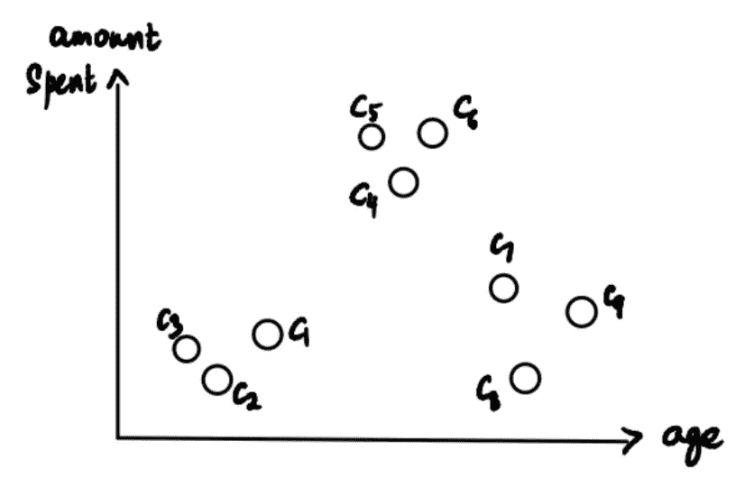

现在，商店希望确定其客户的细分或聚类，以更好地了解他们和他们的需求。这就是我们数据科学家用层次聚类来拯救世界的地方。

我将把解释分为三个部分:

1.  [集群创建和树状图](#d033)
2.  [关于距离的讨论](#542c)
3.  [关于集群的更多信息](#b6a4)

# 1.聚类创建和树状图

我们首先将每一个数据点作为一个集群。这形成了 9 个集群:

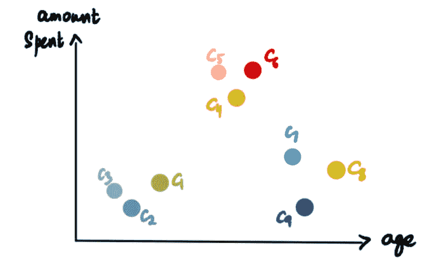

选取两个最接近的*(更多关于接近度的信息，请参见第 2 节)*集群，并使它们成为一个集群。由于 C2 和 C3 距离最近，所以它们形成了一个星团。这给了我们总共 8 个集群。

现在我们用一个叫做**的树状图**来表示这个集群。x 轴代表点(在我们的例子中是客户)，y 轴是聚类之间的距离。

我们重复这个。取两个最近的聚类(C5 和 C6)并使它们成为一个聚类，并将其绘制在树状图上。

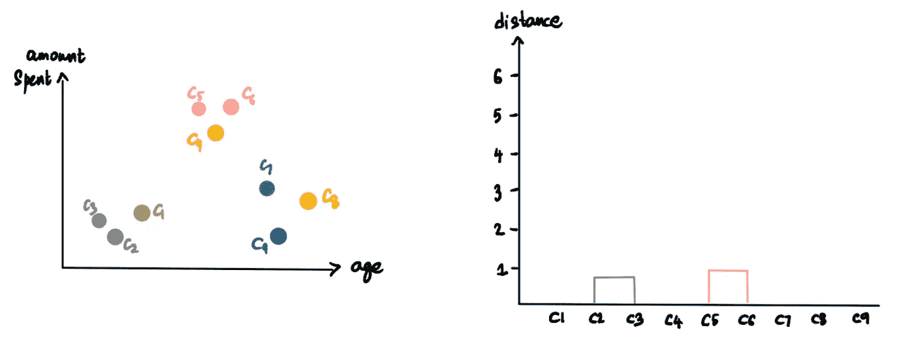

7 个集群

再做一次。(粉色集群和 C4)

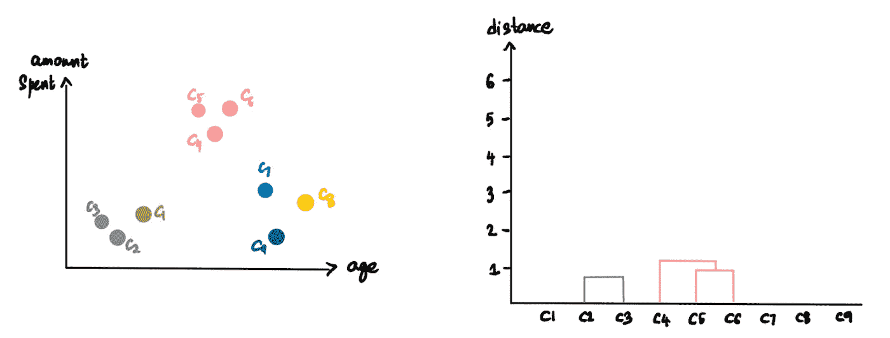

6 个集群

再一次。(C7 和 C8)

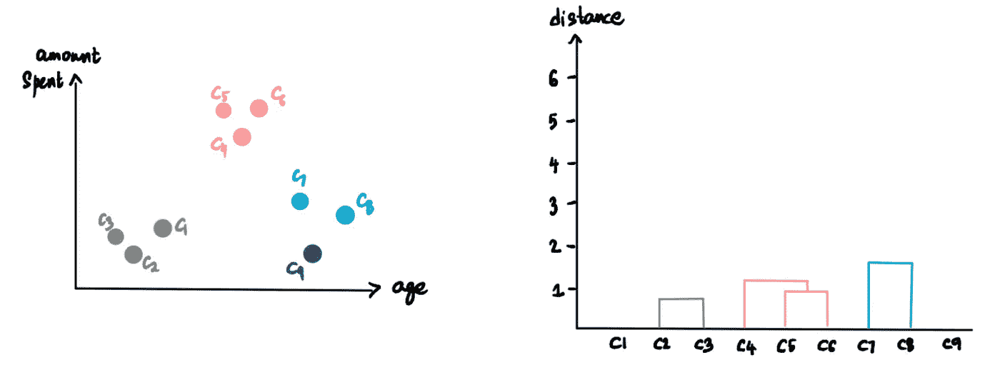

5 个集群

我们不断重复这个过程，直到只剩下一个集群。

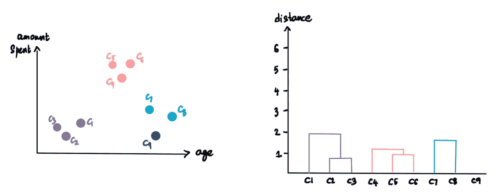

4 个集群

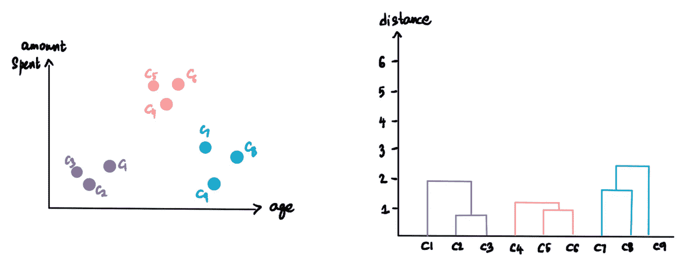

3 组

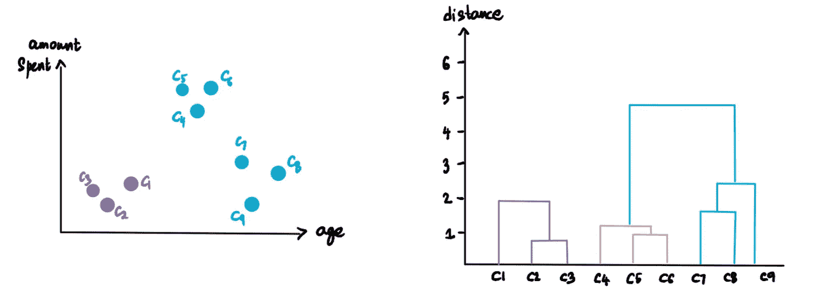

2 个集群

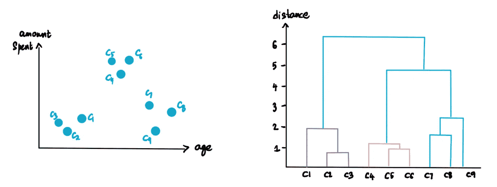

1 个集群

现在，这就是我们如何创建树状图和我们的*层次*集群。

# 2.关于距离的讨论

之前，我们谈到了寻找最接近的*星团，但是我们究竟如何测量这种接近度呢？*

*想象我们有粉色、蓝色和紫色的星团。现在我们想弄清楚我们是应该把粉色的簇和蓝色的还是紫色的簇放在一起。*

**

*有 4 种方法可以做到这一点。但是在我们谈论它们之前，我们先简单地谈论一下**距离**。在这种情况下，当我说距离时，我指的是**欧几里德距离**。所以，如果坐标为 *(p₁，p₂,…，pₙ)* 的 **p** 和坐标为 *(q₁，q₂,…，qₙ)* 的 **q** 是 n 维中的两点，那么它们之间的欧氏距离为:*

*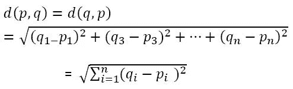*

*在我们的例子中，由于数据是二维的，两点之间的欧几里德距离将是:*

*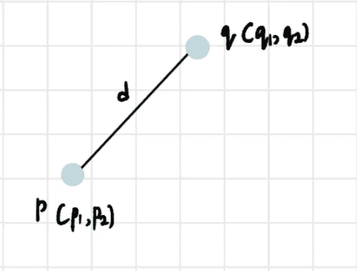**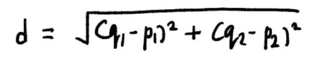*

*现在我们知道了如何解释距离，确定距离的 4 种方法是:*

1.  ***单连接**:在单连接方法中，我们将距离定义为每个聚类中两点之间的最短*距离。因此，我们将粉色和紫色集群中最近点之间的距离与蓝色和粉色集群中最近点之间的距离进行比较。两个距离中较小的一个决定了粉色的那个更靠近哪个星团。**

**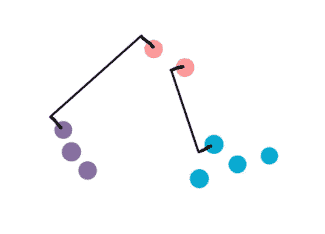**

**由于距离较小，粉色与蓝色群集聚集在一起**

**2.**完全连锁**:类似于单连锁，但这里距离是在两个集群中最远的*点对之间测量的。***

***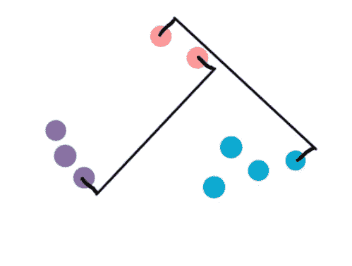***

***由于距离较小，粉色与紫色群集在一起***

***3.**平均关联**:顾名思义，距离定义为第一个聚类的每个观测值到第二个聚类的每个观测值之间的平均距离。*(吓人的公式预警！这是为感兴趣的人准备的，但重要的是你要理解如何测量距离背后的逻辑。)****

**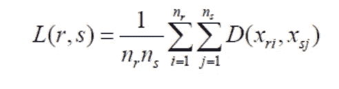**

**4.**质心法**:这涉及到找到每个簇的中心(质心)，然后找到它们之间的距离。(如果你不确定如何计算质心，我在这里解释这个过程**

**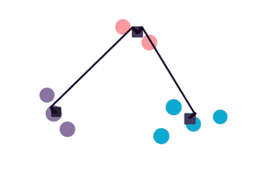**

**由于距离较小，粉色与蓝色群集聚集在一起**

# ****3。关于集群的更多信息****

## **自定义集群**

**我们知道最终的树状图是这样的:**

**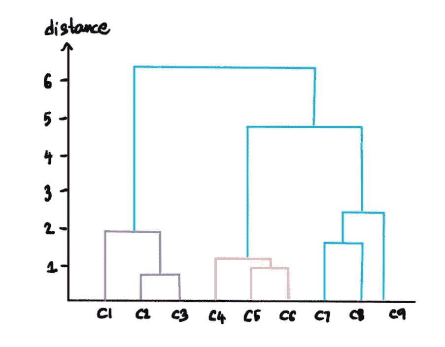**

**我们可以通过指定阈值距离来定制我们想要的聚类数。例如，假设我们不想要距离大于 3 的集群。然后我们在 3:**

**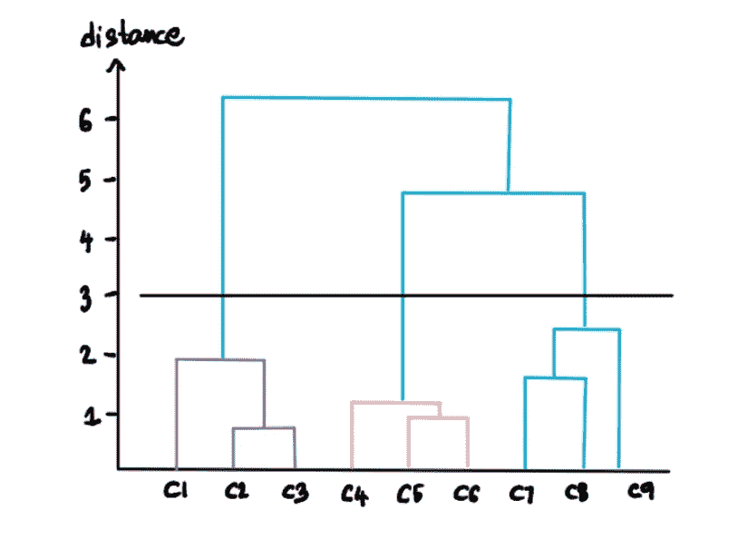**

**将阈值设置为 3**

**这一行意味着我们不希望任何集群超过这个级别，所以我们只剩下 3 个低于阈值线的集群:**

**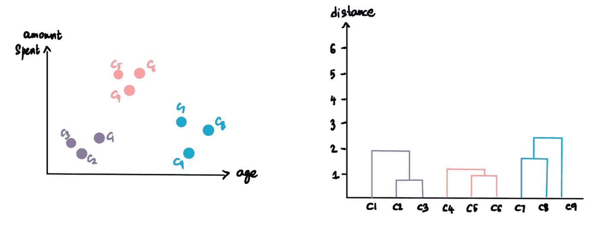**

**阈值为 3 时形成的簇**

**如果我们将阈值距离设置为 5，那么…**

**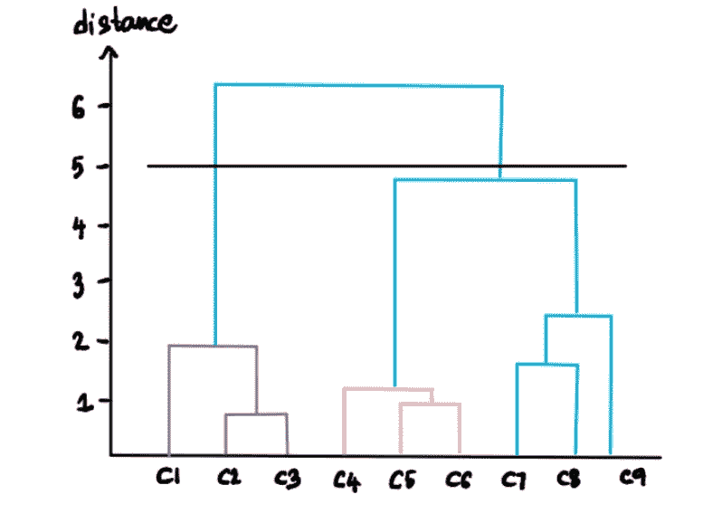**

**…我们剩下两个集群:**

**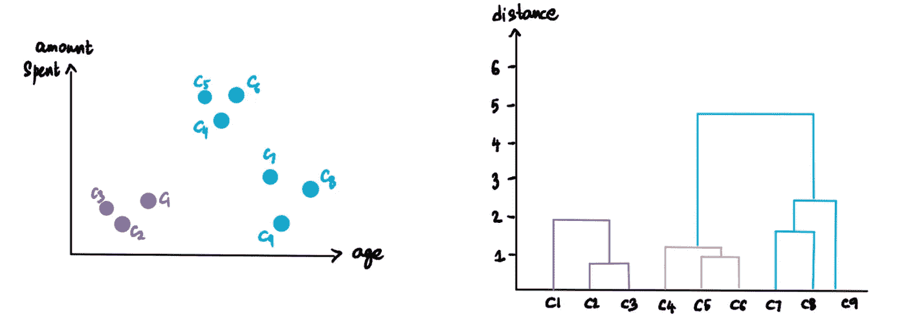**

**阈值为 5 时形成的簇**

## **最佳聚类数**

**我们可以通过**找到不与任何水平延长线**交叉的最长线来计算出最佳的聚类数。在我们的例子中，这将是最长的一行:**

**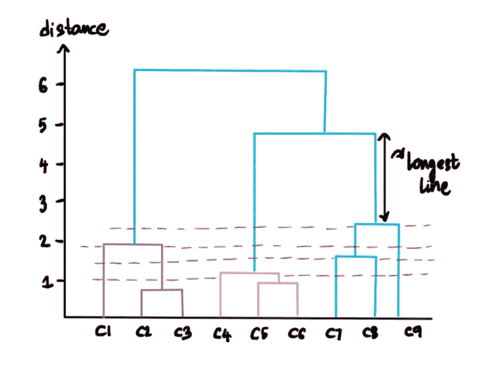**

**画一条水平线穿过这条最长距离的线，这条线将作为计算聚类的阈值:**

**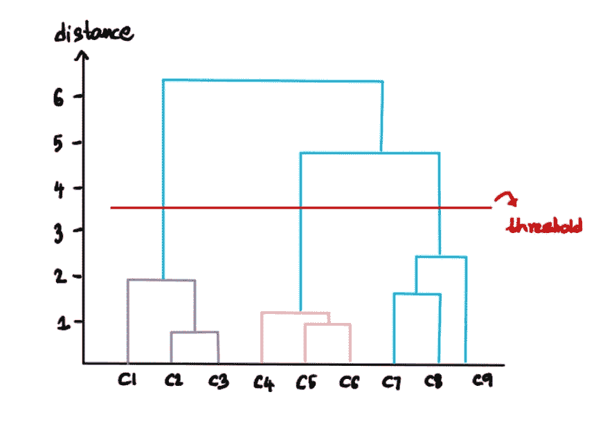******

# **我们有我们的集群。现在怎么办？**

**现在我们已经完成了聚类过程，并发现有 3 个最佳聚类，商店可以从中获得什么见解？**

**如果你观察这些客户群，我们会发现他们分为三类——花费不多的*年轻客户，花费也少的年长客户，以及花费很多的中端客户*。商店现在可以利用这些信息为自己谋利。他们可以通过扩大向第三部分中年客户提供的服务、产品和交易来优化业务。他们可以集中资源让这个群体更快乐——给他们更多迎合他们口味的选择，为他们带来最新产品，甚至为他们提供专属购物时间。**

**这是一个如何使用集群的简单例子，但是可能性是无穷无尽的！**

**如果你想支持我的工作，可以考虑使用[我的链接注册一个媒体订阅](https://medium.com/@shreya.rao/membership)！(每月 5 美元，随时取消)**

**如果你有更多关于人工智能算法的建议或意见，请随时通过 LinkedIn 联系我，或者发邮件到 shreya.statistics@gmail.com。**