# R-NL:鲁棒非线性收缩

> 原文：<https://towardsdatascience.com/high-dimensional-covariance-estimation-when-tails-are-heavy-da61723ce9b3>

## 重尾时的高维协方差估计

在这篇文章中，我讨论了我们最近在 [arXiv](https://arxiv.org/abs/2210.14854) 上发表的论文“R-NL:基于非线性收缩的椭圆分布协方差矩阵估计”中的一种新的协方差估计方法。我介绍了我们正在解决的问题，尝试给出一些关于我们如何解决它的直觉，并简要介绍了我们开发的简单代码。在路上，我触及了一些有趣的概念，比如(健壮的)“泰勒估计量”，我觉得这些概念在现代数据科学中没有得到充分利用，可能是因为没有作者在他们的论文中提供代码(或者可能是因为大多数关于这个主题的论文似乎出现在信号处理社区中，这是他们被数据科学家忽视的另一个潜在原因)。

**非线性收缩**

[非线性收缩](/nonlinear-shrinkage-an-introduction-825316dda5b8)是高维协方差估计的有力工具。在这篇新论文中，我和我的合著者介绍了一个经过修改的版本，它倾向于在重尾模型中产生更好的结果，同时在其他情况下保持强大的结果。为了展示这种新方法及其解决的问题，让我们从一个 R 示例开始。我们首先加载必要的函数，并定义维度 *p* 和示例数量 *n，*以及我们想要研究的真实协方差矩阵。

```
# For simulating the data:
library(mvtnorm)# The NL/QIS method available on [https://github.com/MikeWolf007/covShrinkage/blob/main/qis.R](https://github.com/MikeWolf007/covShrinkage/blob/main/qis.R)
source("qis.R")# Set the seed, n and p
set.seed(1)# p quite high relativ to n
n<-300
p<-200#Construct the dispersion matrix
Sig<-sapply(1:p, function(i) {sapply(1:p, function(j) 0.7^{abs(i-j)} )} )
```

我们这里定义的协方差矩阵对应一个 AR 过程。也就是说，虽然观察值是独立的，但是尺寸 *X_i* 和 *X_j* 的相关性越小，则 *i* 和 *j* 之间的差值绝对值越大。这意味着相关性指数变小，离对角线越远，实际上有一些结构需要学习。

首先，让我们用之前定义的相关结构模拟来自高斯分布的随机向量的独立同分布样本:

```
### Multivariate Gaussian case
X<-rmvnorm(n = n, sigma = Sig)
```

在[非线性收缩文章*、*、](/nonlinear-shrinkage-an-introduction-825316dda5b8)中，我解释了如果只允许修改样本协方差矩阵的*特征值*，但必须保持*特征向量*不变(这是许多收缩方法所做的):让因此**_ j*、 *j=1，..p* ，是样本协方差矩阵的特征向量，并且*

*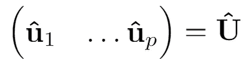*

*特征向量矩阵。那么最佳值由下式给出*

*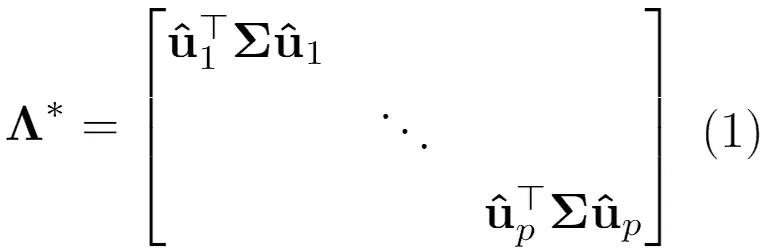*

*从而产生最佳的估计量*

*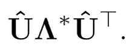*

*注意，根据(固定的)样本特征向量,( 1)中的最优值通常不完全等于真实特征值，而是真实特征值的线性组合。*

*因此，让我们计算样本协方差矩阵和非线性收缩矩阵，并检查我们离理想情况有多近:*

```
*## Sample Covariance Matrix
samplespectral<-eigen(cov(X))## Nonlinear Shrinkage
Cov_NL<-qis(X)
NLvals<-sort( diag( t(samplespectral$vectors)%*%Cov_NL%*%samplespectral$vectors  ), decreasing=T)## Optimal: u_j'*Sig*u_j for all j=1,...,p
optimalvals<-sort(diag( t(samplespectral$vectors)%*%Sig%*%samplespectral$vectors  ), decreasing=T)plot(sort(samplespectral$values, decreasing=T), type="l", cex=1.5, lwd=2, lty=2, ylab="Eigenvalues",)
lines(optimalvals, type="l", col="red", cex=1.5, lwd=2, lty=1)
lines(NLvals, type="l", col="green", cex=1.5, lwd=2, lty=3)
title(main="Multivariate Gaussian")legend(200, 8, legend=c("Sample Eigenvalues", "Attainable Truth", "NL"),col=c("black", "red", "green"), lwd=2, lty=c(2,1,3), cex=1.5)*
```

*这给出了情节:*

**

*来源:作者*

*该图显示了(1)对角线上的最佳值，以及样本和非线性收缩估计值。看起来像人们希望的那样，样本特征值显示出过度分散(对于大值来说太大，对于小值来说太小)，而非线性收缩非常接近理想值。这正是我们所期望的，因为与样本大小 *n=300* 相比，维度 *p=200* 相当高。相对于 *n* 选择的 *p* 越大，样本协方差矩阵看起来就越差。*

*现在我们做同样的事情，但是模拟一个具有 4 个自由度的多元 t 分布，一个(非常)重尾分布:*

```
*### Multivariate t case
X<-rmvt(n=n, sigma=Sig, df=4)## Truth
Sig <-4/(4-2)*Sig  ## Need to rescale with a t distribution## Sample Covariance Matrix
samplespectral<-eigen(cov(X))## Nonlinear Shrinkage
Cov_NL<-QIS(X)$Sig
NLvals<-sort( diag( t(samplespectral$vectors)%*%Cov_NL%*%samplespectral$vectors  ), decreasing=T)## Optimal: u_j'*Sig*u_j for all j=1,...,p
optimalvals<-sort(diag( t(samplespectral$vectors)%*%Sig%*%samplespectral$vectors  ), decreasing=T)plot(sort(samplespectral$values, decreasing=T), type="l", cex=15, lwd=2, lty=2, ylab="Eigenvalues",)
lines(optimalvals, type="l", col="red", cex=1.5, lwd=2, lty=1)
lines(NLvals, type="l", col="green", cex=1.5, lwd=2, lty=3)
title(main="Multivariate t")legend(200, 40, legend=c("Sample Eigenvalues", "Attainable Truth", "NL"),col=c("black", "red", "green"), lty=c(2,1,3), cex=1.5, lwd=2)*
```

*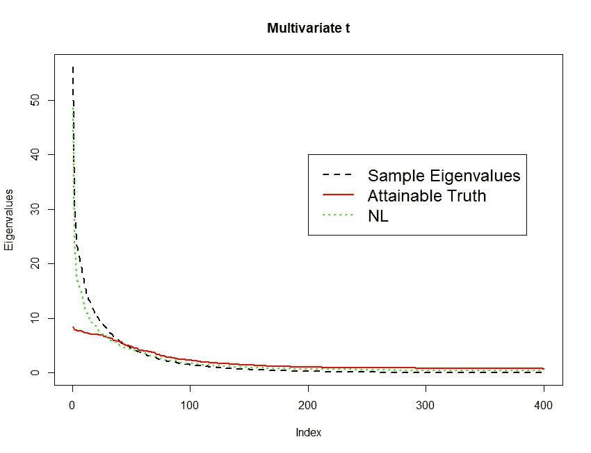*

*来源:作者*

*现在，这看起来不太好了！绿色的非线性收缩值也显示了一些过度分散:大的值太大，而小的值有点太小。显然，在有限样本中，重尾会扭曲非线性收缩。如果有一种方法在高斯情况下显示同样惊人的结果，但在重尾模型中也保持良好的结果，那就太好了。这是我们新方法背后的动机。现在，我将介绍一些细节，首先介绍这种方法的关键:椭圆分布。*

***椭圆分布***

*椭圆分布类包括合理范围的不同分布，如多元高斯分布、多元 t 分布、多元广义双曲线分布等。如果随机向量 **X** 遵循椭圆分布，则可以写成*

*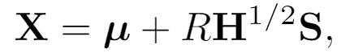*

*其中 **S** 在 *p* 维度上均匀分布在单位球面上 *R* 是某个独立于 **S** 的非负随机变量。这听起来可能很复杂，但它只是意味着椭圆分布可以简化为圆形(二维)或球形(一般)上的均匀分布。因此，这些类型的分布有一个非常具体的结构。特别需要提到重要的一点:上式中， **H** 称为*色散矩阵*，与*协方差矩阵*相对。在本文中，我们想要估计协方差矩阵，如果它存在，给出如下*

*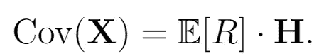*

*这已经很有趣了:在椭圆模型中， **H** 通过假设存在，但是如果 *R* 的期望值不是有限的，协方差矩阵可能不存在！例如，自由度小于 2 的多元 t 分布没有协方差矩阵。尽管如此，我们仍然可以在这种情况下估计出 **H** 。所以色散矩阵在某种意义上是一个更一般的概念。然而，在本文中，我们将假设协方差矩阵存在，在这种情况下，我们从上面看到，离差和协方差矩阵在一个常数之前是相同的。*

*有趣的是，我们可以看一下 **Z** = **X/||X||，**这是随机向量 **X** 除以它的欧几里德范数，这个东西*将总是有相同的分布*！其实这只是在 *p 维*球面上的均匀分布。我们可以在 *p=2* 的例子中看到这一点。*

```
*X<-rmvnorm(n = n, sigma = diag(2))
Y<-rmvt(n = n, sigma = diag(2), df=4)# standardize by norm
ZGaussian<-t(apply(X,1, function(x) x/sqrt(sum(x^2)) ))
Zt <- t(apply(Y,1, function(x) x/sqrt(sum(x^2)) ))par(mfrow=c(1,2))
plot(ZGaussian)
plot(Zt)*
```

*这给了*

*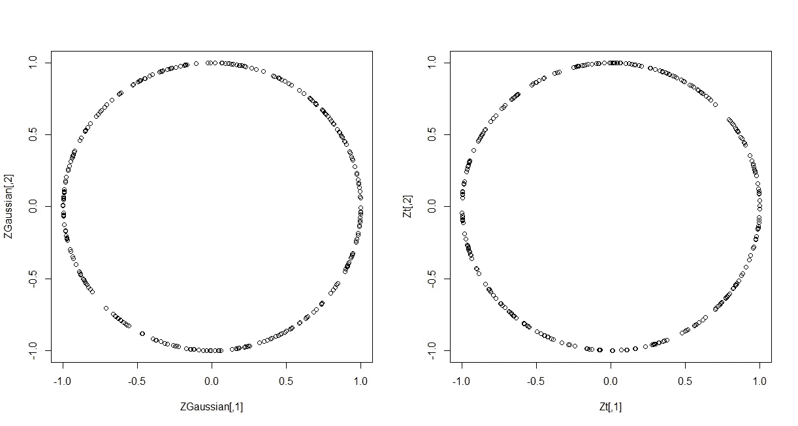*

*来源:作者*

## *(线性收缩)泰勒估计量*

*泰勒在[1]中推导出的对离差矩阵 **H** 的估计，利用了 **Z** = **X/||X||** 总是具有相同分布的事实。使用该分布的似然性，可以得到一个最大似然估计量(基本上只需求导并设置为零)，如下所示:*

*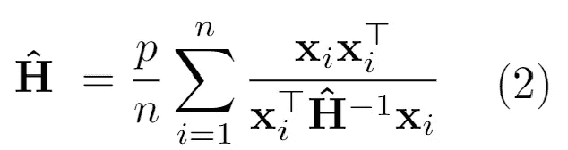*

*注意，这只是隐式地定义了 **H** (它既在左边也在右边)，所以尝试到达 **H** 的自然方式是迭代:*

*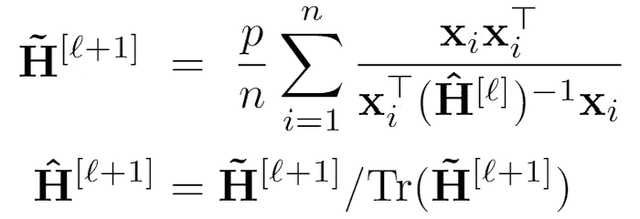*

*其中第二步只是出于技术原因需要的重正化。可以证明，这个简单的迭代方案将收敛于(2)中的解。 **H** 的这个估计量就是所谓的“泰勒估计量”。*

> *泰勒估计量是对来自椭圆分布的独立样本分布矩阵的迭代估计。它是利用椭圆随机向量按其欧几里德范数标准化后总是具有相同的分布这一事实得到的。*

*好，这是一种抵抗重尾的稳健协方差或离差估计的方法。但是上面的泰勒估计器只对 *p < n、*有效，并且当 *p* 接近 *n* 时会恶化，所以我们仍然需要针对 *p* 接近甚至大于 *n* 的情况进行鲁棒估计。信号处理社区中的许多论文只是通过在每次迭代中使用线性收缩(我在这里也解释了)来做到这一点。这看起来像这样:*

*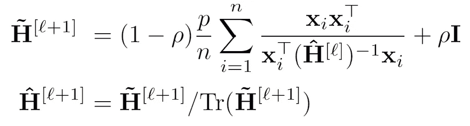*

*不同的ρ选择激发了不同的论文。例如，开始这一系列研究的论文之一是[2]。我们现在改为使用*非线性*收缩连同泰勒的方法。*

> *通过在每次迭代中使用线性收缩，我们可以稳健地估计泰勒的高维估计量。不同的论文已经找到了计算自由参数ρ的智能自适应方法。*

***鲁棒非线性收缩***

*现在的目标是使用与上面相同的迭代方案，但不是使用线性收缩，而是使用非线性收缩进行迭代。不幸的是，这并不简单。我不会在这篇文章中详细介绍，因为需要一些技巧来使它工作，但相反，我指的是我们在 [Github](https://github.com/hedigers/RNL_Code) 和论文上的实现。我们提供的实现可能也很方便，因为上面提到的信号处理社区的文章似乎都没有给出代码或在包中实现他们的方法。*

*为了展示性能和代码，我们从这个新方法开始重复多变量 t 分析。为了完整起见，我们重申上面的整个过程:*

```
*### Multivariate t case
X<-rmvt(n=n, sigma=Sig, df=4)## Truth
Sig <-4/(4-2)*Sig  ## Need to rescale with a t distribution## Sample Covariance Matrix
samplespectral<-eigen(cov(X))## Nonlinear Shrinkage
Cov_NL<-QIS(X)$Sig
NLvals<-sort( diag( t(samplespectral$vectors)%*%Cov_NL%*%samplespectral$vectors  ), decreasing=T)## R-NL code from [https://github.com/hedigers/RNL_Code](https://github.com/hedigers/RNL_Code)
Cov_RNL<-RNL(X)
RNLvals<-sort( diag( t(samplespectral$vectors)%*%Cov_RNL%*%samplespectral$vectors  ), decreasing=T)## Optimal: u_j'*Sig*u_j for all j=1,...,p
optimalvals<-sort(diag( t(samplespectral$vectors)%*%Sig%*%samplespectral$vectors  ), decreasing=T)plot(sort(samplespectral$values, decreasing=T), type="l", cex=1.5, lwd=2, lty=2, ylab="Eigenvalues",)
lines(optimalvals, type="l", col="red", cex=1.5, lwd=2, lty=1)
lines(NLvals, type="l", col="green", cex=1.5, lwd=2, lty=3)
lines( RNLvals, type="l", col="darkblue", cex=1.5, lwd=2, lty=3)
title(main="Multivariate t")legend(200, 40, legend=c("Sample Eigenvalues", "Attainable Truth", "NL", "R-NL"),
       col=c("black", "red", "green", "darkblue"), lty=c(2,1,3,4), cex=1.5, lwd=2)*
```

*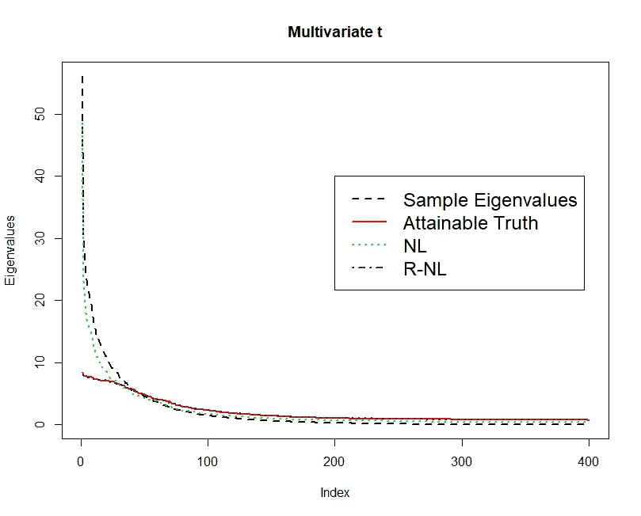*

*来源:作者*

*R-NL(蓝线)几乎完全在红线上，因此反映了我们在高斯情况下看到的 NL 的良好性能！这正是我们想要的。此外，尽管在上面的代码中可能很难理解，但使用该函数非常简单， *RNL(X)* 给出了协方差矩阵的估计值(如果你可以假设它存在的话)，而 *RNL(X，cov=F)* 给出了对 **H** 的估计值。*

*最后，如果我们在高斯例子的开始使用 RNL 函数，这些值看起来几乎与非线性收缩完全相同。事实上，下图显示了使用我们的两种方法 R-NL 和稍加修改的 R-C-NL 以及一系列竞争对手的模拟结果。设置几乎与上面的代码完全一样，具有相同的色散矩阵和 *n=300* ， *p=200。*不同之处在于，我们现在改变了多元 t 分布的尾部决定参数，在网格上从 3(极重尾)到无穷大(高斯情况)。我们不会详细讨论 y 轴上的数字到底是什么意思，只是说越大越好，100 是最大值。竞争对手“R-LS”和“R-GMV-LS”是两种线性收缩泰勒估计量，如上所述，而“NL”是非线性收缩。可以看出，对于重尾，我们比后者(好得多)得多，然后一旦我们接近高斯尾行为，我们就收敛到相同的值。*

*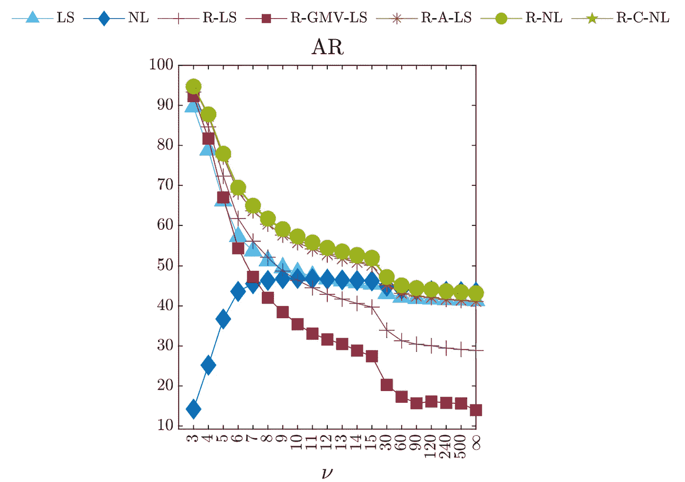*

*arXiv 论文的模拟结果。*

## *结论*

*本文讨论了论文“R-NL:高维椭圆分布的快速稳健协方差估计”。关于 arXiv 的论文包含了广泛的模拟设置，表明 R-NL 和 R-C-NL 估计量在广泛的情况下表现非常好。*

*因此，我希望这些估计量也能成功地用于许多实际应用中！*

***参考文献***

*[1]泰勒博士(1987 年 a)。多元散度的无分布 M 估计。统计年鉴，15(1):234–251。*

*[2]陈、威塞尔和希罗(2011 年)。高维协方差矩阵的稳健收缩估计。IEEE 信号处理汇刊，59(9):4097–4107*