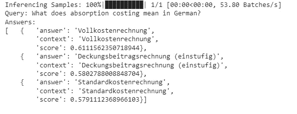
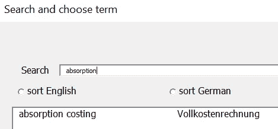
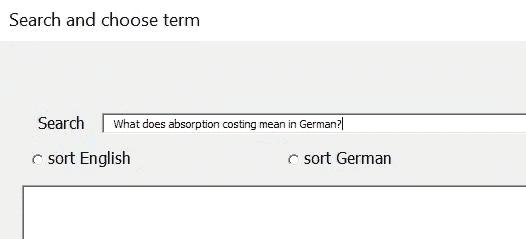
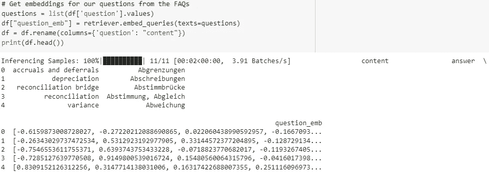
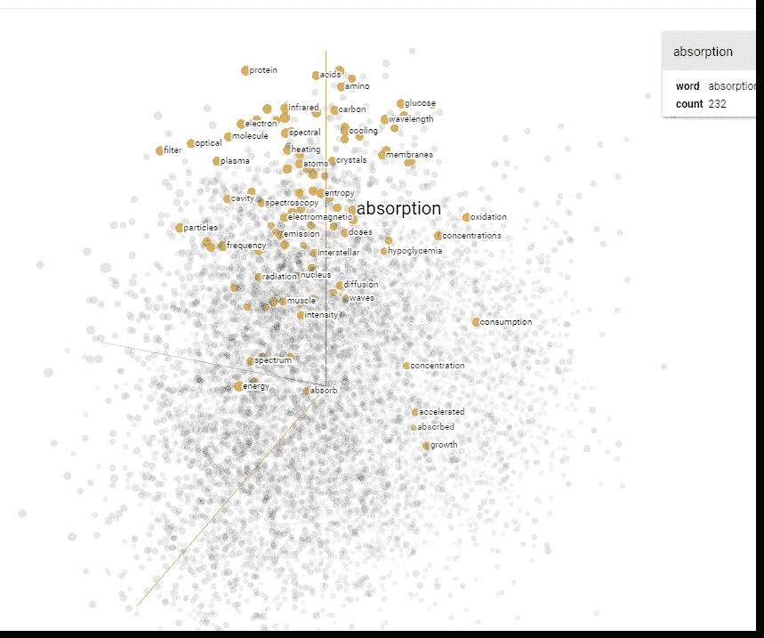
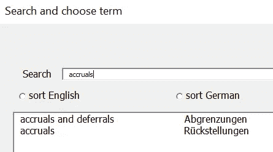
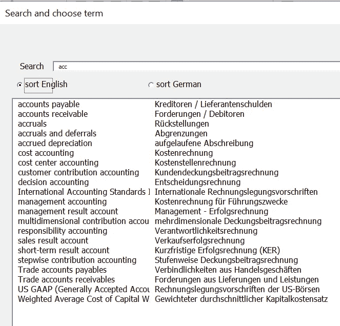

# 用 Haystack 实现高可扩展性快速搜索

> 原文：<https://towardsdatascience.com/high-scalable-fast-search-with-haystack-8b7bb103df8e>

## 使用 Elasticsearch 和 GPU 将您的 FAQ 搜索放在类固醇上


使用 Haystack 的嵌入式单词搜索来确保安全(照片由 [Rutpratheep Nilpechr](https://unsplash.com/@rutpratheep?utm_source=unsplash&utm_medium=referral&utm_content=creditCopyText) 拍摄)

在[之前的帖子](/creating-autocomplete-search-forms-e8bc3f2c1669)中，我们创建了一个简单的“字符串匹配搜索”来查找德语/英语翻译。从比喻的意义上来说，我们也可以把这个翻译表称为一种 FAQ。FAQ 搜索据说具有以下积极特征:

*   在推理时非常快
*   很好地控制答案

虽然也有令人沮丧的地方:

*   概括:只有与 FAQ 中现有问题相似的问题才能得到回答

出于纯粹的好奇，我们现在想为我们的翻译器尝试一种比简单的字符串搜索更高级的技术。为此，我们将使用 Haystack 的认知搜索。

**解决方案:**

Haystack 是使用单词嵌入功能的首选:

  

我们将使用 Google Colab 的 GPU 来弹性地改进 Haystack search (ElasticSearch，如果我应该直呼其名的话)

你也可以在 [Colab](https://colab.research.google.com/drive/1VYzia-KKeMe0ozg5BEfi865gzaZIrAK8#scrollTo=RM4YjMvOkJX0) 上找到完整的代码(图片由作者提供)

让我们看看这项先进技术的成果。虽然我们将主要关注这篇文章中的结果，但请随意查看我的 Github 资源库中的完整代码。



Haystack 向我们展示了这个问题的前三个答案(图片由作者提供)

> 如果您想了解更多关于单词相似性的知识，您可能会发现这篇文章很有帮助:

</chatbot-a-complete-pycharm-app-part-2-of-3-distance-metric-46462a9ad4e4>  

还记得我们在[简单字符串搜索](https://medium.com/p/e8bc3f2c1669/edit)中搜索“absorption”时，我们得到的是“Vollkostenrechnung”这个单词的正确德语翻译吗？



(图片由作者提供)

使用 Haystack，我们得到了相同的结果(得分最高的前 1 个答案)。Haystack 的嵌入式单词搜索的一个明显的优点是，我们现在可以用自然语言查询我们的翻译。我们可以问一个完整的句子，仍然可以得到答案。通过我们的简单搜索，如果我们问“吸收在德语中是什么意思？”我们不会得到答案:



(图片由作者提供)

尽管训练数据仍然只基于英语/德语词汇，但 Haystack 从中获得了更多。就是草堆后面嵌入魔法这个词。



嵌入相似性基于问题(图片由作者提供)

这也是为什么 Haystack 将“边际贡献会计”列为第二，将“标准成本会计”列为第三。它们与“吸收”并不相同，但它们确实包含“成本核算”一词，因此被判定为相似。



为了更好地理解单词嵌入，请看[http://projector.tensorflow.org/](http://projector.tensorflow.org/)(图片由作者提供)

让我们尝试另一个例子，现在更精确地检查结果(详细说明“全部”而不是“最小”):

“所有细节”将告诉我们更多的嵌入背景，并给出以下输出:

```
Inferencing Samples: 100%|██████████| 1/1 [00:00<00:00, 62.73 Batches/s]Query: What are accruals?
Answers:
[   <Answer {'answer': 'Rückstellungen', 'type': 'other', 'score': 0.6129861828861322, 'context': 'Rückstellungen', 'offsets_in_document': None, 'offsets_in_context': [{'start': 0, 'end': 14}], 'document_id': 'd8dd4582c851b70968837d0ddc24b010', 'meta': {'answer': 'Rückstellungen', 'query': 'accruals'}}>,
    <Answer {'answer': 'Rabatt', 'type': 'other', 'score': 0.5722656545690049, 'context': 'Rabatt', 'offsets_in_document': None, 'offsets_in_context': [{'start': 0, 'end': 6}], 'document_id': '9bf6c46ce95bdab52a72ab1bf7333f8c', 'meta': {'answer': 'Rabatt', 'query': 'allowance'}}>,
    <Answer {'answer': 'Abgrenzungen', 'type': 'other', 'score': 0.5675899718102981, 'context': 'Abgrenzungen', 'offsets_in_document': None, 'offsets_in_context': [{'start': 0, 'end': 12}], 'document_id': '6251dfe668dd12ac323b626bf66d010d', 'meta': {'answer': 'Abgrenzungen', 'query': 'accruals and deferrals'}}>]
```

第一个答案是我们所期望的:“应计”的意思是“Rueckstellungen”。第三个答案也是合适的，因为“应计和递延”代表“Abgrenzungen”。但是，Haystack 从哪里得到答案 2(“津贴”，在德语中是“拉巴特”的意思)？在我们的字符串搜索中，当我们搜索“应计”时，我们只找到两个匹配项:



“应计项目”中绝对没有接近“拉巴特”的字符串:



但人们可以认为，“备抵义务”也可以被视为“应计项目”。也许这就是为什么 Haystack 将“备抵”排在第二位，甚至排在“应计和递延”(前 3 位)之前。

正如我们已经提到的，我们的翻译器是提供一个精确的翻译搜索单词。换句话说，它是一个 100%的问答映射。因此，这个上下文中的字符串搜索——原则上可能很简单——对于明确的“词汇词典”来说是一个很好的解决方案。这是否意味着 Haystack 对所有 FAQ 任务都没用？不，一点也不！我们只需要转向真正的 FAQ 任务(而不是词汇词典)。还记得艾萨克( **I** 智能 **S** 解决方案为 **A** 管理和 **A** 分析 **C** 沟通)，我们的聊天机器人回答常见问题吗？多亏了 Haystack(链接如下)，我们将显著改进 Isaac 的 FAQ 功能。

**总结:**

恭喜你，你现在已经了解了简单字符串搜索与使用 Elasticsearch 和 Haystack 的认知搜索相比的优缺点。在下一篇文章中，我们将利用这些知识来改进我们聊天机器人的 FAQ 功能。

在此之前，非常感谢您的阅读！希望这篇文章对你有帮助。请随时在 [LinkedIn](https://de.linkedin.com/in/jesko-rehberg-40653883) 、 [Twitter](https://twitter.com/DAR_Analytics) 或[工作室](https://jesko-rehberg.medium.com/virtual-reality-vr-for-education-a532aa5b6272)与我联系。

<https://jesko-rehberg.medium.com/membership>  

您可以在我的 [Github](https://github.com/DAR-DatenanalyseRehberg/HaystackFAQSearch) 资源库中找到完整的代码和文件。请随时在 [LinkedIn](https://de.linkedin.com/in/jesko-rehberg-40653883) 、 [Twitter](https://twitter.com/DAR_Analytics) 或[工作室](https://jesko-rehberg.medium.com/virtual-reality-vr-for-education-a532aa5b6272)与我联系。