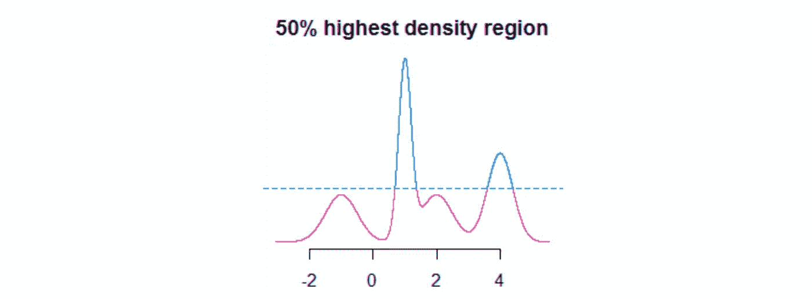
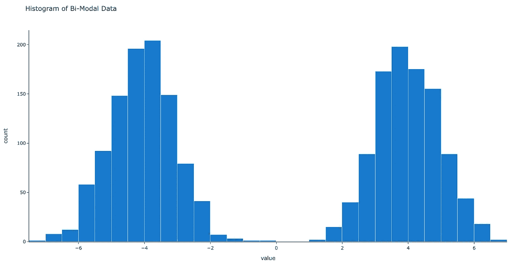
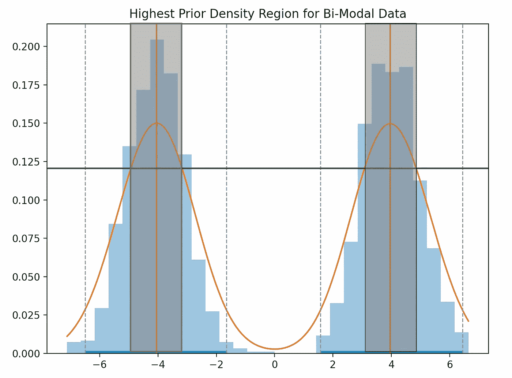
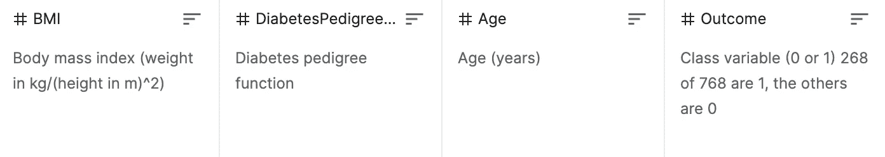

# 用于诊断黑盒性能的最高先验密度估计

> 原文：<https://towardsdatascience.com/highest-prior-density-estimation-for-diagnosing-black-box-performance-c16447a96b7>

## 如何搜索精确度较差的数字要素

模型可解释性是机器学习的一个领域，在过去几年里越来越受欢迎。更好的理解导致利益相关者更大的信任和更好的推广。但是你怎么能偷看黑盒呢？



图 1:蓝色的 50%最高密度区域(HDR)的示例。图片作者— [src](https://mathematica.stackexchange.com/questions/173282/computing-credible-region-highest-posterior-density-from-empirical-distributio) 。

在之前的一篇文章中，我们介绍了 IBM 的解决方案 [FreaAI](https://arxiv.org/abs/2108.05620) 。用一句技术话来说，FreaAI 使用最高先验密度方法和决策树来识别模型性能较低的数据区域。在对统计显著性和一些其他标准进行过滤之后，可解释的数据切片呈现给工程师。

FreaAI 不是开源的，所以在这篇文章中，我们将做一个最高先验密度方法的代码演练。

事不宜迟，我们开始吧！

# 1-虚拟示例

我们正在寻找开发代码，有效地搜索我们的功能，并寻找低准确度的领域。对于单变量数值数据，我们使用最高先验密度(HPD)。

HPD 地区是我们数据的密集区域。根据 IBM 从事 FreaAI 的研究人员的说法，高密度区域更有可能有可解释和可纠正的不准确性。为了确定这些区域，我们…

1.  近似概率密度函数(PDF)。
2.  求一条水平线的 y 值，这条水平线将我们的 PDF 分为α和 1-α。

让我们慢慢来，一步一步来。首先，我们需要创建一些虚拟数据…

```
samples = np.random.normal(loc=[-4,4], size=(1000, 2)).flatten()
```



图 2:虚拟双模态数据的直方图。图片作者。

现在的数据只是一个向量。取而代之的是，我们想要近似一条平滑的曲线来表示我们在任何给定位置的数据密度。换句话说，我们正在寻找近似的**概率密度函数(PDF)** 。

一种估计概率密度函数的方法叫做核密度估计。我们没有时间讨论细节，但是如果你有兴趣的话，这里有一个[深入的演练](https://jakevdp.github.io/PythonDataScienceHandbook/05.13-kernel-density-estimation.html)。

在下面的代码中，我们利用高斯核来开发上述数据的平滑近似值。

```
import plotly.express as px
import scipy.stats.kde as kde# 1\. get upper and lower bounds on space
l = np.min(sample)
u = np.max(sample)# 2\. get x-axis values
x = np.linspace(l, u, 2000)# 3\. get kernel density estimate
density = kde.gaussian_kde(sample)
y = density.evaluate(x)
```


图 3:使用高斯核的双模式数据的核密度估计。图片作者。

既然我们已经有了一条接近 PDF 的平滑曲线(图 3)，我们就可以开始第二步了。

在这里，我们希望找到我们的 PDF 中包含了我们数据的百分之 *p* 的区域。例如，当 p*为 0.05 时，我们希望 5%的数据包含在我们的区域中。这样做的代码有点冗长，所以我们不打算展示它，但是在图 4 中我们可以看到一个图表，它将我们所有的工作联系在一起。*



图 4:50% HPD 区域的图(阴影区域)。图片作者。

分解图 4…

*   蓝色的**框是我们原始数据的直方图。**
*   橙色的 T4 曲线是我们对 PDF 的核密度估计。
*   **红色**垂直线是我们 PDF 中密度最高的点。
*   **灰色**框对应于 x 轴区域，该区域包含我们 50%的数据。
*   **绿色**水平线用于确定**灰色**框的宽度——绿色**线**和橙色**线**的交点为 50%对应的宽度。

这个图表看起来很复杂，但是我们想要关注的是绿线和它与灰框的关系。如果我们将绿线下移，灰框会变宽，从而容纳更多的数据。相反，如果我们向上移动线条，灰色区域会变得更窄，从而容纳更少的数据。

**FreaAI 反复向上移动绿线，直到模型精度有足够的变化。每当这种情况发生时，区域(x 轴上的值)被返回给工程师。**

通过这样做，我们以非常有效的方式接收可解释的数据切片，这可以扩展到大型数据集。

# 2 —训练我们的模型

现在我们已经了解了 HPD 方法，让我们在一个真实的模型上测试一下。

## 2.1 —获取数据

所有的模型都需要数据，我们就从这里开始吧。

在本帖中，我们将使用一个可以从[这里](https://github.com/mberk06/DS_academic_papers/tree/master/DiabetesData)下载的[糖尿病数据集](https://www.kaggle.com/uciml/pima-indians-diabetes-database)。行对应于人，列对应于这些人的特征，例如年龄和身体质量指数。



图 5:我们数据集的最后 4 列— [src](https://www.kaggle.com/uciml/pima-indians-diabetes-database) 。图片作者。

如图 5 所示，我们的结果是对应于给定个体是否患有糖尿病的二元标签。

幸运的是，数据已经被清理了，所以我们只需要将数据帧读入 pandas 就可以开始了…

```
import pandas as pd
df = pd.read_csv('DiabetesData/pima-indians-diabetes.data.csv', header=None)
```

## 2.2—训练模型

有了熊猫数据框架，让我们来训练我们的黑盒模型。我们选择适合的具体模型并不重要，但是我们将使用 XGBoost，因为它的速度、开箱即用的准确性和受欢迎程度。

这是一个代码块中的模型训练…

```
# split data into X and y
mask = np.array(list(df)) == 'outcome'
X = df.loc[:,~mask]
Y = df.loc[:,mask]# split data into train and test sets
seed = 7
test_size = 0.33
X_train, X_test, y_train, y_test = train_test_split(
                                     X, Y,
                                     test_size=test_size, 
                                     random_state=seed)# fit model no training data
model = XGBClassifier()
model.fit(X_train, y_train)# make predictions for test data
y_pred = model.predict(X_test)
predictions = [round(value) for value in y_pred]# evaluate predictions
accuracy = accuracy_score(y_test, predictions)
print("Accuracy: %.2f%%" % (accuracy * 100.0))# add accuracy and return
out = pd.concat([X_test, y_test], axis=1, ignore_index=True)
out.columns = list(df)accuracy_bool = (np.array(y_test).flatten() ==
                 np.array(predictions))
out['accuracy_bool'] = accuracy_boolout 
```

除了最后一步，所有的步骤都应该是不言自明的；在训练模型之后，我们返回带有一个`accuracy_bool`列的测试数据帧，该列对应于我们是否正确预测了标签。这用于确定不同数据分割的准确性。

在我们继续之前，让我们回到我们的高层次目标。上面的 XGBoost 模型展示了 71%的样本外准确性，但是数据的某些部分显示了非常不同的准确性水平，这难道不合理吗？

嗯，这是我们的假设——我们的错误分类(可能)有系统性。

让我们看看是否能识别这些系统区域。

# 3 —真实的东西

如上所述，我们利用 HPD 方法的方式是，我们将反复改变我们正在寻找的数据的百分比，以寻找准确性的“显著”下降。

为了简洁起见，我们很遗憾不能做到超级科学，我们将不得不省去助手。然而，这里的代码改编自。

```
import numpy as np# 1\. Get percents to iterate over
start, end, increment = 0.5, 0.95, 0.05
percents = np.arange(start, end, increment)[::-1]# 2\. Create prior vars
prior_indices = {} 
prior_acc = None
prior_p = Nonefor p in percents:
  # 3\. run HDP and get indices of data in percent
  *_, indices = hpd_grid(col, percent=p) # 4\. Calculate accuracy
  acc = get_accuracy(indices) # 5\. Save if accuracy increases by > 0.01
  if prior_acc is not None and acc - prior_acc > 0.01:
    out[f'{p}-{prior_p}'] = (prior_indices - set(indices), acc - prior_acc) # 6\. Reset
  prior_indices = set(indices)
  prior_acc = acc
  prior_p = p
```

这有用吗？嗯，代码很简单(这就是为什么它没有被链接)，但是我们确实看到我们的 8 个预测器列中有 5 个有低精度区域。一些快速击球手…

*   没有误差的**栏是*皮肤厚度*、 *bmi* 、*糖尿病血统***
*   准确度下降范围从 **1.00 到 3.18%**
*   多达 **4** 个百分比变化显示精确度下降

为了给出更多的上下文，下面是列*胰岛素*的输出。

```
60-65%
> indices: {65, 129, 131, 226, 137, 170, 46, 81, 52, 26, 155}
> accuracy drop: 0.01730911565-70%
> indices: {33, 67, 134, 8, 76, 143, 175}
> accuracy drop: 0.01593264280-85%
> indices: {193, 98, 35, 196, 109, 142, 176, 210, 21, 86}
> accuracy drop: 0.010059552 
```

既然我们知道了哪些指数返回了准确性的巨大变化，我们可以做一些探索性的分析，并尝试诊断问题。

最后，如果您想探索原始的最高先验密度函数，如下所示。请注意，它很快从[这个回购](https://github.com/aloctavodia/BAP/blob/master/first_edition/code/Chp1/hpd.py)改编而来，需要更多的工作才能量产。

下周我计划发布决策树逻辑的完整代码。敬请期待！

*感谢阅读！我会再写 20 篇文章，把学术研究带到 DS 行业。查看我的评论，链接到这篇文章的主要来源和一些有用的资源。*