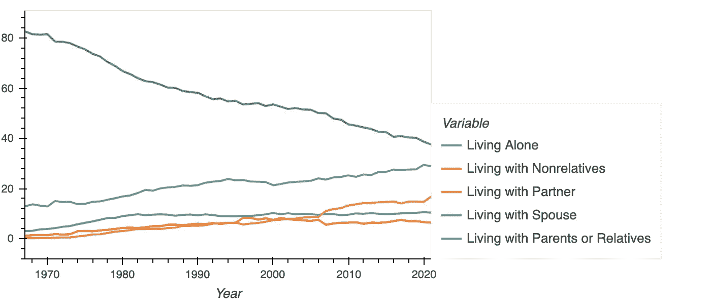
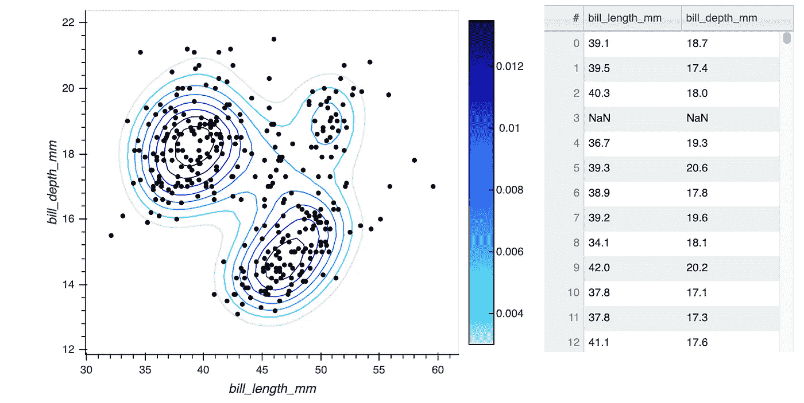
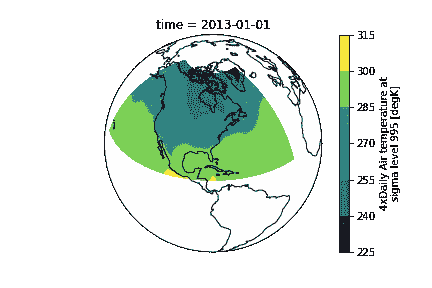
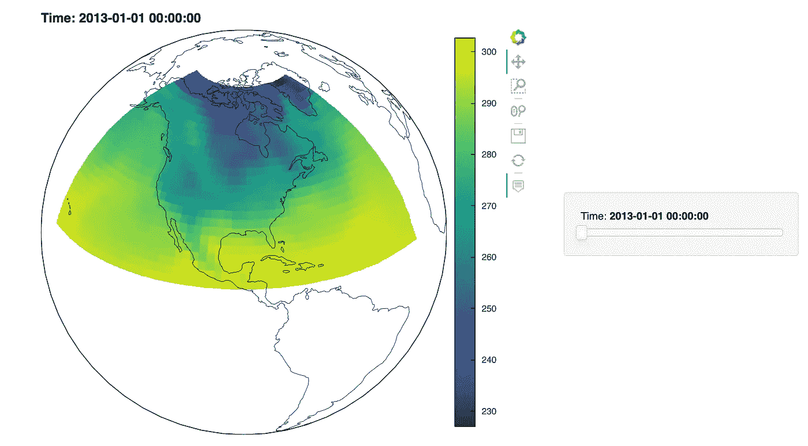
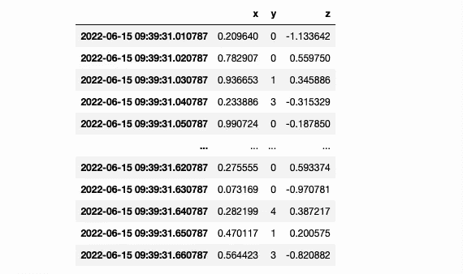
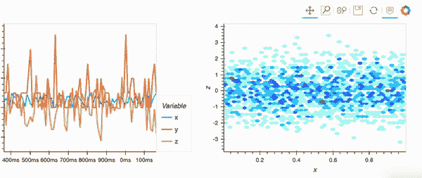
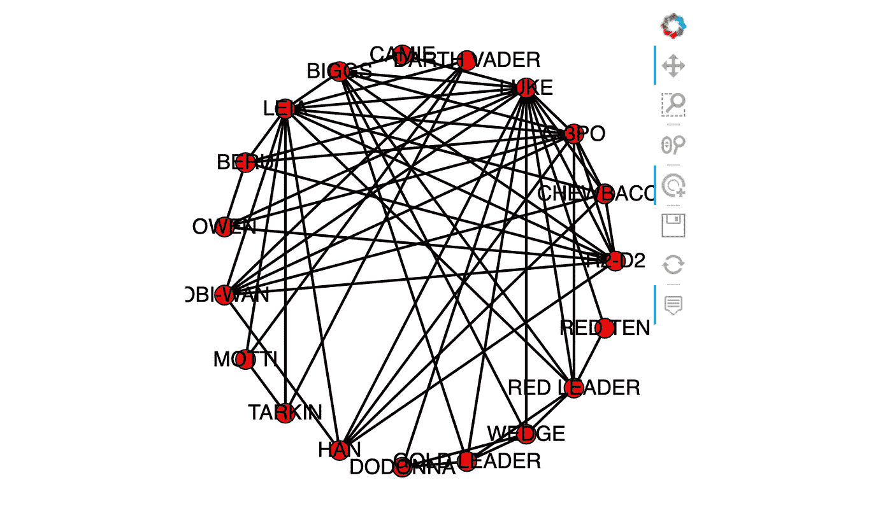

# Holoviz 正在简化 Python 中的数据可视化

> 原文：<https://towardsdatascience.com/holoviz-is-simplifying-data-visualization-in-python-d51ca89739cf>

## Python 有那么多数据类型；我们能用一个工具把它们都画出来吗？

卢克·切瑟在 Unsplash[上的照片](https://unsplash.com/s/photos/data-panel?utm_source=unsplash&utm_medium=referral&utm_content=creditCopyText)

在过去的十年中，Python 已经迅速成为处理数据的默认语言。凭借广泛的功能和充满活力的开源社区，Python 是从机器学习到 web 开发的强大工具。

虽然我经常将 Python 的成功归功于优秀的开源库，但是依赖各种第三方工具的缺点是缺乏一致性和连续性。我们确实经常有内置的绘图工具，如 Pandas 的原生绘图 API，但它们无法复制更现代的工具如 Bokeh 和 Plotly 的交互式绘图。底线是，当涉及到绘图时，我们花了很多时间来考虑数据格式，如果有一种简单的方法来生成跨各种数据类型的交互式绘图就好了。

这就是 HoloViz 旨在通过提供高级工具来解决的问题，这些工具可以更容易地将绘图库应用于数据。HoloViz 有一套自己维护的库，但在本文中，我们将重点关注 hvPlot。hvPlot 本质上添加了一个定制的绘图 API，可以用`.hvplot()`方法直接从我们的数据中访问它。

HoloViz 还开发了其他一些很酷的工具，我们将在以后的帖子中探讨，包括 Panel，这是一个为你的地块制作应用程序和仪表盘的工具。我们将在以后的帖子中探索如何创建仪表板应用程序，但现在，让我们深入 hvPlot，看看我们如何轻松地创建具有各种数据类型的交互式绘图。

# hvPlot

hvPlot 提供了一个高级绘图 API，可用于许多最流行的 Python 数据类型，包括:

*   **熊猫**:数据框，系列
*   **XArray** :数据集，数据阵列
*   **Streamz** :数据帧，系列
*   **GeoPandas** :地理数据框架
*   **网络 X:** 图形
*   **Dask** :数据帧，系列
*   **Rapids cuDF** : GPU 数据帧，系列
*   **进气**:数据源

我们可以看到，hvPlot 通过向 Python 的一些最流行的库中添加新的高级绘图 API 来工作，以便为您可能处理的所有数据提供一致且强大的绘图工具。令我印象深刻的是，它们支持所有这些库，因为它们占了我个人在 Python 中使用的数据的大部分。

看到他们允许我们在 Bokeh、Plotly 和 Matplotlib 之间选择作为最终的绘图后端，我也非常兴奋。我通常是 Plotly 的大力支持者，然而，我承认自从我上次使用它以来，散景已经改进了很多。因此，我将使用散景作为这篇文章的 hvPlot 后端。

# 熊猫

Pandas 无疑是最常用和最重要的 Python 库之一。能够轻松地将数据加载到表中是 Python 能够与其他流行的数据工具如 R 和 Excel 竞争的原因。

虽然熊猫是一个优秀的图书馆，但它缺乏的一个领域是绘图。在我的上一篇文章中，我讨论了一些最好的绘图 Python 库，然而，Pandas 的内置绘图工具不在其中。在熊猫的辩护中，它不是一个绘图库，它的内置工具是为了给用户一个快速和肮脏的数据帧视图。让我们来看看用熊猫制作的数据图表。

由作者创建

Pandas 在幕后使用 Matplotlib，这意味着我们可以使用 axis 对象对此进行进一步的样式化。但是，当我们可以使用 hvPlot 以最小的努力创建一个交互式的和吸引人的情节时，我们为什么要花时间来设计这个情节呢？

***注*** *: Medium 不支持直接嵌入 HTML，所以我发布了一个* [*在线 Jupyter 笔记本，你可以在上面与剧情*](https://nbviewer.org/github/wino6687/medium_hvPlot_Intro/blob/master/hvPlot_Intro_Plots.ipynb) *互动。*

由作者创建

对于那些在处理数据时生成大量快速可视化图形的人来说，能够用同样多的代码生成更好看的图形可以节省大量时间。这也允许任何人在基本上任何技能水平上访问交互式绘图，这只会继续帮助 Python 服务于广泛的用例。

## 更复杂的熊猫情节

让我们看看一个更复杂的图，我们可以使用 hvPlot。为此，我导入了 Seaborn penguin 样本数据集，其中包含三种不同企鹅的信息。

由作者创建

由作者创建

我们可以看到，我们可以将图层层叠加，甚至在同一个窗口中生成数据表。能够以如此少的努力产生这种类型的图是一个主要的时间节省。

# 地理数据

到目前为止，地理图是我最喜欢的数据可视化类型，然而，用 Python 制作它们可能会很痛苦。这种摩擦很大程度上源于依赖性问题，这会浪费大量宝贵的时间。不幸的是，我使用 Holoview 绘制地理数据的体验并不像我希望的那样顺利，但我确实找到了一种可靠的方法来设置它。

在我们进入依赖性问题之前，让我们看一下 xarray 的示例数据中的气温数据的可视化。我们将使用 matplotlib 来创建绘图，并使用 cartopy 来处理投影。

由作者创建

由作者创建

说实话还不错！然而，我一直觉得当涉及到空间数据时，交互式绘图有很多好处。让我们使用 hvPlot 重新制作这个情节。

由作者创建

由作者创建

这是一个很棒的情节。很高兴我们可以提供一个时间片的数据，并自动获得一个滑块，通过不同的日子擦洗。在我用 Python 完成的所有空间绘图中，这可能是我遇到的绘制地球上有适当海岸线的投影数据最快的工具。

***注*** *:如果你在复制这个情节时遇到问题，我会在文章的最后介绍避免依赖问题的步骤。*

# 流数据

使用传统工具在 Python 中可视化流数据尤其困难。这是可能的，但没有我希望的那么容易。幸运的是，hvPlot 处理得非常好。我们可以使用 streams 库创建一个随机数据流，然后用 hvPlot 绘制该数据流。请记住，我们不再使用纯 pandas 数据框架，所以我们必须为 streamz 导入适当的 hvPlot API。

由作者创建

由作者创建

由作者创建

# 图形/网络数据

网络数据是另一种不太适合原生 Python 库的静态图的格式。对于这个例子，让我们使用一个网络，其中节点是星球大战中的角色，边代表一个共享的场景。

由作者创建

由作者创建

如果你去交互式笔记本，你会注意到当你悬停在一个节点上时，它会高亮显示所有的边。像这样的小事情使得交互图作为可视化工具如此有效，hvPlot 使创建交互图变得如此容易，这真是太棒了。

# 缺点是什么？

虽然我真的很喜欢 hvPlot 使我们能够不费吹灰之力做出的各种绘图，但使用更高级别的 API 来取代这些库的内置绘图方法也有一些小缺点。首先，你增加的抽象层次越多，当错误发生时就越难追踪。

我遇到的最恼人的问题是依赖问题，我花了相当多的时间来解决。Geoviews 包有助于使用 hvPlot 创建地理图，它对 Conda 中的依赖项非常挑剔。然而，这并不是唯一的例子，地理图书馆长期以来一直存在依赖性问题；任何必须依赖 GDAL 工作的人都可能曾经遇到过环境问题。

幸运的是，我找到了让它在两台机器上可靠工作的几个步骤。

1.  创造清新的康达环境
2.  使用 conda-forge 仅安装 pyviz、geoviews 和 hvplot
3.  更新 nbconvert(以避免无错误消息的不可见图)

我知道创建一个单独的环境只是为了用地理数据来尝试 hvPlot 是很烦人的，但是，请随意尝试从这里安装您需要的其他库，因为很有可能一切都会继续工作。

# 包扎

总的来说，hvPlot 给我留下了深刻的印象，我可能会在以后的工作中使用它。对于大多数数据类型，这确实感觉像是对我在探索数据集时用 matplotlib 进行的快速绘图的严格升级。这对熊猫的绘图 API 来说尤其如此；我真的很喜欢直接从数据帧中创建交互式绘图是多么容易。

在我的大多数测试中，我并不觉得我必须花时间摆弄 hvPlot，在大多数情况下，它只是工作。我要说的是，如果你确实遇到了问题，互联网上的例子会更少，然而，随着图书馆今天工作得如何，这可能会继续改善。

# 资源

*   [hvPlot 安装和文件](https://hvplot.holoviz.org/developer_guide/index.html)
*   [Jupyter 笔记本上有例图](https://nbviewer.org/github/wino6687/medium_hvPlot_Intro/blob/master/hvPlot_Intro_Plots.ipynb)
*   [我最喜欢的 Python 绘图库](/what-are-the-best-python-plotting-libraries-df234a356aec)

> **注意:**如果你喜欢在 Medium 上阅读我和其他人的内容，考虑使用下面的链接订阅，以支持这样的内容创作，并解锁无限的故事！

  

# 引文

*   **星球大战数据** —开放许可，范创作

Gabasova，E. (2016 年)。星球大战社交网络。https://doi.org/10.5281/zenodo.1411479

*   **NetworkX 气温数据**—无限制， [NCEP/NCAR 再分析 1](https://psl.noaa.gov/data/gridded/data.ncep.reanalysis.html)

国家环境预测中心/国家气象局/NOAA/美国商务部。1994 年，每月更新。NCEP/NCAR 全球再分析产品，1948 年-继续。https://psl.noaa.gov/data/gridded/data.ncep.reanalysis.html 国家海洋和大气管理局/PSL 的研究数据档案。

*   **企鹅数据集** —知识共享， [PamlerPenguins](https://github.com/allisonhorst/palmerpenguins)

艾莉森·玛丽·霍斯特。(2020).帕尔默企鹅:帕尔默群岛(南极洲)企鹅数据。多伊:https://doi.org/10.5281/zenodo.3960218