# Hopfield 网络:神经记忆机器

> 原文：<https://towardsdatascience.com/hopfield-networks-neural-memory-machines-4c94be821073>

## 递归神经网络模型的美学切入点

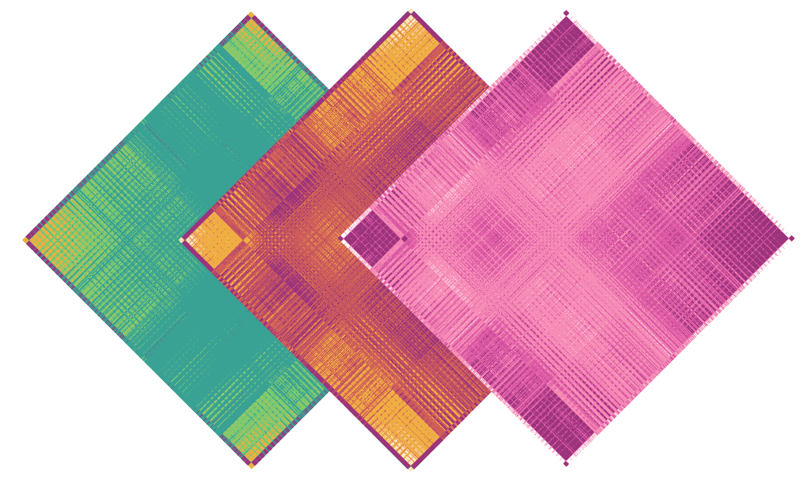

**图一。***各种“记忆”矩阵，对应于由 Hopfield 网络模型记住的不同图像(图片由作者提供)*

# **—概述—**

本文涵盖了 Hopfield 网络——能够存储和检索多个记忆的递归神经网络。我们将从一个深入的概念性概述开始，然后从头开始用 python 实现 Hopfield 网络；在这里，我们将构建、训练、动画和跟踪我们网络的各种统计数据。最后，我们将以 Hopfield 网络在现代机器学习问题中的应用为例来结束。请随意使用下面的目录，跳到您感兴趣的部分。如果你在这篇文章中发现任何错误或不一致的地方，请联系我们，或者提供反馈，告诉我们这些文章将来如何改进；感谢您的关注！

# —目录—

*   介绍
*   概念背景
*   耐能量
*   代码实现
*   现代 HOPFIELD 网络的应用
*   有用的链接

# **—简介—**

在你生命的每一刻，活动波都在你的大脑网络中传播。数十亿个信号不断协调振荡；这些网络是支撑你一切的功能架构。它们是你的爱，你的压力，你最喜欢的歌，你的希望和梦想。你的整个存在感和体验是由这些网络的动态行为形成的，由记忆系统保持稳定，记忆系统不断适应以更好地代表你在不断变化的环境中的位置。

人脑中网络的庞大范围和整合使得研究我们熟悉的形式的计算如何、在哪里、甚至是否以我们熟悉的形式发生变得非常困难。有证据表明，在单细胞中的[调节蛋白](https://www.frontiersin.org/articles/10.3389/fnmol.2018.00445/full)、皮层[微电路](https://www.cell.com/neuron/comments/S0896-6273(02)00944-3)和全脑[功能网络](https://www.sciencedirect.com/science/article/pii/B9780128179864000225)等层面上存在信息处理。对大脑的实验性理解进展缓慢。幸运的是，聪明的工程师已经发明或发现了算法，可以部分地模拟这些网络的各个方面。没有一个单一的模型可以概括人脑的绝对复杂性和行为，但是这些工具让学习这类系统的学生有一个方便的窗口来观察在分布式网络的活动中，信息可能被计算并最终被表示的方式。

为了这篇文章的目的，我们将分析和用 python 实现二进制 Hopfield 神经网络。尽管存在更新的算法，但这台简单的机器是神经网络中记忆和信息处理的研究和建模的一个既有信息量又有美感的切入点。我们将从概念背景开始，然后转向实现。最后，我们将介绍 Hopfield 网络在现代数据分析和模型生成中的一些功能用例。

# **—概念背景—**

Hopfield 网络是一种漂亮的[递归人工神经网络](https://en.wikipedia.org/wiki/Recurrent_neural_network) (RNNs)的形式，首先由 John Hopfield 在他 1982 年的论文中描述，题为:*[*神经网络和具有涌现集体计算能力的物理系统*](https://www.pnas.org/content/79/8/2554) *值得注意的是，Hopfield 网络是联想神经网络的第一个实例:能够产生紧急联想记忆的 RNN 结构。关联存储器或内容寻址存储器是一种系统，在该系统中，通过输入模式与记忆模式的关联性来启动记忆回忆。换句话说，联想记忆允许只使用不完整或有噪声的部分来检索和完成记忆。举个例子，一个人可能会听到一首他们喜欢的歌曲，然后被“带回”他们第一次听到这首歌的记忆。那段记忆中的背景、人物、环境和情感，可以通过随后只暴露给原始刺激的一部分来恢复:只有这首歌。Hopfield 网络(HNs)的这些特征使它们成为人类联想记忆早期计算模型的良好候选，并标志着神经计算和建模新时代的开始。**

**Hopfield 独特的网络架构基于 [Ising](https://en.wikipedia.org/wiki/Ising_model#:~:text=The%20Ising%20model%20(%2F%CB%88a%C9%AA,of%20ferromagnetism%20in%20statistical%20mechanics.&text=The%20model%20allows%20the%20identification,a%20simplified%20model%20of%20reality.) 模型，这是一种解释铁磁材料产生的磁场的紧急行为的物理模型。该模型通常被描述为平面图，其中节点表示规则重复排列的磁偶极矩。每个节点可以占据两种状态之一(即自旋向上或自旋向下，+1 或-1)，并且相邻节点之间的状态一致在能量上是有利的。当每个偶极“翻转”，或进化以找到局部能量最小值时，整个物质趋向于稳态，或全局能量最小值。HNs 可以以类似的方式来考虑，其中网络被表示为 2D 图，并且每个节点(或神经元)占据两种状态之一:活跃或非活跃。像伊辛模型一样，HN 的动态行为最终是根据“系统能量”的隐喻概念来确定的，网络收敛到“能量最小”状态，在学习网络的情况下，这恰好是一种记忆。**

**为了理解 Hopfield 网络的布局和功能，分解单个单元/神经元的质量和属性是有用的。**

****网络中的每个神经元都有三个品质需要考虑:****

****与其他神经元的连接** —网络中的每个神经元都与所有其他神经元相连，每个连接都有独特的强度或权重，类似于突触的强度。这些连接强度存储在权重矩阵中。**

****激活**——这是通过来自其他神经元的净输入和它们各自的连接权重来计算的，大致类似于神经元的膜电位。激活采用单个标量值。**

****双极状态** —这是神经元的输出，使用神经元的激活和阈值函数计算，类似于神经元的“触发状态”在这种情况下，-1 和+1。**

**Hopfield 网络的*信息、*或*记忆*存储在神经元之间的连接强度中，与根据长期记忆模型认为信息存储在大脑中的方式非常相似。这些连接及其各自的权重直接影响每一代网络的活动，并最终决定网络收敛的状态。你可以把神经元-a 和神经元-b 这两个神经元之间的权重，想象成神经元-a 的输出对神经元-b 激活的贡献程度，*反之亦然*。下面更多关于激活及其对神经元状态的影响。**

**重要的是，HN 中神经元之间的连接是对称的。这意味着，如果神经元-a 以+1 的强度连接到神经元-b，则神经元-b 到神经元-a 的连接也是+1。我们可以将具有 n 个神经元的网络的权重存储在一个维度为 n×n 的正方形对称矩阵中。因为神经元不与自身连接，矩阵对角线上的权重实际上为零。值得注意的是，网络结构，包括神经元的数量和它们在网络中的连接，是固定的。那些连接的*权重*是可调参数。当我们谈到“网络学习”时，我们真正的意思是对网络中的每一个权重进行微调，以便获得一些期望的输出。在 HN 的情况下，初始状态配置可以被认为是输入，而它的最终状态配置是输出。因为每个神经元的更新依赖于其输入的线性组合，所以整个网络实际上是一个巨大的数学函数:一个动态系统，随着每一代的更新，它将过去的输出作为当前的输入。这个函数的参数，即权重，决定了网络随时间演变的方式。**

**任何神经元的瞬时激活都可以通过对与其相连的神经元的输入进行**加权求和**来计算:**

**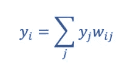**

****方程 1 :** 二进制 Hopfield 网络中一个神经元的激活函数(图片由作者提供)**

**其中 *yi* 表示网络中神经元- *i* 的激活， *yj* 表示输入到神经元- *i、*和 *wij* 的所有神经元各自输出的向量，即神经元 *i* 和 *j* 之间连接的对称权重。**

**神经元的激活用于根据阈值函数确定神经元的状态或输出:**

**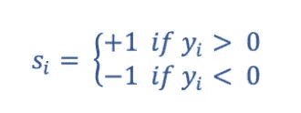**

****等式 2 :** 二进制阈值输出函数(图片由作者提供)**

**其中 *si* 代表神经元 *i* 的给定状态和输出。**

**随着网络中每个神经元状态的更新，它对其他神经元活动的贡献也随之改变；这又反过来反馈和调节更多的活动，等等，直到网络达到稳定的形成。如果一个神经元在给定的一代中的激活是正的，它的输出将是+1，反之亦然。另一种思考方式是，一个给定的神经元正在接收一个类似于其激活的输入“场”。神经元接收到的每一个输入都经过加权和求和，产生一个净激活，无论它是正的还是负的。如果该场的符号与神经元当前输出的符号不同，它的状态将翻转以自我对齐。如果输入场的符号与神经元当前输出的符号匹配，它将保持不变。如果我们根据这些规则考虑整个网络的行为，重现的质量就变得清楚了；每个网络更新或输出成为下一个时间步的输入。**

**现在我们已经定义了单个单元的特征，但是这如何转化为网络中信息的分布式存储和表示呢？**

**虽然每个神经元在给定时间可以代表两种状态中的一种，但网络的整体状态，称为 *s* ，可以代表一串二进制信息。以此模式为例:**

**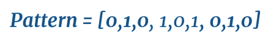**

****图 2.1** 二进制信息串(图片由作者提供)**

**这种模式是一个 1 x 9 的二进制向量，它可以被整形为 3 x 3 的矩阵:**

**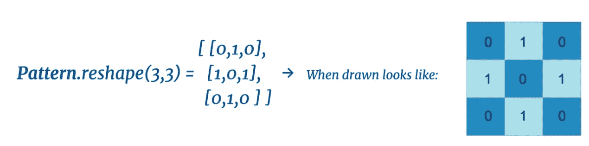**

****图 2.2** 一个二进制信息串被整形并可视化为一个图像(作者提供的图像)**

**图像只是一个数字像素值的矩阵，因此任何可以用占据二进制状态的像素值来表示的图像都可以用二进制 HN 的状态来精确地表示。许多形式的信息可以用二进制/双极方式表示，但我们将把重点放在图像上作为我们的用例。**

**如果一个图案采取图像的形式，我们就用单个神经元来表示像素本身。在上面的例子中，我们有一个 3 x 3 的像素矩阵，所以我们需要 9 个神经元来完全代表图像。另一种形象化的方法是将网络表示为图形，如下所示:**

**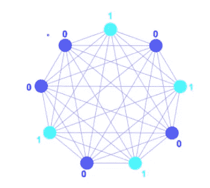**

****图 2.3** 表示 Hopfield 网络状态的示例二进制字符串。二进制字符串中的每一位都由网络中单个神经元的状态来表示(图片由作者提供)**

**在这个网络图中，节点代表神经元，边代表神经元之间的连接。红点表示神经元，其状态代表模式向量中的第一个元素， **1，**。按照顺时针方向观察神经元的状态，就可以得出模式的其余部分。**

**在计算机中，每个神经元的状态被表示为 1×9 向量中的单个元素， *S* 。换句话说，我们**直接**使用网络中神经元各自的状态来表示我们试图存储的信息:**

*****S =【0，1，0，1，0，1，0，1，0，1，0】。*****

**任何任意的 *n* 比特的信息串都可以用一个 *n* 神经元的网络来表示。它是网络中神经元的组合活动，这些神经元以分布的方式共同代表我们的目标信息。在大多数 HNs 中，神经元的状态是双极的(-1 或+1)。为了简单起见，上面的例子使用二进制 0 或 1，从这里开始假设神经元处于双极状态。**

**现在我们知道了神经元的状态是如何随着时间的推移而更新的，以及状态本身是如何表示二进制信息的，我们开始了解 Hopfield 网络真正的 *~magic~* :它们朝着记忆模式的进化。**

**这里，多一点背景信息是有帮助的。HNs 通常被称为“吸引子网络”，因为它们倾向于进化到或被吸引到“稳态”。为了看到这一点，让我们再次考虑上面的示例模式。出于本节的目的，假设网络已经学习了该模式(我们稍后将讨论学习的细节)。假设我们将网络初始化为随机状态，并让网络按照上述更新规则运行，一次一个神经元:**

**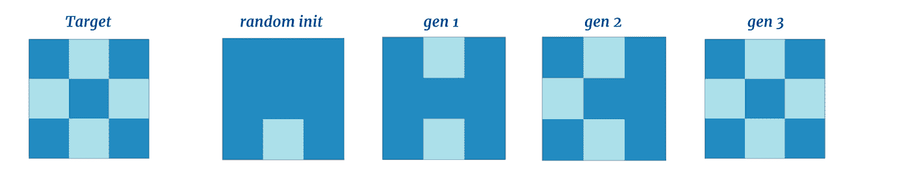**

**图 3 一个 Hopfield 网络的进化，它已经学习了目标模式，并被允许一次进化一个神经元(图片由作者提供)**

**这里我们看到，尽管网络处于随机初始化状态，但它能够在三个更新生成步骤中恢复目标内存——网络的整体状态被*吸引*到内存状态。让我们将目标模式的分辨率提高一个等级:**

**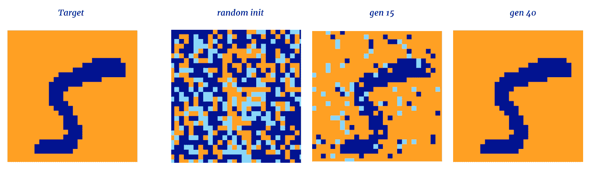**

****图 4** 从 MNIST 数据集中收敛到手写数字的 Hopfield 网络(图片由作者提供)**

*****不可思议！*** 网络又一次慢慢收敛到稳定状态，在这种情况下是手绘的‘5’，并且不再进一步更新。这种行为意义重大。尽管每个神经元的初始状态被打乱，但神经元之间连接的权重，以及它们各自的激活和输出，足以推动整个网络状态随着每次后续更新而更接近记忆的模式。每个神经元只知道自己的状态和输入，然而网络的集体活动却呈现出一种分布式模式。**

**以这种方式配置的网络实际上能够存储多达 [~0.14n 个模式](https://www.frontiersin.org/articles/10.3389/fncom.2016.00144/full)，其中 *n* 是网络中神经元的数量。当存储多个模式时，网络将收敛到与网络初始状态最相似的模式。多个存储模式的示例如下所示。**

******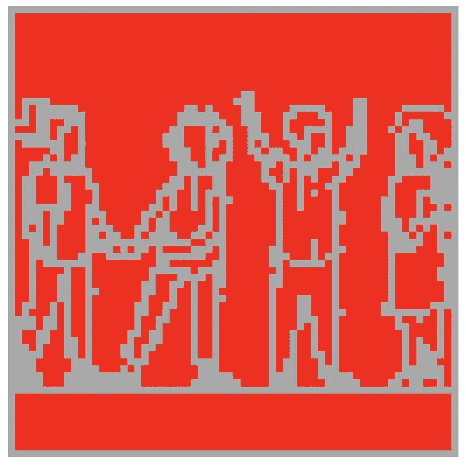****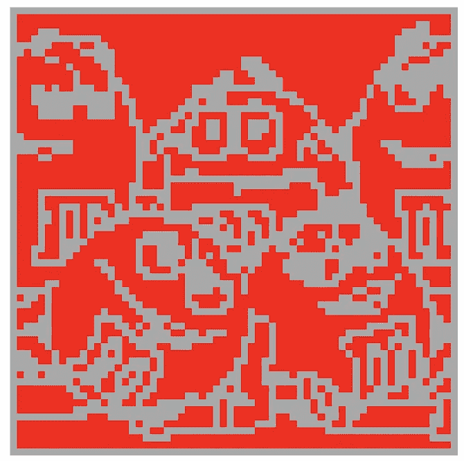****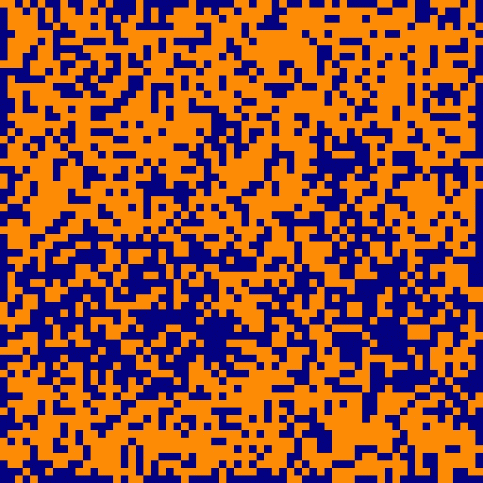****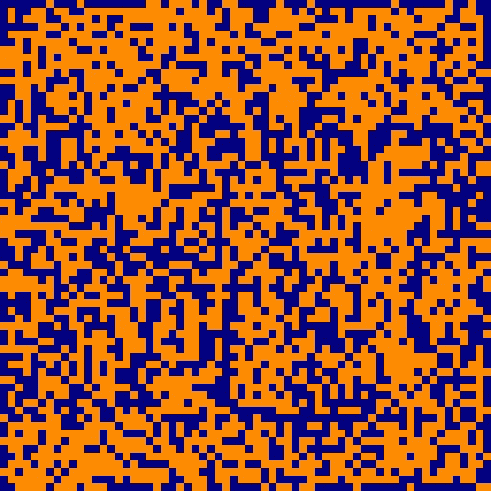****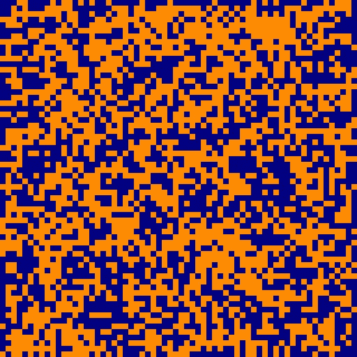**

****图 5** 相同的 4096 神经元 Hopfield 网络形成三个图像存储器，并从每个存储器的失真版本初始化。这体现了模式完成的质量(图片由作者提供)**

**在上面的例子中，同一个 4096 神经元的神经网络已经记住了三种不同的模式(红色图像)。每个图案都是由网络学习的 64x64 像素的图像。网络随后从每个图像的失真版本中被初始化三次。在每次更新生成期间，随机选择 256 个神经元(网络的 7.2%)并根据二进制阈值更新规则进行更新。尽管每个网络初始化都严重失真，但是当网络状态收敛时，网络会恢复每个相应的模式。通过对几种模式的学习，网络已经变得有能力做出灵活的、特定于刺激的行为！**

**在这些示例存储器中，我们识别的信息是发光和不发光像素的简单空间关系，即形状，这使得图像可识别。然而，任何可以存储为二进制值串的信息都可以被 HN 记忆和调用。这篇文章的后面部分将讨论 HNs 的最新应用，但为了想象，让我们回到引言中的例子:想象一下，你大脑中一个非常高维度和集成的吸引子网络的状态正在编码许多关于你第一次听到你最喜欢的歌曲的感觉和上下文环境的信息，即记忆。**

**你和谁在一起，你周围的环境，你在经历中的情绪价值，等等。虽然这些信息编码了记忆的不同部分，但当你后来单独听到这首歌时，它们可能会被同一个记忆网络立刻回忆起来。这种现象被称为*模式完成*，是人类记忆研究中的一个完整的子区域。一些人认为这种物理机制是由人类海马体中吸引子动力学的存在所介导的——参见摘自*The mechanisms for pattern completion and pattern separation in The 海马体* [***Rolls，2013***](https://www.frontiersin.org/articles/10.3389/fnsys.2013.00074/full#B121) *:***

*****海马中的许多突触(连接)表现为长时程增强所示的联想性修改，而这种突触修改似乎与学习有关(参见*** [***莫里斯，1989 年***](https://www.frontiersin.org/articles/10.3389/fnsys.2013.00074/full#B95) ***，*** [***2003 年***](https://www.frontiersin.org/articles/10.3389/fnsys.2013.00074/full#B93)***；*** [***莫里斯等人，2003 年***](https://www.frontiersin.org/articles/10.3389/fnsys.2013.00074/full#B94)***；*** [***中泽友秀等人，2003 年***](https://www.frontiersin.org/articles/10.3389/fnsys.2013.00074/full#B101)*[***2004 年***](https://www.frontiersin.org/articles/10.3389/fnsys.2013.00074/full#B99)***；*** [***林奇，2004***](https://www.frontiersin.org/articles/10.3389/fnsys.2013.00074/full#B80)***；*** [***安达信等，2007***](https://www.frontiersin.org/articles/10.3389/fnsys.2013.00074/full#B11)***；*** [***王与莫里斯，2010***](https://www.frontiersin.org/articles/10.3389/fnsys.2013.00074/full#B174)***；*** [***杰克逊，2013***](https://www.frontiersin.org/articles/10.3389/fnsys.2013.00074/full#B55) ***)。根据以上总结的证据，*** [***卷(1987***](https://www.frontiersin.org/articles/10.3389/fnsys.2013.00074/full#B108)*[***1989 a***](https://www.frontiersin.org/articles/10.3389/fnsys.2013.00074/full#B109)*[***b***](https://www.frontiersin.org/articles/10.3389/fnsys.2013.00074/full#B110) [***1991***](https://www.frontiersin.org/articles/10.3389/fnsys.2013.00074/full#B114)***等(*** [***麦克诺顿和莫里斯，1987***](https://www.frontiersin.org/articles/10.3389/fnsys.2013.00074/full#B89)***)；*** [***征，1989 年***](https://www.frontiersin.org/articles/10.3389/fnsys.2013.00074/full#B78)***；***[***McNaughton，1991***](https://www.frontiersin.org/articles/10.3389/fnsys.2013.00074/full#B86)***)提出，CA3 阶段充当自动联想[也称为吸引子]记忆，其使得情景记忆能够形成并存储在 CA3 网络中，并且随后广泛的循环连接允许通过激活同一表征的一些小部分来启动整个表征的提取(回忆线索)。********

****在我们开始 HNs 的 python 实现之前，有两个网络级的概念是联系在一起的，有助于理解:****

1.  ****网络学习** —计算网络权重，使网络状态向一个或多个记忆吸引子发展**
2.  ****网络能量**——一个数学基础和有用的类比，有助于理解*为什么*网络保证收敛到一个吸引子状态，或*能量最小值。***

****首先，让我们看看上面所示的 4096 个神经元网络的权重矩阵:****

**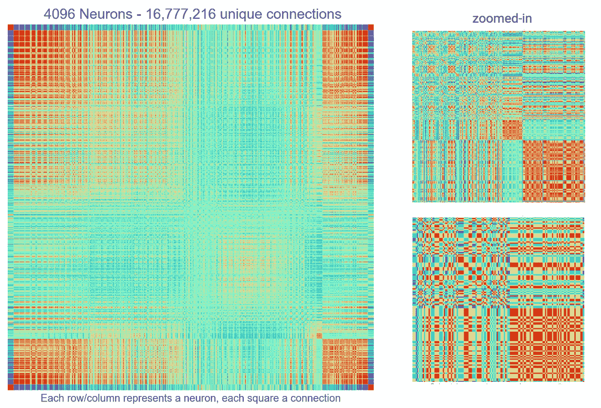**

****图 6** 代表 4096 个神经元网络所有连接权重的颜色编码矩阵(图片由作者提供)**

**你应该注意到的第一件事是这个图看起来很酷；)。每一行/列代表一个神经元，行/列之间的交叉点代表一个颜色编码的连接权重。你应该注意的第二件事是，我们有一个对角对称矩阵。这是意料之中的，因为行/列之间的彩色交叉点代表我们之前讨论过的*对称和双向连接*的权重。从技术上讲，我们只需要这个正方形的一半，但像上面这样的对称数组更容易在计算机中计算和实现，而且看起来有趣得多。**

**我们现在知道网络连接的权重决定了它的吸引子动力学。所以这个百万美元的问题是:*我们如何设计这些权重，使得网络对我们希望它记住的每个记忆都有一个吸引子？***

**已知有几种学习算法对 HNs 有用，但这里我们将利用 hebbian 学习。h [ebbian 学习](https://en.wikipedia.org/wiki/Hebbian_theory)算法起源于描述生物神经网络中突触可塑性现象的规则。总的来说，赫比学习可以被浓缩为“一起放电的神经元，连接在一起”的陈述。换句话说，如果通过突触连接的两个神经元同时活跃，它们的连接强度会增加(在 HNs 的情况下，更积极)，并且它们的活动随着时间的推移变得更加相关。**

**对于异步触发的神经元来说，情况正好相反，相反，它们的连接权重降低(在 HNs 的情况下，变得更负)。在我们储存图像的例子中，希伯来人学习背后的直觉是清楚的。我们希望在目标模式中，同时“点亮”或“熄灭”的神经元之间的权重能够在网络更新时促进它们活动的一致性。我们也希望状态相反的细胞有相反的行为。**

**根据 hebbian 学习来计算两个神经元 I 和 j 之间的单个权重的公式由下式给出:**

**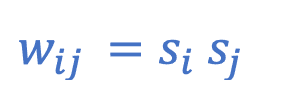**

****等式 3** :计算两个神经元(神经元 I 和 j)之间所需权重的赫比公式(图片由作者提供)**

**其中 si 和 sj 是神经元 I 和 j 在目标模式中将呈现的相应状态。为了计算导致几个同时存储的模式的权重，公式被扩展为:**

**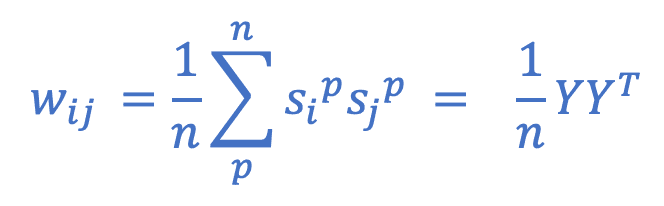**

****等式 4 :** 扩展版的赫比规则，它同时计算给定模式或一组模式的所有期望权重(图片由作者提供)**

**…它有效地计算了所有模式的平均权重，其中 *p* 代表任何模式， *n* 代表模式的数量。在右边，我们有矩阵形式的等价表达式，其中 *Y* 是包含我们的模式作为行向量的矩阵。重要的是，当存储多个模式时，当网络通过该算法学习时，每个模式中的位数必须保持一致。**

**如前所述，以这种方式学习的一个显著特征是它是“一次性的”，这意味着网络只需要一次“暴露”就可以学习。这是因为我们在一次操作中计算了整个权重矩阵。[一次性](https://en.wikipedia.org/wiki/One-shot_learning)学习有些独特，因为它通过[反向传播](https://en.wikipedia.org/wiki/Backpropagation)直接对比现代深度学习；一种过程，其特征是反复调整网络权重以减少误差信号。根据任务的不同，通过反向传播进行训练通常需要数万甚至数百万个训练样本。这使得它不适合作为人类情景记忆处理的模型，根据定义，这需要一个“情节”来记忆。有趣的是，海马体，一个已知具有吸引子样动态的区域，[在一次性学习](https://journals.plos.org/plosbiology/article/file?id=10.1371/journal.pbio.1002137&type=printable)期间被积极招募，并且已知该区域中的稀疏集合在情景记忆回忆期间协调[过去皮层状态的重演。](https://www.ncbi.nlm.nih.gov/pmc/articles/PMC7843437/)**

**在生物网络*体内*和吸引子网络*电子*的行为中观察到的东西之间存在功能和结构对称性，这让我非常感兴趣。对我来说，这表明记忆、认知和学习等行为背后的潜在机制可能比它们的物理实例化系统更为“基础”,无论是大脑还是 CPU 等等…**

****到目前为止，我们已经讨论了 HN 结构、行为和学习。接下来，我们将一切联系在一起，并使用*网络能量的概念来理解*为什么* HNs 会有这样的行为。*****

*我们知道，不管 HN 的初始状态如何，它都趋向于状态空间中的“定点”吸引子。“固定点”是描述网络状态保持稳定的一种方式，即网络可以在该点永远更新，没有神经元会翻转。这种现象对我们来说并不陌生；我们通常观察收敛到稳态的系统。想象一个球从山上滚下来，直到它停在山脚下，或者一枚掉落的硬币在地上快速旋转，直到它的一边静止不动。这种系统的状态，你可以用物体的位置、速度等来描述，收敛到没有进一步扰动就不会改变的结构。以伊辛模型为例，高温磁性材料中磁偶极子的取向可能处于高度熵无序状态。如果允许材料冷却，偶极子将独立地排列到它们的局部场，并且整个材料将趋向于均匀和稳定的全局排列状态。这些例子的共同点是它们的最终状态都处于能量极小状态。换句话说，从热力学角度来看，它们的静止是有利的，因此从每个系统的外部扰动停止的那一刻起，它们就开始各自的状态轨迹，朝着可能的最低能量前进。*

*在计算机中实现的 HNs 不是朝着热力学稳定状态演化的物理系统。然而，由于构建在网络中的约束，由它们的结构和更新规则定义，它们表现出类似的行为。记住，他们最初是受伊辛模型的启发。*

*事实上，HNs 有一个标量值，称为**能量**，它随着每个后续更新生成而单调下降。HN 的国家轨迹随着时间的推移可以被认为是一个点下降的能源景观；当网络汇聚成记忆时，它就发现自己处于风景的“山谷”中，除非受到干扰，否则不会进一步进化。*

*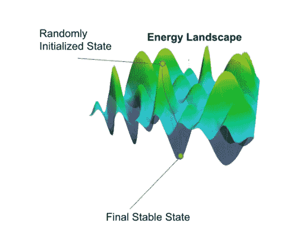*

***图 7。一个能量景观的例子**——Hopfield 网络的“记忆”状态是稳定的吸引子。在上面的例子中，有许多稳定的吸引子或谷。每个吸引子代表一段记忆，网络状态会向最接近初始状态的吸引子方向演化(图片由作者提供)*

***HNs 的美妙之处在于，根据已知的权重，它们各自的吸引子或能量极小值是可调的。系统的任何状态都可以成为*、*或*学习*，成为吸引子，因此任何状态都可以成为学习记忆。下面是 HNs 中能量的数学描述，显示了能量如何保证在随后的更新世代中减少。***

# ***—霍普菲尔德能量证明—***

**注:下面的证明是作者提出的，基于卡内基梅隆* *)* 的 [*关于 Hopfield 网络的讲座中的数学*](https://www.youtube.com/watch?v=3Cp_pjPRmt8&ab_channel=CarnegieMellonUniversityDeepLearning)*

*我发现在这种情况下把能量想成一种张力是很有用的，因为它非常符合物理能量的概念。通过将每个神经元对的各自状态以及它们之间的连接权重相乘，然后将所有可能对的值相加，来计算网络的能量:*

*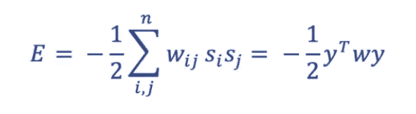*

***公式 5 :** 计算给定世代中 HN 能量的公式(图片由作者提供)*

*从物理学的角度来看，能量是做功的能力，或者系统改变的能力。这里的关键要点是，当单个节点的状态与其输入的“输入场”不一致时，张力或网络能量最高。二进制更新规则通过对齐神经元输出和输入场的符号来缓解这种紧张，这样一来，每次更新都会降低网络的整体能量。*

*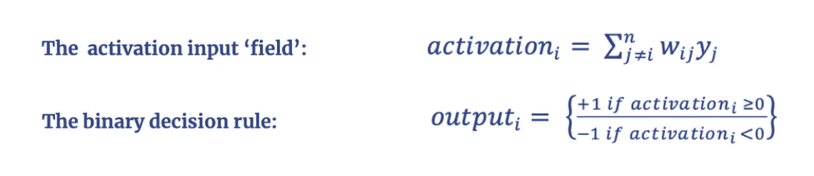*

***等式 6 :** 激活和二元决策规则(图片由作者提供)*

*当神经元状态与其输入场之间的乘积符号为负时，神经元将翻转:*

*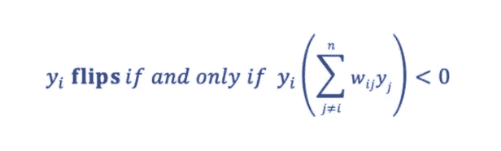*

***等式 7 :** 保证“翻转”的条件(图片由作者提供)*

*翻转神经元在 t=1(翻转后)和 t=0(翻转前)时的状态由下式表示:*

*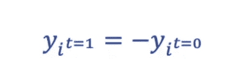*

***等式 8 :** 翻转前和翻转后神经元输出的描述(图片由作者提供)*

*例如，如果神经元在 t=0 时处于状态-1，那么在 t=1 时翻转的状态将是+1，反之亦然。根据这些规则，有一个与每次翻转相关联的数量保证*增加。*我们给这个量起了个绰号 *D* ，并把负数(- *D)* 作为我们对系统能量的类比，因为这个行为更类似于具有能量的物理系统的行为。*

*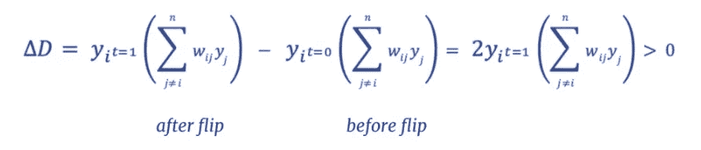*

***公式 9 :** 描述更新生成期间的增量 D 的公式(图片由作者提供)*

*所以- *D* 保证每一代都会减少，我们对每一代中更新的所有神经元求和- *D* ，并将其称为*能量*:*

*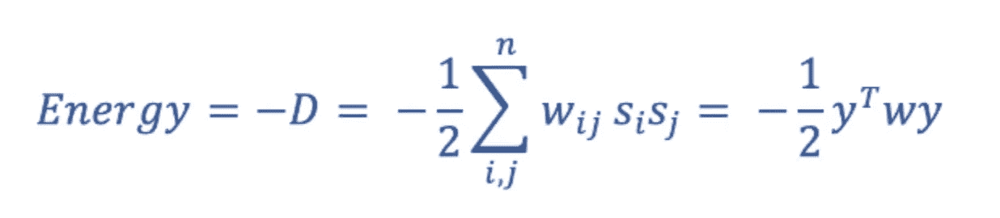*

***方程 10 :** 能量方程的迭代(图片由作者提供)*

*好吧，让我们看看它的行动！*

*让我们将经过训练的 HN 初始化为其存储器的失真版本，并在它被记住时为每一代更新计算这个值 *E* 。我们期望看到能量在初始化时最高，在内存中最低:*

***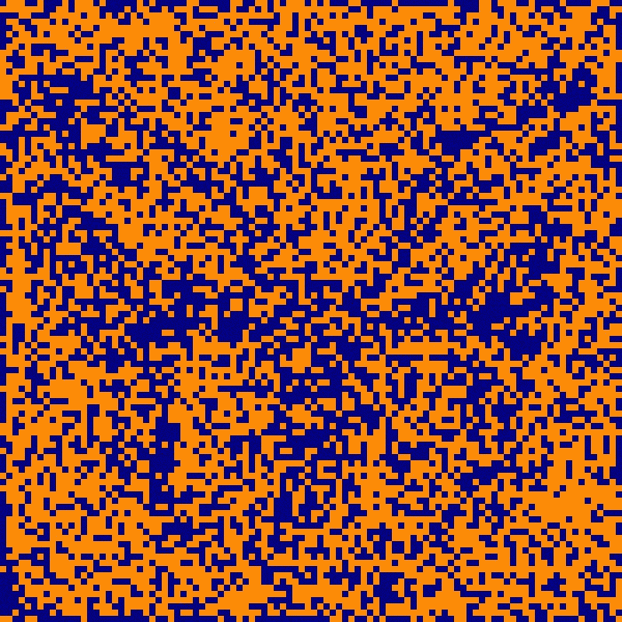**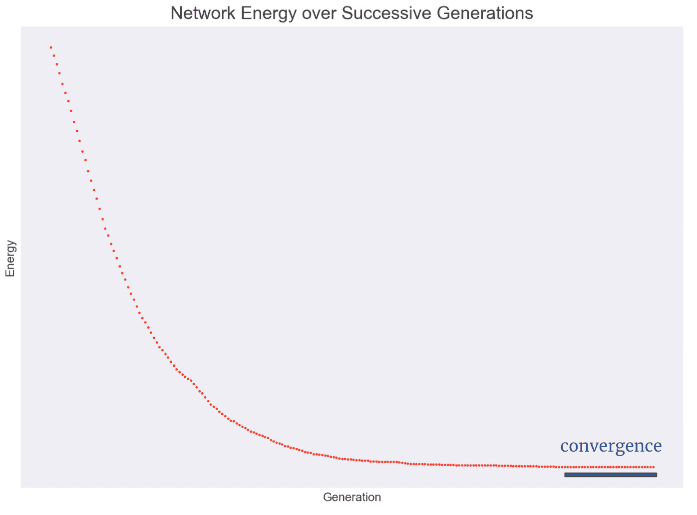*

***图 8** 一个示例网络不断迭代，直到在其内存上收敛——在每一代测量网络的总能量，并显示收敛(图片由作者提供)*

*在这里，我们看到在网络记住一张蝴蝶的照片时，在随后的更新世代中, *E* 减少了。图中标有“收敛”的部分是静态的，因为网络中的每一个神经元的状态都符合其各自输入的符号。此时，网络状态与学习到的图像相匹配，因此已经收敛到其存储器中。*

# ***—代码实现—***

*我们已经介绍了 Hopfield 网络的基础知识；现在是时候用 python 从头实现一个了。*

*这个程序将包含建立、训练和动画 Hopfield 网络的方法。我们将导入 MNIST 手写数字数据集作为实验。首先，我们实施网络的核心结构和基本功能:*

*此代码包含构建 Hopfield 神经网络所需的核心函数。您可能想要试验的任何图像或其他二进制信息字符串都应该在类初始化时作为 numpy 数组传递。*

*接下来，我们可以使用从 [MNIST](http://yann.lecun.com/exdb/mnist/) 手写数字数据集中提取的样本进行实验。我们将随机选取一个数字作为我们网络的内存，然后使用 pygame 动画显示网络的更新步骤。*

*一个使用上面定义的 Hopfield 类的实验，使用 pygame 制作动画*

*fetch_MNIST 函数是乔治·霍兹写的，可以在这里找到[。](https://github.com/geohot/ai-notebooks/blob/master/mnist_from_scratch.ipynb)*

*我们做到了！一个功能齐全、生气勃勃的 HN。上面的代码提供了一个利用图像记忆探索这些特殊网络行为的机会。*

# ***—现代 Hopfield 网络的应用—***

*如果你已经做到了这一步，你就会明白我们到目前为止所讨论的 HNs 具有占据离散二进制状态的神经元:-1 或 1。这是有用的，但是在什么信息可能被有效地存储在网络中方面有些限制。理论上，一个足够大的二进制 HN 可以存储任何信息，但是想想看，你需要多少个神经元来存储一张灰度图像。*

*假设我们有一个 28x28 的灰度图像；灰度是一种图像格式，它将像素值存储为介于 0(黑色)和 255(白色)之间的整数。如果我们在相对较小的*图像中有 28x28 = 784 个像素，并且我们选择将每个像素的灰度值表示为一个[无符号 8 位整数](https://www3.ntu.edu.sg/home/ehchua/programming/java/datarepresentation.html#:~:text=An%208%2Dbit%20unsigned%20integer,both%20representing%20256%20distinct%20numbers.)，我们将需要一个具有 6272 个神经元的 HN 来完全表示图像的信息内容。对于更大的图像分辨率，比如 1024×1024，我们需要 800 万个神经元。现代机器学习中的信息在内容和维度上都很丰富，因此拥有能够占据*连续*状态的神经元显然是一个优势，减少了代表记忆所需的神经元数量，并极大地增加了网络的信息存储容量。**

*在 2020 年的论文 [*中首次介绍了*连续 Hopfield 网络(CHNs)* 领域的进展*](https://arxiv.org/abs/2008.02217)*Hopfield 网络就是你所需要的一切。与传统的二进制 HNs 相比，CHN 有几个优点。顾名思义，CHNs 中神经元的状态是连续的，即它们是浮点数，而不是整数 0 或 1。因此，在任何给定的更新生成中，CHN 的状态都是浮点数的向量。这大大增加了网络可以学习和检索的模式的复杂性。此外，网络的存储容量，如它可以记住和回忆多少不同的模式，比二进制网络中的存储容量高得多——二进制 Hopfield 网络(bhn)容易出现“虚假”最小值。如果 BHN 学习的记忆过于相似，或者学习了太多的模式向量，网络就有收敛到中间记忆的风险，即学习模式的某种组合；换句话说，网络将无法区分模式，变得毫无用处。**

*在上面引用的 2020 年论文中，作者提出了一种 CHN 架构，该架构对现代机器学习问题提供了一些适用性。值得注意的是，该网络提议:*

*   *一步到位*
*   *存储的模式比 BHN 多得多*
*   *能够利用丰富的高维数据帮助分类任务*

*我不会在这里讨论论文的细节，但是您可以自己探索。作者为他们的实现提供了一个用例，并表明，作为深度学习架构的补充层，CHNs 在复杂的 [*免疫库分类*](https://proceedings.neurips.cc/paper/2020/file/da4902cb0bc38210839714ebdcf0efc3-Paper.pdf) *任务中的表现优于其他最先进的算法。**

*我使用的所有代码和更多代码可以在 github repo 中找到。下面是一些链接，它们在我学习 Hopfield Networks 的时候给了我很大的帮助！*

# ***—有用链接—***

*   *[麻省理工学院开放式课程，霍普菲尔德网络](https://www.youtube.com/watch?v=gt52wUN3VrQ&ab_channel=MITOpenCourseWare)*
*   *[卡耐基甜瓜讲座关于 Hopfield 网络和深度学习](https://www.youtube.com/watch?v=3Cp_pjPRmt8&ab_channel=CarnegieMellonUniversityDeepLearning)*
*   *[Geoff Hinton 关于 Hopfield 网络的演讲](https://www.youtube.com/watch?v=DS6k0PhBjpI&ab_channel=ColinReckons)*
*   *[采访霍普菲尔德网络创始人约翰·霍普菲尔德](https://www.youtube.com/watch?v=DKyzcbNr8WE&ab_channel=LexFridman)*
*   *[geeksforgeeks Hopfield Networks](https://www.geeksforgeeks.org/hopfield-neural-network/)*
*   *[扬尼克·基尔彻解释的*霍普菲尔德网络就是你所需要的*](https://www.youtube.com/watch?v=nv6oFDp6rNQ&ab_channel=YannicKilcher)*

*感谢您的阅读，并感谢任何反馈！*