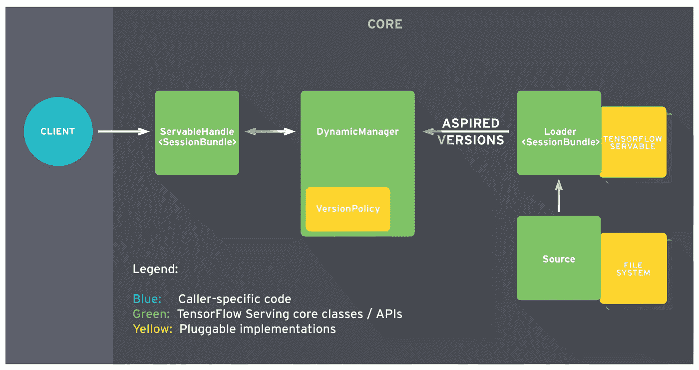
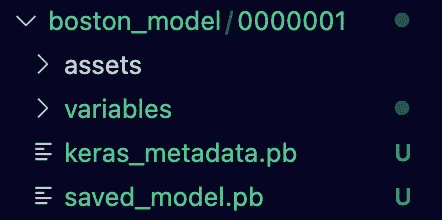
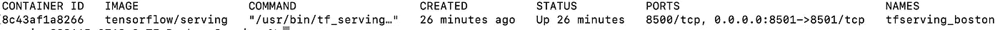
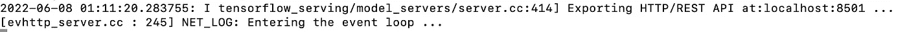
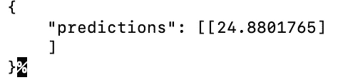

# 在 Docker 上提供 TF 服务的托管模型

> 原文：<https://towardsdatascience.com/hosting-models-with-tf-serving-on-docker-aceff9fbf533>

## 将张量流模型部署为 REST 端点

图片来自 [Unsplash](https://unsplash.com/photos/6Dv3pe-JnSg)

训练机器学习(ML)模型只是 ML 生命周期中的一步。如果你不能从你的模型中得到回应，那么 ML 就没有任何意义。你必须能够主持你的训练模型进行[推理](https://hazelcast.com/glossary/machine-learning-inference/)。有多种托管/部署选项可用于 ML，其中最受欢迎的是 [TensorFlow Serving](https://www.tensorflow.org/tfx/guide/serving) 。

TensorFlow 服务有助于获取您的已训练模型的工件，并托管它以进行推理。使用 TensorFlow Serving 进行推理的最简单方法是 [Docker](https://www.docker.com/) 。在本文中，我们将举一个例子，训练一个模型，然后使用 TensorFlow Serving 结合 Docker 托管它，以提供一个用于推理的 REST API。如果你想直接跳到代码，看看这个[库](https://github.com/RamVegiraju/TF-Serving-Demo)。

## 目录

1.  先决条件/设置
2.  张量流服务架构
3.  培训和保存您的模型
4.  使用 TensorFlow Serving & Docker 托管您的模型
5.  学分+额外资源和结论

## 先决条件/设置

在这篇文章中，我们不会深入任何实际的模型构建。我们将采用流行的[波士顿数据集](https://www.kaggle.com/code/prasadperera/the-boston-housing-dataset/data)并训练简单的[人工神经网络](https://www.sciencedirect.com/topics/earth-and-planetary-sciences/artificial-neural-network)。本文更多的是围绕托管 ML 模型的基础设施，而不是优化模型性能本身。

确保 [Docker 已安装](https://docs.docker.com/get-docker/)并正常运行。要完全理解这篇文章，请确保对 [Docker 命令](https://docs.docker.com/engine/reference/commandline/docker/)以及 Python 有一个基本的了解。

**注**:该数据集最初由 Harrison，d .和 Rubinfeld，D.L .出版并授权[《享乐价格和对清洁空气的需求》，J. Environ。经济学&管理学](https://www.sciencedirect.com/science/article/abs/pii/0095069678900062)。

## 张量流服务架构

作者截图(来源: [TensorFlow Github](https://github.com/tensorflow/serving/blob/master/tensorflow_serving/g3doc/architecture.md#:~:text=following%20key%20concepts%3A-,Servables,of%20a%20Servable%20is%20flexible.) )

理解 TensorFlow Serving 背后的要点是客户端用来执行推理的 [**可服务的**](https://www.tensorflow.org/tfx/serving/architecture) 对象。通常，这个 Servable 是您将在训练您的模型之后创建的 [SavedModelBundle](https://www.tensorflow.org/guide/saved_model) 。每个 Servable 都有一个相关的版本，这可以在保存模型时指定。如果你愿意的话，你还可以用它同时为多个不同的型号服务。

流程大致如下-

*   [**Source**](https://www.tensorflow.org/tfx/serving/architecture#sources) :从提供的文件路径加载模型，这是可服务对象。我们将在启动容器时指定这个路径。
*   [**Loader**](https://www.tensorflow.org/tfx/serving/architecture#loaders) :从源代码中获取一个新模型，包含加载和卸载 servable 的功能，根据新模型创建一个期望的版本。
*   [**模型管理器**](https://www.tensorflow.org/tfx/serving/architecture#managers) :维护模型的生命周期，这意味着对模型版本/元数据的任何更新。如果必要的资源可用(例如:特定版本的元数据存在或不存在)，管理器实质上监听源并满足请求。
*   [**servable handle**](https://www.tensorflow.org/tfx/serving/architecture#servables):这是与客户端代码的对话点，这里公开了合适的 API([REST 或者 gRPC](/serving-ml-models-with-grpc-2116cf8374dd#:~:text=gRPC%20takes%20full%20advantage%20of,10%20times%20faster%20than%20REST.) )。

要全面深入了解 TensorFlow 服务架构，请务必阅读官方文档[这里](https://github.com/tensorflow/serving/blob/master/tensorflow_serving/g3doc/architecture.md#:~:text=following%20key%20concepts%3A-,Servables,of%20a%20Servable%20is%20flexible.)。

## 培训和保存您的模型

我们将首先在波士顿住房数据集上训练一个简单的模型。我们在一个 train.py 脚本中提供了所有这些，确保安装了以下导入。

培训导入

我们可以直接从 Sklearn 加载波士顿数据集，拆分数据集进行训练。

加载波士顿数据集

然后我们创建我们的神经网络并训练我们的模型。

模特培训

脚本的最后一行是正确服务您的模型的关键。

保存 TF 模型

“波士顿模型”将是**模型名称**和目录，我们将在其中指向我们训练过的模型工件。创建的子目录‘0000001’是包含您的**模型元数据**的目录:assets、variables、keras_metadata.pb 和 saved_model.pb。确保运行该脚本，并确保在执行后创建以下目录，如下所示。

模型数据(作者截图)

## 使用 TensorFlow Serving & Docker 托管您的模型

确保 Docker 启动并运行。我们要做的第一件事是使用以下命令提取 TensorFlow 服务 Docker 映像。

拉张量流服务图像

在您提取图像之后，我们需要启动容器，对于 REST API，我们需要公开端口 8501。请注意， [gRPC](/image-classification-on-tensorflow-serving-with-grpc-or-rest-call-for-inference-fd3216ebd4f3) 也是受支持的，对于这个 expose 端口 8500。

启动容器

如果您运行下面的 Docker 命令，您应该会看到您添加的容器名称。

tfserving_boston Docker 容器正在运行

确保在源命令中添加项目所在位置的路径。“MODEL_NAME”环境变量是保存模型的目录，这是保存模型最新版本的地方。请注意，在运行容器时，您还可以在这里注入容器可能使用的其他环境变量。

剩余端点暴露

现在我们有了一个 REST 端点，我们可以使用一个 [Curl 命令](https://phoenixnap.com/kb/curl-command#:~:text=apt%20install%20curl-,What%20Is%20the%20curl%20Command%3F,to%20be%20sent%20or%20received.)发送一个示例调用。对于单个数据点，运行以下命令。

单次调用

结果(作者截图)

如果您想要发送多次调用，您也可以创建一个示例 shell 脚本来迭代有效负载。我们可以将样本数据点打包到一个 JSON 中，并将其提供给我们的端点。

样本数据点

迭代有效载荷

您可以使用以下命令执行 shell 脚本，并看到 10 个返回的结果。

为了更有创造性或者更大规模地加载测试，你也可以使用像 Python [requests](https://github.com/RamVegiraju/TF-Serving-Demo/blob/master/predict.py) 库这样的包。

## 结论

<https://github.com/RamVegiraju/TF-Serving-Demo>  

有关本示例的完整代码，请访问上面的链接。我希望这篇文章是对 TensorFlow 服务的良好介绍。对于数据科学家来说，理解机器学习的基础设施和托管方面变得比以往任何时候都更加重要。有很多主机选项，我在下面附上了我一直在做的 SageMaker 系列，以及一些其他资源，当我开始使用模型主机和推理时，这些资源也帮助了我。

## 信用/额外资源

[带 TF 上菜和 Docker 的上菜模特](https://neptune.ai/blog/how-to-serve-machine-learning-models-with-tensorflow-serving-and-docker)

[SageMaker 系列](https://ram-vegiraju.medium.com/list/amazon-sagemaker-f1b06f720fba)

[与亚马逊 SageMaker 合作的 TF](https://sagemaker.readthedocs.io/en/stable/frameworks/tensorflow/deploying_tensorflow_serving.html)

*如果你喜欢这篇文章，请在*[*LinkedIn*](https://www.linkedin.com/in/ram-vegiraju-81272b162/)*上与我联系，并订阅我的媒体* [*简讯*](https://ram-vegiraju.medium.com/subscribe) *。如果你是新来的中号，用我的* [*会员推荐*](https://ram-vegiraju.medium.com/membership) *报名吧。*