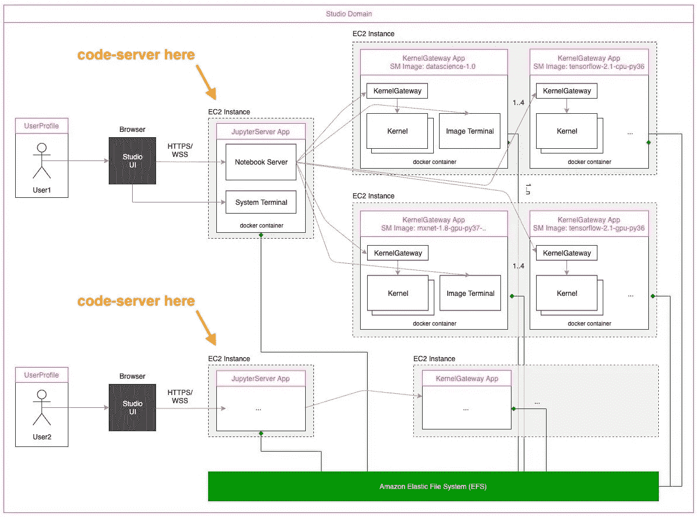
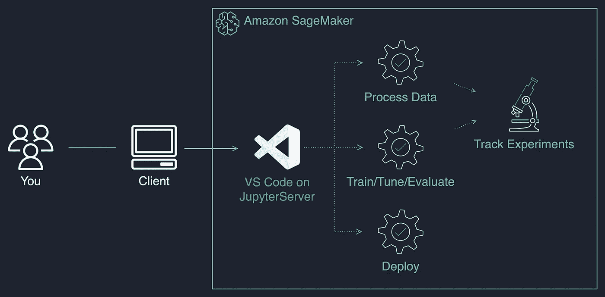
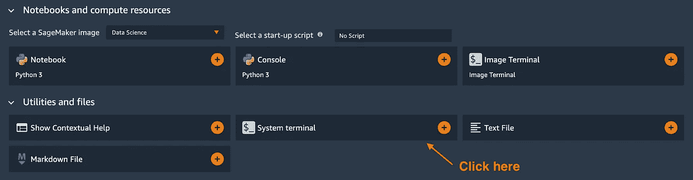
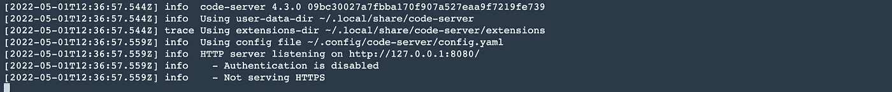
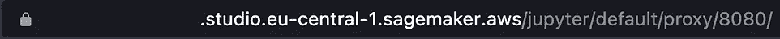
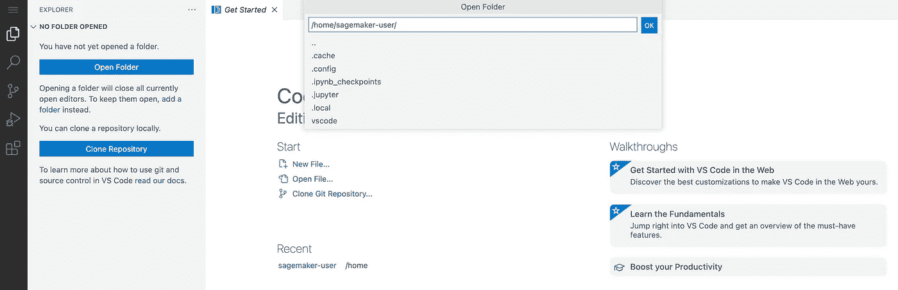
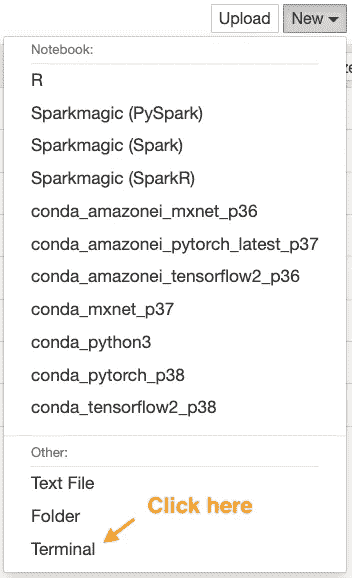
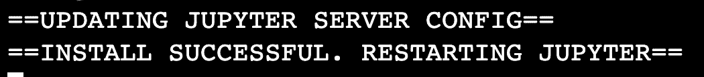
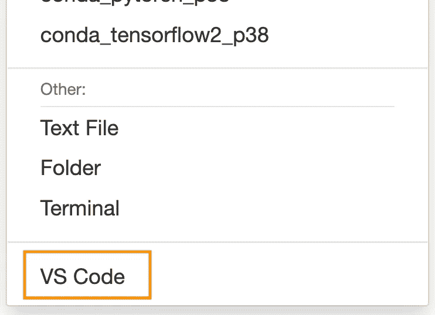
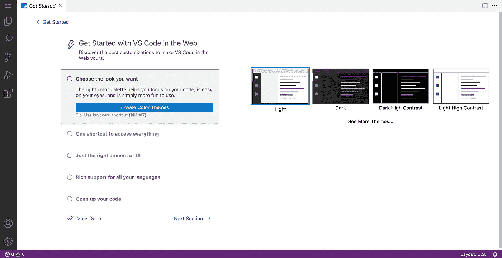

# SageMaker 上的托管与代码

> 原文：<https://towardsdatascience.com/hosting-vs-code-in-sagemaker-studio-f211385e25f7>

## 在您的环境中设置它的分步指南

与[普拉雅格·辛格](https://www.linkedin.com/in/prayag21/)和[菲尔·米金斯](https://www.linkedin.com/in/phil-meakins/)联合发布。

ML 团队在进行项目时需要灵活选择笔记本电脑或完整的 IDE。他们甚至可能在同一个项目中使用多个 ide。

这有点像带着合适的装备爬山。这使得攀登更容易，也给了登顶更多的机会。


照片由[雷蒙·克拉文斯](https://unsplash.com/@raimondklavins?utm_source=unsplash&utm_medium=referral&utm_content=creditCopyText)在 [Unsplash](https://unsplash.com/?utm_source=unsplash&utm_medium=referral&utm_content=creditCopyText) 拍摄

到目前为止，在 SageMaker，你可以在 Jupyter 和 RStudio 之间进行选择。在这篇文章中，我将首先展示如何在 Studio 环境和笔记本实例上托管 VS 代码。

# **预排概述**

我们将通过以下步骤解决这一问题:

选项 A:在 Studio 上托管 VS 代码

*   我们将首先看到 VS 代码可以在 SageMaker Studio 架构中的什么地方运行，以及这种方法的关键考虑因素。
*   然后，我们将为一个 Studio 用户完成 VS 代码安装过程。
*   最后，我将展示 Studio 管理员如何使用生命周期配置来自动化所有 Studio 用户的安装。

在选项 B 中:我们将在一个[笔记本实例](https://www.youtube.com/watch?v=X5CLunIzj3U)上安装 VS 代码。

# **先决条件**

要浏览此示例，请确保您具备以下条件:

对于选项 A:在 Studio 上托管 VS 代码

1.  熟悉其底层架构。如果你对亚马逊 SageMaker Studio 笔记本架构感到陌生，你可以访问[深入了解它。](https://aws.amazon.com/blogs/machine-learning/dive-deep-into-amazon-sagemaker-studio-notebook-architecture/)
2.  我们将使用[代码服务器](https://github.com/coder/code-server)在云中安装和运行 VS 代码。确保您熟悉这个实现。
3.  在步骤 3 中，将使用生命周期配置自动安装 VS 代码。在继续之前，请确保您已经阅读了[使用生命周期配置定制 Amazon SageMaker Studio](https://aws.amazon.com/blogs/machine-learning/customize-amazon-sagemaker-studio-using-lifecycle-configurations/)。

对于选项 B:在笔记本实例上安装 VS 代码

1.  访问一个 [SageMaker 笔记本实例](https://www.youtube.com/watch?v=X5CLunIzj3U)。确保它运行亚马逊 Linux 2。
2.  [笔记本上的这个外壳脚本](https://gist.github.com/SofianHamiti/0bce9c2ba6aaf05f6ff0fb26f46e31a8)实例。它将帮助我们安装 VS 代码并设置 Jupyter 代理，这样我们就可以访问它。

# 选项 A:在 Studio 上托管 VS 代码

## **第一步:VS 代码应该安装在 Studio 的什么地方？**

**架构概述**

[代码服务器](https://github.com/coder/code-server)允许我们从浏览器访问 VS 代码，同时将它托管在 Studio 中。所以首先，我们需要弄清楚我们将在 Studio 的什么地方安装和运行它。

下面是设置的架构概述:



作者图片

SageMaker Studio 在一个 JupyterServer 中运行 JupyterLab UI，与笔记本内核解耦。JupyterServer 自带代理，允许我们在浏览器上访问 VS 代码。这是我们托管代码服务器的地方。

**该方法的主要考虑事项**

关于 JupyterServer，您应该记住以下 4 点:

*   它托管在一个固定大小的小型实例上，允许最少的本地计算。
*   它运行在一个 docker 容器中，你不能做 docker-in-docker。
*   每次您停止/启动 JupyterServer 应用程序时，都会管理和重新初始化容器映像。
*   您可以使用 yum 或 pip 安装库。



图片作者:将 JupyterServer 留给开发，在 SageMaker jobs 中运行更大的计算。

启动`pip install sagemaker`来获得 [SageMaker python SDK](https://sagemaker.readthedocs.io/en/stable/) 。

## **步骤 2:为 Studio 用户安装和运行 VS 代码**

现在您已经知道 VS 代码将被托管在哪里，让我们在一个 Studio 用户配置文件中安装并运行它。我们将分 3 步完成:

**从你的工作室启动器启动一个系统终端**

“系统终端”是 JupyterServer 的终端。



作者图片:点击工作室启动器中的终端图标

安装并运行代码服务器

您可以在系统终端运行以下脚本来安装 code-server:

脚本应该需要几秒钟的时间来运行，这就是本部分的全部内容。安装完成后，您可以使用以下命令运行 code-server:

```
code-server --auth none --disable-telemetry
```

确保从 Studio 用户的主文件夹`/home/sagemaker-user`中运行该命令。



Image by author:运行 code-server 命令后，您应该会看到以下内容。

**注释**

*   我们创建一个`vscode/`文件夹来避免权限错误。代码服务器实际上并没有安装在其中。此外，我们使用默认安装，如果需要的话，可以随意[定制你的](https://coder.com/docs/code-server/latest/install)。
*   为了便于说明，我们用`--auth none`运行`code-server`。您可以使用密码或其他方式来保护您环境中的访问。更多细节参见[代码服务器文档](https://coder.com/docs/code-server/latest)。

**在浏览器上访问 VS 代码**

现在，您需要做的就是复制您的工作室 URL，稍微修改一下，然后粘贴到一个新标签页中:



作者图片:左边是我工作室的原创网址。我替换了 **/lab？**与 **/proxy/8080/** 并粘贴到新的浏览器标签页中。



图片作者:VS 代码会加载，你可以打开里面的`**/home/sagemaker-user**`文件夹。

您可以安装 Python 扩展并开始在您的 ML 项目中工作！

## **步骤 3:跨 Studio 用户自动安装**

作为工作室管理员，你可以让每个用户自己安装 VS 代码。该设置不需要更改域。但是，如果您支持数百名数据科学家，您可以自动设置他们。

在这里，我们将从[我们的脚本](https://gist.github.com/SofianHamiti/cf4f090461e1c4dd641935689e6e1f06#file-on-jupyter-server-start-sh)创建一个[生命周期配置](https://aws.amazon.com/blogs/machine-learning/customize-amazon-sagemaker-studio-using-lifecycle-configurations/)，并将其附加到一个 Studio 域。该安装将由域中的所有用户继承。

**将安装脚本转换成 base64 编码的字符串**

首先，我们需要将[安装脚本](https://gist.github.com/SofianHamiti/cf4f090461e1c4dd641935689e6e1f06)下载到我们的环境中，并使用以下命令将其转换为 base64 字符串:

```
LCC_CONTENT=`openssl base64 -A -in on-jupyter-server-start.sh`
```

**将生命周期配置附加到 Studio 域**

然后，我们使用 [AWS CLI](https://awscli.amazonaws.com/v2/documentation/api/latest/reference/sagemaker/create-studio-lifecycle-config.html) 来创建域生命周期配置:

```
aws sagemaker create-studio-lifecycle-config \
--studio-lifecycle-config-name install-vscode-on-jupyterserver \
--studio-lifecycle-config-content $LCC_CONTENT \
--studio-lifecycle-config-app-type JupyterServer
```

如果需要，你也可以使用这个 [Boto3 命令](https://boto3.amazonaws.com/v1/documentation/api/latest/reference/services/sagemaker.html#SageMaker.Client.create_studio_lifecycle_config)。只要确保在您的域所在的同一区域执行该命令即可。

**注意-** 现有的 Studio 用户需要停止/启动他们的 JupyterServer 应用程序才能看到变化。

# 选项 B:在笔记本实例上托管 VS 代码

笔记本实例的设置很快。您可以通过笔记本实例的 Jupyter/Jupyterlab 启动终端。

如果您使用 Jupyter，按钮应该在右上角:



图片来自作者

然后，您将需要 [**在终端上用下面的命令执行这个脚本**](https://gist.github.com/SofianHamiti/0bce9c2ba6aaf05f6ff0fb26f46e31a8) :

```
sudo sh install_vscode.sh
```

运行该命令需要几秒钟时间。



Image by author:当您看到以下内容时，您可以关闭“终端”选项卡。

现在重新加载 Jupyter 页面并检查右上角的`New`按钮:



图片作者:你应该在**新**按钮下看到一个 VS 代码选项。

点击 VS 代码按钮将在新的浏览器标签中打开 VS 代码。您可以为 VS 代码安装 Python 扩展，并开始在您的 ML 项目中工作！



作者图片

您还可以将脚本添加到[生命周期配置](https://docs.aws.amazon.com/sagemaker/latest/dg/notebook-lifecycle-config.html)中，并在实例重启时自动进行设置。

# **结论**

ML 团队在进行项目时，需要灵活地使用笔记本或完整的 IDE。

在这篇文章中，我展示了如何在 SageMaker Studio 和 Notebook 实例上安装 VS 代码。对于单个用户和使用生命周期配置的数百个用户。

您还可以阅读[利用 Amazon SageMaker Studio](/industrializing-an-ml-platform-with-amazon-sagemaker-studio-91b597802afe) 实现 ML 平台的工业化，并了解企业 ML 平台团队如何组织、标准化和加速 Studio 环境的供应。