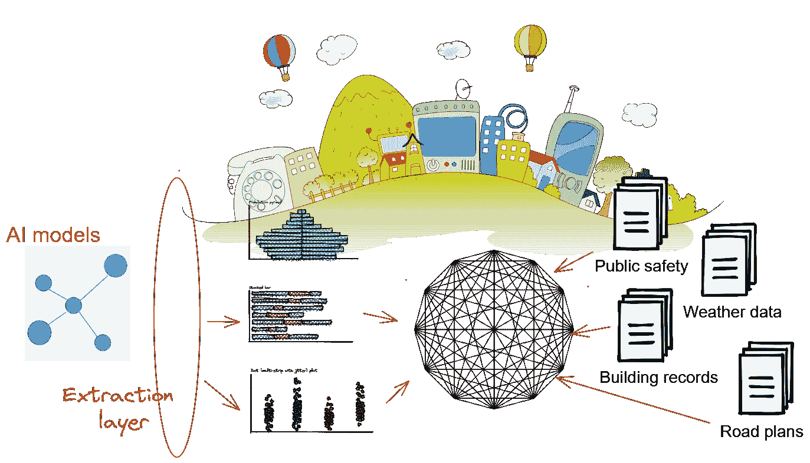
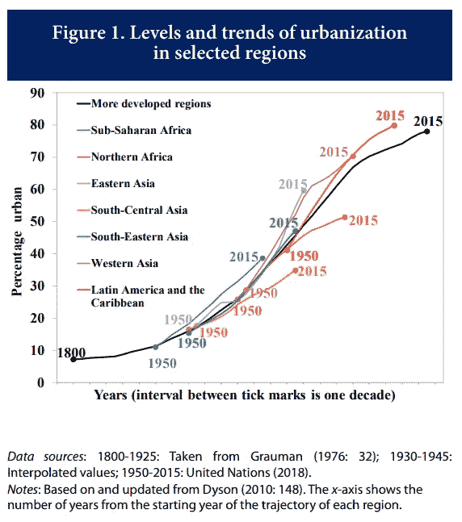
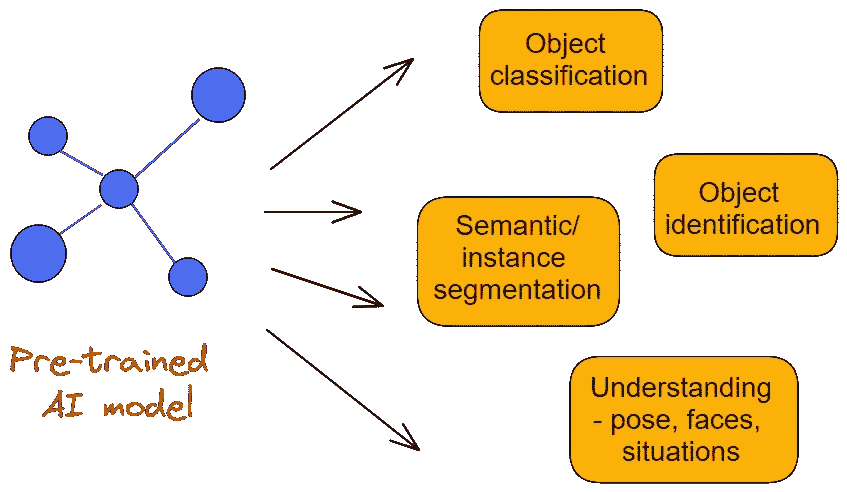
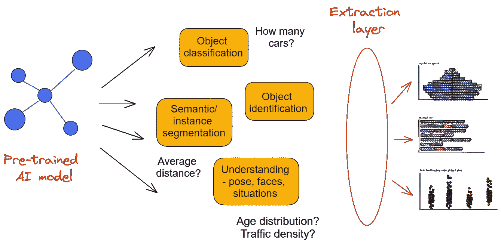
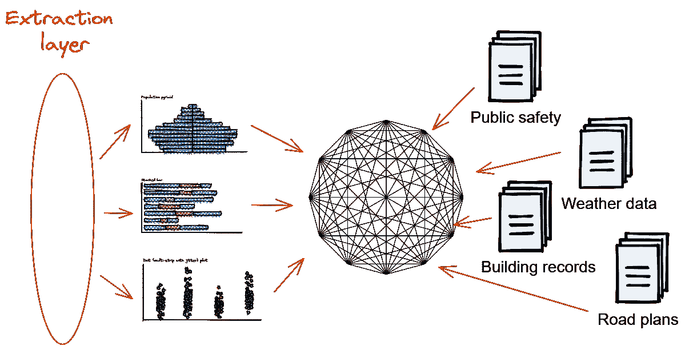
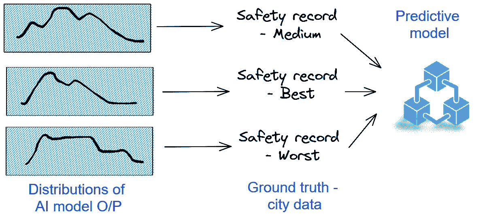

# 人工智能如何帮助智能城市计划

> 原文：<https://towardsdatascience.com/how-ai-can-help-smart-city-initiatives-f83484891343>

## 基于人工智能感知和市民数据来源，帮助智能城市计划的一些想法

图片来源:作者使用 [Exlidraw](https://excalidraw.com/) 创作(使用免费 [Pixabay 图片](https://pixabay.com/vectors/city-village-digital-home-town-1252643/))

# 智能城市的人工智能

人工智能(AI)和机器学习(ML)工具和技术已经应用于世界各地的智能城市和社区项目。特定的应用领域仅受限于公众和城市规划者的想象力，例如，

*   交通管理，
*   道路安全，
*   水资源管理，
*   电动汽车，
*   公共安全和执法
*   较新的自动化系统
*   公共产品和服务的数字化交付

  

这是一项至关重要的任务，因为**数据的爆炸规模和**快速城市化不可避免的问题的维度。根据联合国经济和社会事务部的数据，目前，世界上 55%的人口居住在城市地区。预计到 2050 年，这一比例将上升至 68%。

图片来源:[联合国人口报告](https://population.un.org/wup/Publications/Files/WUP2018-PopFacts_2018-1.pdf)

人们正积极努力为管理如此巨大的人类及其愿望的融合奠定一个[数字主干](https://www.businessgoing.digital/artificial-intelligence-in-smart-cities/)。最近在物联网方面的努力集中在将数十亿个传感器**(各种类型和功能)放置在世界主要城市周围。这是获取数据的第一步。但是，吸收、分析、理解和处理“大数据”需要对数字和计算系统进行变革。**

**  

# 城市计算机视觉中的人工智能——挑战与理念

计算机视觉和智能场景感知是两个最突出的应用，因为这些领域已经完全被现代人工智能算法和系统(如卷积神经网络)所接管。

然而，使用智能城市项目中通常可用的数据来构建高性能和高成本效益的人工智能系统存在一些棘手的限制和挑战。在最基本的层面上，这可以归结为一个事实，即**传统的监督学习模型和方法在应用于智能城市应用领域时可能会遇到数据源问题**。

而且，**我不是在谈论接收和摄取原始数据**——在这种情况下是图像和视频。现代城市和公共基础设施的每一个角落都在增加成千上万的摄像机和图像传感器。当然，对于如此大量的数字数据的接收、存储、监管和处理也存在挑战。但是，即使一个组织可以相对容易地管理所有这些，他们也必须解决高质量数据标签的**问题。**

人类——通勤者、学生、慢跑者、骑自行车者、行人——每个人都可以通过他们的智能手机成为图像/视频数据的潜在来源。

让他们自主获取原始数据很容易。但是让他们准确、勤奋、一致地标注数据是非常困难的。

在这方面，已经有一些来自科技创业公司 的 [**新颖的想法和举措。这是一个很好的开始。**](https://www.hayden.ai/safe-sense-app)

  

与此同时，我们可以想出一些关于如何稍微调整基本 AI/ML 问题的想法，以便大量涌入的数据可以在短期内得到很好的利用。

# 更改度量标准并使用数据网格化

为了开始利用现有的数据和算法为智能城市系统和项目带来直接利益，我们可以扩展我们对用于“教授”人工智能系统的指标的定义。为此，我们必须超越人工智能模型训练的线性化视图，在平面之间移动(就像在三维网格中一样)。

图片来源: [Pixabay](https://pixabay.com/illustrations/node-knot-fastening-connection-242409/) (免费使用)

> 让人类自主地获取原始数据是很容易的。但是让他们准确、勤奋、一致地标注数据是非常困难的。

## 使用人工智能已经很擅长的常规任务

就计算机视觉而言，人工智能算法已经在许多日常工作中表现出色，

*   物体分类(*是车，是垃圾桶，那是狗？*)
*   物体识别和放置(*它在场景中的什么位置？*)
*   语义和实例分割(*对象族的分组和标记*
*   面部和人类姿态的语义理解(*人类的年龄、性别、步态、运动方式，而不被个人识别*
*   情境的语义理解(*那是火吗？意外吗？路障？*)

我们可以使用所有这些…

图片来源:作者使用 [Exlidraw](https://excalidraw.com/) 创作

## 但它们只是堆栈的开始

通常，基于人工智能的初创公司甚至大型科技组织都会花费大量精力来构建性能最佳的深度学习(DL)模型，以获得上述任务的高度准确性。

跳出框框思考- *我们能否从公开可用的预训练模型(例如优步或谷歌发布的模型)中获取我们已经拥有的东西，并将它们用作更大预测模型的组件之一*？

首先，我们调整这些人工智能模块的使用方式，

*   我们**假设他们的准确性和性能在平均意义上已经很好了**——对于一个与模型的训练集没有太大差异的城市或社区，输出是可信的
*   我们将它们设计成能够**输出硬数字或统计数据**，而不是标准 DL 模型的概率输出

想法是这样的。请注意在 DL 模型的输出中添加了新的**提取层**，以及我们通过该层询问的一些问题实例。

*   *那张图中有多少辆车？有多少行人？*
*   在那次公众集会中，年龄和性别的分布是怎样的？
*   一天中那个时间的交通密度是怎样的？

图片来源:作者使用 [Exlidraw](https://excalidraw.com/) 创建

## 连接到更大的网格

一旦我们开始获得这些数字并回答这些问题，我们必须将它们与其他动态数据集融合在一起，这些数据集可以来自智能城市数字基础设施或社区的数字化记录。

*   道路和城市规划图
*   住房记录
*   犯罪和安全记录
*   气象资料
*   关于学校、住宅单位和企业的公共信息

这些都进入数据网格。

图片来源:作者使用 [Exlidraw](https://excalidraw.com/) 创建(使用 [Pixabay 免费图片](https://pixabay.com/vectors/geometry-hexagons-lines-mesh-152406/))

## 问正确的问题

这只是 20000 英尺高度的概观。从这个计划中获得有意义的结果的关键是，

*   确定项目范围
*   问正确的问题

这意味着，为这个预测模型设置正确的机制和指标。一些例子是，

*   天气模式、交通密度和公共安全之间有关联吗？
*   对于给定的天气条件和一天中的时间，车辆距离和位置的分布如何影响事故率？

因此，我们将大量使用将统计分布与基础事实联系起来的方法。

图片来源:作者使用 [Exlidraw](https://excalidraw.com/) 创建

请注意，我们提出的问题是关于对定量变量的影响，如事故率和公共安全记录，这两者都应该是，

*   对现代城市的健康和发展至关重要
*   任何智能城市计划都有望对其进行数字化和良好维护

因此，对于我们的预测模型训练，我们更少依赖于不可预测的公民数据标签，而更多地依赖于预训练人工智能模型的统计输出和数字城市基础设施数据的组合。

## 我们不会达到 90%以上的准确率，但这没关系

我们必须准备好接受这样一个事实:我们不会一直得到一个强有力的预测趋势或信噪比。模型准确性(或任何其他度量标准)不会像伟大的人工智能模型(ImageNet)所宣传的那样超过 90%。

应该没多大关系。

在大多数智能城市项目中，没有人工智能模型。没有机器学习指标。没有太多的基线可以比较。

没有人能在脑子里进行这种数据网格化，并提出一个预测模型。**没有** [**的人性化表现**](https://bardhrushiti.medium.com/human-level-performance-and-bayesian-optimal-error-fadf4f55cd48) **来配合高达**。这不是识别猫和狗的问题。

这只是一个向前推进的想法，拥抱现代人工智能模型和大规模数据分析软件工具的礼物，并为实现未来智能城市的真正数字化转型的梦想提供价值。

> 我们不太依赖不可预测的公民数据标签，而更依赖于预训练人工智能模型的统计输出和数字城市基础设施数据的组合

# **摘要**

**在本文中，我们谈到了以统计方式使用预训练人工智能模型的输出的概念——将它们的计数和分布输入到更大的预测模型中。**

**核心思想是用现代智能城市数字基础设施中确定性的、校准良好的数据来修饰这个预测模型。**

**我们认为这种想法是一种平行的方法，同时公民开发者(通过智能手机获取图像或感知数据的人类)的数据收集和标记正在完善和改进。**

**我们还讨论了这种混乱的数据模型的预期挑战和性能限制。然而，任何相关性或统计显著趋势的发现都应该能够为智能城市计划的管理提供比当前方法更高的价值，当前方法没有充分发挥大规模人工智能和数据科学的力量。**

***喜欢这篇文章吗？成为* [***中等会员***](https://medium.com/@tirthajyoti/membership) *继续* ***无限制学习*** *。如果您使用下面的链接，* ***，我会收到您的一部分会员费，而不会对您产生额外的费用*** *。***

** ****