# 人工智能如何帮助保存艺术品

> 原文：<https://towardsdatascience.com/how-ai-could-help-preserve-art-f40c8376781d>

## 艺术杰作随时都是风险；人工智能和新技术可以助一臂之力

作者使用 OpenAI 的 [DALL-E 2](https://arxiv.org/pdf/2204.06125.pdf) 生成的图像

最近几个月，人们一直在谈论人工智能如何根据文本提示创建图像。因此，当一个人将人工智能和艺术这两个词联系在一起时，他会立即想到 DALL-E、稳定扩散和其他算法。相反，在这篇文章中，我想讨论为什么艺术品往往比我们想象的更不安全，以及人工智能如何帮助保存它们。

# **在《对美的憎恨:是什么威胁着世界的记忆？**

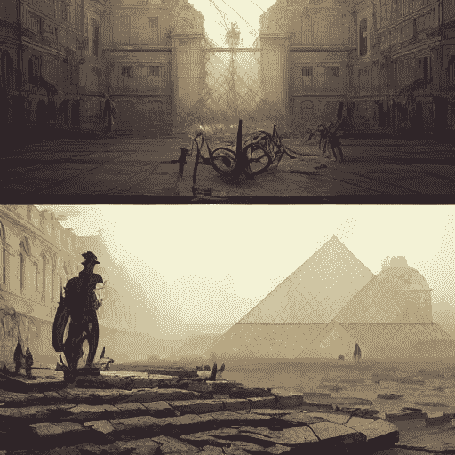

人工智能想象中的卢浮宫博物馆废墟。作者使用[稳定扩散](https://arxiv.org/abs/2112.10752)创建的图像

> "每一个创造的行为首先是一个毁灭的行为."――巴勃罗·毕加索”

认为文化遗产是安全的是错误的。许多人类最有价值的作品也是最脆弱的。纵观历史，随着时间的推移，只有一小部分艺术作品得以保存下来。

例如，在战争期间，文化遗产经常遭到破坏。在古代，掠夺新征服的领土被认为是一种常见的行为，这一传统在殖民主义和拿破仑掠夺时期一直保持着。此外，在第二次世界大战期间，大量的艺术品被损坏或永远丢失。几件作品被纳粹偷走(再也没有找到)，而其他的则在盟军对德国的空袭中被毁。

即使在今天，在叙利亚的战争中，像阿勒颇这样的千年古城也遭到了残酷的破坏(根据联合国的统计，该城超过 70%的面积遭到破坏)。更不用说恐怖组织破坏和抢劫帕尔米拉和伊拉克博物馆的行为了(通常这些作品会被转卖去购买武器)。此外，独裁政权甚至在近代也经常毁坏重要的艺术品(巴米扬的佛像被塔利班摧毁)。

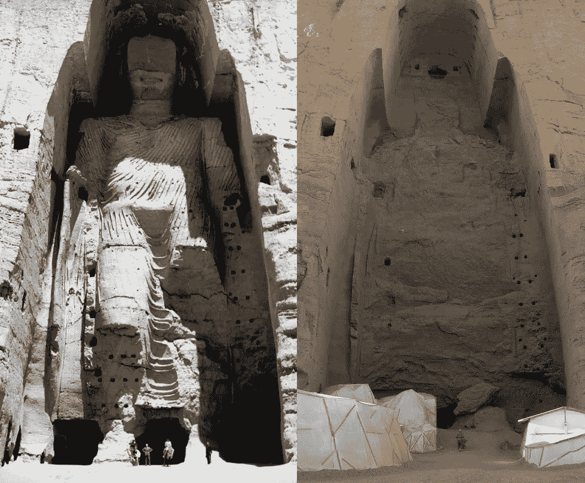

佛像被塔利班摧毁。图片来源:[此处](https://en.wikipedia.org/wiki/Buddhas_of_Bamiyan)

此外，许多作品在自然事件中被摧毁或损坏。地震或其他自然灾害等事件往往会导致珍贵作品的丢失。在 1966 年 11 月 4 日的[佛罗伦萨洪水](https://en.wikipedia.org/wiki/1966_flood_of_the_Arno)中，数千份珍贵而古老的手稿被泥土覆盖，严重受损(有些仍在修复中)。奇马布埃珍贵的十字架是 14 世纪的作品，也受到了洪水的影响，需要精心修复。即使在今天，许多地区仍有洪水的危险，而 [*acqua alta*](https://en.wikipedia.org/wiki/Acqua_alta) (高水位)现象对威尼斯是一种威胁。

佛罗伦萨洪水的图片。在左图中，被洪水淹没的历史中心。中图，一些志愿者帮助将画作从乌菲齐博物馆运送到安全的地方。右图，志愿者在街道上铲泥..图片来源:[此处](https://it.wikipedia.org/wiki/Alluvione_di_Firenze_del_4_novembre_1966)

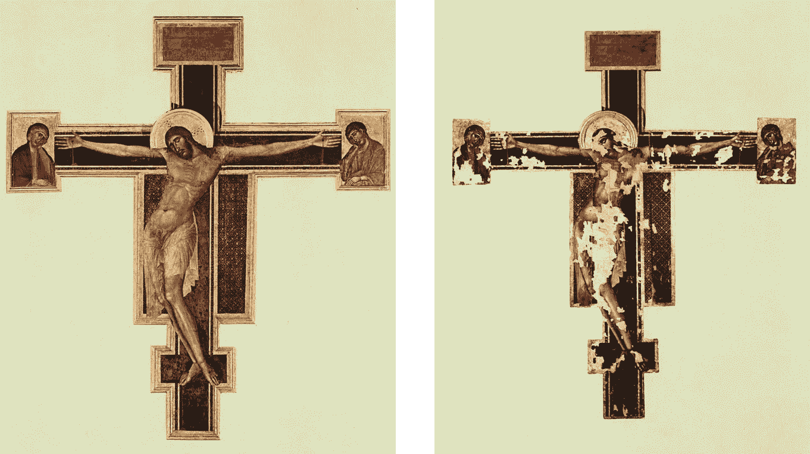

奇马布埃的十字架，洪水破坏前左，修复后右。图片来源:[此处](https://it.wikipedia.org/wiki/Crocifisso_di_Santa_Croce)

在 1755 年摧毁里斯本的地震中，皇家图书馆保存的大量珍贵古卷丢失(同时丢失的还有提香、鲁本斯、柯雷乔和卡拉瓦乔的作品)。此外，许多作品在 1734 年的皇家宫殿大火中丢失(贝拉斯克斯、鲁本斯、博施、布鲁格尔、范·戴克、埃尔·格列柯、莱昂纳多·达·芬奇、拉斐尔和许多其他人的无价作品)。即使在今天，像 2018 年巴西国家博物馆[或 2019 年巴黎圣母院](https://en.wikipedia.org/wiki/National_Museum_of_Brazil_fire)[这样的火灾表明这种破坏性事件仍然会发生。](https://en.wikipedia.org/wiki/Notre-Dame_fire)

此外，一些对艺术品造成损害的自然现象是由人类活动引起的。事实上，污染和气候变化将艺术和建筑遗产置于危险之中。例如，[酸雨](https://en.wikipedia.org/wiki/Acid_rain)正在加速腐蚀[埃及狮身人面像](https://en.wikipedia.org/wiki/Great_Sphinx_of_Giza)，但对于大理石建筑来说，这也是一个严重的问题。[气温上升](https://sciencing.com/about-6372037-pollution-s-impact-historical-monuments.html)被认为是通过增加对历史建筑的破坏来催化化学反应。

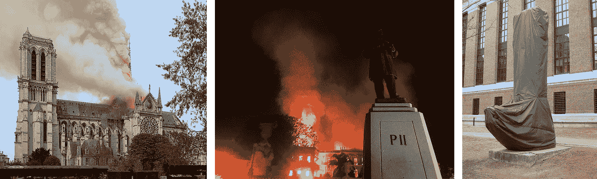

左图显示了 2019 年失火的巴黎圣母院。中间画面，着火的巴西博物馆。右图中，哈佛大学每年冬天都会用防水罩包裹校园里的一些青铜和大理石雕像，以保护它们免受酸雨和酸性雪的腐蚀。图片由作者使用维基百科的图片组合而成

也有艺术品丢失的意外事件(飞机失事和其他形式的运输)。2006 年，一名男子在菲茨威廉博物馆(剑桥)因踩到自己松开的鞋带而摔倒，毁坏了三个 17 世纪的中国花瓶。而在 2010 年，一名女子在大都会博物馆摔倒在一幅毕加索的画作上，导致画作受损(这幅画价值 1.3 亿美元，被认为是他的杰作之一)。2000 年，苏富比的一名员工用粉碎机处理了一个箱子，只是箱子不是空的，而是装着一幅吕西安·弗洛伊德的画。

此外，对艺术品的忽视也是一个严重的问题。壁画、古画、雕像和纪念碑是脆弱的作品，因此维护和修复是昂贵和精细的工作。2012 年，西班牙一位业余修复者修复了一幅画，引起了轰动(但还有其他例子，比如帕伦西亚的[“土豆头】)。](https://www.npr.org/2020/11/11/933801380/behold-the-potato-head-of-palencia-another-botched-art-restoration-in-spain)

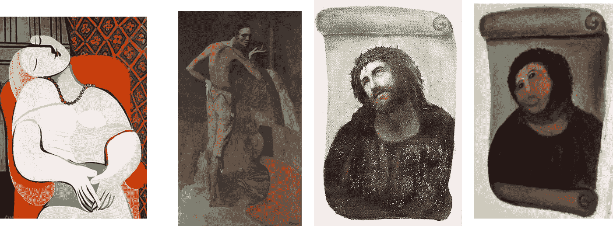

第一块展板是毕加索的《Le Rêve 》,在一次拍卖中受损。第二块展板是毕加索的画“演员”，这幅画在纽约大都会博物馆被一个跌倒的女人损坏。第三和第四块展板是 Elías García Martínez 的油画《幼儿保育和教育之家》,以及 2012 年的修复成果。图片由作者使用维基百科的图片组合而成

此外，我们还可以加上疏忽(如庞贝古城导致的[坍塌)、破坏者和疯子(如损坏](http://bloggingpompeii.blogspot.com/2010/11/what-do-we-know-about-schola.html)[米开朗基罗圣像](https://en.wikipedia.org/wiki/Piet%C3%A0_(Michelangelo))的人)、艺术品交易、经济利益(如修建大坝)以及其他原因。这就是为什么联合国教科文组织审查了世界遗产[的](https://whc.unesco.org/en/list/)，也保留了一份不太有名的[名单，其中包括处于危险中的遗产](https://whc.unesco.org/en/158/)。

对艺术品的破坏不仅仅是作品的经济价值。在古代和现代，蓄意这样做是为了抹去一个民族的记忆(无论是宗教的还是文化的)。最近，这些相同的机制被用于破坏波斯尼亚、叙利亚和阿富汗的考古遗迹(这被认为是违背宗教教义的)。此外，这场辩论比以往任何时候都更具话题性，例如，那些呼吁归还殖民主义时期被盗物品的人(例如，代表该国历史的著名的[贝宁青铜器](https://en.wikipedia.org/wiki/Benin_Bronzes)被分散在欧洲博物馆中)声称。

> 一个不了解其过去历史、起源和文化的民族就像一棵没有根的树。马库斯·陈嘉炜

正如我们所看到的，当指定用于保护的资金被削减时，遗产面临着自然现象和政治选择的风险。我们每个人都有保护记忆的公民义务，我认为这也包括数据科学。事实上，人工智能的使用越来越民主化，任何人都可以以更低的成本用于社交应用。

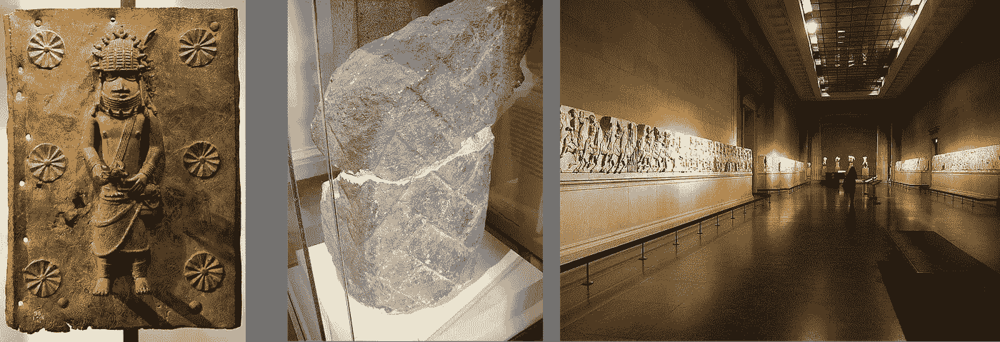

左图:贝宁青铜器之一，现藏于大英博物馆，强烈要求归还。中间的面板，是吉萨狮身人面像仪式胡须的一部分，现藏于大英博物馆。右图是希腊要求归还的帕台农神庙大理石浮雕。

简而言之，艺术作品是脆弱的，往往比人们想象的更有风险。科学和人工智能如何保护它们？

# **人工智能拯救人类创造力**

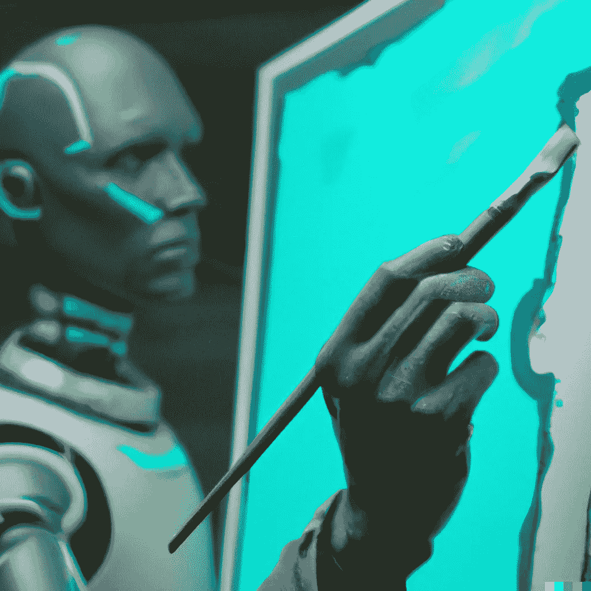

作者使用 OpenAI 的 [DALL-E 2](https://arxiv.org/pdf/2204.06125.pdf) 生成的图像

首先，新的科学调查技术使我们能够了解这些作品。即使是最伟大的艺术家也是从草图开始他们的作品，并且经常在过程中重新思考。今天我们有几种技术可以让我们分析绘画作品(比如 [x 射线](https://en.wikipedia.org/wiki/X-ray))，这些技术不仅是非侵入性的，还可以让我们讲述作品的故事。然而，这些技术产生的数据通常很难解释(尤其是有几个重叠的图像)，因此机器学习算法已经被开发用于图像分析。

x 射线曝光能够显示绘制不足或进展中的变化。例如，这表明伦勃朗在他的杰作[布料商协会](https://en.wikipedia.org/wiki/Syndics_of_the_Drapers%27_Guild)中多次微调人物的构成。列奥纳多·达·芬奇在画《岩间圣母》之前曾画过天使和其他人物。虽然有时可以很容易地识别艺术家的各种干预，但通常有几个图案，艺术家会重画几次，产生几个重叠的图像。这些模式很难区分，人工智能有助于重建工作的不同阶段。

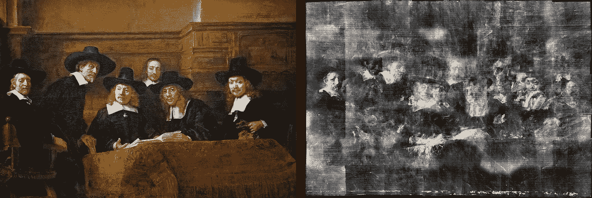

伦勃朗的绘画及其射线照相术。图片由作者使用维基百科的图片组合而成

人工智能也被证明在修复方面是有用的。例如，它已成功用于数字修复(摄影、文章，甚至手稿)。剑桥的马赫实验室已经使用人工智能算法来识别损坏并虚拟重建手稿中的图像(这一过程被称为修复)。类似的技术已经被用于重建[受损照片](https://en.wikipedia.org/wiki/Digital_photograph_restoration)，彩色黑白照片，重建壁画图像等等。

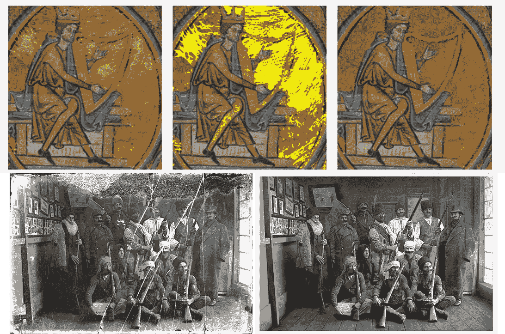

上图:修复有大面积损坏的大图像区域。该图像显示了损坏的设计(左)，修复域(中)，以及最终结果的权利。图片来源:[此处](https://arxiv.org/pdf/1803.07187.pdf)。下图:照片的数字修复(修复前后)。图片来源:[此处](https://en.wikipedia.org/wiki/Digital_photograph_restoration)

作为一个有趣的例子，研究人员最近用 AI 重建了[，并预测了](https://www.bbc.com/news/technology-57588270)[伦勃朗](https://en.wikipedia.org/wiki/Rembrandt)的杰作[守夜人](https://en.wikipedia.org/wiki/The_Night_Watch)原本的样子(这幅画在被移到另一个地点时被任意缩短)。此外，这种技术可以用来重建被认为丢失的作品:例如，著名的[范艾克兄弟的根特祭坛画](https://en.wikipedia.org/wiki/Ghent_Altarpiece) (1432)中的两块嵌板丢失了，研究人员使用卷积神经网络试图忠实地重建这两块嵌板。

> 即使是艺术作品最完美的复制品也缺少一个要素:它在时间和空间中的存在，它在它出现的地方的独特存在— [来源](https://www.wired.com/story/artificial-intelligence-reviving-lost-art/)

重建丢失的绘画仍然是一个有争议的应用。事实上，当试图用 AI 重现丢失的克里姆特画作时(1945 年，克里姆特的三幅杰作不可挽回地丢失了)，研究人员明确表示，这个想法不是要取代，而是要给出一个什么被认为是永远丢失的概念。

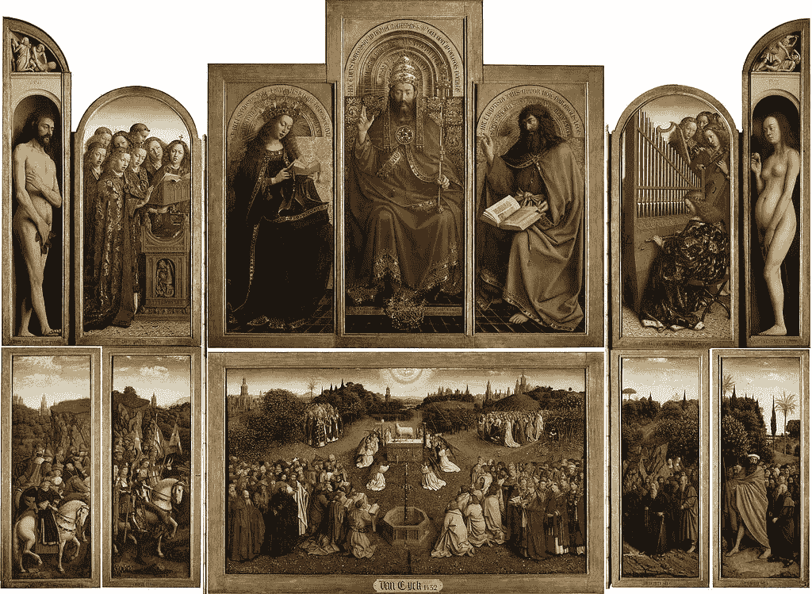

*神秘羔羊崇拜*也被称为*根特祭坛画。图片来源:* [*此处*](https://en.wikipedia.org/wiki/Ghent_Altarpiece)

人工智能的另一个有趣的用途是通过算法鉴定画作。事实上，对作品的估价是一个巨大的市场，通常给作品归属并不容易(特别是如果它是一位画家或他工作室里的某个人的作品)。最近，提出了一种方法，通过研究作品的地形，可以重建作者的签名。简而言之，表面高度信息被记录下来(以 50 微米的空间分辨率)，然后通过[卷积神经网络](https://en.wikipedia.org/wiki/Convolutional_neural_network) (CNN)，这样就可以研究笔触的差异。

> 许多著名的艺术家，包括埃尔·格列柯、伦勃朗和彼得·保罗·鲁本斯，都利用不同规模和结构的作坊来满足市场对他们艺术的需求。因此，需要公正的定量方法来深入了解作坊绘画有争议的归属—文章作者([来源](https://www.datanami.com/2022/01/13/ai-can-identify-painters-based-on-their-paintings-textures/))

类似的方法对于避免艺术品的伪造非常有用，甚至对于确定作品的年代和归属也很有用。此外，可以识别作品签名的算法可以用于打击艺术品贩运。

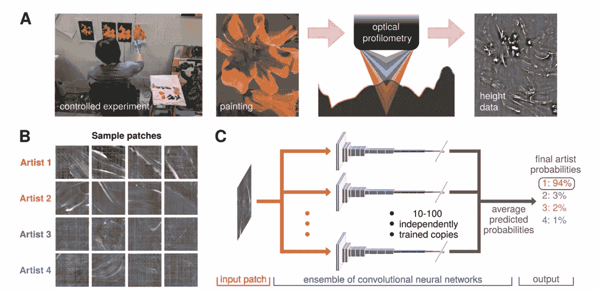

*用于识别作者的*笔触风格的数据准备和分析工作流程。图片来源:[原文](https://arxiv.org/abs/2106.07134)

# **人工智能深入挖掘**

维姬·T 在 unsplah.com 拍摄的照片

人工智能及其应用也将对考古学和考古遗产产生影响。

此外，x 光并不局限于绘画。事实上，研究人员还经常分析玻璃(例如，为了了解做工)、木乃伊和雕像等物体。此外，还经常使用其他技术，如 CT 扫描。Antikythera 机械装置(神秘的希腊神器)本身已经通过 X 射线进行了分析，以研究其可能的操作。在所有这些情况下，应用于图像分析的人工智能算法被证明是非常有用的。

另一个有趣的例子是重写本:羊皮纸或书籍被刮掉墨水后重新书写(羊皮纸很贵，因此被阿曼涅西斯僧侣重新使用)。今天，抹去的文字可以用成像技术重建，让我们重新发现被认为已经遗失的古代杰作。最近，使用人工智能和 [X 射线](https://en.wikipedia.org/wiki/X-ray)已经有可能转录解码[阿基米德重写本](https://en.wikipedia.org/wiki/Archimedes_Palimpsest)(其中包含两部被认为遗失的阿基米德作品)。

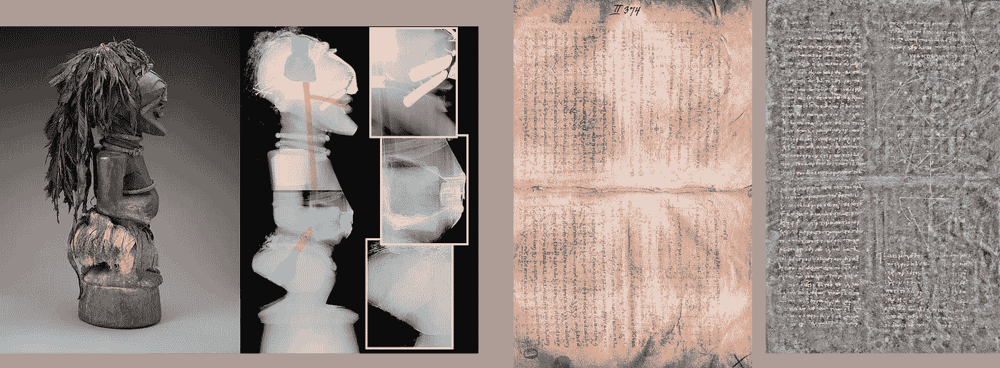

左图:印第安纳波利斯艺术博物馆的非洲叶松权力人物的 x 光照片。右图:在不同光源下进行分析的阿基米德重写本的图像。图片由作者使用维基百科的图片组合而成

公元 79 年可怕的火山爆发使火山灰和火山灰淹没了庞贝和赫库兰尼姆。在这个毯子下面发现了一个珍贵的纸莎草图书馆(纸莎草很少能在地中海气候下存活)。不幸的是，之前解开和破译它们的尝试导致了纸莎草纸的毁灭。幸运的是，新的成像技术使得不需要打开它们就可以分析它们。

> “虽然有可能注意到赫库兰尼姆纸莎草纸的每一卷上都有文字，但打开它需要纸莎草纸有自己的柔韧性。而且没有更多的灵活性，”——Brant Sales([来源](https://en.futuroprossimo.it/2019/10/i-papiri-di-ercolano-carbonizzati-dal-vesuvio-saranno-letti-dallai/))

在以色列恩格迪发现的一张有 1700 年历史的希伯来羊皮纸上,已经成功尝试了 X 射线方法。不幸的是，虽然以色列卷轴含有一种金属基墨水，在 x 射线下显示良好，但赫克拉诺斯纸莎草纸是用碳基墨水书写的，这意味着“[在 x 射线扫描中文字和纸莎草纸之间没有明显的对比](https://www.theguardian.com/science/2019/oct/03/ancient-scrolls-charred-by-vesuvius-could-be-read-once-again)”。为此，研究作者使用了更高能的 X 射线，但也使用了人工智能。作者使用 3D 卷积神经网络来检测文本并解密。

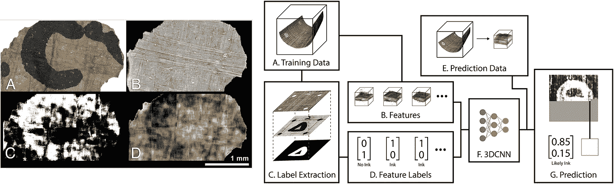

左边:赫库兰尼姆碎片的分析结果。右边:训练神经网络来检测 ct 扫描数据中的碳墨的系统概述。(来源:[此处](https://journals.plos.org/plosone/article?id=10.1371/journal.pone.0215775)，授权:[此处](https://creativecommons.org/licenses/by/4.0/))

图像分析也可以用来发现未知的考古遗址。考古遗址的发现通常是偶然事件(出于其他原因的挖掘)或需要昂贵的调查。事实上，激光雷达技术(用激光瞄准一个物体或表面)已经被成功地用于探测新的考古遗址(在墨西哥发现了 Angamuco 的遗迹)。这项技术也被用来揭示吴哥景观的人为变化。[激光雷达](https://en.wikipedia.org/wiki/Lidar)、热图像和卫星图像因此可以通过人工智能进行分析，以监控考古遗址的状态和研究干预措施。

在过去，这些仪器在直升机或小型飞机上。然而今天，[无人机越来越受欢迎](https://www.science.org/content/article/aerial-drones-reveal-hidden-archaeology)并且允许更大的灵活性。例如，一个研究项目使用无人机为 T2 绘制庞贝古城遗址的地图。测绘是第一步，以核实哪些结构处于危险中，跟踪现场的演变，并计划干预的优先次序。再者，无人机还可以用于水下考古等困难领域。

无人机拍摄的庞贝鸟瞰图

正如我们所见，人工智能可以用来重建受损的画作。同样的方法也可以用于考古文物，如马赛克。最近，发表了一篇论文，介绍了一种有趣的方法。作者测试了 OpenAI 的 DALL-E 的“outpainting”能力(人工智能将不完整的图像作为输入，并填充缺失的部分)。他们或者用已经损坏的马赛克(包括图形和几何图案)进行测试，或者通过人工移除保存完好的马赛克部分进行测试，这样他们就可以比较结果。

方法和结果很有趣；它还通过在不同条件下进行试验来利用现有的算法。这证明了这些算法的灵活性和涌现性。另一方面，正如作者指出的，结果并不总是令人兴奋的:

> 然而，重建显示出几个错误，因此，在大多数情况下，它仍然远远达不到手动重建的质量。当重新创建人脸和出现裸体时，性能最差(这是由于对图像内容的 DALL-E 策略)。对于几何形状，性能似乎更好，但 DALL-E 在颜色再现和某些形状上有一些限制，特别是当它们很小时。—来源:[原创文章](https://arxiv.org/pdf/2210.06145.pdf)

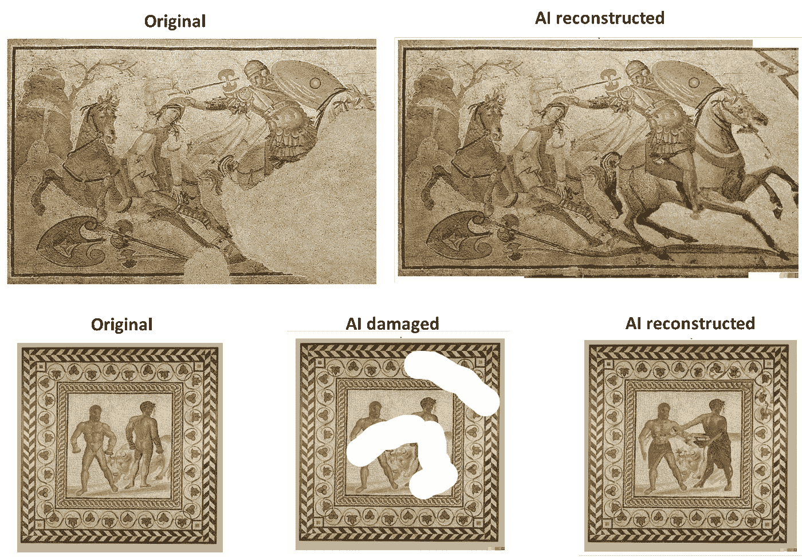

使用人工智能的马赛克重建。上图中:亚马逊战役的马赛克，和原版一样(左)和人工智能重建的(右)。在下面的面板中:原始的马赛克(左)被人为破坏(中)并被算法重建(左)。图片由作者整理，来源:[原创文章](https://arxiv.org/pdf/2210.06145.pdf)

人工智能还可以用于编目和自动化繁琐的任务。考古学家发现了成千上万的陶器碎片([尤其是罗马的](https://en.wikipedia.org/wiki/Ancient_Roman_pottery))，分析成千上万的花瓶、双耳瓶和盘子碎片是一项乏味的工作。另一方面，所有这些碎片一旦被编目并研究了它们之间的关系，就可以提供关于过去文明的日常生活的有价值的信息。在剑桥，他们[开发了一种算法](https://arxiv.org/pdf/2203.07437.pdf)，将碎片与数据库中的陶器轮廓进行匹配。这种方法可以快速分类，然后用其他算法研究考古遗址中各种陶瓷的分布。

这种方法不仅限于罗马陶瓷。亚利桑那大学的研究人员使用类似的方法对[古普韦布洛陶瓷](https://www.sciencedirect.com/science/article/pii/S0305440321000455)的设计和图案进行分类。

考古学家经常发现铭文，但这些铭文往往在几个世纪后被损坏，变得难以辨认。最近， [DeepMind 推出了 Ithaca](https://www.nature.com/articles/s41586-022-04448-z) (之前名为[皮媞亚](https://arxiv.org/pdf/1910.06262.pdf)的模型的后续)，这是一个人工智能模型，能够在受损的文本中找到缺失的字符。DeepMind 的作者在最大的希腊铭文语料库之一上训练他们的模型，以获得类似于人类碑文作者获得的结果。其他语言也尝试了类似的方法，比如斯基台语、3000 年前的中国甲骨文和波斯楔形文字。

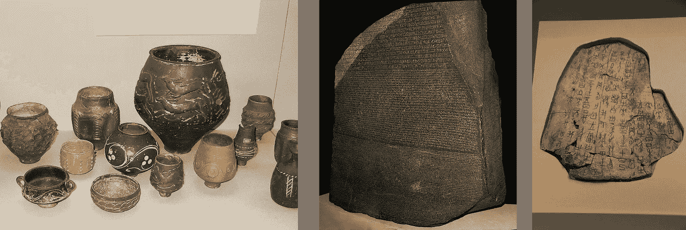

左图:古罗马陶器。中间的面板:罗塞塔石碑(允许象形文字被破译的石碑)。右图:中国甲骨文。图片由作者使用维基百科的图片组合而成

> “仅仅因为你能阅读这些字母，并不意味着你知道它们的意思”——雷吉娜·巴兹莱([来源](https://www.pbs.org/wgbh/nova/article/scan-image-process-translate-ancient-text/))

虽然在已知语言(希腊语、拉丁语等)的情况下解读古代碑铭并不容易，但也有语言失传的情况。语言可以根据它们共有的特征(字母、词汇、语法、声音等等)被分成不同的家族。各种语言通常有一个共同的词根(例如，新拉丁语言，拉丁语中的“aquam”，意大利语中的“acqua”，西班牙语中的“agua”)，然后经历了一个导致它们分化的进化路径。这些原则被语言学家用来寻找相似性和共同模式，以破译死亡的语言。

人工智能已经被证明有能力找到模式和相似之处。因此，这种方法一直试图解码丢失的语言，如 Ugaritic 或 Linear B。在这种情况下，[作者使用了基于](https://arxiv.org/pdf/1906.06718.pdf) [LSTM](https://en.wikipedia.org/wiki/Long_short-term_memory) 和嵌入的模型，并获得了一些有趣的结果。所使用的方法只不过是在丢失的文本中寻找具有已知标记的跨度。

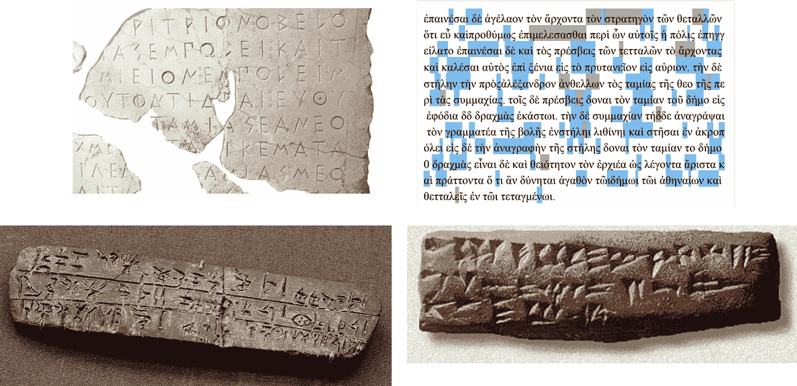

上图中:一个受损的古希腊石碑讲述着雅典卫城的故事，右边是一个用皮媞亚重建的碑文的例子(正确的是蓝色，不正确的是紫色)，来源:[原文](https://arxiv.org/pdf/1910.06262.pdf)。下图，线性 B 和 Ugaritic 写作的例子，来源:维基百科

# **离别的思念**

作者使用 OpenAI 的 [DALL-E 2](https://arxiv.org/pdf/2204.06125.pdf) 生成的图像

最近几年，人们在努力将艺术数字化。主要的博物馆(如[大都会博物馆](https://www.metmuseum.org/art/the-collection))已经建立了绘画、书籍、雕像、物品、艺术品等的大型数据库。通常这些巨大的数字图书馆对公众和学者免费开放。这些机构本身正在采取协调一致的举措。例如，欧盟已经制定了将庞大的文化遗产数字化的指导方针。

这些举措旨在实现藏品和文化遗产获取的民主化。事实上，许多保存在博物馆里的作品，公众只要参观一下就可以看到。此外，博物馆只展示其藏品的一小部分(许多作品存放在仓库里，除了在罕见的展览中从不展出)，因此这些举措允许人们接触通常看不到的作品。一方面，这些举措为想要研究作品的学者提供了宝贵的资源。另一方面，算法需要数据，这使得越来越复杂的人工智能模型能够得到训练。

正如我们所看到的，保存在博物馆里的作品是很脆弱的物品，随时都可能丢失。保护它们是一项重要而困难的工作，无论是保护它们还是恢复它们。在这些任务中，人工智能可以提供帮助(监控、研究它们等等)。另一方面，技术需要得到保护遗产的政策和投资的支持。

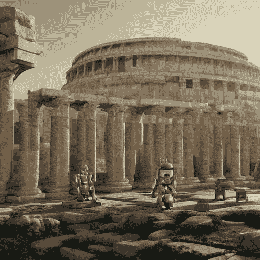

作者使用[稳定扩散](https://arxiv.org/abs/2112.10752)创建的图像

更重要的是，人工智能近年来发展迅速，有趣的视角为日益强大的模型开辟了道路。事实上，正如我们所看到的，所使用的许多模型都是卷积网络，它们已经被证明对于涉及图像的任务是有效的。然而，机器学习的所有其他领域也可以使用。事实上，例如，[无监督聚类](https://en.wikipedia.org/wiki/Unsupervised_learning)可以用来分组陶瓷碎片。

此外，用于重建铭文和翻译死语言的第一个模型是基于编码器-解码器和 LSTMs 的。皮媞亚也使用了相同的架构，但后来的 DeepMind Ithaca 文章已经基于类似于 transformer 的架构。随着视觉变压器被证明对成像有效，我们可以期待在未来几年有更多类似的模型。

另一个值得注意的是，为新任务开发新的复杂算法并不一定是必要的:正如我们所见，一些研究人员已经利用了 DALL-E，它可以通过网站公开访问。这表明许多可用的算法可以在未来重新利用。

除了人工智能能力的技术演示，它还开辟了真正的视角和影响。例如，有一个好的数码图像是修复一幅画或马赛克的第一步。此外，许多考古遗址人员不足，监督费用昂贵且存在问题。更不用说人工智能将能够帮助决策，优先干预，并降低成本。

> “这些东西看起来像漫画。它们看起来不像克里姆特的画。这就像人们试图克隆他们的狗。可以，但不是同一只狗。”— Jane Kallir 关于人工智能重建遗失的克里姆特画作([来源](https://www.washingtonpost.com/entertainment/museums/gustav-klimt-google-digital-reconstructions/2021/12/28/4a18f61e-36a5-11ec-8be3-e14aaacfa8ac_story.html))

公开的伦理问题当然仍然存在。应该仔细观察镶嵌画的结果。毕竟，这种模式有时不仅仅是在重建历史，更像是在改写历史。就像伦勃朗的画作一样，该算法试图根据其掌握的数据进行猜测，事实上，展览的策展人指出了原始部分和重建部分之间的分离。

此外，卫星图像和激光雷达技术已经确定了[数千个尚未探索的新考古遗址](https://news.artnet.com/art-world/lidar-technology-identifies-500-mesoamerican-sites-2026460)。在考古学家对它们进行研究之前，这些可能是盗墓贼挖掘出的。考虑公布数据固然重要，但也必须谨慎行事。

另一个棘手的案例是修复。自 19 世纪以来，每一项新技术都被用于修复，而没有考虑可能的损害。例如，混凝土对结构造成的负担有时会比预期的更大。

# 如果你觉得有趣:

你可以寻找我的其他文章，你也可以 [**订阅**](https://salvatore-raieli.medium.com/subscribe) 在我发表文章时获得通知，你也可以在**[**LinkedIn**](https://www.linkedin.com/in/salvatore-raieli/)**上连接或联系我。**感谢您的支持！**

**这是我的 GitHub 知识库的链接，我计划在这里收集代码和许多与机器学习、人工智能等相关的资源。**

**  

或者随意查看我在 Medium 上的其他文章:

       **