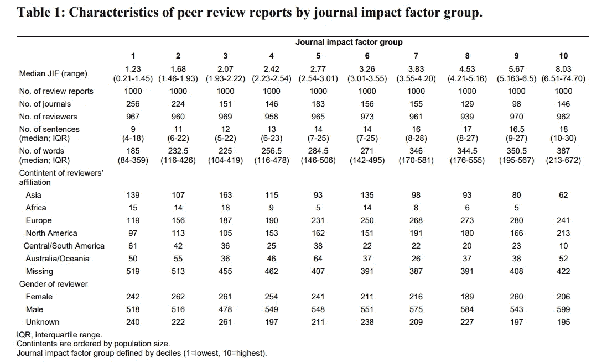
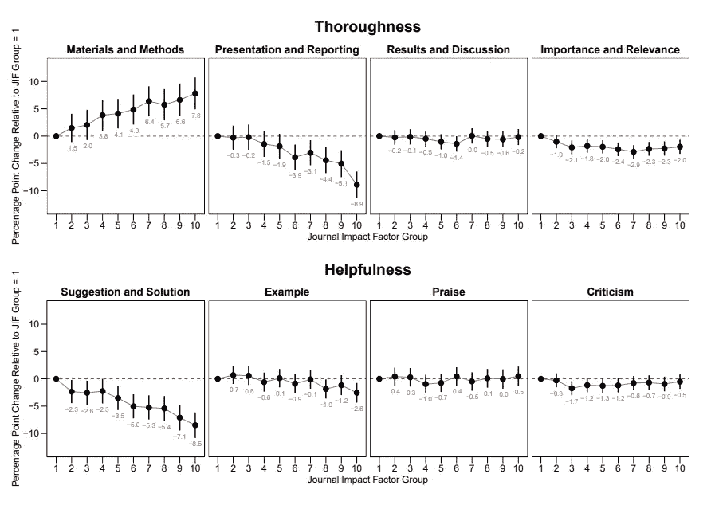

# 人工智能如何拯救科学的支柱

> 原文：<https://towardsdatascience.com/how-ai-could-save-a-pillar-of-science-43d564d5564d>

## 同行评审是人类的工作，但我们可能需要机器的帮助

图片来自 unsplash.com[的](https://unsplash.com/) [Patrick Tomasso](https://unsplash.com/@impatrickt)

不同的研究人员和教授正在推动变革。几个问题也减缓了讨论的速度:我们如何评估同行评议的质量？能不能客观做，或者定量衡量？

最近发表的一篇科学文章显示了这是如何可能的，以及在使用机器学习模型的规模上是可能的。这篇文章探讨了研究人员如何分析同行评议，为什么它很重要，以及人工智能意想不到的新应用开辟了什么有趣的前景

# **同行评议:现代科学的支柱**

科学之海中同行评议的支柱，图片是作者使用[稳定扩散](https://arxiv.org/abs/2112.10752)开源代码完成的。

同行评议被认为是现代科学的支柱之一。每一篇文章和每一个研究提案都要提交给“同行”、研究人员和/或教授进行评判，他们评判一篇手稿的好坏。今天，同行评议通常用于所有学科(从生物学到医学，从物理学到计算机科学)，以评估一篇手稿是否可以在期刊或会议上发表。

此外，同行评审还用于评估申请资金、职业发展等方面的提案。有不同的变体；从本质上讲，一篇文章是由匿名评论者来评判的，他们对手稿或提案提供评论。

然而，这一体系并非没有缺陷，如新冠肺炎论文的撤回、掠夺性期刊和会议的出现等等。这是一个简短的介绍，如果你对我概述的关于如何改进同行评审的好处、问题和建议感兴趣的话(链接如下)。

 [## 科学贡献如何变成一个有毒的环境

### 计算机科学是如何继承了其他学科同样的错误的

towardsdatascience.com](/how-science-contribution-has-become-a-toxic-environment-6beb382cebcd) 

一方面，关于如何判断一篇文章的质量，或者是否有可能使用一种算法来评估提交的手稿，还有几个问题没有解决。另一方面如何评价高质量同行评议的决定因素和特点。安娜·塞弗林最近试图用人工智能来回答后一个问题

# **用 AI 评估同行评审**

图片由[廷杰伤律师事务所](https://unsplash.com/@tingeyinjurylawfirm)在【https://unsplash.com/】T2

**数据集**

> 许多同行审查报告的保密性质以及缺乏评估其质量的数据库和工具，阻碍了对同行审查的大规模研究。— [原文](https://arxiv.org/ftp/arxiv/papers/2207/2207.09821.pdf)

正如作者所指出的，直到几年前，综述还是审稿人、编辑(或会议委员会)和作者之间的私人讨论。然而，今天，Publons 网站收集了数百万条评论，可以下载并用作数据集。该网站接收和收集由不同学者进行的评论，并收集不同的元数据(目前有来自大约 100 万学者的 1500 万条评论)。

为了进行分析，作者下载了 500 万篇评论，使用了以下标准:

*   对于这项分析，他们不包括物理学、空间科学和数学。这些综述提出了许多难以归类的数学公式
*   他们只选择了医学和生命科学期刊
*   他们选择了 10，000 篇经过验证的出版前评论作为对照
*   他们决定根据《华尔街日报》的影响因子分成 10 组，并从中抽取 1000 篇评论

影响因子是什么？由于很难定义同行评审的质量，他们选择了影响因子作为替代指标。影响因子是为了帮助图书馆员选择购买哪些期刊而开发的，它只是一个期刊发表的文章数量与该期刊的文章在过去两年中被引用的次数之间的比率。这个简单的指标被认为是期刊质量的同义词。

从理论上讲，人们可能会认为，一篇影响因子较高的论文(或接受率较低的会议)等同于更彻底的同行评审和稿件选择。这篇文章正是针对这一点。

**模型和训练**

作者从评论中挑选了 2000 个句子，然后进行标注。然后，他们决定了 8 个类别，并手动评分每个句子是否符合这些类别。不同的类别涵盖两个不同的宏观领域:

> 我们关注的是**彻底性**(句子是否可以归类为评论材料和方法、陈述、结果和讨论，或论文的重要性)，以及**有用性**(如果句子涉及表扬或批评，提供例子或提出改进建议)。——作者采访到 [**性质**](https://www.nature.com/articles/d41586-022-02787-5)

之后，他们使用了五重交叉验证和朴素贝叶斯算法。他们使用不同的评估标准，并确定哪些单词对每个类别的分类最重要。此外，他们还使用了一系列线性混合效应模型来研究综述特征和期刊影响因子之间的关联。

正如作者所指出的，可以看出，来自亚洲、非洲和南美洲的审稿人的比例从影响因子较低的期刊向影响因子较高的期刊递减(欧洲和北美的趋势相反)

综述和科学期刊综述表。来自原始文章

总的来说，模型的预测与人类注释者编码的预测相差不远，证明了使用机器学习模型评估评论的可行性。

作者还注意到，影响因子与综述内容不相关:影响因子较高的期刊通常较长，对材料和方法更关注，但对如何改进稿件的建议较少

> 但是，即使在影响因子相似的期刊中，这些比例也相差很大。所以我想说，这表明影响因子对于评论的“彻底性”和“有用性”来说是一个不好的预测指标。

原文:“相对于最低期刊影响因子组，涉及彻底性和有用性类别的句子比例的百分点变化。”

# **结论和离别感想**

总的来说，一些研究人员抱怨同行评议的现状(包括生命科学和计算机科学)。多年来的范式一直是:高影响因子(或低接受率)等于高质量的同行评议和文章。

事实上,[旧金山研究评估宣言](https://sfdora.org/) t (DORA)提议在资助和推广中消除任何基于期刊的指标。例如，乌特勒支大学已经正式放弃将期刊影响因子作为决定员工招聘或晋升的标准(新政策包括团队合作、领导力、公众参与和开放科学实践)。

这项研究还表明，同行评议不具有包容性，几个地理区域在高影响因子期刊中的代表性不足。即使在同行评审期间，更大的包容性将允许更好地考虑来自相同地理区域的作者所写的文章。

此外，这项研究表明，即使评论的质量不能与期刊的影响因子相关联，也可以使用人工智能来监控同行评议的质量。欧盟和几个委员会正在推动同行评审改革和同行评审数据更加透明。像这样的研究表明出版商如何监控评论者的评论或决定每篇评论的彻底性和有用性标准。

未来，审稿人在同行评议时得到 AI 助手的辅助并非不可想象。事实上，通常最有声望的会议和期刊会收到成千上万的投稿，但由于作为审稿人的研究人员数量减少，他们几乎没有时间对这些投稿进行评估。**未来，在提交评审之前使用人工智能将实现更加客观、公平和包容的同行评审。**

# 如果你觉得有趣:

你可以寻找我的其他文章，你也可以 [**订阅**](https://salvatore-raieli.medium.com/subscribe) 在我发表文章时获得通知，你也可以在**[**LinkedIn**](https://www.linkedin.com/in/salvatore-raieli/)**上连接或联系我。**感谢您的支持！**

**这是我的 GitHub 知识库的链接，我计划在这里收集代码和许多与机器学习、人工智能等相关的资源。**

** [## GitHub - SalvatoreRa/tutorial:关于机器学习、人工智能、数据科学的教程…

### 关于机器学习、人工智能、数据科学的教程，包括数学解释和可重复使用的代码(python…

github.com](https://github.com/SalvatoreRa/tutorial) 

或者随意查看我在 Medium 上的其他文章:

 [## 对数据集的批判性分析

### 停止微调你的模型:你的模型已经很好了，但不是你的数据

towardsdatascience.com](/a-critical-analysis-of-your-dataset-2b388e7ca01e)  [## 机器学习应对气候变化

### 人工智能如何帮助对抗全球变暖并从人类手中拯救世界

towardsdatascience.com](/machine-learning-to-tackle-climate-change-7911e004c3a2)  [## 机器遗忘:遗忘的职责

### 从人工智能模型中删除数据点信息的重要性

towardsdatascience.com](/machine-unlearning-the-duty-of-forgetting-3666e5b9f6e5)  [## AI 新绽放？为什么布鲁姆模式可以改变游戏规则

### 我们现在已经习惯了大型语言模型，为什么这个如此特别呢？

pub.towardsai.net](https://pub.towardsai.net/a-new-bloom-in-ai-why-the-bloom-model-can-be-a-gamechanger-380a15b1fba7)**