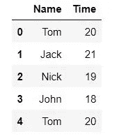
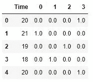
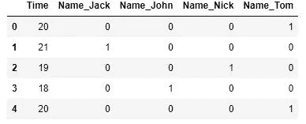

# 如何以及为什么在您的数据科学项目中执行一键编码

> 原文：<https://towardsdatascience.com/how-and-why-performing-one-hot-encoding-in-your-data-science-project-a1500ec72d85>

## 一篇关于什么是一键编码，为什么使用它，以及如何使用它的文章(Python 语言)


马库斯·斯皮斯克在 [Unsplash](https://unsplash.com/s/photos/binary?utm_source=unsplash&utm_medium=referral&utm_content=creditCopyText) 上的照片

W 当处理真实数据时，你经常会得到带有“混合”值的数据集:字符串和数字。如果您是数据科学和机器学习领域的新手，您通常会发现“非常漂亮”的列(最多有一些 nan 要处理)，通常带有缩放值。但是当涉及到真实世界的数据时，我们经常要处理杂乱的数据。

因此，当涉及到真实数据时，我们可能必须在同一个数据集中处理带有字符串的列和带有数字的列。我们该如何应对？

一种可能性是执行所谓的一键编码。在本文中，我们将了解什么是一键编码，为什么要执行它，它的局限性，以及执行它的几种方法。

# 1.为什么您应该需要一次性编码

一些算法可以直接处理分类数据；例如，可以直接从分类数据中学习决策树，而不需要数据转换(这取决于具体的实现)。相反，许多机器学习算法要求所有输入和输出变量都是数字。

在这些情况下，一键编码会有所帮助，因为它将分类数据转换为数字数据；换句话说:它将字符串转换为数字，以便我们可以毫无问题地应用我们的机器学习算法。

现在，想象一个有某种动物的柱子；类似于:

```
animals = ['dog', 'cat', 'mouse'] 
```

一键编码将创建与“动物”列中的独特动物种类数量一样多的新列，新列将填充 0 和 1。因此，如果您的“动物”列中有 100 种动物，一键编码将创建 100 个新列，全部用 1 和 0 填充。

正如你所想象的，这个过程会导致一些麻烦。在这种情况下，麻烦的是所谓的“**哑变量陷阱**”。

虚拟变量陷阱是这样一种场景，其中存在的变量变得彼此高度相关，这意味着一件重要的事情:一次性编码可能导致多重共线性；这意味着**我们总是必须分析变量**(新特性，又名:新列)**，并决定是否要删除它们中的一些**(你可以在这里阅读我的文章[关于特性选择:它甚至涵盖了多重共线性的场景)。](/how-to-perform-feature-selection-in-a-data-science-project-591ba96f86eb)

这意味着一件重要的事情:当我们没有“太多”的唯一值要转换到新列(即新要素)时，我们最好执行一次性编码，这样我们可以避免多重共线性(但有时我们别无选择:我们必须面对多重共线性并执行要素选择，意识到我们可能会遗漏一些东西)。

现在，让我们来看看执行一键编码的几种方法。

# 2.scikit-learn 中的“OneHotEncoder”方法

我要展示的第一个方法是 scikit-learn 提供的“OneHotEncoder”方法。直接举个实际例子吧。假设我们有这样一个数据集:

```
import pandas as pd
from sklearn.preprocessing import OneHotEncoder# initializing values
data = {'Name':['Tom', 'Jack', 'Nick', 'John',
                'Tom', 'Jack', 'Nick', 'John',
                'Tom', 'Jack', 'Nick', 'John',],
        'Time':[20, 21, 19, 18,
                20, 100, 19, 18,
                21, 22, 21, 20]
}#creating dataframe
df = pd.DataFrame(data)#showing head
df.head()
```



我创建的数据框。图片作者。

为了执行一键编码，我们可以使用下面的代码:

```
#creating instance of one-hot-encoder
encoder = OneHotEncoder(handle_unknown='ignore')#perform one-hot encoding on columns 
encoder_df = pd.DataFrame(encoder.fit_transform(df[['Name']]).toarray())#merge one-hot encoded columns back with original DataFrame
df2 = df.join(encoder_df)#drop columns with strings
df2.drop('Name', axis=1, inplace=True)#showing new head
df2.head()
```



使用 scikit-learn 的编码数据帧。图片作者。

因此，编码器创建了 4 个新列，相对于另一列(列“时间”)的值，全部用 0 和 1 填充。如果有十个(或更多)独立值成为新列，您可能会理解数据框会变成什么样。

现在，这个方法有一个问题:如你所见，新列是数字…你如何理解哪个数字代表你的旧字符串值？更具体地说:这些数字中哪个是汤姆，哪个是尼克？我们必须以某种方式重命名这些列。

在这个过程中，我寻找了一些重命名列的解决方案，这样我们就不会丢失新列和旧列之间的关系(也就是 Nick？)，但我只找到了一个，我对此不满意，所以我不会在这里展示它。

幸运的是，我在 Linkedin 上发布了这个方法，我网络中的一个家伙 Filippo 回答并建议我另一个方法。让我们看看。

# 3.熊猫中的“get_dummy”

有一种更简单的方法来执行一键编码，它可以直接在熊猫身上完成。考虑我们之前创建的数据帧 df。要对其进行编码，我们可以简单地编写以下代码行:

```
#one-hot encoding
df3 = pd.get_dummies(df, dtype=int)#showing new head
df3.head()
```



熊猫的编码数据帧。图片作者。

就这么简单。只需一行代码，您就可以获得用“Name”列中的唯一值命名的列，并删除“Name”列。现在，如果您想要重命名列，例如从“Name_Jack”重命名为“Jack ”,您可以使用 Pandas 轻松完成，但是列的名称是已知的。

# 结论

在本文中，我们已经了解了什么是一键编码，以及何时以及为什么要执行它。记住，我们必须在编码过程之后执行特征选择，我的建议是在 Pandas 中使用“get_dummy()”方法，这既快速又简单。你可以在文档[上阅读更多关于“get_dummy()”方法的内容。](https://pandas.pydata.org/docs/reference/api/pandas.get_dummies.html)

*让我们连在一起！*

[*中等*](https://federicotrotta.medium.com/)

[*LINKEDIN*](https://www.linkedin.com/in/federico-trotta/) *(向我发送连接请求)*

*如果你愿意，你可以* [*订阅我的邮件列表*](https://federicotrotta.medium.com/subscribe) *这样你就可以一直保持更新了！*

考虑成为会员:你可以免费支持我和其他像我一样的作家。点击 [*这里的*](https://federicotrotta.medium.com/membership) *成为会员。*