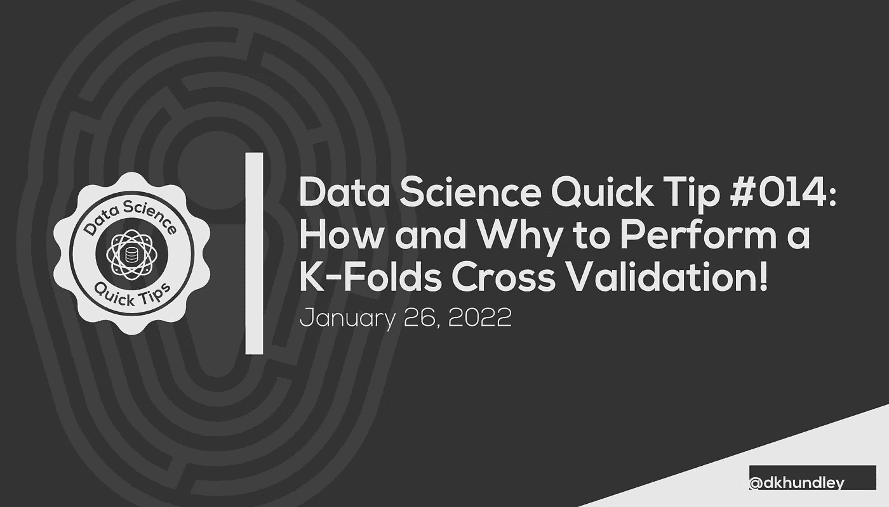
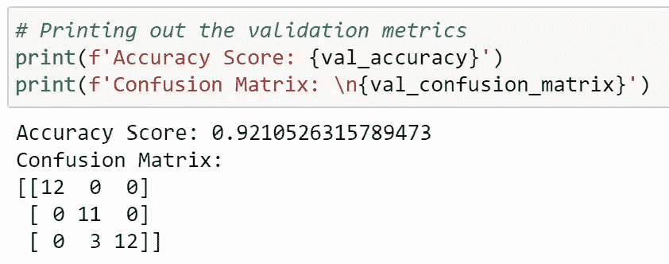
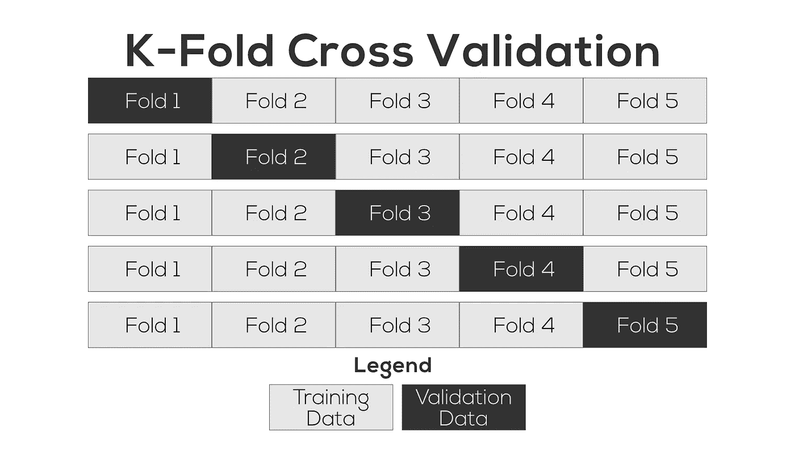
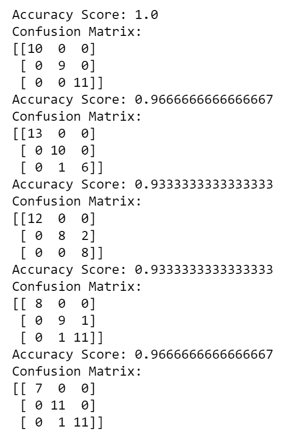

# 如何以及为什么执行 K 倍交叉验证

> 原文：<https://towardsdatascience.com/how-and-why-to-perform-a-k-folds-cross-validation-adf88665893b>



# 如何以及为什么执行 K 倍交叉验证

## 帮助您在处理较小的数据集时避免过度拟合等情况

你好，朋友们！一年多前，我开始了一系列的短文，我称之为**数据科学快速提示**。我已经有一段时间没做了，这一个与我正在做的另一个系列特别相关，我正在创建一个围绕电影评级的预测模型。为了回顾我们在该系列中所做的事情，我创建了一个预测模型，试图预测我最喜欢的播客之一可能给他的下一部电影的电影评级。

虽然我一直在通过收听播客的备份目录来收集有关他评级的电影的数据，但我发现的现实是，他根本没有给那么多电影评级。(这个播客的主要目的完全是别的东西；电影评论只是偶尔的奖励。)我仍然有办法查阅过去的目录，但迄今为止，我只收集了大约 **125 条影评**。

这可能看起来很多，但…不是。差远了。大多数大公司在数千甚至数百万条记录上训练模型，所以 125 条记录与像这样大得多的数据集相比几乎不算什么。因此，在我们进入什么是 k 倍验证之前，让我们快速回顾一下数据科学家通常如何用大型数据集训练他们的预测模型。如果你想继续，你可以在我的 GitHub 库[中找到我将在这篇文章中分享的代码，链接在这里](https://github.com/dkhundley/ds-quick-tips/blob/master/014_kfolds_validation/notebooks/kfolds-validation.ipynb)。

# 传统的“训练测试”分裂

为了简单起见，在这篇文章中，我们将使用虹膜数据集[。Iris 数据集可以非常容易地用 Scikit-Learn 库直接加载。以下是加载该数据集的代码:](https://scikit-learn.org/stable/auto_examples/datasets/plot_iris_dataset.html)

```
# Importing the necessary Python libraries
import numpy as np
import pandas as pd
from sklearn import datasets
from sklearn.model_selection import train_test_split, KFold
from sklearn.ensemble import RandomForestClassifier
from sklearn.metrics import accuracy_score, confusion_matrix# Getting the Iris dataset from Scikit-Learn
iris = datasets.load_iris()# Loading the predictor value (y) and remainder of the training dataset (X) as Pandas DataFrames
X = pd.DataFrame(data = iris['data'], columns = iris['feature_names'])
y = pd.DataFrame(data = iris['target'], columns = ['target'])
```

Iris 数据集是一个非常简单的小数据集，有三个目标类，这意味着这是一个很好的小数据集，可以用来练习创建**多类分类模型**。虹膜数据集也已经处于这样一个位置，如果我们不想做任何特征工程，我们在技术上不必做任何特征工程。鉴于这篇文章的重点不是创建一个完美的模型，我也不会费心去做任何特性工程。此外，我将使用 Scikit-Learn 的 **RandomForestClassifer** 算法来创建一个基本的预测模型。因为我不想创建一个完全精确的模型，你会注意到我根本不想调整算法的超参数。

当数据科学家创建预测模型时，他们通常会留出一部分带标签的训练数据集，称为**验证数据集**。(它有时被称为测试数据集，但由于我个人认为这有点用词不当，因为你有时会在一个模型被创建后传递一个未标记的测试数据集，我认为“测试数据集”术语应该保留给它。)验证数据集通过根据训练数据集训练的模型来计算度量，以确保模型的准确性之类的事情。

现在，不要把验证数据集和训练数据集混在一起是一个绝对的基本规则。这是因为您希望确保模型能够从模型尚未看到的数据集中得出准确的推断。在机器学习领域，我们将外部数据对训练数据集的这种影响称为**数据泄漏**。

在数据科学家有足够数量的记录进行训练的典型情况下，他们将执行典型的**训练测试分割**。(再说一次，我并不热衷于这种命名法，但是考虑到 Scikit-Learn 这样的库会进行这种拆分，我们将这样称呼这种拆分。)执行这种训练测试分割的最流行的方法之一是使用 Scikit-Learn 的内置函数`train_test_split`。下面是我们如何在 X 和 y 数据集上执行该函数:

```
# Performing a train_test_split on the dataset
X_train, X_val, y_train, y_val = train_test_split(X, y)
```

现在，我们已经在训练和验证数据集之间执行了拆分，我们准备好执行模型训练和验证。下面是实现这一点的代码:

```
# Instantiating a RandomForestClassifier model
rfc_model = RandomForestClassifier()# Fitting the X_train and y_train datasets to the RandomForestClassifier model
rfc_model.fit(X_train, y_train)# Generating validation metrics by comparing the inferential predictions (val_preds) to the actuals (y_val)
val_accuracy = accuracy_score(y_val, val_preds)
val_confusion_matrix = confusion_matrix(y_val, val_preds)# Printing out the validation metrics
print(f'Accuracy Score: {val_accuracy}')
print(f'Confusion Matrix: \n{val_confusion_matrix}')
```

当我打印出这些验证指标时，我在个人电脑上看到的是:



作者截图

老实说，92%并不坏，因为我们既没有特征工程也没有超参数调整，但这也是非常简单的虹膜数据集。我们面临的最大风险是，像这样的小数据集的验证准确率通常要低得多。其原因是，在针对非常小的一组数据进行训练时，我们很可能会面临**过度拟合**的风险。也就是说，因为模型在训练数据集中没有太多的信息，所以模型倾向于针对狭窄的训练数据集的外观生成非常具体的推断。

这显然是不理想的，那么我们如何确保我们的模型不会过度拟合呢？正如您所猜测的，这就是 k 倍验证的用处所在！

# k 倍验证

在上面的例子中，我们对数据集进行了一次训练测试分割。如果您避免数据泄漏，这意味着您的验证数据集将永远不会被视为模型训练过程的一部分。

所以问题是，有没有一种安全的方法来利用完整的数据集，同时小心数据泄漏？答案是肯定的，一种流行的方法是使用 **k 倍验证**。k-fold 验证所做的是将数据分成许多批次(或折叠),并对数据集进行洗牌，每次留出一个折叠用于验证目的。下图有助于更清楚地说明这一点。



作者创作的图形

在上图中，数据集被分成五个不同的部分，当我们遍历每一行时，我们用所有的浅灰色框进行训练，然后用一个深灰色框进行验证。请注意，我们实际上是以这种方式对模型进行五次不同的训练。虽然这看起来并不理想，但它仍然是有帮助的，因为如果验证度量标准有些不同，我们将能够判断出模型是否被过度拟合。换句话说，如果您的验证度量对于每个折叠都是不同的，这是一个很好的指标，表明您的模型过度拟合了。

因此，让我们从上面的代码开始，对其进行一点重构，以执行 k 倍验证:

```
# Instantiating the K-Fold cross validation object with 5 folds
k_folds = KFold(n_splits = 5, shuffle = True, random_state = 42)# Iterating through each of the folds in K-Fold
for train_index, val_index in k_folds.split(X):

    # Splitting the training set from the validation set for this specific fold
    X_train, X_val = X.iloc[train_index, :], X.iloc[val_index, :]
    y_train, y_val = y.iloc[train_index], y.iloc[val_index]

    # Instantiating a RandomForestClassifier model
    rfc_model = RandomForestClassifier()

    # Fitting the X_train and y_train datasets to the RandomForestClassifier model
    rfc_model.fit(X_train, y_train)

    # Getting inferential predictions for the validation dataset
    val_preds = rfc_model.predict(X_val)

    # Generating validation metrics by comparing the inferential predictions (val_preds) to the actuals (y_val)
    val_accuracy = accuracy_score(y_val, val_preds)
    val_confusion_matrix = confusion_matrix(y_val, val_preds)

    # Printing out the validation metrics
    print(f'Accuracy Score: {val_accuracy}')
    print(f'Confusion Matrix: \n{val_confusion_matrix}')
```

当我运行这段代码时，输出如下:



作者截图

如果您还记得，来自原始训练测试分割数据(92%)的准确性分数或多或少与我们从 k 倍验证准确性度量中看到的一致。虽然所有这些可能有一些过度拟合，但没有什么特别明显的迹象表明我们在这里有严重的过度拟合问题。这是一件好事！

现在，这是一个很好的评估过度拟合的技术，但是你可能会发现，这不是一个纠正过度拟合的方法。您必须采取额外的措施来实际纠正过度拟合的情况，无论是以不同的方式设计数据，解决某种目标类不平衡，还是其他什么。这超出了这篇文章的范围，但我可能会在以后写一些更具体的东西。

但是现在，这个帖子就写到这里吧！这次要保持简短甜蜜。希望在处理小数据集时，你们都觉得这很有价值。我知道我个人会在我的电影分级模型项目中使用它！感谢您的阅读，我们将在下一篇文章中再见。