# 反向传播的工作原理——Python 实现

> 原文：<https://towardsdatascience.com/how-back-propagation-works-a-python-implementation-21004d3b47c6>

本文主要关注 Python 中反向传播的实现。我们已经在下面链接的前一篇文章中讨论了反向传播的数学基础。在这篇文章的最后，你会明白如何从头开始构建神经网络。

[](/how-does-back-propagation-work-in-neural-networks-with-worked-example-bc59dfb97f48) [## 反向传播在神经网络中是如何工作的？

### 用一个例子演示背景如何在神经网络中工作。

towardsdatascience.com](/how-does-back-propagation-work-in-neural-networks-with-worked-example-bc59dfb97f48) 

# 数据、神经网络结构和初始参数

我们将使用具有`395`个数据点和`3`特征(`x1`、`x2`和`x3`)的数据集来训练`3–4–1`网络。目标(`y`)由两个值组成(`0`表示失败，`1`表示成功)。

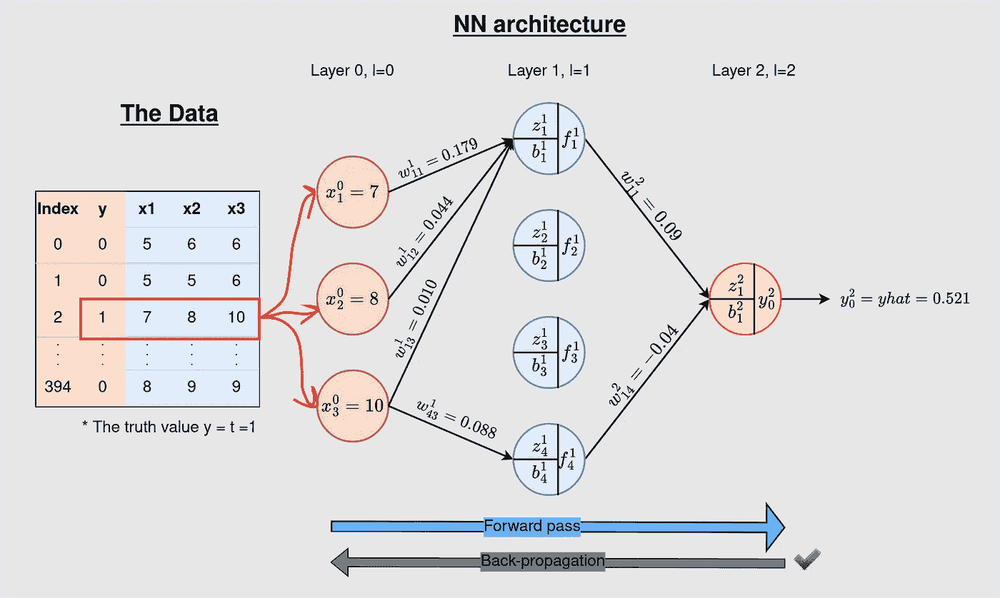

图 1:数据和神经网络架构。我们将实现一个 3–4–1 NN，数据集为 395 个示例，具有 3 个特征和 1 个目标值 y，图中显示的所有参数值都是初始值(来源:[https://towardsdatascience . com/how-does-back-propagation-work-in-neural-networks-with-worked-example-BC 59 DFB 97 f 48](/how-does-back-propagation-work-in-neural-networks-with-worked-example-bc59dfb97f48))。

所有层的初始参数如下所示:

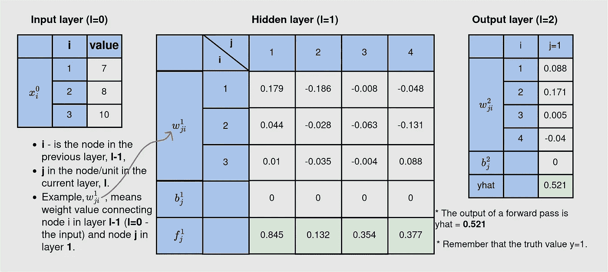

图 2:这些是参数的初始值(权重和偏差)。该图还显示了输入层上的单个数据点(来源:[https://towardsdatascience . com/how-does-back-propagation-work-in-neural-networks-with-worked-example-BC 59 DFB 97 f 48](/how-does-back-propagation-work-in-neural-networks-with-worked-example-bc59dfb97f48))。

我们将使用 NumPy 来执行大多数操作，充分利用它为操作的向量化和数组广播进行了优化这一事实。让我们使用 NumPy 进行一些简单的操作，您会发现它的用处。

# 使用 Numpy 执行数学运算

假设我们想要同时执行由隐藏层的所有 4 个神经元进行的计算。通过矩阵乘法和加法，NumPy 让事情变得更简单。`z=w·x+b`其中`w·x`是使用`np.dot(w, x)`函数在 Numpy ( `np`)中实现的矩阵乘法。

`import numpy as np
w = np.array([[ 0.179, 0.044, 0.01 ],
[-0.186, -0.028, -0.035],
[-0.008, -0.063, -0.004],
[-0.048, -0.131, 0.088]])
print("w shape: “, w.shape)
x = np.array([7, 8, 10]).reshape(-1, 1)
print(“x shape: “, x.shape)
b = np.array([0, 0, 0, 0]).reshape(-1, 1)
print(“b shape: “, b.shape)
z = np.dot(w, x) + b
print(z)`

**输出:** *w1 形态:(4，3)
x 形态:(3，1)
b 形态:(4，1)
[[1.705]
[-1.876]
[-0.6]
[-0.504]]*

这给了我们所有隐藏层的`z`-值。接下来，通过矢量化，NumPy 还允许我们为上面生成的所有值应用激活。

`sigmoid = lambda z: 1/(1+np.exp(-z))
print(sigmoid(z1))`

**输出:** *[[0.84618664]
【0.132849】
【0.35434369】
【0.37660112】]*

矢量化属性允许我们将所有 z 值传递到 Sigmoid 激活函数中，并获得隐藏层中所有 4 个神经元的所有输出。然后，这些值可以作为最后一层的输入进行传递。

## 记号

既然我们现在知道如何通过 NumPy 中的矩阵乘法和加法对给定层中的所有神经元执行操作，我们将采用以下新的符号。

*   `x⁰`将表示整个输入数据—一个维度矩阵(特征数量、训练示例数量)，
*   `wˡ` —连接层`l-1`到`l`的权重矩阵，
*   `bˡ` —应用于层 l 中神经元的偏置向量，

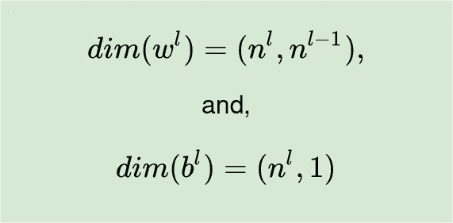

l 层权重和偏差的维度(来源:[https://towards data science . com/how-neural-networks-actually-work-python-implementation-simplified-a 1167 B4 f 54 Fe](/how-neural-networks-actually-work-python-implementation-simplified-a1167b4f54fe))

*   `zˡ` —加权输入加偏差。也就是代码中的`wˡ·x + bˡ`或 `np.dot(wˡ, x)+bˡ`，
*   `g` —激活功能。我们将对隐藏层和输出层使用 Sigmoid 函数，


乙状结肠激活功能。给定 z 的任意值，函数`g`输出 0 到 1 范围内的实数。

*   `fˡ`—`l`层输出的向量，即`g(wˡ·x+bˡ)` = `g(zˡ)`。这成为下一层`(l+1)`的输入，
*   `yhat` —模型的最终输出，
*   `y`或`t` —真实值，在我们的例子中是`0`和`1`。
*   `m`——#训练的例子。

# 我们需要实现反向传播的关键方程

为了在我们的浅层 NN 的代码中实现反向传播，我们需要在以下 3 个部分中简要讨论的 **10 个方程**:`A`、`B`和`C`(关键方程编号为`1`到`10`)。

## **A .更新方程式，以及成本函数:**

参数(权重和偏差)将使用以下等式在每一层进行更新:


更新方程式

其中`ϵ`是学习率——一个超参数，`t`是学习步骤，`E`是成本/误差函数。我们将使用[二元交叉熵损失函数](/cross-entropy-loss-function-f38c4ec8643e)作为函数`E`。它被定义为:

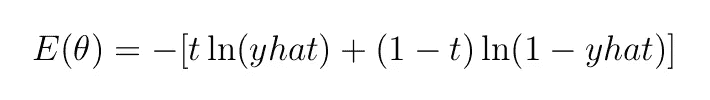

等式 4:二元交叉熵损失函数。

> 在代码中:
> 
> `cost = -np.sum(np.multiply(y, np.log(yhat)) + np.multiply(1-y, np.log(1-yhat)))/m`
> 
> (针对 m 训练实例)。

其中`t`是真值(`0`或`1`)，而`yhat`是模型的输出。由于我们在输出端使用 Sigmoid 函数，`yhat`将在`0`和`1`的范围内。我们的参数(权重和偏差)在`θ`中。

`E`相对于(wrt) `yhat`的偏导数可以表示为(此处勾选):

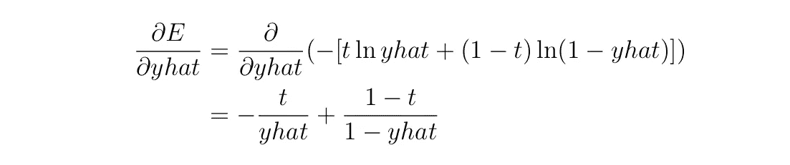

二元交叉熵损失函数的导数。

而 Sigmoid 函数的导数由下式给出(参见[本文](/derivative-of-sigmoid-and-cross-entropy-functions-5169525e6705)):

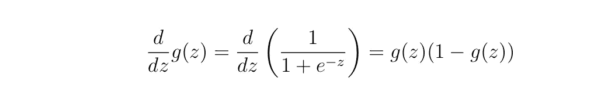

注意关于成本函数`E`的以下内容。

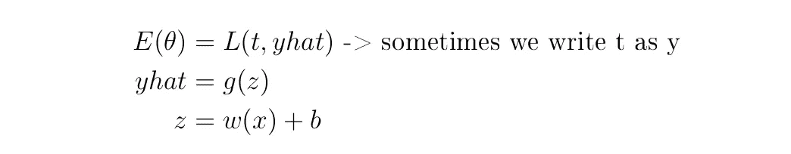

也就是说:

*   `E`是`yhat`和`t`的函数(已知)，
*   `yhat=g(z)`表示`yhat`是`z`的函数，
*   `z =wx+b`，暗示，`z`是`w`和`b`(我们的参数)的函数
*   实际上，`E`是权重(`w`)和偏差(`b`)的函数，可以写成`E(yhat, t)`或`E(g(z), t)`或`E(g(wx+b), t)`。

**含义:**要得到`E` wrt 对`w`和`b`的导数(需要更新参数)，我们需要得到

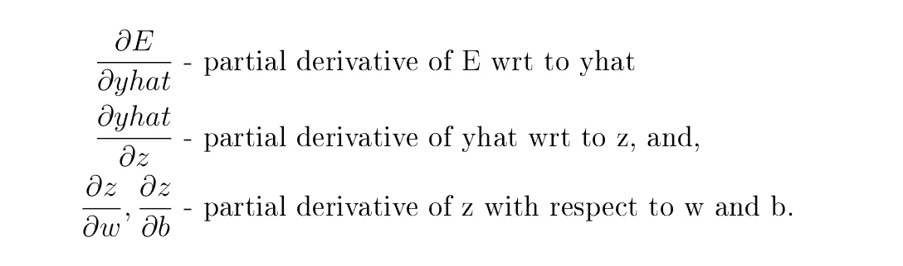

因此(根据链式微分法则)，


## B.更新输出隐藏层(w 和 b)中的参数所需的关键方程

如果我们需要更新`w²`和`b²`，我们需要计算:

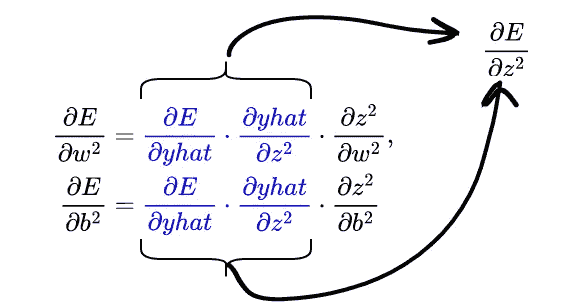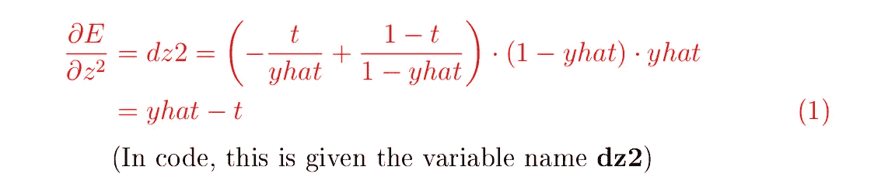

因此，

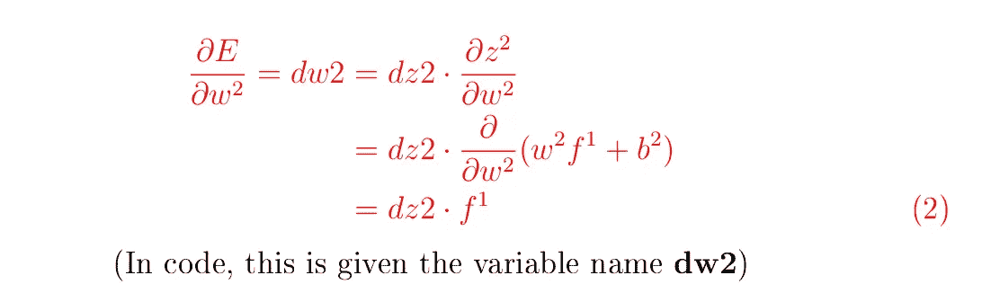

和

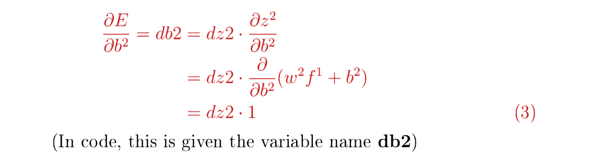

> 在代码中:
> 
> 方程式 1: `dz2 = yhat-y`
> 方程式 2: `dw2 = np.dot(dz2, f1.T)/m`
> 方程式 3: `db2 = 1/m * np.sum(dz2, axis=1, keepdims=True)`
> 
> (A.T 是矩阵 A 的转置)

我们现在有了更新`w²`和`b²`所需的等式，如下所示，

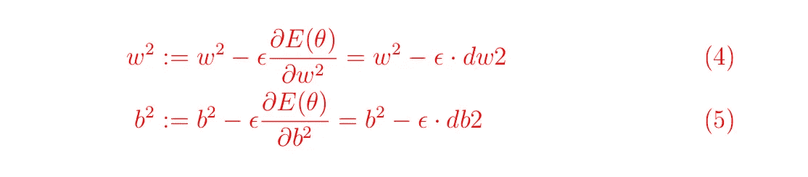

> 在代码中:
> 
> 方程式 4:`w2 = w2-learning_rate*dw2`方程式 5: `b2 = b2-learning_rate*db2`

## C.更新隐藏输入层(w 和 b)中的参数所需的重要方程

我们需要计算下面的导数。


如果你求解这些导数，你将得到以下结果(如果有些东西没有意义，请参考[主要参考资料](/how-does-back-propagation-work-in-neural-networks-with-worked-example-bc59dfb97f48))

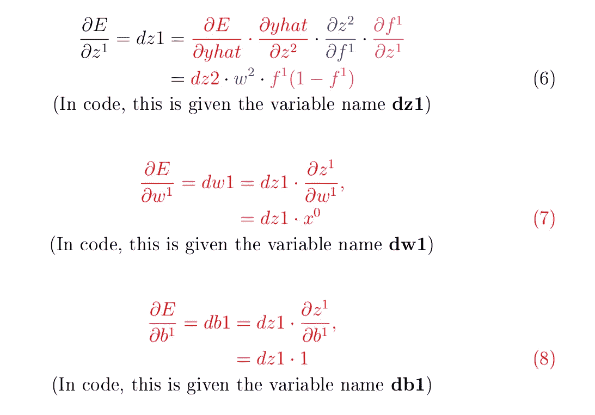

> 在代码中:
> 
> 方程式 6: `dz1 = np.dot(w2.T, dZ2) * (1-f1)*f1`
> 方程式 7: `dw1 = np.dot(dz1, X.T)/m`
> 方程式 8: `db1 = 1/m * np.sum(dz1, axis=1)`

然后，我们可以用以下等式更新隐藏输入端的参数:

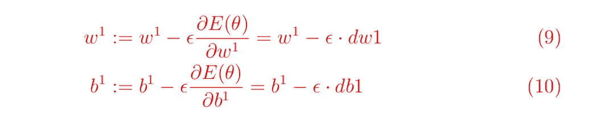

> 代码:
> 公式 9:`w1 = w1-self.learning_rate*dw1`公式 10: `b1 = b1-self.learning_rate*db1`

至此，我们有了`10`关键方程。让我们把它们放在桌子上。因为我们将用 m > 1 个训练例子来训练我们的模型，我们将使用右边的等式。

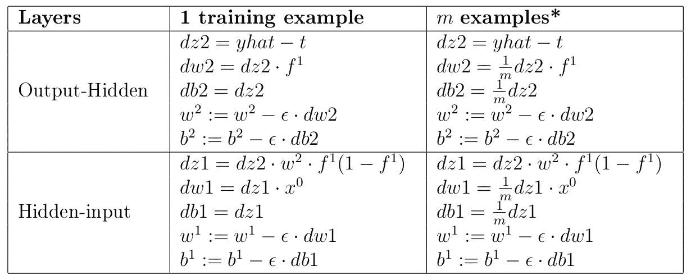

在代码中实现反向传播所需的 10 个等式。*注意，当实现 m 个示例的 back-prop 时(右)，变量可能是具有 m 个元素的向量。例如，`yhat`和`t`将分别包含 m 个示例的模型的所有预测和所有示例的真值。

# 把一切都放进 Python 代码

为了从头开始构建一个迭代的神经网络，我们需要实现前向传播和后向传播。我们已经在后面的文章中看到了如何实现前向传播。我只粘贴下面的代码；然后，我们添加反向传播组件。该代码在我们的`3–4–1` NN 中通过一个训练示例实现了向前传递。

**输出:**

```
Input shape (3, 1)
w1 shape:  (4, 3)
w2 shape:  (1, 4)
w1 shape:  (4, 3)
b1 shape (4, 1)
w2 shape:  (1, 4)
b2 shape (1, 1)
f1 shape (4, 1)
z2.shape (1, 1)
yhat shape (1, 1)
[[0.521]]
```

单个数据点`x=[7, 8, 10]`的单次正向传递输出`~0.521` (如预期的那样，见图 1)。

在前向传播之后，我们需要**计算近似的成本**，**执行反向传播**，最后，**更新参数**。为了实现这些步骤，让我们向上面代码中的`ForwardPass`类添加三个函数，并将该类重命名为`OurNeuralNet`。

我们根据需要增加了三个功能:`compute_cost(args)`、`backward_propagation(args)`和`update_parameters(args)`。注意，我们的类现在需要我们定义学习率。

## 训练模型

类`OurNeuralNet`现在有了实现 NN 操作所需的所有函数——参数初始化、向前传递、损失计算、反向传播和更新参数。这一次，让我们调用上面的类在更大的数据集上训练模型，而不是单个例子。数据在以下链接:【https://kipronokoech.github.io/assets/datasets/marks.csv】T21。

然后我们将调用`train_model(args)`函数用部分数据训练我们的模型。在`395`个例子中，我们将使用第一个`300`来训练模型。我们正在为`4500`迭代训练模型，学习率为`0.2`(实际上是任意选择)。在每次迭代中，我们还计算预测`yhat`的模型精度。

输出:

```
iteration 0 cost:--> 0.691 accuracy--> 0.67
iteration 1000 cost:--> 0.461 accuracy--> 0.78
iteration 2000 cost:--> 0.203 accuracy--> 0.917
iteration 3000 cost:--> 0.162 accuracy--> 0.933
iteration 4000 cost:--> 0.169 accuracy--> 0.947
iteration 4500 cost:--> 0.108 accuracy--> 0.99
{'w1': array([[ 0.074, -0.349,  1.217],
       [-0.05 , -0.167,  1.144],
       [-0.265,  0.091,  1.068],
       [-0.265,  0.079,  1.077]]), 'b1': array([[-7.196],
       [-7.103],
       [-6.843],
       [-6.818]]), 'w2': array([[2.81 , 2.743, 2.586, 2.573]]), 'b2': array([[-7.392]])}
```

哇！如您所见，随着模型的训练，预测的成本在下降，训练的准确度在上升，达到了`99%`的高点。我们的模式是学习！

## 测试模型

**理解**:我们已经使用`300/395`数据例子进行模型训练。这被称为*训练集*。为了确保我们的模型能够在*看不见的数据*(通常称为*测试集*)上进行归纳，我们将使用没有用于模型训练的`95`数据点进行测试(参见下面的代码片段)。

**注意:**为了进行测试，我们需要使用我们在前面部分中训练模型后找到的参数对特征数据进行单次正向传播。

输出:

```
Testing on 95 data points0.9157894736842105
```

厉害！该模型在测试集上达到了`91.6%`精度。这意味着该模型可以很好地概括看不见的(测试)数据。

这标志着本文的结束。如果您发现这里的一些概念具有挑战性，请浏览以下参考资料:

1.  [神经网络的基础知识](/the-basics-of-neural-networks-neural-network-series-part-1-4419e343b2b)
2.  [神经网络如何工作——使用工作示例](/feed-forward-neural-network-with-example-neural-network-series-part-2-eeca7a081ef5)
3.  [神经网络的实际工作方式——Python 实现(简化)](/how-neural-networks-actually-work-python-implementation-simplified-a1167b4f54fe)
4.  [神经网络实际上是如何工作的——Python 实现第 2 部分(简化)](/how-neural-networks-actually-work-python-implementation-part-2-simplified-80db0351db45)
5.  神经网络中的反向传播是如何工作的？【数学基础】(T29)

# 使用的代码

*   本文中使用的代码可以在我的 git repo 中找到:[https://github . com/kipronokech/Neural-Networks-from-Scratch](https://github.com/kipronokoech/Neural-Networks-from-Scratch)。

请[以每月 5 美元的价格注册成为 medium 会员](https://medium.com/@kiprono_65591/membership)，这样就可以在 Medium 上阅读我和其他作者的所有文章。

你也可以[订阅，以便在我发表文章时将我的文章发送到你的邮箱](https://medium.com/subscribe/@kiprono_65591)。

感谢您的阅读，下次再见！！！

# 结论

在本文中，我们从头开始训练一个浅层神经网络(一个只有一个隐藏层的神经网络)。我们已经了解了如何初始化参数、执行特征数据的正向传递、实现反向传播以及更新参数。在接下来的文章中，我们将讨论如何选择学习速率、适当的参数初始化以及改变隐藏神经元的数量对模型性能的影响。