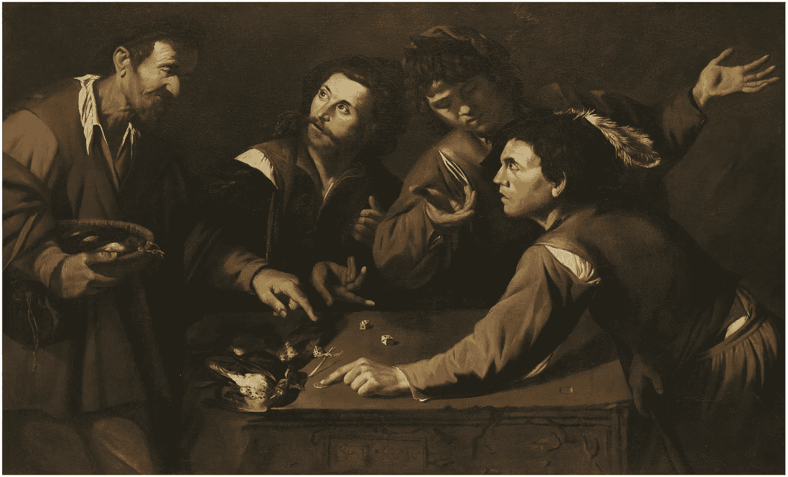
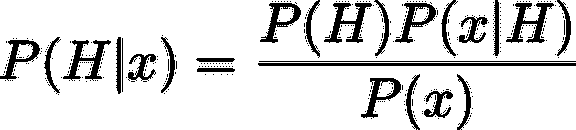
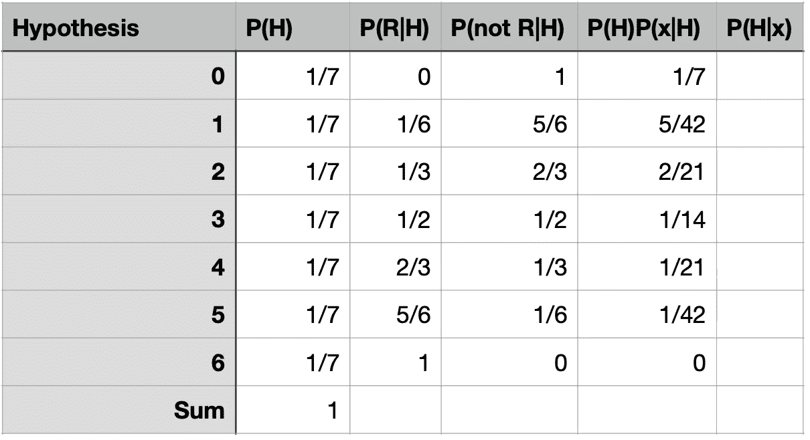
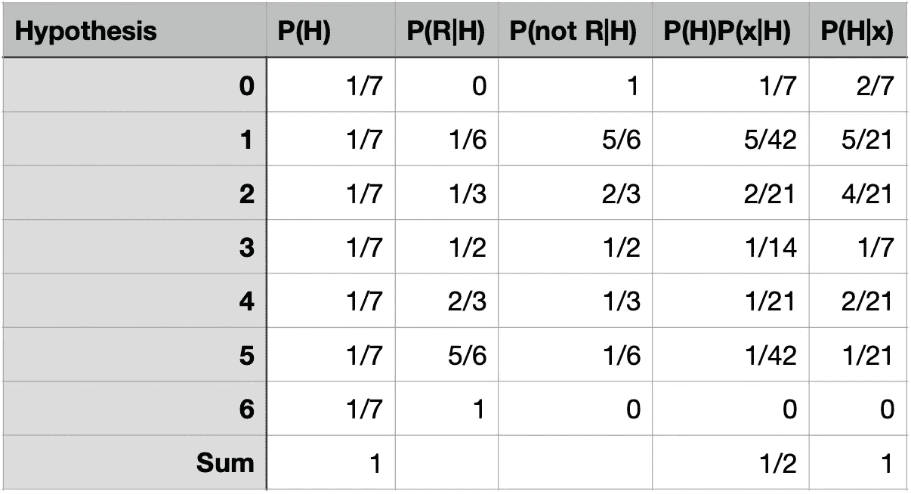
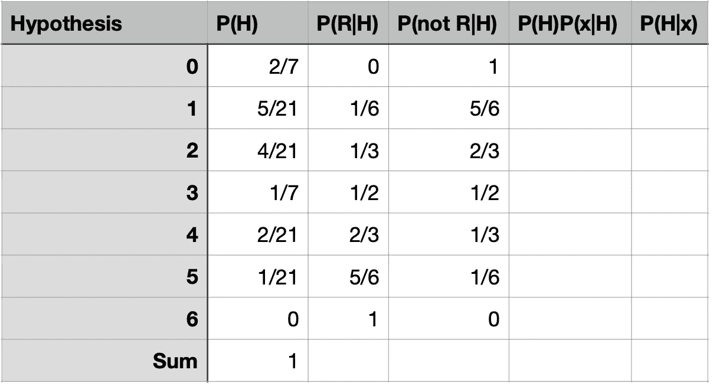
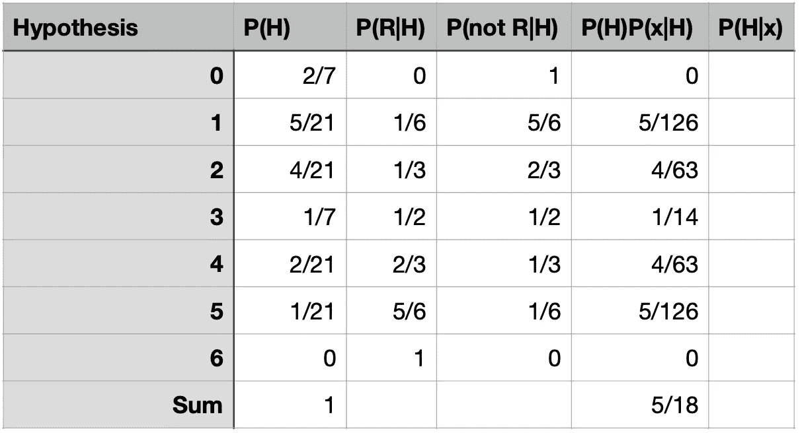
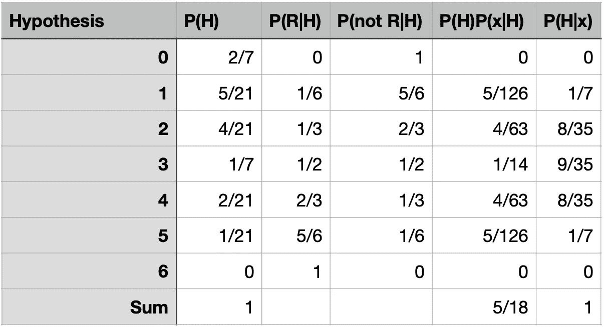
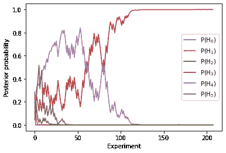

# 贝叶斯统计如何更新概率

> 原文：<https://towardsdatascience.com/how-bayesian-statistics-works-in-updating-probabilities-625b1b8599ec>

## 实验如何更新知识导致准确的概率估计

掷骰子的人和卖鸟的人聚集在一块石板周围——赌徒的主人——布面油画(公共领域图片来自维基百科)

通过研究一个骗子的赢款，在不知道他的资源的情况下，通过应用**贝叶斯定理**，有可能找出他得到点数的概率。在这个故事中，我们看到了如何进行一些“实验”,使得正确估计事件发生的概率成为可能，即使我们不知道从中提取的样本的成分。

根据贝叶斯理论，概率是主观的**。主观猜测可能会导致有意义的结果，这听起来可能有点奇怪。这个故事的目的是通过一个例子来说明这是可能的。**

**毕竟概率**一定**是主观的，因为没有办法估计一个客观的概率，除非你已经知道了，因为你已经以某种方式准备好了系统。**

**考虑一个里面有 6 个球的骨灰盒。这些球可以是红色(R)，绿色(G)或蓝色(B)。只有知道骨灰盒里有几个，才能知道抽到的客观概率，比如一个红球。否则，你只能猜测，在抽球之前，你只能给它分配一个主观概率:换句话说，你可以只根据你的*感觉*打赌你会在第一次抽中一个红球，这取决于你觉得自己有多幸运。但是，观察别人的下注，你就能对那个概率有个准确的概念。**

**在我们的例子中，骨灰盒包含三个红色球，两个绿色球和一个蓝色球。然而，假设我们对瓮中之物一无所知。我们只能说有以下几种可能。**

1.  **骨灰盒里没有红色的球。我们将此条件表示为 P(R|0)=0，其中 P(R|0)是在假设有 0 个红球的情况下，抽取红球的概率。P(R|0)称为抽 R 的**条件概率**，骨灰盒里没有红球。**
2.  **骨灰盒里只有一个红色的球。在这种情况下，P(R|1)=1/6，也就是说，有六分之一的可能性抽到一个红球。**
3.  **如果骨灰盒里有 2 个红球，P(R|2)=2/6=1/3。**
4.  **P(R|3)=3/6=1/2 是抽中一个红球的概率，如果骨灰盒里有 3 个红球。**
5.  **P(R|4)=4/6=2/3 是瓮中有四个红球的情况下抽到红球的概率。**
6.  **如果红球的数量是 5，P(R|5)=5/6。**
7.  **当然，如果所有的球都是红色的，P(R|6)=1。**

**以上概率是客观存在的，但是，我们对假设一无所知，对此我们需要进行猜测。根据贝叶斯定理**

****

**在这个公式 P(H|x)中，假定事件 *x* 已经发生，则**后验**代表**更新后的**H 为真的概率。它由之前的**P(H)和**可能性** P(x|H)的乘积除以 P(x)给出，P(x)只不过是一个归一化因子，称为**证据**。****

**在我们的例子中，P(H)是假设 H 为真的(先验)概率。我们的先验概率只能是主观的，我们只能做出有根据的猜测。我们必须相信 P(H)有一个给定值。它被称为“先验”，因为它必须在实验之前进行评估。既然我们不能从一个值中选择另一个值，我们可以设 P(H)=1/7，因为有七种可能的假设，而我们没有选择其中一种的线索。**

**给定假设 H，可能性 P( *x* |H)表示从瓮中抽取 *x* 的可能性。上面列出了 *x* =R 的 P( *x* |H)，当然，P 取决于 H。比如对于 *x* =R，H=4，P( *x* |H)=2/3。**

**证据 P( *x* )是在不考虑假设的情况下，抽到一个 *x* 的概率。它被称为证据，因为它可以作为实验的结果来评估。因为它是一个标准化因子，所以可以通过**忽略**概率来评估，如下所示。**

**在第一次抽签后，我们可以根据贝叶斯定理，通过计算后验概率(即实验完成后的概率)来更新我们的知识。换句话说，我们想要评估 P(H| *x* )假设 H 为真，给定事件 *x* 发生。**

**假设我们在第一次尝试中抽到了一个绿色球( *x* =G)。然后，我们可以构建下表。**

****

**第二列中的 P(H)是第一列中列出的假设 H 的概率。为了方便起见，在第三列中示出了可能性 P(R|H)。在我们的例子中，事件 *x* =G，我们需要计算抽到一个不是红色的球的可能性，即 1-P(R|H)。给定 H，事件 *x* =G 发生的乘积 P(H)P( *x* |H)显示在倒数第二列。**

**倒数第二列中所有概率的总和给出 P( *x* )，不考虑 h .它是 1/2。将表的最后一列除以这个数，得到后验概率，它作为表的最后一列添加。**

****

**如图所示，所有 H 的 P(H)和 P(H|x)之和必须为 1。从表中我们可以看到，由于实验的进行，我们的信念是如何演变的。假设 6(所有的球都是红色的)已经被排除:它的概率为零。实验结束后，每个假设的概率随着投票箱中红球的数量而减少。事实上，如果瓮中的红球数量是 5 个，我们很可能抽到一个红球，然而，如果只有一个球，抽到一个绿球的概率更高。**

**每次我们做实验，我们都会更新概率。现在，我们的先验是第一次实验后得到的后验。我们更确信瓮中有一个红色的球，而不是五个，并且我们确信不是所有的球都是红色的。然后，让我们重新构建该表。**

****

**然后，让我们进行另一个实验，假设我们画了一个红球( *x* =R)。在这种情况下，贝叶斯定理的分子是乘积 P(H)P(R|H ),并且表格改变为**

****

**将每个分子除以 5/18，即分子总数，我们得到后验概率:**

****

**值得注意的是，现在后验概率相对于假设 3 是对称的。对称性是由于我们画了一个绿色的球和一个红色的球，在这些实验之后，我们可以得出结论，假设与频率一致，画一个红色的球的概率等于画一个非红色的球的概率。**

**我们也排除了另一个假设:H=0。其实画了一个红球，H=0 是不可能为真的。**

**现在，假设 H=3 是最有可能的(实际上，这是真的)。**

**我们可以多次重复这个过程。每一次，我们都会更新关于骨灰盒内容的知识。有趣的是，将概率的演变绘制成实验次数的函数(我们模拟了 200 次抽签，每次都计算后验概率):**

****

**正如我们所看到的，所有的先验最终都趋向于零，除了正确的一个，P(3)，它趋向于 1，正如大数定律所预测的那样(即通过频率主义方法)。**

**[在这里](https://colab.research.google.com/drive/1rZ22a6lF51BhB_GM8m7z7sVkdwhAnnEX?usp=sharing)，你可以找到一个 jupyter 笔记本，用来计算随机抽取一个球后的后验概率，并迭代这个过程。使用该工具，您可以看到后验概率如何随着实验次数的增加而演变，并理解贝叶斯定理如何从一个*主观*概率导出一个*客观*概率。**

**通过使用这个工具，你甚至可以改变初始的先验，并看到最终的结果独立于初始的猜测。例如，你可以从完全随机的先验 P(H)开始。最终，结果总是 P(3)趋向于 1。**

**引用 Bruno De Finetti 的话，“概率是不存在的”，因为它绝不是客观的，也就是说，它不是任何真正的实验所固有的。虽然没有客观概率这种东西，但贝叶斯定理导致对它的估计，其值随着我们对系统的了解而演变，并在每次实验后更新，导致尽可能客观的估计。在这个故事中，我们已经说明了更新过程是如何工作的，以及为什么它会导致正确的答案。**

> **这样的故事还要继续看下去吗？不要错过订阅媒体的新故事:[https://giovanni-organtini.medium.com/membership](https://giovanni-organtini.medium.com/membership)**