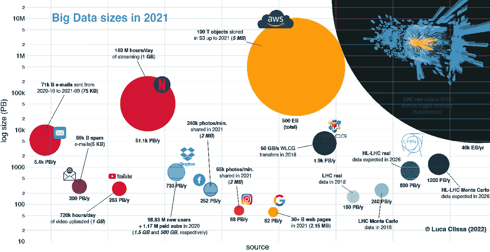
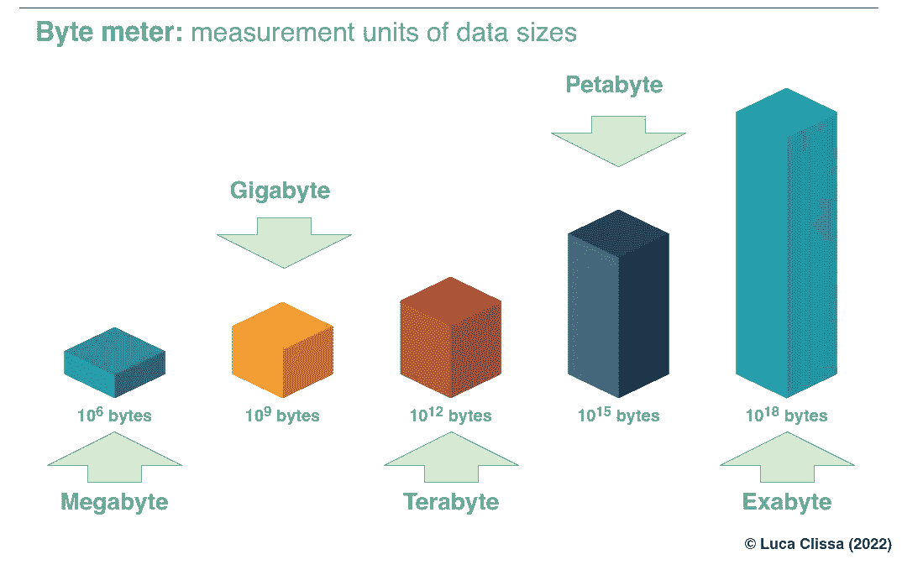

# 2021 年大数据有多大？

> 原文：<https://towardsdatascience.com/how-big-are-big-data-in-2021-6dc09aff5ced>

## 关于一些最著名的大数据源的大数据“规模”的调查

想过大数据有多大吗？本文试图对一些最著名的数据生成者生成的数据进行最新的比较。

欧洲核子研究中心 0 级数据中心。图片来源: [CERN](https://home.cern/resources/image/computing/computing-images-gallery)

我们正在见证数字数据的不断增长，以至于我们的时代被称为*大数据时代*。多种多样的参与者推动了这一增长，从科技公司到标准行业、媒体机构、机构和研究实验室。此外，现在即使是日常物品也可以收集数据，因此数据生产者中也包括普通人。

总的来说，数据生产的现代趋势由两个主要因素驱动:来自不同行业的几个利益相关者提供的数字服务和数百万用户的大规模使用。

尽管由于缺乏官方信息，重建生成数据的数量非常困难，但可以通过整合不同性质的多个来源来尝试。

# 2021 年的大数据规模

图片由作者提供。互动版请访问:[datapane.com/lclissa/big-data-2021/](https://datapane.com/u/lclissa/reports/dkjK28A/big-data-2021/)

> 标题中链接的交互式版本，具有可点击的链接，重定向到所有用于评估的参考来源。

首先映入眼帘的肯定是右上角的巨大气泡。这说明了欧洲核子研究中心*[大型强子对撞机(LHC)](https://home.cern/science/accelerators/large-hadron-collider) 实验的电子设备检测到的数据。一年中，处理的信息量约为 40k EB，即 40 万亿 GB。举个例子，这可能是亚马逊 S3 上存储的数据量的十倍！*

*然而，并非所有这些数据都令人感兴趣。因此，实际记录的信息缩减到每年数百 PB(真实和模拟数据分别为 160 和 240 PB)，并且在即将到来的 [*高亮度(HL-LHC)*](https://home.cern/resources/faqs/high-luminosity-lhc) 升级中，它将增长近一个数量级。*

*商业大数据源也经历了类似的量。据估计，谷歌搜索索引的大小不到 PB，而公司的服务伙伴 YouTube 的大小大约是它的 4 倍。*

*对于 Instagram 和脸书年度照片上传，可以分别重建相同的关系。*

*关于更合适的存储服务，如 Dropbox，大小增加到几百 PB，类似于 LHC 实验的 HL 升级。*

*然而，流数据一直占据着大数据市场的份额。像网飞和电子通信这样的服务产生的流量比单纯的数据生产者多一到两个数量级。值得注意的是，科学界在这方面也发挥了重要作用。例如，由于全球 LHC 计算网格(WLCG) 的[，来自 LHC 数据流通的流量达到每年数千 Pb。](https://wlcg.web.cern.ch/)*

# *费米估计过程*

> *...但是这些数字从何而来？*

*即使有可能，精确重建一个组织产生的大量数据(尤其是大型组织)也是非常困难的。事实上，并不是所有的公司都在第一时间追踪这些信息。即使如此，这些数据通常也不会与公众共享。*

*尽管如此，一种尝试性的方法可以将数据生产过程分解为其原子组成部分，并进行合理的猜测(**)*)。事实上，当以特定数据源为目标时，检索关于给定时间窗口内产生的内容量的信息更容易。一旦我们有了这些，我们就可以通过合理的*猜测此类内容的单位大小*来推断数据总量，例如平均邮件或图片大小、1 小时视频的平均数据流量等等。当然，即使很小的错误在大规模传播时也会产生很大的影响。然而，返回的估计值仍然可以指示所涉及的**数量级**。**

**让我们深入了解在评估过程中挖掘的资源。**

**谷歌。尽管互联网上的网页数量无穷无尽，但最近的迹象表明，并不是所有的网页都被搜索引擎编入索引。事实上，这样的[指标应该尽可能小，以确保有意义的结果和及时的响应](https://www.kevin-indig.com/googles-index-is-smaller-than-we-think-and-might-not-grow-at-all/)。因此，最近的一项分析估计，谷歌搜索索引包含[300 亿到 500 亿网页](https://firstsiteguide.com/google-search-stats/)(目前的估计见[worldwidewebsize.com](https://www.worldwidewebsize.com/))。考虑到根据年度*网络年鉴* 一个平均页面的重量大约为 [2.15 MB，截止到 2021 年**谷歌搜索索引**的总大小应该大约为***62pb(PB*)**。](https://almanac.httparchive.org/en/2021/page-weight)**

****YouTube。**据 [Backlinko](https://backlinko.com) 报道，2021 年[每天有 72 万小时的视频上传到 YouTube](https://backlinko.com/youtube-users#youtube-statistics)。假设平均大小为 [1 GB(标准定义](https://www.quora.com/What-is-the-file-size-of-a-one-hour-YouTube-video)，这使得去年总共生产了大约 **263 PB** 。**

**脸书和 Instagram。 [Domo](https://www.domo.com/) 的 [*数据不眠 9.0*](https://mms.businesswire.com/media/20210929005835/en/911394/5/data-never-sleeps-9.0-1200px.jpg?download=1) 报告估计，2021 年两大社交媒体上每分钟上传的图片数量分别达 240k 和 65k。假设平均大小为 [2 MB](https://www.adobe.com/express/discover/sizes/facebook) ，那么总共大约有 **252** 和**68pb**。**

****Dropbox。**虽然 Dropbox 实际上并不产生数据，但它提供了一个云存储解决方案来托管用户的内容。2020 年，公司宣布[新增用户 1 亿，](https://backlinko.com/dropbox-users)117 万，[其中](https://backlinko.com/dropbox-users)为付费订阅。通过推测免费和付费订阅的占用率分别为 75%(2gb)和 25%(2tb)，2020 年 Dropbox 用户所需的新存储量可以估计为大约 **733 PB** 。**

****

**图片由作者提供。**

****邮件。**据 [*Statista*](https://www.statista.com/) 统计，从 2020 年 10 月到 2021 年 9 月交换了近 131 亿次电子通信([71 亿次电子邮件和 60 亿次垃圾邮件](https://www.statista.com/statistics/1270424/daily-spam-volume-global/))。假设标准邮件和垃圾邮件的平均大小分别为 [75 KB 和 5kb](https://medium.com/@raindrift/how-big-is-email-305bbdb69776)，我们可以估计总流量大约为 **5.7k PB** 。**

**网飞。在过去的几年里，公司的渗透率直线上升，这也是为了应对疫情改变了的日常事务。Domo 估计，2021 年网飞用户每天消耗[1.4 亿小时的流媒体](https://www.businesswire.com/news/home/20210929005835/en/Domo-Releases-Ninth-Annual-%E2%80%9CData-Never-Sleeps%E2%80%9D-Infographic)，假设[每小时 1 GB(标准清晰度)](https://www.digitaltrends.com/movies/how-much-data-does-netflix-use/)时，总计约为 **51.1k PB** 。**

****亚马逊。**据亚马逊网络服务(AWS)首席布道者杰夫巴尔(Jeff Barr)称，[据报道，截至 2021 年](https://aws.amazon.com/blogs/aws/amazon-s3s-15th-birthday-it-is-still-day-1-after-5475-days-100-trillion-objects/)，超过 100 万亿个对象存储在亚马逊简单存储服务(S3)中。假设对于一个普通的存储桶，每个对象的大小为[5mb](https://www.ringingliberty.com/2021/06/30/why-is-aws-s3-object-count-is-measured-iin-units-used-to-measure-file-size/)，这使得曾经存储在 S3 的文件的总大小大约等于**500 EB(EB)**。**

****LHC。由于受控的实验条件和科学结果的公布，在这种情况下可以获得更详细的信息。
在最近一次运行(2018 年)中，LHC 在四个主要实验中的每一个实验中都产生了大约每秒 24 亿次粒子碰撞——即 [ATLAS](https://atlas.cern/) 、 [ALICE](https://alice-collaboration.web.cern.ch/) 、 [CMS](https://cms.cern/) 和 [LHCb](https://home.cern/science/experiments/lhcb) 。这为每次碰撞提供了大约 100 兆字节(MB)的数据，因此预计每年大约有 40000 兆字节的*原始数据。*****

**然而，以目前的技术和预算，存储如此大量的数据是不可能的。此外，只有一小部分数据是真正感兴趣的，所以没有必要记录所有的信息。因此，使用硬件和软件触发选择系统，绝大多数原始数据被直接丢弃。因此，记录的数据量*降低到大约每天 1 PB，这使得**在 2018 年的最后一次数据采集期间得到 160 PB** 。***

**除了 LHC 收集的真实数据，物理分析还需要将实验结果与根据当前理论模拟的蒙特卡罗数据进行比较。除了实际记录的信息之外，这产生了将近 1.5 倍的数据。**

**此外，CERN 社区已经在努力增强大型强子对撞机的能力，用于所谓的 [*高亮度 LHC (HL-LHC)*](https://home.cern/resources/faqs/high-luminosity-lhc) 升级。在这种新的体制下，预计到 2026 年，生成的数据将以系数 *≥ 5* 的速度增长，并每年产生约 **800 PB** 的新数据。**

**此外，由于[全球 LHC 计算网格(WLCG)](https://wlcg.web.cern.ch/) 的存在，收集的数据被持续传输，以允许世界各地的研究人员进行研究，从而在 2018 年产生了 **1.9k PB** 的年流量。**

**关于 LHC 数据产生的更详细的解释见[1]。**

# **结论**

**尽管官方数据的缺乏阻碍了对单个组织产生的海量数据的准确估计，但对原子数据生产单位及其规模的推理可能会提供有趣的见解。**

**例如，**流数据**(例如网飞、电子邮件和 WLCG 传输)已经占据了大数据市场的很大一部分，并且由于能够生成和共享数据的智能日常对象的广泛采用，它们的影响在未来几年可能会继续增加。**

**然而，最令我震惊的是，**科学数据**在大数据现象中也发挥着重要作用，其数量堪比一些最知名的商业参与者！**

**总而言之，数据生产率正处于巅峰状态，并且在未来几年将继续增长。很高兴看到这些估计将如何随着时间的推移而演变，以及这些组织的相对贡献在几年后是否会发生变化。**

**现在我真的很想知道**你*怎么看*T21**什么引起了你的注意**！****

**你觉得提供的数字合理吗？它们在多大程度上反映了你的个人经历？**

***有没有你认为应该加入比较的重要大数据源或组织？*随意[分叉用于可视化的代码](https://github.com/clissa/BigData2021)并自己集成！**

## ****参考文献****

**[1] L. Clissa，[2021 年大数据规模调查](https://arxiv.org/abs/2202.07659) (2022)， *arXiv***