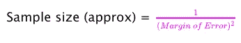
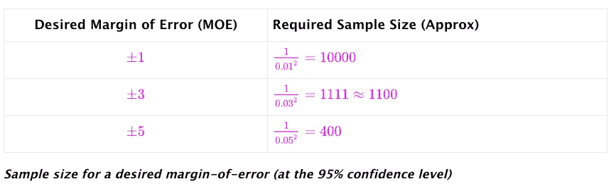
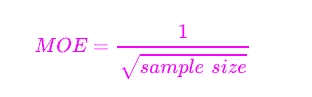
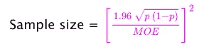
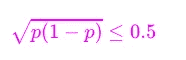
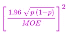
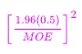
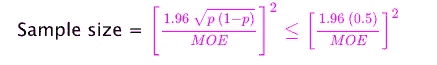
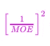
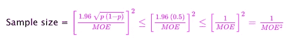

# 你的样本量应该有多大？

> 原文：<https://towardsdatascience.com/how-big-should-your-sample-size-be-54ab2154c152>

## 每个数据科学家都应该知道的一个方便的小公式

Artturi Jalli 在 [Unsplash](https://unsplash.com?utm_source=medium&utm_medium=referral) 上拍摄的照片

你正在与首席执行官和管理团队开会。

产品团队正在推销一个新产品创意。它有很多很酷的功能，可以与公司目前的产品顺利配合。他们认为现有客户会喜欢它。他们认为这是从客户群中增加钱包份额的好方法。他们向首席执行官申请预算来制造产品。

销售团队不太确定。他们认为现有客户没有迫切的理由购买新产品——他们认为这是一种维生素，而不是止痛药。他们认为大多数顾客不会购买。他们认为建造它是浪费金钱。

他们都把目光投向了首席执行官，但她还没有做好决定的准备。她非常精通数据。她想对现有顾客的*随机* *样本*进行调查，看看他们中有多少人想要购买新产品*。

她转向你。你能计算一下数字，让我在今天结束前知道我们应该调查多少客户吗？我希望误差幅度为正负 3 个百分点。

你以闪电般的速度回复:*约 1100 个客户*。

她被你的反应速度惊呆了。哇，真快。

你尽量显得谦虚:-)。

她继续说道。调查 1100 名客户成本太高。假设我可以有正负 5 个百分点的误差。那么有多少顾客？

你的另一个即时回应: *400 个客户*。

*这样更好。她求助于营销团队。让我们对 400 名顾客做一个随机调查，结果出来后我们再见面。*

首席执行官离开了。会议结束。

人们聚集在你周围。你是怎么做到的？

简单。这就是得心应手的小公式([来源](https://en.wikipedia.org/wiki/Sample_size_determination#Estimation_of_a_proportion))。

有了这个，你可以使用你的手机计算器快速找到任何误差范围的近似样本大小。

但是一些误差幅度的数字——1%、3%和 5%——在商业世界中是如此普遍，以至于你应该记住这些结果。毕竟，表现出进行闪电般的心算比拿出手机更令人印象深刻；-).

还有一件事。你也可以翻转公式。

现在，您可以处理“反向”问题:*我只能调查 250 名客户。在那种情况下，误差幅度是多少？*

没问题。拿出手机的计算器，算出 1/(250 的平方根)就是 0.063(即 MOE 正负 6.3)。

不错吧。

就是这样。勇往直前，给人留下深刻印象！:-)

***这个公式从何而来？***

让我们从一个古老的统计问题开始。

> *我们应该随机抽取多少人的样本，这样我们才能在正负 MOE 的误差范围内，以 95%的置信度**估计人口比例？*

在我们的例子中，

*   人口=所有现有客户
*   人口比例= %所有想要购买新产品的现有客户
*   MOE =回想一下，CEO 首先要求 3%的误差幅度，后来要求 5%

上面这个老生常谈的问题有一个老生常谈的[答案](https://en.wikipedia.org/wiki/Sample_size_determination#Estimation_of_a_proportion):

*p* 是*样本比例*——表示将购买该产品的**受访者的百分比。**

但是我们还没有做调查，所以我们不知道 p，事实上，这里的重点是要找出 p，对吗？).那么我们将把什么代入 p 的公式呢？

一点数学知识就能拯救我们。

原来，对于 0 和 1 之间的 *p* ，这总是正确的:

(你可以画出来自己确认或者只是做一点微积分证明)

因为样本大小

最多是**还是**

原始公式可以近似为:

请注意，由于中没有 *p*

我们已经解决了“不知道给 *p* 插什么”的问题。

接下来，请注意，1.96 (0.5) = 0.98 仅略小于 1.0。所以这个

可以近似计算为

将所有这些放在一起:

我们完了！

*重要警告*:由于我们正在进行简化，这个公式是保守的。 如果 *p* 的真值远离 0.5，它将推荐一个多余的样本量。

如果您可以从之前的类似调查中猜测出 *p* 的可能值，您可以在此公式中使用 *p* 的值。

*是的，她知道人们*在调查中告诉你的可能并不是他们实际会做的。这里有一个有趣的最近的例子([来源](https://medium.com/magnetic/52-things-i-learned-in-2022-db5fcd4aea6e)):*

> 研究人员询问了 100 个人，一个理智的人是否会解锁他们的手机，并交给实验人员进行搜索。大多数人说没有。然后研究人员让另外 103 个人打开他们的手机，交给他们。其中 100 人照办了。

* *置信水平不一定是 95%，但有两个原因使用它。

*   这在商界很常见
*   对我们来说很方便的是，相关的 Z 分数 1.96 很好地乘以 0.5，得到一个接近 1.0 的数字，这导致了样本大小的超级简单的公式。

要使用不同的置信水平，您需要用上面公式中的其他值替换 1.96。[更](https://en.wikipedia.org/wiki/Sample_size_determination#Estimation_of_a_proportion)。

如果你喜欢这篇文章，你可能也会喜欢这些(我意识到我听起来像一个推荐引擎:-)。

[我有数据。我需要洞察力。我从哪里开始？](https://medium.com/p/7ddc935ab365)

[首先创建一个常识基线](https://medium.com/p/e66dbf8a8a47)

[如何在日常分析工作中使用因果推理](https://medium.com/p/b5efbdbf8ab0)

[来自深度学习大师的教训](https://medium.com/p/1e38404dd2d5)

[从预测到行动——如何从数据中学习最优策略](https://medium.com/p/1edbfdcb725d)