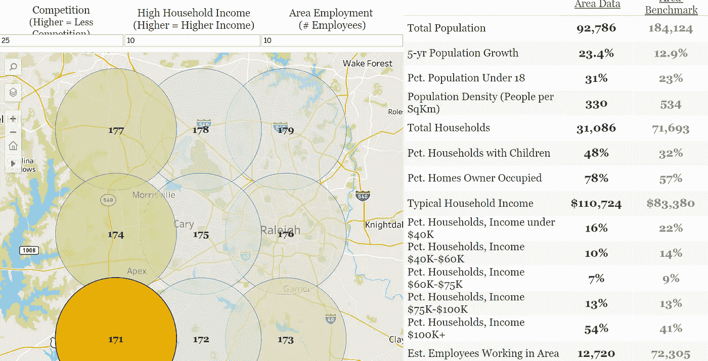
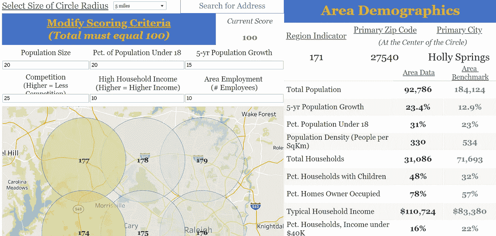
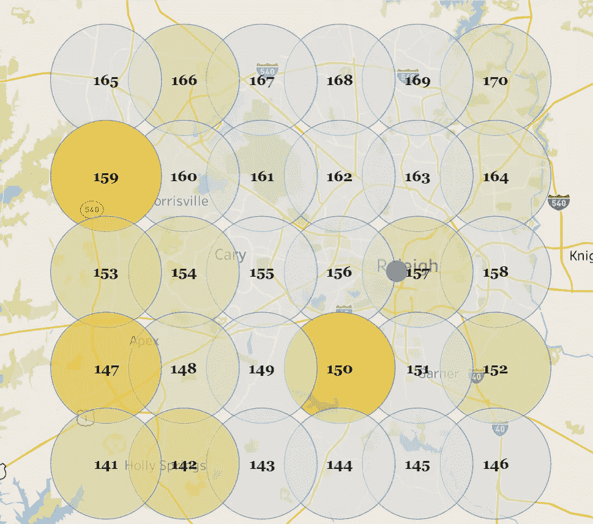

# 数据如何帮助识别增长市场和选址？

> 原文：<https://towardsdatascience.com/how-can-data-help-identify-growth-markets-and-with-site-selection-7db2ea92c18c>

维塔利·巴拉科夫斯基在 [Unsplash](https://unsplash.com?utm_source=medium&utm_medium=referral) 上的照片

*本文所表达的观点是我基于公开数据和工具得出的个人观点。*

寻求发展的中小型企业有很多事情要做，既要维持当前的运营，又要寻找下一步的发展方向。许多人可能想知道……数据能做什么来帮助识别增长市场和评估网站？

我们认为在选址中使用数据识别增长市场的最大好处是:( 1) **更有效地利用选址时间**和(2) **提高选择正确市场/区域/地点的可能性**。

# 更有效地利用你的时间

卢克·切瑟在 [Unsplash](https://unsplash.com?utm_source=medium&utm_medium=referral) 上拍摄的照片

识别增长市场是一项耗时的任务。有时一个团队成员的任务是研究不同的市场，所以他们花大量的时间搜索关键指标，试图将它们整合在一起，并整理出它们的含义。或者，也许你和一个房地产经纪人合作，他提供一些数据和网站。

当这种情况发生时，团队可能会陷入熟悉的陷阱。我们自然更有可能寻找我们知道或有联系的地区，无论是以前在那里生活过，认识该地区的某人，还是在那里上学的团队成员。无论这种联系是什么，我们都倾向于熟悉的事物。然而，这也带来了封闭未知区域的风险，而这些未知区域可能更适合你的业务。

数据可以打开你可能没有想到的新区域，仅仅因为你不知道它们的存在。最重要的是，它只会向前推进与您的业务相关的领域，因此您不必为了找到正确的“未经雕琢的钻石”而对几个错误的领域进行排序。

因此，当我们说数据可以帮助团队更有效地利用时间时，我们的意思是它可以:

1.  立即消除对你的业务没有意义的领域。
2.  确定最有意义的领域(其中一些你以前可能没有注意到)
3.  对这些区域进行排序和优先排序

消除对你的业务没有意义的领域意味着你不会浪费时间在对你来说不太可能成功的地区和领域。例如，如果您发现一个城市需要至少 25，000 的人口才能成功，您可以立即排除您所在区域(地区、州、县)中不符合该标准的所有城市。

那么，假设你想要高密度的餐厅和高千禧一代人口。现在，我们可以使用数据来寻找符合这一特征的地区——25，000 多名居民，高餐厅密度，高千禧一代人口。我们可以通过为您的业务添加新的过滤器来继续缩小搜索范围，如家庭收入、人口密度和人口增长。

在此基础上，我们可以选择对您的业务至关重要的内容，并开发一种评分算法。我们可以创建这样的计算:

*   人口规模的 20%权重
*   餐厅密度的 30%权重
*   占千禧一代人口的 15%
*   占家庭收入的 25%
*   人口增长 10%的权重

这一过程的结果是只过滤与您的客户人口统计相关的地理区域，然后对剩余的区域进行评分，这是一个符合您的标准的缩小的城市列表，按照定制的分数排序，优先考虑对您的成功最重要的数据点。

现在，您的团队可以花更多的时间在这个缩小的区域列表(县、城市、邮政编码)中进行辩论，并在该区域内搜索资产，从而更有效地利用您的时间，只关注最有可能成功的区域。

# 提高你找到正确市场的可能性

为你的企业选择一个新的市场、区域或地点并不是一门完美的科学。数据只是一个复杂难题的一部分，它包括你的产品的市场、适当的可达性(汽车交通/步行交通、街道临街面)、标志、空间的可用性和大小、成本/可负担性等等。

没有人应该承诺或保证数据可以明确地告诉你在哪里定位，或者一个网站会成功(我会厌倦任何人说数据本身就可以做到这一点)。相反，我们的理念是，数据可以提高做出正确决策的可能性，让人们更好地相信，该领域拥有让您的产品取得成功的正确因素。

上面概述的过程是这个过程的第一步。通过确定取得成功需要具备的条件，并寻找这些地点，你已经迈出了增加在正确市场取得成功的可能性的第一步。

现在，想象我们想更进一步。你已经找到了一个你喜欢的市场，并想采取下一步行动在市场中找到合适的位置。

假设我们想在一个城市开一家新的牙医诊所。医疗保健从业者经常瞄准人口统计数据、可识别的竞争和高启动成本，这使得该行业可以从增加对位置数据的访问中受益匪浅，以培养对这些大型投资的信念。

为了扫描市场寻找最佳区域，我们可以将一个区域分成半径不同的重叠圆圈。在每个圆圈中，我们收集与业务类型相关的数据，显示信息，并可以创建一个可定制的评分功能来寻找热点。

看看下面的图片——它将北卡罗来纳州的威克县(罗利及周边城市的所在地)分割成重叠的 5 英里的圆圈。在每个圆圈中，我们显示数据点，如人口、18 岁以下人口、增长、估计家庭收入、就业、竞争等。

区域中重叠圆的示例；作者图片

圆圈的颜色基于一个定制的评分函数，该函数有助于创建数据如何相互作用的单一优先视图，例如，当我们对竞争*和*收入*和*就业*和*人口增长……等等感兴趣时。

在页面顶部，我们可以为我们的评分功能插入输入框。评分函数本质上是一个加权平均值，将每个数据点与其最佳可能结果进行比较。例如，如果屏幕上任何一个圆的最佳人口数为 100，000，而一个圆的人口数为 75，000，则该圆的得分为 0.75。然后乘以用户指定的权重，并添加到等式的其他部分。

自定义评分示例；作者图片

其结果是一个地区细分，帮助企业进一步完善和关注他们应该在市场中的目标。现在，企业可以说*“维克县西南部 Apex 和 Holly Springs 之间的一个地方”，而不是说*“维克县的一家新牙科诊所”*或*“罗利的一家新牙科诊所”*，因为*知道该地区有合适的市场，他们可以取得成功。

更进一步，我们可以选择任何一个地址(比如说，一个潜在的租赁物业)并在我们的地图上画出来，看看周围地区根据我们的评分标准进行比较的情况。我们感兴趣的是，对于给定的数据点(下面的蓝点)，周围的区域是否是深橙色的(更有吸引力)。

圆上输入点(蓝点)的示例；作者图片

# 结论

数据在商业中的主要价值是帮助做出更好的决策，而不是为某人做决定。它通过开放对信息和洞察力的访问来实现更好的决策，这些信息和洞察力与我们自己无法达到的规模或复杂性的决策相关。例如，在上面的牙科例子中，我们可能知道一个城市的人口，但我们不可能在给定点的 *x* 英里半径范围内计算它，也不可能一次又一次地这样做。

它并不完美，通常也不会回答所有的问题，但很多时候它的信息是以前无法获得的，可以有意义地影响或告知决策。

在我们的工作中，我们帮助企业获取、分析和访问这些信息，这些企业可以从更好地访问位置数据中受益。

*想谈谈位置分析或这如何能让你受益？在 jordan@jordanbean.com，通过 LinkedIn* *或电子邮件与我联系。*