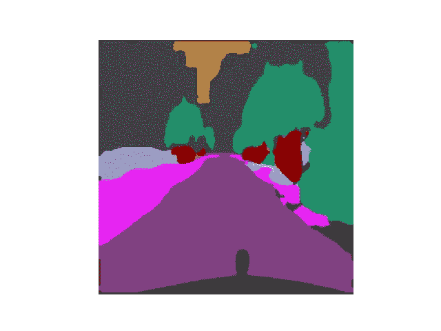
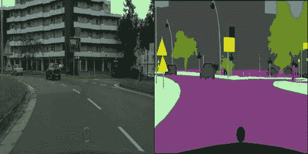
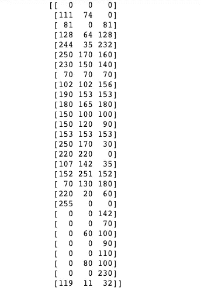
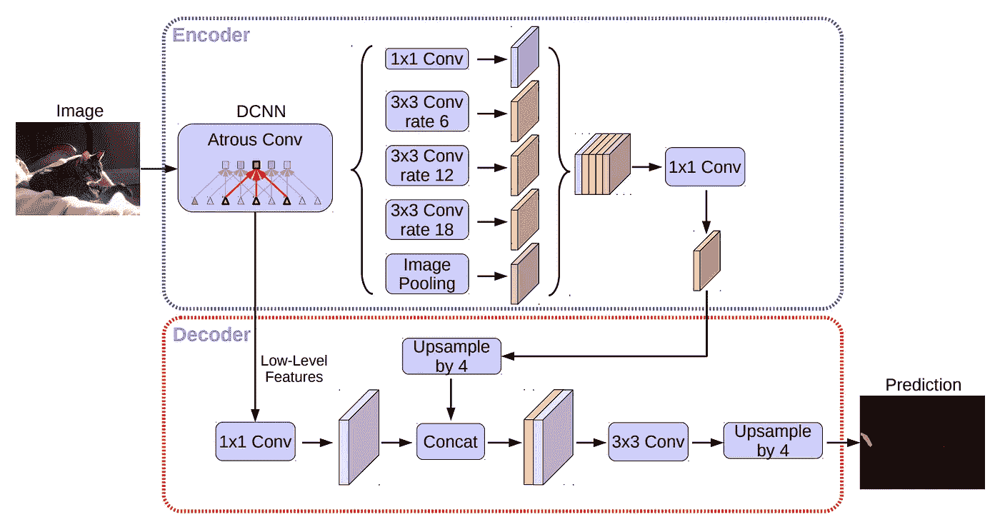
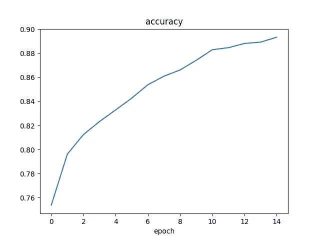
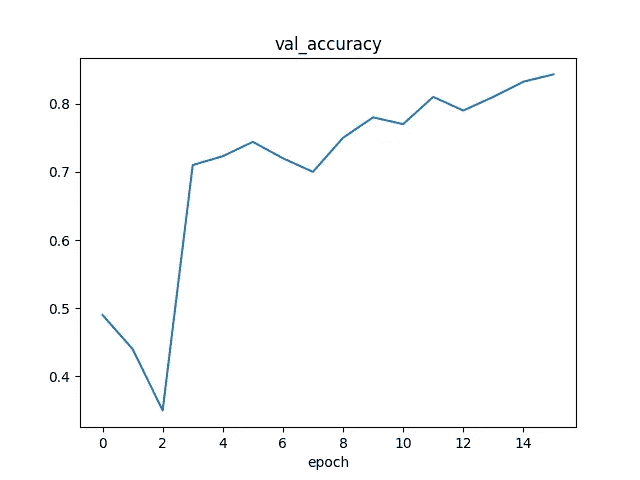
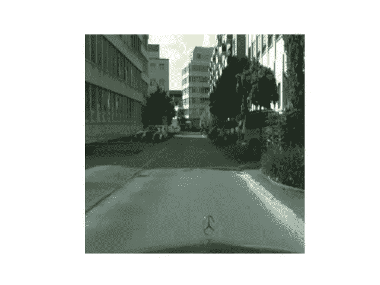

# 机器学习如何帮助视障人士

> 原文：<https://towardsdatascience.com/how-can-machine-learning-help-visually-impaired-people-4fcdc76816b2>

# 机器学习如何帮助视障人士

## 基于 DeepLabv3+的盲人室外障碍物识别方案



作者图片

多年来，我一直是视障人士的志愿者。在刚刚过去的新年前夜，我和一位盲人女士一起出去，这位女士生活了几十年，对她的邻居非常熟悉，但她仍然需要一双眼睛，以防人行道上出现意想不到的障碍:节日后被遗弃的圣诞树，非法停放的汽车，新的工地等。不幸的是，我们的志愿者比需要的少，因此一些盲人不得不等待几次才能有人陪同行走。

因此，我一直在想，当我的视障朋友单独使用机器学习时，我如何建议一种解决方案来帮助他们识别障碍。

在本文中，我提出了一种方法:

1.  使用智能手机捕捉实时图像作为用于对象识别的深度学习模型的输入；
2.  提供语音向导，让视障人士意识到道路上可能存在的障碍。

我现在将为这个项目的重要部分提供更多细节:具有深度学习的对象识别系统。本文用到的所有代码都可以在这个[笔记本](https://colab.research.google.com/drive/13kvfII2amzhcjc1AB40yk1nH8D9dJu3i)里找到。

# 资料组

物体识别系统可以通过语义分割来实现，即对输入图像中的每一个像素赋予语义标签(比如一棵树，一条人行道)。

准备适当的数据集是这项任务的一个重要步骤。

当我在巴黎做志愿者时，我将在[城市景观图像](https://www.kaggle.com/dansbecker/cityscapes-image-pairs)的数据集上训练深度学习模型。原始 cityscapes 数据集可从 cityscapes-dataset.com[获得，该数据集免费提供给学术和非学术实体用于非商业目的，如学术研究、教学、科学出版物或个人实验。](http://cityscapes-dataset.com)

它包含带有 2975 个训练图像文件和 500 个验证图像文件的城市街道场景的标记图像。每个图像文件都是 256x512 像素，每个文件都是原始照片在图像左半部分的合成，在右半部分的旁边是标记的图像(语义分割的输出)。

这是一个图像的例子。



数据集[中的样本城市景观图像](https://www.kaggle.com/dansbecker/cityscapes-image-pairs)

数据集对不同的物体有不同的颜色，我们可以通过快速浏览来快速识别一些颜色:蓝色代表汽车，红色代表行人，绿色代表树木，灰色代表建筑物，等等。

让我们从图像预处理开始。第一项调查得出的结论是，即使是单个图像蒙版也有不止 10K 种不同的独特颜色，因此我们需要一个“getlabel”函数来查找给定调色板中每个像素的最近颜色和有限的颜色值，并将每个颜色与一个标签关联为一个整数。关于更多信息，这个 [Github 库](https://github.com/mcordts/cityscapesScripts/blob/master/cityscapesscripts/helpers/labels.py)提供了颜色标签和相关对象的完整列表。



作者图片:有 29 个颜色值的调色板

以下函数通过以下方式为模型创建训练和验证数据集:

1.分离输入和输出图像；

2.归一化输入图像；

3.将输出图像中的每个像素关联一个整数作为标签。

```
train_images=[]
train_masks=[]
val_images=[]
val_masks=[]

def getlabel(img):
    *"""
    turn a 3 channel RGB image to 1 channel index image
    """* height, width, ch = img.shape
    m_lable = np.zeros((height, width, 1), dtype=np.uint8)
    for w in range(width):
        for h in range(height):
            b,g,r=img[h, w, :]
m_lable[h,w,:]=np.argmin(np.linalg.norm(np.array([r,g,b])-color_palette,axis=1),axis=0)
    return m_lable

def load_images(path):
    temp_img,temp_masks=[],[]
    images=glob(os.path.join(path,**'*.jpg'**))
    for i in tqdm(images):
        i = cv2.imread(i)
        img = i[:, :256]
        img = cv2.normalize(img, None, 0, 1, cv2.NORM_MINMAX, cv2.CV_32F)
        msk = i[:, 256:]
        label = getlabel(msk)
        temp_masks.append(label)
        temp_img.append(img)
    return np.array(temp_img),np.array(temp_masks)train_images,train_masks=load_images(train_path)
val_images,val_masks=load_images(val_path)
```

# 训练模型

在本节中，我们将在 cityscapes 数据集上使用 DeepLabV3+ 构建一个**语义分割模型。**



[DeepLabV3+](https://arxiv.org/pdf/1802.02611.pdf)架构

DeepLab 是一个语义分割架构**，它基于 DeepLab** 和阿特鲁空间金字塔池(ASPP)方案。使用 ASPP 而不是经典池方法的原因是，随着采样率变大，有效过滤器权重的数量变小。

本文给出了 DeepLabV3+的结果，它是 DeepLab 的最新版本，通过添加编码器-解码器结构扩展了它的祖先 DeepLabV3。下面的代码通过构造扩展卷积块来构建 DeepLabV3+,扩展卷积块包含一个卷积层，后跟一个批处理归一化层和 ASPP，后者包含一个平均池、一个 1*1 卷积块、一个上采样层，后跟一系列具有递增扩展速率的卷积块。

```
def convolution_block(
    block_input,
    num_filters=256,
    kernel_size=3,
    dilation_rate=1,
    padding=**"same"**,
    use_bias=False,
):
    x = layers.Conv2D(
        num_filters,
        kernel_size=kernel_size,
        dilation_rate=dilation_rate,
        padding=**"same"**,
        use_bias=use_bias,
        kernel_initializer=keras.initializers.HeNormal(),
    )(block_input)
    x = layers.BatchNormalization()(x)
    return tf.nn.relu(x)

def DilatedSpatialPyramidPooling(dspp_input):
    dims = dspp_input.shape
    x = layers.AveragePooling2D(pool_size=(dims[-3], dims[-2]))(dspp_input)
    x = convolution_block(x, kernel_size=1, use_bias=True)
    out_pool = layers.UpSampling2D(
        size=(dims[-3] // x.shape[1], dims[-2] // x.shape[2]), interpolation=**"bilinear"**,
    )(x)

    out_1 = convolution_block(dspp_input, kernel_size=1, dilation_rate=1)
    out_6 = convolution_block(dspp_input, kernel_size=3, dilation_rate=6)
    out_12 = convolution_block(dspp_input, kernel_size=3, dilation_rate=12)
    out_18 = convolution_block(dspp_input, kernel_size=3, dilation_rate=18)

    x = layers.Concatenate(axis=-1)([out_pool, out_1, out_6, out_12, out_18])
    output = convolution_block(x, kernel_size=1)
    return output

def DeeplabV3Plus(image_size, num_classes):
    model_input = keras.Input(shape=(image_size, image_size, 3))
    resnet50 = keras.applications.ResNet50(
        weights=**"imagenet"**, include_top=False, input_tensor=model_input
    )
    x = resnet50.get_layer(**"conv4_block6_2_relu"**).output
    x = DilatedSpatialPyramidPooling(x)

    input_a = layers.UpSampling2D(
        size=(image_size // 4 // x.shape[1], image_size // 4 // x.shape[2]),
        interpolation=**"bilinear"**,
    )(x)
    input_b = resnet50.get_layer(**"conv2_block3_2_relu"**).output
    input_b = convolution_block(input_b, num_filters=48, kernel_size=1)

    x = layers.Concatenate(axis=-1)([input_a, input_b])
    x = convolution_block(x)
    x = convolution_block(x)
    x = layers.UpSampling2D(
        size=(image_size // x.shape[1], image_size // x.shape[2]),
        interpolation=**"bilinear"**,
    )(x)
    model_output = layers.Conv2D(num_classes, kernel_size=(1, 1), padding=**"same"**)(x)
    return keras.Model(inputs=model_input, outputs=model_output)

model = DeeplabV3Plus(image_size=IMAGE_SIZE, num_classes=NUM_CLASSES)
model.summary()

loss = keras.losses.SparseCategoricalCrossentropy(from_logits=True)
model.compile(
    optimizer=keras.optimizers.Adam(learning_rate=0.001),
    loss=loss,
    metrics=[**"accuracy"**],
)

history = model.fit(train_dataset,validation_data=val_dataset, epochs=15) 
```

这是 15 个训练时期的训练准确度和验证准确度的曲线图。经过 15 次训练，验证准确率达到 84%。



作者图片:准确性(左)与验证 n 准确性(右)

我们可以用这个模型来识别照片中的物体。本文开头有一个模型预测的图像遮罩，有下图。



作者的图像:作为模型输入的原始图像

# 后续步骤

为了说明这个想法，我在非常著名的城市景观数据集上训练了一个模型，该数据集取自驾驶车辆，这在实践中可能是不够的，因为视障者以不同的行为行走。为了避免偏见，最好直接从盲人的智能手机上收集数据。

有了深度学习提供的客观识别，我建议在系统中加入语音引导，只要设备检测到障碍物，就向用户发出警告。

此外，对于盲人来说，知道他们离障碍物有多远也是有用的。我们当然可以用标记数据训练另一个深度神经工作。缺少这样的数据集，我给她一个简单的代数计算，作为利用[针孔相机模型](https://en.wikipedia.org/wiki/Pinhole_camera_model)对用户与物体距离的第一次估算:即图像上物体的大小与现实生活中物体的大小之比，与焦距和到物体的距离之比相同。因此，我们可以通过焦距*实际高度/图像高度来估计距离。

# 结论

在这篇文章中，我给出了一个可能非常幼稚的项目建议，关于我们如何通过深度学习来帮助视障人士。

作为一项重要的任务，外出永远不会是盲人的唯一需求，日常生活中的其他活动有时也具有挑战性:阅读电子邮件、购物、医疗访问等。不幸的是，我们与环境的大多数互动都是通过视觉实现的，我相信人工智能至少可以为盲人消除一部分这种限制。我愿意接受更多的建议和讨论。

# 参考

[1]使用 DeepLabV3+的多类语义分割:【https://keras.io/examples/vision/deeplabv3_plus/ 

[2]用于语义图像分割的阿特鲁可分离卷积编解码器:【https://arxiv.org/pdf/1802.02611.pdf】T4

[3]复习:DeepLabv3 —阿特鲁卷积(语义分割):[https://towardsdatascience . com/Review-DeepLabv3-atrous-卷积-语义-分割-6d818bfd1d74](/review-deeplabv3-atrous-convolution-semantic-segmentation-6d818bfd1d74)