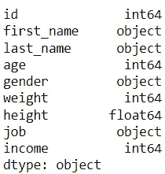
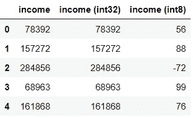
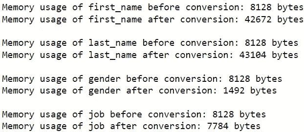
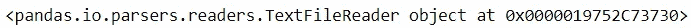
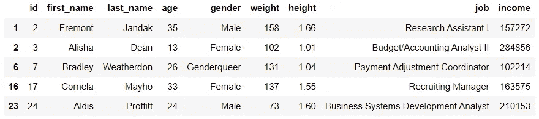

# 熊猫如何应对大数据集？

> 原文：<https://towardsdatascience.com/how-can-pandas-cope-with-big-datasets-c5a08446230>

## 管理大量数据的策略

照片由 Kayla S:[https://www . pexels . com/photo/a-熊猫-笼子里的熊-4444036/](https://www.pexels.com/photo/a-panda-bear-in-the-cage-4444036/)

谈到用 Python 进行数据操作，Pandas 可以说是最受欢迎的模块。它有巨大的效用，包含了大量的特性，并拥有强大的社区支持。

也就是说，Pandas 有一个明显的缺点:它的性能水平随着数据集的增大而下降。

使用 Pandas 处理较大数据集的计算需求会导致长时间运行，甚至可能由于内存不足而导致错误。

虽然追求更擅长处理大型数据集的其他工具可能很诱人，但首先探索可以用来处理 Pandas 大量数据的措施是值得的。

在这里，我们涵盖了用户可以使用 Pandas 来节省内存和处理大量数据的策略。

注:每个策略都将通过由 [Mockaroo](https://www.mockaroo.com/) 生成的假数据集进行演示。

## 1.加载较少的数据

从数据框中移除列是数据预处理中的一个常见步骤。

通常，在加载数据后，这些列会被忽略。

例如，下面的代码加载模拟数据集，然后省略除 5 列之外的所有列。

虽然在大多数情况下这是一种可行的方法，但这是一种浪费，因为您要使用大量内存来加载甚至不需要的数据。我们可以用`memory_usage`函数测量模拟数据集的内存使用情况。

代码输出(由作者创建)

一个更好的解决方案是在数据加载过程中省略掉不需要的列。这将确保内存仅用于相关信息。

这可以通过`usecols`参数来实现，该参数允许用户在加载数据集时选择包含*的列。*

代码输出(由作者创建)

单独包含该参数会显著降低内存消耗。

## 2.使用节省内存的数据类型

只要为相关变量选择适当的数据类型，就可以节省大量内存。

如果用户没有为每个变量显式选择数据类型，Pandas 模块将默认为其赋值。

代码输出(由作者创建)

虽然这是一个很方便的特性，但是就内存效率而言，分配给每一列的数据类型可能并不理想。

减少内存使用的一个关键步骤是手动为变量分配最节省内存的数据类型。

**数值变量的数据类型**

Pandas 模块对数值变量使用 int64 和 float64 数据类型。

int64 和 float64 数据类型提供最大数量和精度的值。但是，反过来，这些数据类型需要最多的内存。

下面是模拟数据集的总内存消耗。

代码输出(由作者创建)

幸运的是，处理较小数值或精度的变量不需要这种消耗内存的数据类型。

例如，在模拟数据集中，较小的数据类型将满足像`age`、`weight`、`income`和`height`这样的变量。让我们看看在为这些变量分配新的数据类型时，数值数据的内存是如何变化的。

代码输出(由作者创建)

转换数据类型的简单操作可以大大减少内存的使用。

**注意**:使用不适应变量值的数据类型会导致信息丢失。手动分配数据类型时要小心。

请注意，`income`列被赋予 int32 数据类型，而不是 int8 数据类型，因为该变量包含更大的值。

为了强调选择正确数据类型的重要性，让我们将数据集中的原始收入值与 int32 和 int8 数据类型的收入值进行比较。

代码输出(由作者创建)

如输出所示，选择错误的数据类型(在本例中为 int8)会改变值，并妨碍任何后续数据操作的结果。

清楚地了解您的数据以及可用数据类型(例如 int8、int16、int32 等)提供的值的范围。)在为感兴趣的变量分配数据类型时是必不可少的。

为了提高内存效率，一个好的做法是在用参数`dtype`加载数据集的同时指定数据类型*。*

**类别变量的数据类型**

通过将分类变量指定为“category”数据类型，也可以节省内存。

作为一个例子，让我们看看在将“category”数据类型分配给`gender`列之后，内存消耗是如何变化的。

代码输出(由作者创建)

显然，这种转换大大减少了内存的使用。

然而，这种方法有一个警告。当“category”数据类型的列包含大量的唯一值时，它会消耗更多的内存。因此，这种转换不是对每个变量都可行的。

为了突出这一点，我们可以检查这种转换对数据框中所有分类变量的影响。

代码输出(由作者创建)

如输出所示，虽然转换后`gender`和`job`列的内存使用较少，但是`first_name`和`last_name`列的内存使用较多。这可能是因为数据集中存在大量唯一的名字和姓氏。

出于这个原因，在为列分配“category”数据类型以节省内存时要小心。

## 3.分块加载数据

对于太大而不适合内存的数据集，Pandas 提供了`chunk_size`参数，允许用户决定每次迭代应该导入多少行。

当给这个参数赋值时，`read_csv`函数将返回一个迭代器对象，而不是一个实际的数据帧。

代码输出(由作者创建)

获取数据需要遍历这个对象。通过将大型数据集分割成较小的部分，可以在不超出内存限制的情况下执行数据操作。

在这里，我们遍历数据集的每个子集，过滤数据，然后将其追加到一个列表中。

之后，我们使用`concat`函数将列表中的所有元素合并在一起，以获得一个完整的数据集。

代码输出(由作者创建)

## 熊猫的局限性

熊猫可能具有处理大量数据的功能，但在“大数据”面前它们是不够的，这些数据可能包含许多千兆字节或兆兆字节的数据。

该模块在 CPU 的一个核心中执行其操作。不幸的是，一旦内存使用和计算需求达到一定的水平，用一个处理器执行任务是不可行的。

对于这种情况，有必要实现类似并行处理的技术，这需要在一台机器的多个内核上运行一个任务。

Python 提供了像 [Dask](https://dask.org/) 和 [PySpark](https://spark.apache.org/docs/latest/api/python/) 这样的库，它们整合了并行处理，使用户能够以更快的速度执行操作。

也就是说，这些工具主要专注于处理数据密集型任务，可能不会提供与熊猫相同的功能。所以，除非必要，否则最好不要依赖它们。

## 结论

照片由 [Prateek Katyal](https://unsplash.com/@prateekkatyal?utm_source=medium&utm_medium=referral) 在 [Unsplash](https://unsplash.com?utm_source=medium&utm_medium=referral) 上拍摄

虽然 Pandas 主要用于中小规模的数据，但对于使用稍微大一点的数据集的任务，不应该避开它。该模块具有帮助容纳更大量数据的特征，尽管程度有限。

Pandas 库经受了时间的考验，仍然是数据操作的首选库，所以除非万不得已，否则不要急于跳到其他解决方案。

我祝你在数据科学的努力中好运！