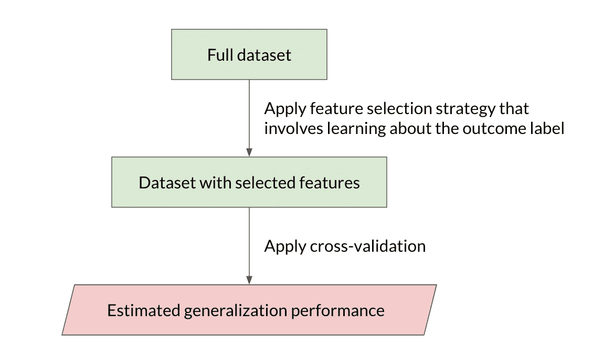
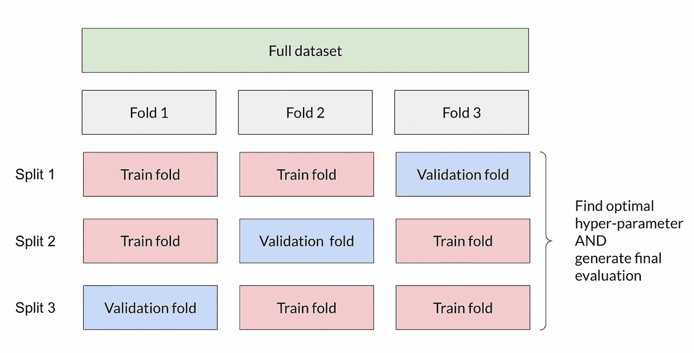
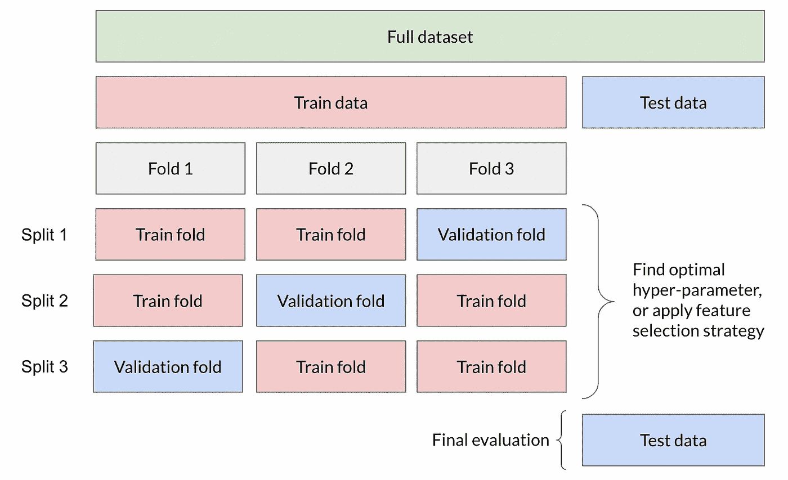

# 交叉验证如何出错以及如何修复

> 原文：<https://towardsdatascience.com/how-cross-validation-can-go-wrong-and-how-to-fix-it-feature-selection-use-case-with-sample-code-abf928be9080>

## 带有示例代码的特性选择用例

在 [Unsplash](https://unsplash.com?utm_source=medium&utm_medium=referral) 上拍摄的 [ThisisEngineering RAEng](https://unsplash.com/@thisisengineering?utm_source=medium&utm_medium=referral)

交叉验证是一种重采样过程，用于估计机器学习模型在有限数据集上的性能。该程序通常用于优化模型的超参数和/或评估最终模型的性能。然而，程序设计中有许多细微差别，可能会使获得的结果不太可靠，甚至是错误的。

假设您正在处理包含数百个要素的表格数据的分类问题。您决定根据其对应的带有结果标签的方差分析 f 统计来选择要素。

# **它是如何出错的——场景 1**

首先对整个数据集执行要素选择策略，选择具有最高 f 统计值的前 k 个要素(其中 k 是任意数字)。之后，您决定进行交叉验证，并将带有所选特征的数据输入 CV 循环，以评估模型性能。

在 CV 之前对整个数据集执行特征选择会导致数据泄漏。图片作者。

这里你犯了数据泄露的错误。由于您执行的选择策略涉及了解整个数据集的结果标签，因此模型在训练期间可以使用有关验证集的知识，尤其是结果标签。这给了模型一个不切实际的优势来做出更好的预测，这在实时生产中是不会发生的。

# **它是如何出错的——场景 2**

您希望选择 f 统计的 p 值小于特定阈值的要素，而不是选择任意数量的要素。您认为 p 值阈值是一个模型超参数，您需要对其进行调整以获得性能最佳的一组要素，从而获得性能最佳的模型。

由于 CV 以超参数优化而闻名，因此您可以通过对整个数据集执行该过程来评估一组不同的 p 值阈值。问题是，您使用这个 CV 估计值来选择最佳 p 值阈值(因此是最佳的特征集)和报告最终的性能估计值。

在同一个 CV 循环中将超参数调整与模型评估相结合，会导致对模型性能的乐观偏置评估。图片作者。

当结合超参数调整和模型评估时，用于评估的测试数据不再是统计上的纯数据，因为它们已经被模型在调整超参数时“看见”。超参数设置保留了现在形成测试分区的数据的部分“记忆”。每次在样本集上评估具有不同超参数的模型时，它都会提供有关数据的信息。关于数据集上的模型的这种知识可以在模型配置过程中被利用，以找到数据集的最佳执行配置。超参数可以通过利用样本的无意义的统计特性来调整。换句话说，每当在有限数据样本上评估的泛化性能的 CV 估计被直接优化时，超参数调整中的过拟合是可能的。CV 程序试图减少这种影响，但它不能完全消除，特别是当数据样本很小且要调整的超参数数量相对较大时。因此，您应该期望在以这种方式获得的性能估计中观察到乐观偏差。

# **如何修复**

只有当分类器训练的各个方面都发生在 CV 循环内部时，CV 方法才被证明是无偏的。这意味着训练分类器的所有方面，例如特征选择、分类器类型选择和分类器超参数调整都发生在每个 CV 循环期间没有遗漏的数据上。在某些方面违反这一原则会导致对真实误差的非常有偏差的估计。

> 在场景 1 中，特征选择应该已经在每个 CV 循环中完成，以避免数据泄漏。

为了避免不希望的乐观偏差，模型评估必须被视为模型拟合过程的一个组成部分，并且每次模型拟合到新的数据样本时都要重新进行。

> 在场景 2 中，模型性能应该在一个完全不可见的测试集上进行评估，该测试集在超参数优化期间没有被触及。如果你的数据很小，以至于你不能负担一个单独的坚持集，那么应该使用嵌套 CV。具体来说，内部循环用于超参数搜索，外部循环用于通过在几个数据集分割上平均测试集分数来估计泛化误差。

模型性能应在超参数优化过程中未触及的完全不可见的测试集上进行评估。图片作者。

如果你负担不起一个单独的保持测试集，应该使用嵌套 CV。内环用于超参数搜索，外环用于估计泛化误差。图片作者。

## 嵌套 CV 的代码片段

Scikit-learn 确实有现成的方法来支持嵌套 CV。具体来说，你可以在内环使用`GridSearchCV`(或`RandomSearchCV`)进行超参数搜索，在外环使用`cross_val_score`估计泛化误差。

为了说明嵌套 CV 下发生了什么，下面的代码片段没有使用这些外壳方法。如果您希望实现的评分策略不被`GridSearchCV`支持，这个实现也会很有帮助。然而，这种方法只有在搜索空间很小的情况下才有效。对于更大的超参数搜索空间，Scikit-learn CV 工具是一种更整洁、更有效的方法。

# **值得注意的问题 1:如果我们在 CV 循环中应用特征选择策略，在生产模型中使用哪个特征集？**

由于训练/测试分割的随机性，当我们在 CV 循环中应用特征选择策略时，很可能为每个外部循环找到的最佳特征集略有不同(即使模型性能可能在运行中几乎相同)。接下来的问题是:在生产模型中应该使用哪一组特性？

要回答这个问题，请记住:

> 交叉验证测试的是一个过程，而不是一个模型实例。

本质上，我们使用 CV 来估计整个模型构建过程在未来未知数据上的表现，包括数据准备策略(例如插补)、特征选择策略(例如用于单向 ANOVA 检验的 p 值阈值)、算法选择(例如逻辑回归 vs XGBoost)和特定算法配置(例如 XGBoost 中的树数)。一旦我们使用 CV 选择了获胜的过程，我们将对整个数据集执行同样的最佳执行过程，以得出我们的最终生产模型。CV 中的拟合模型已经达到了性能评估的目的，现在可以丢弃。

从这个意义上说，将获胜过程应用于整个数据集所输出的任何特征集都将在最终的生产模型中使用。

# 值得注意的问题 2:如果我们在生产模型的所有可用数据上训练一个模型，我们如何知道该模型将执行得有多好？

继续问题 1，如果我们将通过 CV 找到的最佳执行过程应用于整个数据集，我们如何知道生产模型实例将执行得有多好？

如果设计良好，CV 会给出性能度量，描述根据所有历史数据训练的最终模型的总体性能。您已经通过使用模型评估的 CV 程序回答了这个问题！这就是为什么确保你的简历程序设计得当是至关重要的。