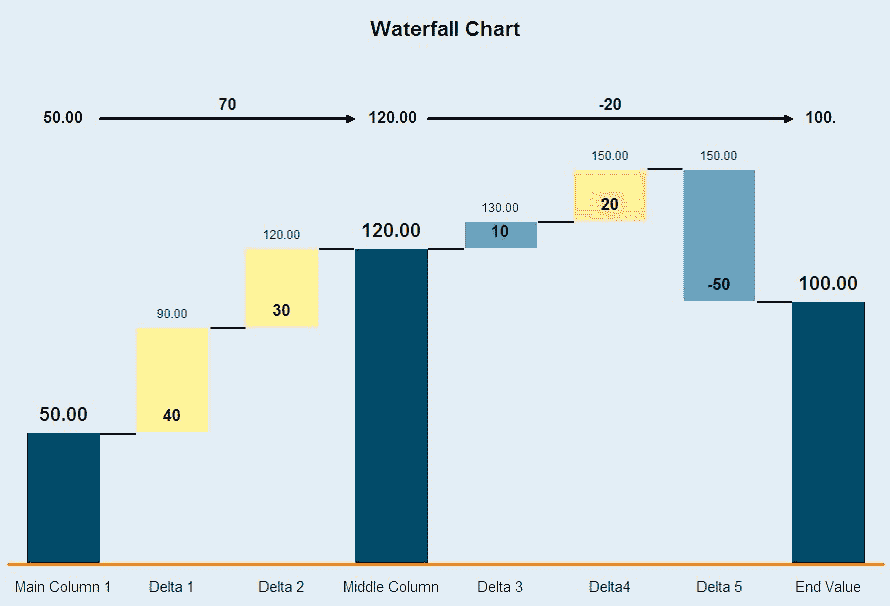

# 数据和财务团队如何成为朋友(而不是敌人)

> 原文：<https://towardsdatascience.com/how-data-and-finance-teams-can-be-friends-and-stop-being-frenemies-7ecc357f51ef>

## *实用数据领导者系列的第一部分*

*照片记入*[juv art](https://www.shutterstock.com/g/JUVART)*via Shutterstock。*

最近，我写了一篇关于在整个组织中形成的[数据孤岛](https://medium.com/towards-data-science/where-data-silos-live-in-your-organization-f51ecdd90809)的文章，这通常是由于缺乏与合作伙伴的合作。这种一致性可能很难实现，但对数据领导者的成功至关重要。事实上，你可以说这种一致性对于经理级别及以上的任何数据科学家或工程师来说都是最重要的任务。

由于要支持一系列内部客户，数据团队可能会倾向于遵循装配线的原则，甚至是麦当劳的油炸厨师。每个人都吃同样的奶酪汉堡，只加两份泡菜。点菜吧。

但是，最好的数据团队能够解决不同合作伙伴(财务、产品、营销等)的问题，在他们所在的地方用定制的数据产品满足他们，这些产品超越了通用的现成解决方案。

这是一个关于与每个部门合作的最佳实践以及他们所有奇妙的怪癖的系列文章的第一篇。

这些挑战和摩擦点往往会超越行业和垂直领域，因为尽管数据类型或特定系统可能会有所不同，但每个部门的主要目标并没有变化(行为在很大程度上受激励因素的影响)。例如，在大多数公司，营销团队需要推动增长，财务团队需要为此做预算，数据团队需要衡量增长。

我们将从财务团队开始，深入探讨数据团队如何在优先级交叉的地方与他们协作。虽然这是为中型公司编写的(大约。1，000 到 5，000 名员工)利用现代数据堆栈，这些项目和技巧中的许多都可以根据您组织的特定需求进行调整。

# 将赢得您的财务团队的项目

在这里，我将主要关注战略财务或 FP&A 项目，如混合财务和非财务指标，以告知业务增长；策略；和投资。这是我看到与财务团队合作的大部分项目的地方。

另一方面，财务会计(如税务、工资)往往存在于一系列系统中，这些系统大部分都在数据平台之外，这没关系。

## **财务报告**

如果你是一家上市公司或即将进行首次公开募股，数据团队很可能会与财务部门合作，向华尔街提交季度报告，并附带收益电话会议的数据。

为了实现这种报告，数据团队将管理复杂的管道，将来自商务系统的交易数据转换为客户级数据，详细说明特定的客户关系或购买的产品以及相关的收入。

财务团队将首先关注可靠性；没有一个首席财务官愿意重述季度收益。我发现这是少数几个可以精确测量准确性的地方之一，使用总账作为事实的来源。财务团队对准确性有很高的标准，因为他们对定期报告的每一分钱都负有责任——希望他们支持团队的分析数据标准不会降低。

数据应该有多及时？理想情况下，相同的数据可以被查询并用于每天的财务分析和报告。但最好是把准确性放在及时性之上，有可能提供独立的实时销售视图，而不需要精确到一分钱。

推而广之，首席财务官将关注财报中可能推动业务增长的相关数据，如日活跃用户(dau)、应用下载量或浏览量。准确性在这里往往更加主观——依赖于您对“用户”、“活跃”和“视图”的定义定义必须清晰、合理，并且在一段时间内保持严格的一致性，这样你才能对不同时期的趋势充满信心。换句话说，数据应该(至少)是方向准确的。

不言而喻，[数据可观察性](https://www.montecarlodata.com/blog-what-is-data-observability/)对于这些指标至关重要。您必须主动检测可能影响输出完整性的输入数据性质的任何变化。季度末的周转时间很紧，您不希望在编译和交付这些报告时发现数据问题。

## **预测和增长驱动模型**

财务团队的真实预测。一旦数据团队支持财务报告，下一个合乎逻辑的步骤就是合作预测未来季度—销售、获得的新客户、客户流失。

数据团队可以提供关于正确建模方法的专业知识，但你可能会发现，你的财务同事更喜欢更简单的经验方法，而不是更精确但更难解释的模型，这使他们更容易调整假设、输入和模型参数。

当一个预测被错过时，你将希望能够快速诊断出原因，并生成广受欢迎的[瀑布图](https://en.wikipedia.org/wiki/Waterfall_chart)。这些图表如此有效的原因是它们可以传达预测中不同类型的不确定性，如环境导致的差异、客户行为导致的差异以及无法解释的或随机的差异。

维基百科中瀑布图的一个例子。

虽然预测是一种操作机制，但它的战略对应部分是增长驱动因素的建模。数据团队应带头进行建模练习，探索与增长相关的最重要的产品和营销杠杆(即客户获取和保留)。

虽然这些模型在本质上是历史性的，但如果做得好，它们会暗示因果关系。例如，[分析可能显示，如果我听许多不同流派的音乐](https://research.atspotify.com/2020/12/algorithmic-effects-on-the-diversity-of-consumption-on-spotify/)，我更有可能保留我的 Spotify 订阅，但这是 Spotify 可以通过干预产品体验来影响的行为吗*增加我的参与度和保留的可能性*？

将这些模型与后续产品实验配对可以巩固这种因果关系。使用上面的例子，Spotify 可能会试验发现算法的类型多样性，以观察像我这样的客户是否会在算法编程更加类型多样化时增加他们的参与度和保留度。

对于财务团队来说，这些模型在规划业务的长期增长情景、告知如何为产品和营销指标设定目标以逐步实现增长目标方面特别有用。

## **营销归因和组合**

通常，当谈到营销支出问题时，您会遇到营销(确定在哪里以及如何花钱)、财务(确定预算和盈利能力)和数据(确定如何衡量投资回报率)三驾马车。

鉴于平台“围墙花园”和第三方 cookie 的消亡，数据团队是否仍在尝试提供多点触摸属性，或者这已经成为一个不可行的方案？我见过数据团队在高管的命令下追逐完美归属的圣杯，却因跟踪限制而功亏一篑。

[营销组合建模(MMM)](https://en.wikipedia.org/wiki/Marketing_mix_modeling) 一直是我解决支出、渠道组合和投资回报问题的首选方法，使用时间序列模型来提供数字和非数字营销渠道的整体视图，说明如果营销支出从等式中移除，超出预期基数的增量销售额。

然后，您可以专注于每个营销渠道内的单个客户归属，以优化特定的优惠和信息，而无需尝试跨多个外部渠道跟踪客户。

## **定价、优惠&终身价值(LTV)**

在营销团队和财务团队之间，有一些关键的定价决策——不同产品的价格点是什么，可以提供哪些有利可图的折扣，以及何时提高现有客户的价格？

早期的伙伴关系可能是围绕定价实验，将这些决策从行政猜测领域转移到一系列定价实验，在这些实验中，成功的衡量超出了最初的销售，以考虑客户保留和终身价值(LTV)。

通常，财务团队将根据客户保持率的综合假设，针对特定的活动或客户群对这一 LTV 指标进行建模。随着合作关系的巩固，数据团队的一个高影响力项目是将 LTV 的衡量从营销活动或团队层面转移到个人客户层面，纳入您对影响客户流失和追加销售的客户行为的了解。

然后，这些 LTV 分数可以存在于数据仓库中，并容易地应用于未来的实验和分析。一旦他们看到你可以衡量他们的定价策略的粒度，财务团队就会带着更多的假设回来进行测试。

# 与财务团队合作的成功秘诀

财务团队可能是数据团队最具战略意义的合作伙伴之一。关键是了解他们对数据准确性的存在需求，这种需求如何影响项目交付预期，如何最好地丰富他们记录系统中的数据，以及在这样做的过程中，如何与他们合作进行变革性的数据项目。请记住:

## **1。准确性和一致性至关重要**

财务指标必须符合高标准的准确性，非财务指标必须始终一致，以便在财务建模和报告中有用。

准确性长期以来一直是宝贵的“数据质量维度”之一，但很少有数据产品可以客观地说明数据是准确的还是不准确的。财务数据是一个罕见的例外，在这种情况下，您的收入分析报告可以与总帐进行核对。

这里的关键是围绕金融数据产品的使用设定期望值。如果它用于外部报告，那么您可能需要在指定的时间窗口内精确到总账的每一分钱。另一方面，如果您打算将财务数据产品用于日常分析或建模，那么您的财务合作伙伴可能会接受较低的精确度，而倾向于更精细或及时的数据。

## **2。需求收集至关重要**

你可能需要改变你的敏捷原则，使之更接近瀑布方法，因为在数据可靠性标准得到满足之前，发布是不可能的。

虽然敏捷过程将包括需求收集，但我发现在里程碑日期交付什么存在一定程度的不确定性。另一方面，财务团队要遵守严格的报告窗口，需要高度确定他们可以依赖哪些数据进行报告。

不可避免的是，新的数据产品或财务报告的变化将需要与现有流程并行运行一段时间，以建立对其准确性和可靠性的信心。

出于这些原因，您可能仍然能够运行敏捷流程，但是要准备好设置清晰的时间表和交付预期，以与财务团队的报告节奏保持一致。

## **3。嵌入优于移交**

如果您可以在项目中嵌入一名财务团队成员，这将极大地改进业务规则和指标定义的翻译。

对于数据和财务团队来说，坐在地板的相对角落，来回抛出需求和解决方案，当另一个团队没有按照预期的里程碑交付时抱怨是很有诱惑力的。你可以连续几周坚持不懈地捕捉财务报告的详细要求，结果却错过了一些导致失败的关键细节。

毫不奇怪，更好的方法通常是在项目期间嵌入主题专家。您将看到互惠互利:数据工程师将能够与专家合作，定义业务规则和对数据的期望，财务团队将更好地理解构建可靠和值得信赖的数据产品所涉及的技术复杂性。

## **4。将数据处理带到上游**

Excel 可能已经(很久以前)将其行限制增加到 2 ⁰，但是您可以处理仓库中更重的工作负载，并将财务逻辑从群组级别移动到客户级别。

众所周知，财务团队构建多层电子表格来支持业务运营，从粒度数据开始，嵌入复杂的逻辑来提供每周的业务绩效与预测报告。

数据团队可以与财务部门合作，详细阐述假设、输入和输出，使您能够在数据仓库中向上游运行这些计算，您可以在数据仓库中存储重要的业务逻辑、预计算场景，并开始在流程中引入更多自动化。

这样，您就可以用可配置的仪表板代替电子表格，减轻财务合作伙伴(和笔记本电脑)的负担，并在流程中对数据管道引入更强的质量控制。

## **5。经验模型可能是首选**

在你向财务团队交付一个黑盒模型来预测客户流失之前，确保当他们需要每周调整假设时，这个模型对他们有用。

数据团队通常会发现一个问题，例如预测客户流失，并根据数十或数百个预测因素，匆忙应用高级技术来模拟每个客户流失的可能性。但这是你的财务合伙人想要解决的问题吗？它能满足他们的日常需求吗？

如果他们预测每周将有多少客户流失，那么您最好使用一个更简单的模型，根据任期应用观察到的或预期的流失率，或许还有一两个其他关键预测因素，以便财务团队可以轻松管理和调整预测。

记住这些事情，你会很快成为财务团队的朋友。

[关注媒体上的我](/@shane.murray5),了解更多关于数据领导力、数据科学应用和相关主题的故事。[订阅](/subscribe/@shane.murray5)，让我的故事发送到你的收件箱。