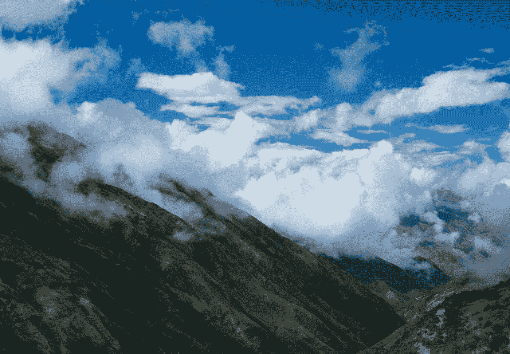
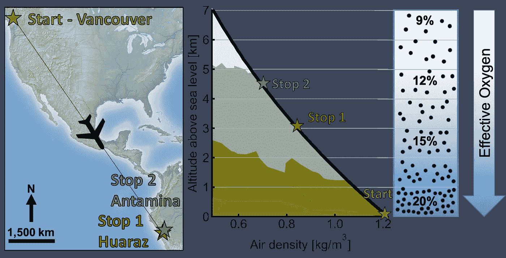
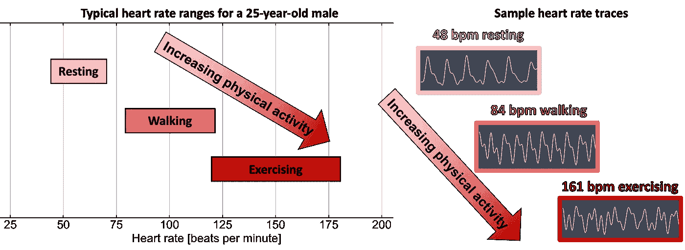
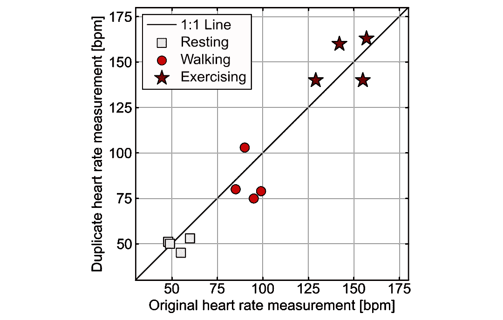
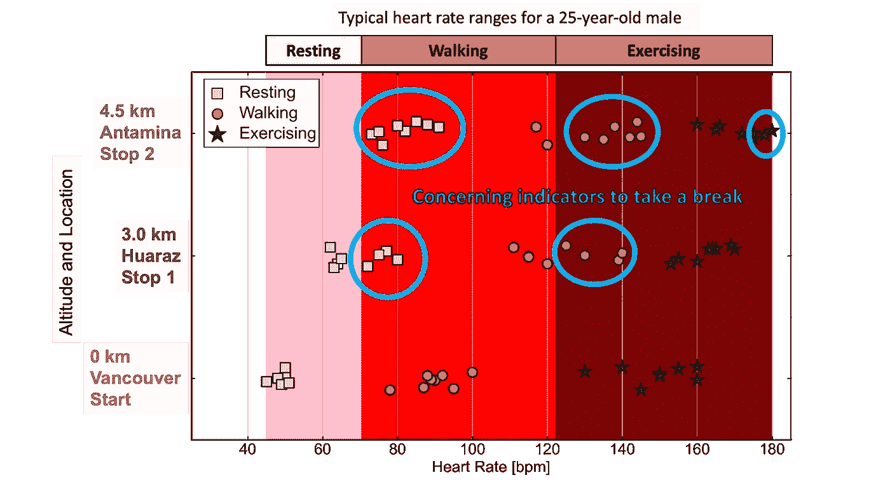

# 数据如何帮助我适应 4500 米的高海拔

> 原文：<https://towardsdatascience.com/how-data-helped-me-acclimate-to-a-very-high-altitude-of-4-500-m-f7356311f281>

## 关于如何利用数据为现实生活决策提供信息的快速、实用的方法

安娜·冈察洛娃在 [Unsplash](https://unsplash.com?utm_source=medium&utm_medium=referral) 上的照片

# 介绍

为了工作，我打算从加拿大温哥华到秘鲁的安塔米纳矿，在秘鲁的瓦拉斯停留 4 天以适应环境。4500 米的上升高度使空气密度下降了近 50%，这比 8000 公里的飞行更让我担心，因为有效氧气几乎是我在海平面所习惯的一半。这种数据很容易在网上找到(我在这里使用的是来自[的数据](https://www.engineeringtoolbox.com/air-altitude-density-volume-d_195.html)),在下图中直观地显示出来，可以清楚地了解正在发生的事情。

三个主要位置的地图(左)和一个显示空气密度和可用氧气如何随高度降低的图形(右)。作者图片

除了同样的缓慢上升的一般攀岩技巧，这不是我的选择，我在网上找不到太多的建议。处理数据是我最擅长的，所以我决定下载一个心率监测应用程序，并记录我的经验，以帮助其他人寻找适应高海拔的实用技巧。

下面是一个关于我如何使用数据来准备和动态调整到非常高的高度的故事。使用数据为现实生活决策提供信息的一般工作流程也可以应用于其他情况，如准备跳伞或水肺潜水。

# 准备和方法

我的研究显示，跟踪我的心率将是我整个旅程的关键，因为我的心脏需要更努力地工作，才能将有限的氧气输送到全身。我查看了一名 25 岁男性在我跟踪的三种身体活动状态下的典型心率范围:

*   休息:平躺在床上
*   步行:测量前步行 3min
*   锻炼:测量前做 50 个俯卧撑

如下图所示，我发现了我必须注意的限制。也做了一些测试，测了心跳，检查是否在推荐范围内。

一名 25 岁男性在三种基本活动下的典型心率范围(左)和应用程序在海平面上每次活动的心率轨迹(右)。

首先，我需要测试应用程序，并确保我得到一些可重复的结果。我在三种身体活动状态下测量了四次我的心率，并复制了我的测量结果，看它们如何比较。该应用程序测量约 10 秒钟，并以每分钟心跳数(bpm)为单位报告心率。

如下图所示，这款应用的可重复性非常好，足以满足我的需求，我对结果非常满意。正如预期的那样，可变性随着要求更高的活动而增加，因为有更多难以控制的变量，如行走或锻炼的速度。

app 在海平面上三种不同身体活动状态下的心率测量重复性结果，单位为每搏。

# 应用

首先，我确认我的心率在海平面的指导范围内，事实上，它比所有活动状态的平均值都要低一点，如下图所示。在每次停车时，如果我感到喘不过气来，我会检查我的心率，每当我超过既定的基线时，我就会停下来休息一下。我不得不在矿井中做一些体力劳动，并定期测量我的心率，我能够安全地这样做，并根据需要休息。

在海平面、海拔 3.0 公里和海拔 4.5 公里处测量的每次活动的心率。25 岁男性每次活动的典型范围已在背景中标出，关于心率测量值超过安全指南的部分用青色圈出。

我越往上走，氧气越少，日子就越难过。从海平面到海拔 4.5 公里，我的平均静息心率增加了近一倍。有时，当我认为我不需要使用我的心率并忽略这些数据时，我会很快感到头晕目眩。最终，我习惯了，对自己的极限有了很好的理解，但是利用这些数据，我能够快速安全地到达那个点。

随着我继续适应，我的心率逐渐下降。不幸的是，我没有测量它是如何在那个高度随时间调整而下降的，但是这些数据也会提供一些清晰的见解。

# **经验教训在 4500 米高度存活并茁壮成长**

适应海拔 4.5 公里的环境仍然是一个挑战，尽管我从心跳数据中获得了有用的信息。研究和阅读其他到过高海拔地区的人的故事是非常有用的，因为我能够从他们的经历中学习并更好地准备。在我住院期间，我一直调整得更好，大约一周后，我完全停止了测量我的心率。

这是一个简短的视频，我在海拔 4.5 公里的安塔米纳矿不仅幸存了下来，而且还茁壮成长，这多亏了一点点数据。

 [## LinkedIn 上的福阿德·法拉杰:在安塔米纳矿的可怕经历:来自露天煤矿、钻孔和爆破

### 在安塔米纳矿的可怕经历:从露天开采，钻孔和爆破，挖掘和装载(与最好的挖掘机操作员…

www.linkedin.com](https://www.linkedin.com/posts/fouadfaraj_awesome-experience-at-antamina-mine-from-activity-6876515224803962881-cipA) 

# 简短的笔记

时刻考虑如何在生活任务中利用数据帮助自己！想出创造性的方法来使用数据并将其应用到决策中是非常有趣的。记录并与他人分享知识也是一种很好的体验，对将来做类似事情的人很有帮助。

***来自《走向数据科学》编辑的提示:*** *虽然我们允许独立作者根据我们的* [*规则和指导方针*](/questions-96667b06af5) *发表文章，但我们不认可每个作者的贡献。你不应该在没有寻求专业建议的情况下依赖一个作者的作品。详见我们的* [*读者术语*](/readers-terms-b5d780a700a4) *。*