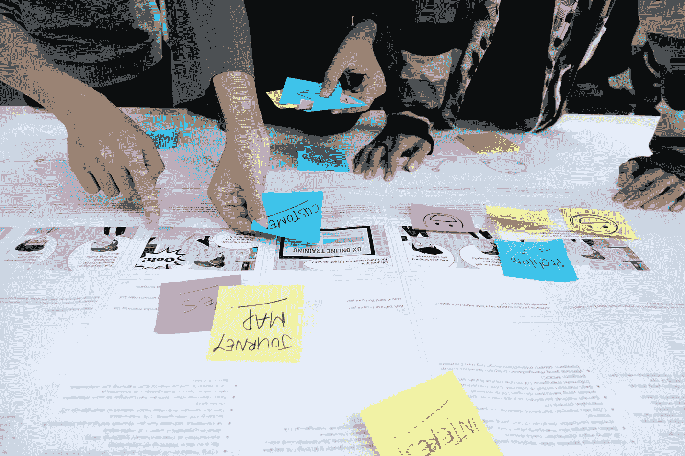
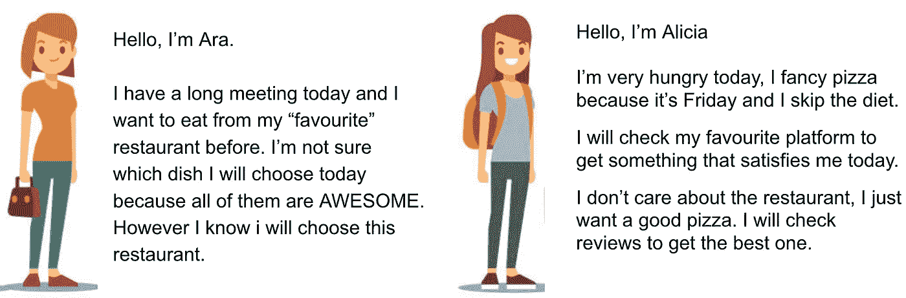
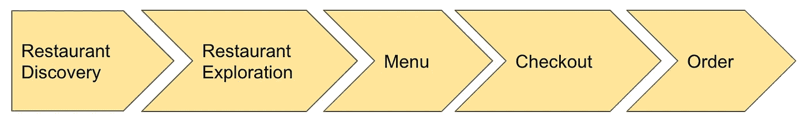
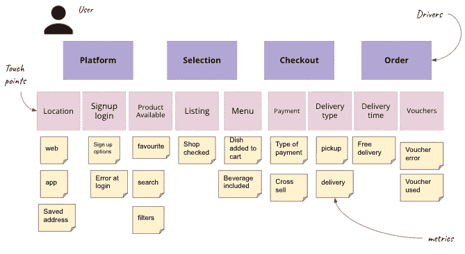

# 数据科学家如何从细分项目的用户故事映射中获益

> 原文：<https://towardsdatascience.com/how-data-scientists-can-benefit-from-user-story-mapping-for-segmentation-projects-5ae7c9b9cda2>

## 在我们的细分或建模中，数据科学家如何从用户故事写作和产品发现映射中受益？

图片来自 [Unsplash](https://unsplash.com/photos/w00FkE6e8zE)

在产品开发领域，许多技术被用来区分新想法或新特性的优先级，以改进产品、修复 bug 或更新需求，等等。其中一些技术被用于管理团队冲刺，但是其他的对于特性工程也是有用的。在这种情况下，我想向您展示我是如何使用用户故事写作和映射来开发行为细分的。但是让我们从头开始。

**什么是用户故事映射？**

> [用户故事映射](https://en.wikipedia.org/wiki/User_story)是产品发现中使用的技术:概述新产品或现有产品的新功能。它包括一个视觉练习，帮助产品经理和他们的开发团队定义将改善用户体验的工作。

结果有助于保持对大的产品图片的关注，同时还提供所有的细节。

在开发细分市场时，我们的数据科学团队遇到了一个业务问题，即根据客户在平台中的意图来划分客户。**但是如何开始呢？**

对于一家跟踪数百个前端事件的电子商务公司来说，选择最重要的事件至关重要。我们显然可以使用传统的方法:

*   数据发现
*   数据准备和特征创建
*   模型开发和评估
*   误差分析
*   从头开始重复，以击败性能

但是我们也可以使用*用户故事写作*来加速这个过程，在这里我们可以关注用户视角的功能和价值。

一个**用户故事**将会是:

> 作为一个…(人物角色)我想…(功能)为了…(原因/用户愿望)

现在让我们转到我们的行为细分。想象一下，我们处于一个食品配送行业，我们希望为点餐时有不同意图的客户创建细分市场:

用户故事示例 1 —作者提供的图片

我们在这里看到两个目标相同的场景: ***点餐*** 。但是我们如何找到解释每种行为的最佳特征呢？

作为数据科学家，一些团队在跟踪系统如何在其公司中工作方面比其他团队更有经验，而且很难理解所有可用的功能。在我的例子中，为了避免问题，并确保我可以从我的细分中得到最好的用户故事，我还包括了故事映射。

# 该过程

**首先**，我开发了我所有的用户故事(如上图所示)，并在文本中提供了足够的上下文，以便它可以映射到我们在平台上的用户旅程。

**其次**，我在同一间屋子里聚集了一群公司前端跟踪的专家:*产品分析师*。他们不断地与团队合作来改进跟踪，创建最好的产品报告和仪表板，产品经理可以在其中找到差距或机会来改进产品/功能，或者只是通过 AB 测试来查看他们上一个版本的执行情况。

有了我的故事和人之后，我们为我们的产品定义了用户旅程的主要步骤。示例:

作者图片

接下来，我们包括了用户应该遵循的必要接触点，以便完成主要驱动因素。例如，餐馆发现包含家庭、添加位置、注册、所有可用餐馆列表、搜索、过滤器等。或者像下图，平台包含位置和报名。

用户故事映射示例—按作者分类的图片

根据我们有多少用户故事，将专家分成相同的小组，并将每个小组分配给一个用户故事。他们的目标是:

> 确定将您的故事映射到您的数据所需的指标

一旦在每个接触点下写下了所有的度量标准(比如用户故事映射示例中的度量标准)，那么他们必须在每个流程步骤列中对每个任务进行优先级排序。这个想法是在以后选择我们需要的“最小数量的事件”来解释用户行为。一些小组可能比其他小组有更多的任务，但这没关系。

该练习将通过从不同组的最小值项目中收集所有事件来结束。有了新列表，数据科学家可以开始发现数据并从中创建特征，这将加快细分的特征选择部分。

可能在发现部分，一些数据由于质量差、缺少太多值或任何其他问题而不符合使用条件。但是不要担心，记住在我们的映射中任务是有优先级的，所以如果没有足够的特性，可以在最小值选择之后从各自的列中取出一些。

> 这也可以应用于我们想要开发的任何模型，以加快我们的特征选择知识。

# 概述:

1.  定义要涵盖的不同场景
2.  组建专家小组，以便他们能够涵盖每种情况
3.  在我们应用程序的用户旅程中，将每个用户行为映射到事件或数据
4.  对每个步骤进行优先级排序，并选择解释用户行为所需的最少事件
5.  组合所有事件，供数据科学家用作分段或建模的特征

我希望你觉得有趣，请张贴任何意见或问题，我很乐意帮助你，并根据我的经验提出建议。随时**关注我** [**上媒**](https://medium.com/@ana90isabel) 或 [**LinkedIn**](https://www.linkedin.com/in/ana-casado-41908884/) 连接。