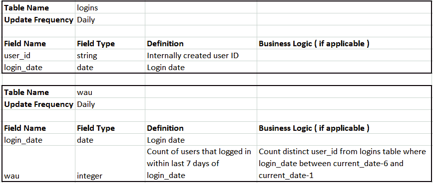

# 数据科学家如何通过数据集市减少数据争论的时间

> 原文：<https://towardsdatascience.com/how-data-scientists-can-reduce-data-wrangling-time-with-a-data-mart-809eefbe0bc2>

## 什么是数据集市，为什么数据科学家应该使用数据集市

照片由[马頔·瓦尔科夫](https://www.pexels.com/@dima-valkov-1186343/)从[派克斯](https://www.pexels.com/photo/pie-on-a-plate-3740245/)拍摄

作为一名数据科学家，你可以花多达 [80%的时间清理和转换数据](https://www.infoworld.com/article/3627276/data-science-needs-drudges.html)，以便生成可操作的见解，并构建机器学习模型来创造业务影响。现在想象一个世界，你可以花更多的时间在分析和模型开发上，而不是清理数据。通过将[数据集市](https://www.snowflake.com/guides/difference-between-data-warehouse-and-data-mart)定义为为特定用户组或业务单位开发的数据仓库中的数据子集，这可以成为现实。

## 介绍

当我刚开始做数据科学家时，数据仓库中只有原始数据，没有 ETL 管道来创建一个可以用来查询客户信息的集中式表。每当我需要客户数据时，我都必须将多个表连接在一起，并应用适当的业务逻辑。每次分析都要重新运行，这是很乏味的。最终，我将这些频繁的查询放入 ETL 管道，并创建了一个分析数据集市，帮助我将数据清理和准备时间减少了 50%以上。现在您已经知道了拥有数据集市的好处，让我回顾一下我用来建立数据集市的过程，以及如何在您的公司中应用它。

## **1。确定数据集市的业务单元和用户**

目标用户将使用数据集市来回答业务单元中利益相关者的问题。例如，您可以构建一个数据集市来回答产品经理关于用户行为和参与度的问题。数据集市的用户可以是数据科学家，也可以是产品涉众的数据分析师。

## **2。创建数据集市将用来回答的问题列表**

这将决定数据集市中的数据类型。例如，产品数据集市需要回答关于每日注册数、每周活跃用户数和产品 A/B 测试结果的问题。我建议从一个常见的问题列表开始创建数据集市的初始版本，然后根据需要添加表。

## **3。数据集市表的文档模式**

在模式文档中包含尽可能多的信息，因为如果将来有人对数据有疑问而不是问你，它可以用作参考。添加读入数据时需要应用的任何业务逻辑，如过滤器和转换逻辑，以及记录所需数据的时间范围和更新频率。按照步骤 2 中的产品数据集市示例，我们需要使用与注册、产品行为和用户实验相关的数据源。

下面是一个用户表模式的例子，我指定表应该每天更新。这是一个重要的细节，因为它将允许数据工程师多久调度一次 ETL 作业，并允许查询数据的用户知道数据多久更新一次。

我列出了 5 个字段，包括字段名、字段类型和要应用的业务逻辑(如果适用的话),比如从电子邮件地址中删除空格，并通过从 logins 表中取 login_date 字段的最大值来导出最新的登录日期。注意，最后一个字段是一个名为 update_date 的引用字段，它应该被设置为上次为这个表运行 ETL 的时间，以便让用户知道上次更新数据的时间。有时 ETL 作业可能会失败，如果当天刷新了表，这有助于排除故障。

作者创建的用户表模式示例

数据集市的另一个可能的表是 logins 表，用于报告每周的活动用户。然而，与其只创建一个每周活动用户表，不如创建一个每日用户登录表更灵活，如下所示，用于构建一个包含每周活动用户(WAU)计数的聚合表。请注意， **wau** 的业务逻辑是不同的用户计数，其中登录日期是当前日期-1 和当前日期-6。我们使用当前日期-1 的原因是因为最近的数据通常来自昨天，用昨天减去 6 天可以得到 7 天的时间来计算 **wau** 。

在决定数据集市中的表时，时间段越细越好，因为它可以让您更灵活地回答关于任何时间段的问题。

作者创建的登录和 wau 表模式示例

## 4.**根据模式文件**创建样表

在记录了表模式之后，就该编写代码来创建示例表了。这些示例表可以由您或数据工程师创建。如果是数据工程师，让他们为您提供生产数据来验证这些表。当数据工程师使用测试数据时，我所能做的就是验证表模式。在样本表通过 QA 检查之后，如果需要，您可以与数据工程师一起回溯任何历史，然后让他们将 ETL 代码投入生产。

## **最终想法**

作为一名数据科学家，拥有一个数据集市极大地提高了我的生产力，因为我可以花更少的时间清理和转换数据，而花更多的时间进行数据分析和开发机器学习模型来推动业务影响。建立一个数据集市可能听起来有点吓人，但是从长远来看，帮助您和您的利益相关者在更短的时间内获得更多的洞察力是值得的。

## 你可能也会喜欢…

</how-data-scientists-and-data-engineers-can-collaborate-effectively-4d33a23f211c>  </6-bad-data-engineering-practices-you-shouldnt-apply-as-a-data-scientist-58de5eca14c3>  </6-best-practices-i-learned-as-a-data-engineer-9d3ad512f5aa> 