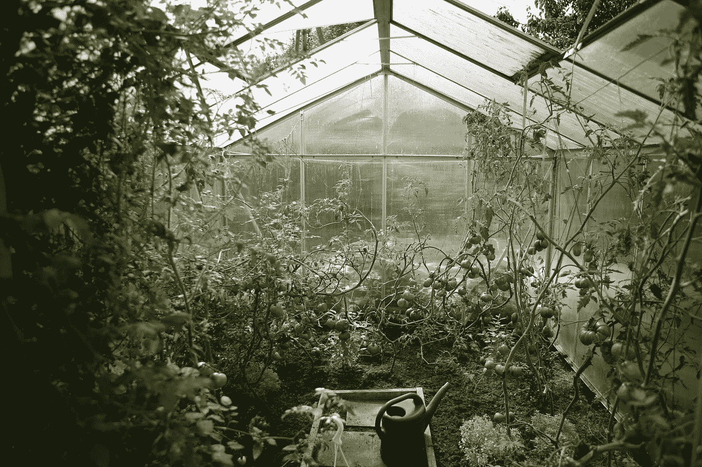

# 数据科学家如何提高他们的编码技能

> 原文：<https://towardsdatascience.com/how-data-scientists-level-up-their-coding-skills-edf15bbde334>

进入数据科学职业生涯有很多途径，并不是所有的途径都需要强大的编程背景。当我们听到数据从业者质疑他们自己和他们的能力时，一个反复出现的主题是代码:“如果我不知道如何[*插入你自己认为的编码缺点*]，我甚至不是真正的*数据科学家吗？”*

嗯，是的，你是！没有人知道一切；我们所能希望的是认识到我们知识上的差距，并找到解决这些差距的有效方法。本周的亮点将在您的编码之旅中为您提供帮助:每个亮点都从不同的角度探讨了数据科学编程的(广阔)主题，并且每个亮点都提供了不同类型的可操作要点。尽情享受吧！

*   [**到底什么是好代码？Sergey Mastitsky**](/good-data-scientists-write-good-code-28352a826d1f) 对编码最佳实践的精彩介绍是全面的、可理解的和详细的。这也是一个有用的提醒，写干净、清晰的代码不是炫耀你的技术实力，而是对你的同事和用户的慷慨和同情。
*   [**掌握测井要领**](/basic-to-advanced-logging-with-python-in-10-minutes-631501339650) 。成为一个可靠的队友的另一个重要方面？确保代码中有良好的日志调用，以便易于调试。 [Kay Jan Wong](https://medium.com/u/fee8693930fb?source=post_page-----edf15bbde334--------------------------------) 的日志初级读本从基本函数一直到更高级和更专业的函数，涵盖了常见问题，并包括 Python 的完整实现。

照片由 [www.zanda .摄影](https://unsplash.com/@zanda_photography?utm_source=medium&utm_medium=referral)在 [Unsplash](https://unsplash.com?utm_source=medium&utm_medium=referral)

*   [**你的 Python 技能如何简化你的工作流程**](/3-tools-for-fast-data-profiling-5bd4e962e482) 。停留在事物的实际方面， [Rebecca Vickery](https://medium.com/u/8b7aca3e5b1c?source=post_page-----edf15bbde334--------------------------------) 带我们了解了三个 Python 库的来龙去脉——Lux、Pandas Profiling 和 sweet viz——它们自动化了分析数据的常规任务(在应用其他技术之前，这是任何数据科学分析中重要的第一步)。
*   [**改弦易辙**](/how-i-would-learn-to-code-if-i-had-to-start-over-607428f14266) 。 [Ken Jee](https://medium.com/u/6ee1f7466557?source=post_page-----edf15bbde334--------------------------------) 最近分享了关于学习编码的有益建议，集中在他事后会做出的不同决定上。从他的文章中得到的一个有力的教训是，无论你在数据科学之旅的哪个阶段，你都有时间调整你发展和提高技能的方式。

我们希望你本周能有时间多看几篇我们发表的优秀文章——错过这些将是一种遗憾！

*   作为 TDS 播客的主持人，Jeremie Harris 分享了关于人工智能未来的最后一集。
*   为您的数据科学项目选择正确的视觉类型至关重要。 [Semi Koen](https://medium.com/u/aabf98f9b9a?source=post_page-----edf15bbde334--------------------------------) 的指南将[帮助你做出可靠、有效的决定](/how-to-choose-an-effective-visual-for-your-data-science-project-3e7c0a291a55)。
*   一部 AI 歌剧听起来是什么样的？尼科·韦斯特贝克的第一篇文章[带领我们经历了在德累斯顿森佩罗珀创造*追逐瀑布*的迷人过程](/lessons-learned-from-making-an-ai-opera-6b188c3094cf)。
*   通过跟随 [Rashida Nasrin Sucky](https://medium.com/u/8a36b941a136?source=post_page-----edf15bbde334--------------------------------) 的分步教程，学习如何使用 TensorFlow 的函数式 API[预测一个模型](/a-step-by-step-tutorial-to-develop-a-multi-output-model-in-tensorflow-ec9f13e5979c)的两个输出。
*   出版由[迈克尔·布朗斯坦](https://medium.com/u/7b1129ddd572?source=post_page-----edf15bbde334--------------------------------)创作的激动人心的新作总是一种特权；他的最新文章(与合著者 Francesco Di Giovanni、James Rowbottom、Ben Chamberlain 和 Thomas Markovich)介绍了梯度流框架(GRAFF)，这是一种受物理学启发的绘制神经网络的方法。

一如既往地感谢您花时间阅读我们作者的作品。如果你想以其他有意义的方式表达你的支持，可以考虑[成为一名中级会员](https://bit.ly/tds-membership)。

直到下一个变量，

TDS 编辑