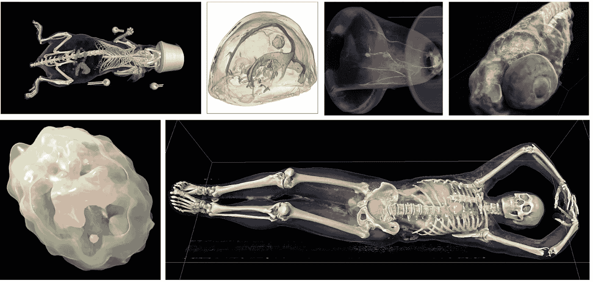
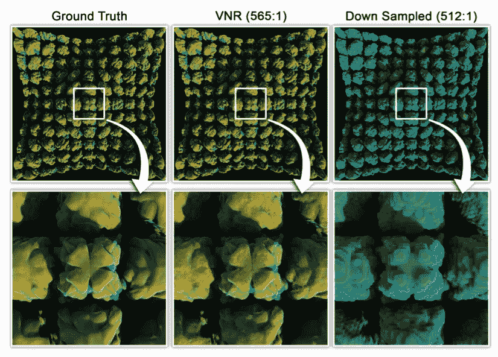

# 深度学习如何实现大规模科学可视化

> 原文：<https://towardsdatascience.com/how-deep-learning-enables-large-scale-scientific-visualization-f574408a6b43>

## 使用神经网络压缩信息用于交互式渲染

加州大学戴维斯分校 VIDI 小组以前的工作样本。图片由加州大学戴维斯分校 VIDI 小组提供

# 介绍

作为英特尔的软件架构师和技术传播者，最大的乐趣之一就是有机会看到 oneAPI 卓越中心(CoE)在全球范围内所做的出色工作。最近，加州大学戴维斯分校可视化和界面设计创新(VIDI)实验室分享了他们如何使用深度学习进行高性能、交互式科学可视化。

## 为什么这很重要？

近年来，科学模拟和建模变得越来越详细。模拟可以轻松生成数百万亿字节的数据。对于生成三维数据表示的仿真模型，理解仿真输出的最佳方式是使用实时渲染器对其进行视觉检查。

可以想象，使用高保真方法渲染万亿字节的数据，如使用最强大的 GPU 的[光线行进](https://en.wikipedia.org/wiki/Ray_marching)(想想更高级的光线跟踪)和[路径跟踪](https://en.wikipedia.org/wiki/Path_tracing)，是一项挑战。纯粹的强力渲染算法和标准压缩算法无法提供支持这种规模的实时交互所需的性能或压缩率。虽然以每秒 1 帧(fps)的速度查看模拟输出的渲染非常有价值，但以 30fps 的速度提供实际的交互式渲染可以为研究人员提供更有用的体验。

这就是关-刘妈教授和他的团队大卫·鲍尔和吴起所做的工作。他们结合了深度学习和渲染方面的最新研究，提供了一些真正了不起的东西。

# 用于压缩的即时神经表示

上面提到的最大挑战之一是压缩数据，然后快速解压缩大型数据集，速度足够快，以实现实时、交互式渲染。如果我们以 30fps 的速度渲染，模拟数据的解压缩时间必须少于 33.3 毫秒。

## 压缩类型和速率

第二个难题是压缩率。压缩算法可能是无损的，这意味着可以完全恢复原始输入数据。它们也可能是有损的，这意味着不可能从压缩的表示中重建原始数据。正如人们所料，一般来说，无损算法往往会导致较小的压缩率。

人们每天使用的典型压缩文件是 zip、mp3 和 JPEG。前者是无损的，可以实现大约 3:1 的压缩率。后者是有损的，通常实现大约 20:1 和 10:1 的压缩率。这意味着这些典型算法的最大压缩比大约是原始数据大小的 1/20。

出于实时渲染的目的，人们将寻求的主要特征是快速解压缩和相对最小的数据丢失。然而，20:1 的压缩率对于许多使用案例来说可能是不够的。

## 救援的即时神经表现

正如我们在过去 10 年中所看到的，现代神经网络非常擅长编码信息和快速解码信息。这两个特征使得神经网络非常适合作为大规模数据集的压缩方法。

使用神经网络进行压缩的另一个有用特征是，与大多数压缩算法不同，表示的大小不会随着数据集大小的增加而增加。人们可能会认为，随着数据复杂性的增加，静态表示会变得更容易丢失。

然而，给定一个足够大的网络，这种退化不是线性的。由于巨大的模拟模型大小，可以使用大型神经网络，这导致良好的压缩比和随着数据集大小增长的最小信息损失。VIDI 团队报告的结果是“比原始数据小 10-1000 倍，并且使用 MLP 和散列网格编码几乎是即时训练的”

图 1:在相似的压缩率下，即时神经表示(VNR)质量与朴素方法的比较。图片由加州大学戴维斯分校 VIDI 小组提供

在图 1 中，我们可以清楚地看到这种压缩算法相对于传统算法的价值。

## 创建表示

为了训练模型进行压缩，VIDI 团队必须获取 3D 模拟信息，并将其转换为适合标准机器学习工作流程的东西。从逻辑上讲，这是一个相对标准的机器学习流程:

1.  获取 3D 空间中的随机数据样本
2.  使用散列网格编码对每个样本进行编码，以创建传递给 DL 模型的张量
3.  针对实际样本输出训练样本点的模型

为了尽可能提高性能，VIDI 团队使用了英特尔开放卷内核库(oneAPI OpenVKL 规范的一种实现)，从基础事实中为训练阶段生成训练样本。OpenVKL 在这里很有帮助，因为它支持对体数据的高效遍历和采样。

使用正确的配置，训练模型大约 20k 步只需要不到一分钟的时间。这样做的结果是合理的峰值信噪比 (PSNR)在大多数情况下约为 30dB，在一些数据集中约为 49dB 以上。对于那些不熟悉 PSNR 的人来说，它是用分贝(dB)来衡量的。该值越高，图像越接近原始图像。

## 弥合渲染差距

虽然即时神经表示令人印象深刻，但它本身可能不足以提供高性能的实时交互体验。为了弥合这一差距，加州大学戴维斯分校 VIDI 团队还开发了几种用于即时神经表示数据的采样和渲染算法。

不幸的是，这里的技术超出了本文的范围，但是你可以查看一下[即时神经表示和相关渲染优化](https://arxiv.org/abs/2207.11620v2)的细节。

当然，更有趣的事情是看所有这些如何组合在一起，以实现真正的交互体验。你可以在下面的视频中看到加州大学戴维斯分校 VIDI 团队训练即时神经表达的速度和取得的令人印象深刻的结果。

# 结论

我一直认为 DL 是一种可以解决极其复杂的问题的技术，这些问题需要很大的解决空间；我还没有考虑过如何用“众所周知”的解决方案为问题提供启发性的解决方案。即时神经表示是一个很好的例子，它利用了 DL 模型的力量，并将其用作一些数据的启发式优化，这些数据可以容忍某种程度的有损转换。

像即时神经表示这样的技术能够与日益复杂的模拟数据进行可用的实时交互。为了强调 1fps 交互和 60fps 交互的区别，请看这个有趣的视频。

我很兴奋也很乐观，像这样的新解决方案将继续推动科学发现。支持与仿真模型数据进行 30+ fps 的交互对于科学家来说可能是一个游戏改变者，他们将不再需要与他们的数据进行幻灯片式的交互。

*如果你想看看我在看什么科技新闻，你可以在 Twitter 上关注我。此外，一起查看* [*代码*](https://connectedsocialmedia.com/category/code-together/) *，这是我主持的面向开发者的英特尔播客，我们在这里讨论技术。*

Tony 是英特尔的一名软件架构师和技术宣传员。他开发过多种软件开发工具，最近领导软件工程团队构建了数据中心平台，实现了 Habana 的可扩展 MLPerf 解决方案。

# 参考

[1]吴起，大卫·鲍尔，迈克尔·j·道尔，关-刘妈，[用于交互式体绘制的即时神经表示](https://arxiv.org/abs/2207.11620v2)，2022，[https://arxiv.org/abs/2207.11620v2](https://arxiv.org/abs/2207.11620v2)