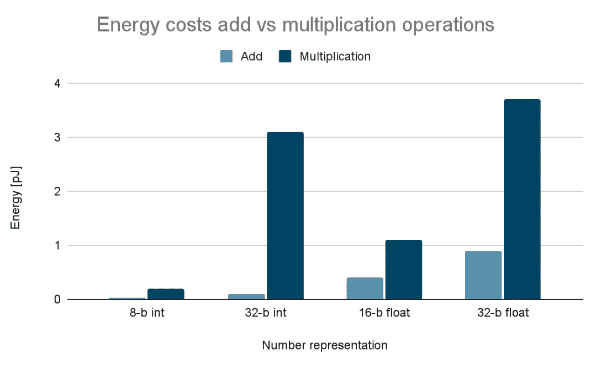

# DeepMind 如何利用人工智能发现矩阵乘法的新方法

> 原文：<https://towardsdatascience.com/how-deepmind-discovered-new-ways-of-multiplying-matrices-using-ai-a04557e9f861>

照片由 [Gayatri Malhotra](https://unsplash.com/@gmalhotra?utm_source=medium&utm_medium=referral) 在 [Unsplash](https://unsplash.com?utm_source=medium&utm_medium=referral) 上拍摄

上个月，DeepMind [发表了一篇论文](https://www.nature.com/articles/s41586-022-05172-4)，其中他们展示了 AlphaTensor，这是一种人工智能算法，能够找到更快的方法来完成最常见的代数运算之一:矩阵乘法。当然，你可能会问自己一个合理的问题:这和我有什么关系？在这篇文章中，我将解释论文的内容，如果你坚持到最后，你会找到一些例子，说明为什么这是一个如此大的突破，以及它如何 ***将*** 影响你未来的日常生活。

## 为什么矩阵乘法很重要？

也许你还记得我在[的上一篇文章](/accelerating-neural-networks-on-hardware-baa3c14cd5ba)中提到，矩阵乘法是最常见的人工智能算法之一:神经网络的训练和部署的重要组成部分。请记住，这不是这个代数运算的唯一用途。它有数以百计的应用(机器人的坐标变换，复杂优化问题的解决)，但为了这篇文章，我们将只关注人工智能。

这实际上是一个非常简单的操作:每个矩阵都是一个二维数字数组，在乘法过程中，左边矩阵(维数为[M，N])的每个行元素都与右边矩阵(维数为[N，P])的每个列元素相乘。所得矩阵的维数为[M，P]。然后将每个乘法结果累加在一起。让我们记住一个[2，2]*[2，2]矩阵乘法的小例子:

记住矩阵乘法的工作原理。作者制作的动画。

通过以这种简单的方式计算结果，很容易确定需要多少次乘法来计算输出矩阵的所有元素。给定一个[M，N]*[N，P]矩阵乘法，我们需要做 M*N*P 次乘法，以便计算输出矩阵。所以一个[2，2]*[2，2]矩阵乘法需要 2*2*2=8 个单独的乘法。

为什么我们关心我们需要做多少次乘法？好吧，让我们来看看下图:

图片由作者提供。原始数据来自[《如何评估深度神经网络处理器》，2020](https://www.rle.mit.edu/eems/wp-content/uploads/2020/09/2020_sscs_dnn.pdf) 。

看那个！与相同的位表示加法相比，与某个位表示(8 位、32 位浮点等)的乘法使用更多的能量！当然，我们在这里谈论的是皮焦(0.0000000000001 焦耳)，这是非常小的…但乘以一些最先进的神经网络所需的数十亿次运算，然后*然后*想象这些是 24/7 运行的，你开始得到不可忽略的能耗。

因此，重要的问题是:我们能否用更少的乘法运算来执行相同的代数运算，以节省能量？

## 什么是张量分解？

嗯，令人惊讶的是，答案竟然是肯定的！方法是使用一种叫做*张量分解*的技术，这是 DeepMind 在论文中用来表示矩阵乘法运算的技术。

从概念上讲，主要思想是以这样一种方式对矩阵的元素进行分组，即我们需要更少的乘法来实现相同的结果，并且加法的数量略有增加(但是因为这些使用更少的能量，所以没什么大不了的)。听起来违反直觉，对吗？如何用较少的乘法运算得到*相同的*数学结果？

嗯，事实上很简单:

两个 M=N=P=2 的矩阵相乘的 Strassen 算法。图片由作者提供。

在这个例子中，我们通过使用较少的乘法来计算结果！我们首先组合输入矩阵的元素，并将它们相乘以生成中间结果。最后，在它们之间进行组合，以获得输出矩阵的实际元素(可以使用简单的代数来证明，这种中间结果组合等价于上一个动画中显示的形式)。这就是 Strassen 算法，它能够使用 7 次**单独乘法**来计算[2，2]*[2，2]矩阵乘法的结果(我们在上一节中看到的 2 个矩阵相乘的简单方法需要 8 次**单独乘法**)！

这种矩阵乘法运算的分解可以用 3 个矩阵来表示:U、V 和 W。如下面的动画所示，U 和 V 用于组合输入矩阵的元素，W 用于组合中间结果。这被称为秩 7 分解，因为 U、V 和 W 的秩*等于 7。*

斯特拉森算法动画，但显示矩阵 U，V 和 w。

## 发现算法如何工作

所以让我们来看看实际的论文提出了什么，好吗？

在本文中，DeepMind 基于其之前非常成功的 AlphaZero 训练了 AlphaTensor，该算法可以为不同的矩阵乘法大小生成这种重组算法。从概念上讲，他们将问题设计为一个[强化学习](https://deepsense.ai/what-is-reinforcement-learning-the-complete-guide/)问题，其中一个代理试图通过试图最小化结果矩阵的*秩*(列)来找到矩阵 U、V 和 W。因为秩与乘法次数直接相关，这有效地最小化了所需的元素乘法。这篇论文的技巧和绝对的 ***精彩之处*** 在于他们能够将问题建模为一个游戏，因此一个强化学习算法能够尝试做最少的乘法来得到结果。

在一组不同大小的矩阵乘法上，AlphaTensor 能够找到使用与当前已知解决方案相等甚至更少乘法的算法！他们对 Strassen 算法特别感兴趣，该算法使用 49 次乘法将 2 个 4x4 矩阵相乘，这是自 1969 年发现以来该矩阵大小的最佳解决方案。AlphaTensor 找到了一个更好的算法，只使用了 47 次乘法！

然后，他们在 Nvidia V100 GPU 和 TPU 上比较了使用 Strassen 算法和 AlphaTensor 算法的大矩阵乘法(M=N=P=8192 和更大)的加速。他们表明，与 Strassen 算法相比，alpha 张量发现算法能够实现 1.5%到 4 %的加速。

## 那么…这跟我有什么关系？

如果你认为这是一些与你的生活无关的深奥的代数，那么…你错了！人工智能算法训练和预测(例如，神经网络)所需的计算都可以(通常)用矩阵乘法来表示。那么，如果我们现在使用更少的乘法来获得相同的数学结果，会发生什么呢？

*   训练将更快，消耗更少的能量，这将允许我们使用相同的硬件来训练更复杂的网络。
*   神经网络将适合更小的设备，为这些算法开辟了一个全新的应用领域。
*   如果硬件也被设计成考虑这些计算矩阵乘法的新方法，则应该实现显著的能量节省。

## 动手！

你知道这篇论文最精彩的部分是什么吗？你可以在网上免费获得它！如果您对自己分析数据感兴趣，可以看看 AlphaTensor 的 [GitHub 资源库。](https://github.com/deepmind/alphatensor)

欢迎在 [Twitter](https://twitter.com/PecciaF) 或 [LinkedIn](https://www.linkedin.com/in/fpecc/) 上关注我，让我知道你对这篇文章的看法，或者[请我喝杯咖啡](https://www.buymeacoffee.com/pecciaf)，如果你真的喜欢它！

感谢阅读！

## 参考

原始纸张:

*   Fawzi，a .，Balog，m .，Huang，A. *等* [用强化学习发现更快的矩阵乘法算法](https://doi.org/10.1038/s41586-022-05172-4)。*性质* **610** ，47–53(2022)。

强化学习的有用指南:

*   [什么是强化学习？完整指南— deepsense.ai](https://deepsense.ai/what-is-reinforcement-learning-the-complete-guide/)

原始 AlphaZero 文件:

*   Silver，d .等[一种通用的强化学习算法，精通国际象棋、shogi，并通过自玩](https://www.science.org/doi/10.1126/science.aar6404)。科学 362，1140–1144(2018)