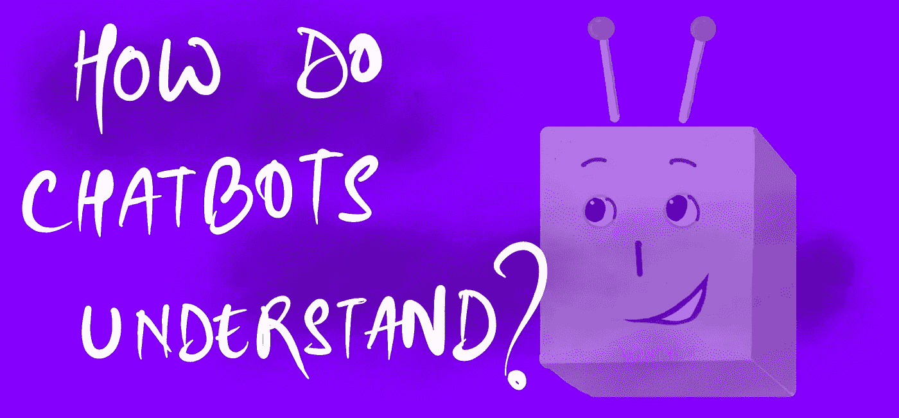
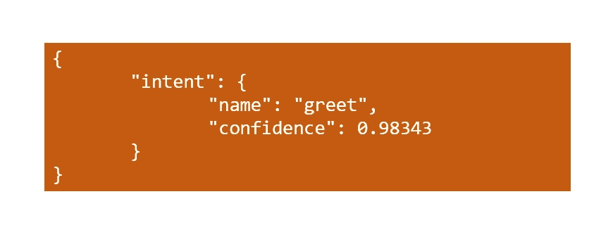
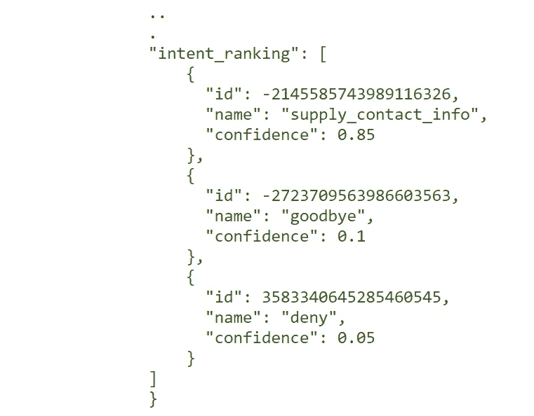
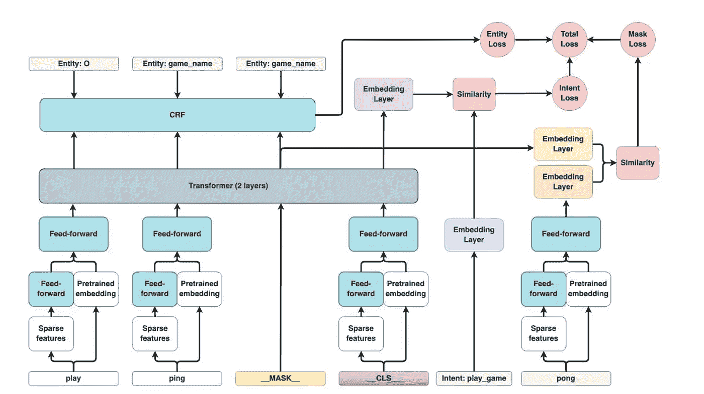
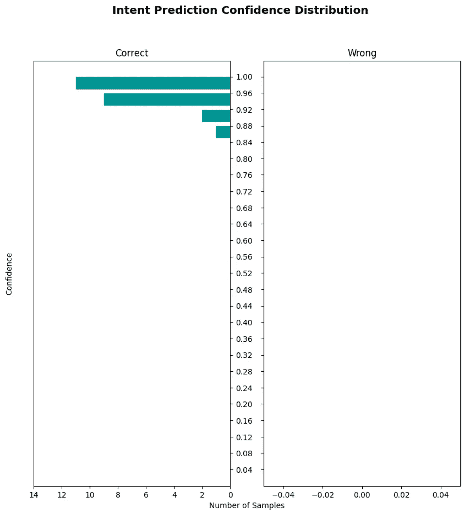

# 聊天机器人是怎么理解的？

> 原文：<https://towardsdatascience.com/how-do-chatbots-understand-87227f9f96a7>

## 用 Rasa 构建聊天机器人——第四部分



作者图片

在本系列的前几篇文章中，我们已经讨论了构建聊天机器人、插槽和实体以及处理机器人故障的基础。我们现在将讨论 Rasa 如何通过意图实现机器人理解。我们还将基于逻辑回归构建一个简单的定制意图分类器，尽管 Rasa 确实提供了一些现成的好分类器。

## 目录

```
- Natural Language Understanding
- Intent Classification
- The DIETClassifier
- A custom intent Classifier
```

## 本系列的前几篇文章

> 第一部分:[用 Rasa 构建聊天机器人](/building-a-chatbot-with-rasa-3f03ecc5b324)
> 
> 第二部分:[槽和实体一样吗？](/are-slots-and-entities-the-same-f98a38ac328d)
> 
> 第三部分:[处理聊天机器人故障](/handling-chatbot-failure-gracefully-466f0fb1dcc5)

# 自然语言理解

自然语言理解，简称 NLU，是研究机器如何进行阅读理解的领域。这是自然语言处理的一个子领域。

虽然 NLP 关注的是理解本身，但是 NLP 可以推导出可能不是直接显而易见的上下文和含义。Rasa 使用**意图**来帮助机器人理解用户在说什么。

实体用于提取关键信息，这些信息也有助于机器人制定响应。在这篇文章中，我们将关注意图分类。

# 意图分类

**意图分类**是我们刚刚讨论的技术之一。您只需为用户输入的每条消息分配一个标签。这个标签代表一个主题，称为一个`intent`。例如，您可以定义类似于`greet`、`goodbye`、`supply_contact_info`等的意图。

因为我们已经将这些训练数据标记为 nlu 数据的一部分，所以它变成了一个(通常)简单的文本分类问题。我说“通常”是因为你定义意图的方式与它们分类的难易程度有很大关系。

这对于任何分类问题都是正确的:与不同种类的马相比，区分不同的哺乳动物更容易。类似地，更容易使用名为`book_flight`的意图和实体来提取目的地、日期等。而不是每个用例都有不同的意图:

*   `book_flights_destination_given`
*   `book_flights_date_mentioned`
*   `book_flights_budget_mentioned`等。

## 意图分类器

可以采用许多方法对意图进行分类。你可以有一个纯粹基于规则的系统，它会寻找特定的单词和短语来判断用户想说什么。可以想象，这种方法不会工作得太好，尤其是对于更复杂的用例。

机器学习方法在这里真的很好，尤其是随着自然语言处理领域的发展。例如，您可以使用简单的朴素贝叶斯模型来构建自己的意图分类器。

另一方面，您可以使用 DIETClassifier，这是一个基于 transformer 的模型，可以执行实体提取和意图分类，我们稍后将对此进行讨论。

Rasa 提供了一些意图分类器，您可以在`config.yml`文件中直接使用它们。其中一些是:

*   **减肥分类器**
*   **SklearnIntentClassifier** :使用 sklearn 的 SVC
*   **keyworditintentclassifier**:匹配字符串和数据(基于规则)
*   **FallbackClassifier** :帮助处理边缘情况和低置信度结果。这在之前的帖子中讨论过。

> **注**
> 
> 有关回退和处理失败的更多信息，请查看本系列的这篇文章:

[](/handling-chatbot-failure-gracefully-466f0fb1dcc5) [## 优雅地处理聊天机器人故障

### 用 Rasa 构建聊天机器人——第三部分

towardsdatascience.com](/handling-chatbot-failure-gracefully-466f0fb1dcc5) 

让我们看看除了预测意图本身之外，意图分类器通常提供的信息。



意图分类器的典型输出—按作者分类的图像

除了意图之外，这些分类器通常还会返回一个置信度得分(如果是概率模型的话)和一个意图排名。这些在调试你的机器人性能的时候真的很有用。



一些意向分类器如 DIET 也输出意向排名——按作者分类的图片

# 饮食分类器

DIETCLassifier 是一个基于转换器的模型，既作为实体提取器又作为意图分类器，因此被命名为**双重意图实体转换器。**由 Rasa 开发。

这是 Rasa 附带的组件之一。让我们讨论一下架构中最有趣的部分。

*   有两种特殊的代币:`_MASK_`和`_CLS_`。
*   `_CLS_`令牌通过其他令牌的稀疏嵌入的总和或直接像 BERT 那样的预训练嵌入来表示整个用户消息。它有助于意图分类。
*   `_MASK_`令牌通过屏蔽随机令牌来帮助一般化模型。它用于计算掩模损耗。
*   前馈模块由所有令牌共享，并且默认情况下具有 80%的掉线连接。
*   这些令牌通过前馈层传递到默认情况下有两层的转换器中。
*   然后，这些被传递到使用 Tensorflow 实现的条件随机场模块中。这就是实体提取发生的地方(回想一下，DIETClassifier 能够进行提取和意图分类)。
*   最后，所有三种损失:实体损失、意图损失和屏蔽损失给出了我们试图通过反向传播来减少的总损失。

你可以看到下面的建筑。



饮食分类器——图片来自 Rasa 的[论文](https://arxiv.org/pdf/2004.09936.pdf)

## 为什么饮食分类器如此灵活

Rasa 将 DIETClassifier 设计成非常可定制的。除了你可以在大多数模型中改变的通常的超参数，像时期的数量，隐藏层的数量等等。这些是 Rasa 的 DIETClassifier 提供的功能:

*   **添加预训练嵌入**:支持 BERT、GloVe 和 ConveRT 等嵌入。这为您提供了使用稀疏嵌入(例如，计数矢量器)和密集嵌入的灵活性。
*   **仅将其用作意图分类器或实体提取器:**您可以使用 DIET 来完成一项任务，并让其他组件来完成其余任务。
*   **_ MASK _ variable 标志:**这随机屏蔽了某些记号，因此模型有更好的机会进行泛化。
*   **修改前馈层的连接密度:**默认情况下，DIETClassifier 只保留所有权重的 20%为非零，保持模型轻便，减少过拟合的机会。您可以修改这些超参数来构建越来越复杂的模型。

# 构建我们的意图分类器

Rasa 使得构建我们自己的组件变得非常简单，从实体提取器、策略和意图分类器一直到拼写检查器和语义分析器。

让我们建立一个基于逻辑回归的意图分类器，它接受我们的 NLU 数据并符合`sklearn`的`LogisticRegression`模型。我们将使用和以前一样的聊天机器人，包括 NLU 数据，故事和行动。

## 蓝图

每个组件都被定义为一个从`Component`继承的类。有些属性是在类中定义的，还有一组必要的方法，rasa 使用这些方法来训练并最终根据`config.yml`文件中定义的步骤将数据传递给我们的组件。

我们的意图分类器的高级结构如下所示:

```
# importsclass LRClassifier(IntentClassifier): *def* __init__(self, component_config: Optional[Dict[Text, Any]] =        None) -> None:
        super().__init__(component_config) # necessary attributes: eg. name, provides, requires, etc. # necessary methods: eg. train, process, persist, etc. 
```

## **训练方法**

这个方法只是训练我们的分类器。因为我们使用的是 sklearn，所以非常简单。

## **工艺方法**

每次运行 Rasa 的管道时都会执行该方法，这发生在每个用户消息之后。它包含组件的逻辑。在我们的意图分类器的例子中，`process`方法将包含一个`predict`调用，它预测一个意图，如果我们需要的话，还有一个意图排名。

## 持久化方法

这个方法保存了我们的模型供以后使用。我们将使用`joblib`,因为我们正在使用 sklearn。Sklearn 的文档推荐使用`joblib`，因为它的模型通常包含许多`numpy`矩阵。

## **加载方法**

每当您启动聊天机器人时，就会调用`load`方法。它从保存在`persist`方法中的文件中加载模型。

## 评估我们的模型

Rasa 为评估 NLU 和机器人核心提供支持。我们所要做的就是创建一些测试数据并运行`rasa test`。也支持交叉验证。

为了测试我们的分类器，将测试数据添加到`tests/test.yml`。它看起来会像这样:

之后，运行:

```
rasa test
```

将生成一个`results`文件夹，您可以通过图表和报告查看分类器的性能。您还将看到`DIETClassifier's`实体提取的性能。



Rasa 测试支持生成的图表—图片由作者提供

# 笔记

## 意图是有限的

你或许可以想象，让一个机器人将一条消息分类到一组排他的类中是非常有限的。Rasa 通过提供对等级意图的支持来帮助解决这个问题，并且正在努力消除所有的意图。

与此同时，我们可以设计一个更好的对话代理，方法是将我们的意图构造得非常通用，然后使用实体或层次意图提取用户消息中更细微的方面。

## 高级测试

Rasa 提供了许多您可以在测试组件时使用的特性。其中包括:

*   交叉验证
*   比较模型
*   策略测试

还有很多东西，尽管我们不会在这篇文章中讨论它们。

# 示例代码

[](https://github.com/Polaris000/BlogCode/tree/main/CustomIntentClassifier) [## blog code/CustomIntentClassifier 在主 Polaris000/BlogCode

### 这是一个示例机器人，展示了 Rasa 对定制组件的支持——特别是定制意图分类器……

github.com](https://github.com/Polaris000/BlogCode/tree/main/CustomIntentClassifier) 

## 本系列的前几篇文章

> 第一部分:[用 Rasa 构建聊天机器人](/building-a-chatbot-with-rasa-3f03ecc5b324)
> 
> 第二部分:[槽和实体一样吗？](/are-slots-and-entities-the-same-f98a38ac328d)
> 
> 第三部分:[处理聊天机器人故障](/handling-chatbot-failure-gracefully-466f0fb1dcc5)

# 结论

在这篇文章中，我们讨论了聊天机器人是如何理解用户所说的话的。我们还构建了一个理解简单查询的定制模型，这是通过将用户消息分类到一组固定的意图中来实现的。

我们还谈到了为什么意图是有限的，以及是否有更好的方法来处理意图分类。

希望这篇文章能让你对聊天机器人如何从用户信息中提取含义有所了解。