# 使用 SAS 研究所的 JMP 软件进行代码和分析验证

> 原文：<https://towardsdatascience.com/how-do-i-double-check-myself-when-implementing-code-for-an-analysis-54362258cd36>

## 当学习一门新的编码语言时，如何验证你的代码和分析是正确的

在 [Unsplash](https://unsplash.com?utm_source=medium&utm_medium=referral) 上由[Towfiqu barb huya](https://unsplash.com/@towfiqu999999?utm_source=medium&utm_medium=referral)拍摄的照片

# 介绍

随着许多人开始他们的数据科学之旅，理解和执行编码语言中的代码的能力已经成为对数据集进行分析的先决条件。我个人被各种各样的语言淹没了，人们可以用这些语言来实现代码。我是选择 Python 还是 R？两个都要学吗？Matlab 适合我吗？也许我会用 excel？一旦我选择了一种语言，我如何知道我所做的是正确的？

开始一门新的编程语言可能会非常令人生畏。幸运的是，任何人都可以搜索互联网，在 Coursera 和 Youtube 等网站上学习课程，以帮助加强他们的数据科学教育。一旦掌握了这些基本原理，一个人就可以去 Kaggle，尝试从他们的免费数据集学习，以了解如何执行不同的机器学习技术。**虽然这些都是很棒的工具，但是如果有一种简单的方法来验证我所做的分析是否正确，或者至少我得到的答案在可行解决方案的正确空间内，那会怎么样？**

嗯…有！

# JMP

当我完成运筹学硕士学位并获得数据科学证书时，一个极大地支持了我的 Python 编码教育的应用程序是 T4 JMP 统计软件 T5。JMP 是一个(免费 30 天试用)在线软件，由 SAS 提供，可以为日常用户运行不同类型的分析。没有 JMP，我不得不痛苦地认识到我的分析是错误的(我从来没有失败过一次任务，但如果不是因为 JMP 在我的后兜里，我可能会失败!)。).

# 特征

你可能想知道 JMP 是如何工作的，它能做什么？虽然我今天不会给出关于 JMP 的完整教程，但我想强调一下它在开始时的一些令人敬畏的特性。

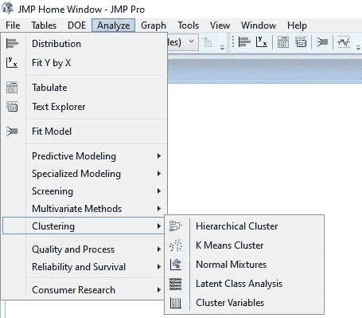

聚类(图片来自作者)

JMP 的聚类部分提供了许多很好的选项，可以通过聚类来查看数据的相似性和差异性。我常用的一种帮助我了解更多数据集的技术是 **K 表示集群。**

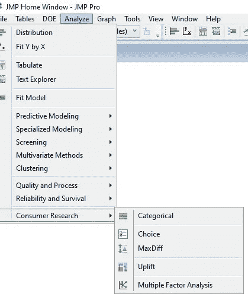

消费者研究(图片来自作者)

JMP 的另一个有趣的产品是**消费者研究**选项。包括的技术有**分类、选择、最大差异、提升、**和**多因素分析。**

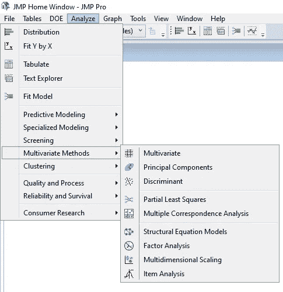

多元方法(图片来自作者)

在学习如何用 Python 编程时，我用得最多的部分之一是**多元方法**部分。今天，我将展示一个**主成分(主成分分析(PCA))** 的例子，这是一种降维技术，旨在保持数据集的方差。

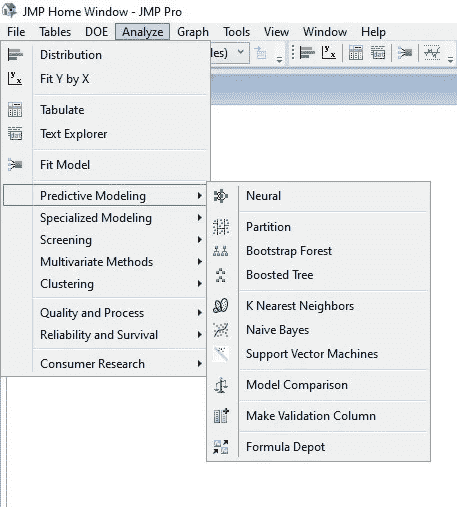

预测建模(图片来自作者)

JMP 提供的另一个真正有趣的东西是**预测建模**部分。它提供的一些技术是当今的热门话题，包括**神经网络、Bootstrap Forest、Boosted Tree 和支持向量机。**此外，**朴素贝叶斯**可以为你的预测分析提供很好的基线。

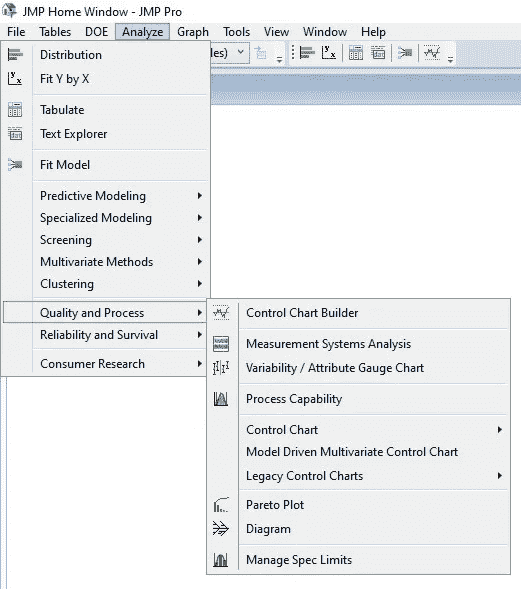

质量和流程(图片来自作者)

JMP 提供的一个附加部分是其**质量和流程**部分。本节提供的技术包括**控制图生成器、测量系统分析、可变性/属性测量图、过程能力、控制图、模型驱动多元控制图、传统控制图、帕累托图、图表、**和**管理规格限制。**

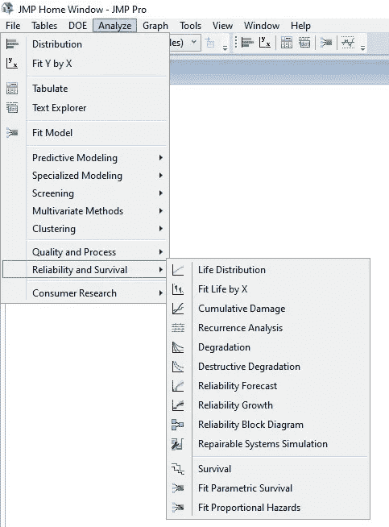

可靠性和存活率(图片来自作者)

JMP 提供的**可靠性和生存**部分对于事件和未来故障预测非常有用。

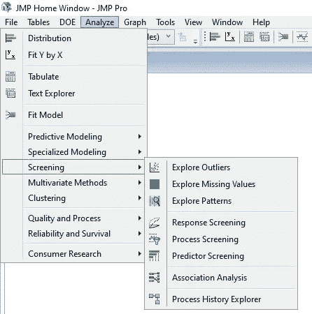

放映(图片来自作者)

**筛选**部分为理解数据集中的异常值以及预测和过程筛选提供了很好的技术。

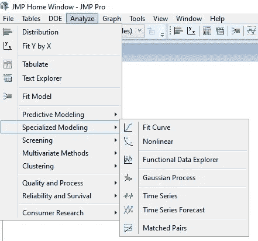

专业建模(图片来自作者)

最后，今天将概述的最后一个部分是**专业建模**部分。这一部分非常适合想要对数据集进行预测的数据科学家！

# 例子

对于这个例子，我们将对威斯康星诊断乳腺癌数据集进行主成分分析(在这里找到它[！](https://datasetsearch.research.google.com/search?query=Breast%20Cancer%20Wisconsin%20&docid=L2cvMTFqOWM3ejY5Yw%3D%3D))。第一步是将数据集加载到 JMP，只需复制并粘贴 excel 或。CSV 文件。

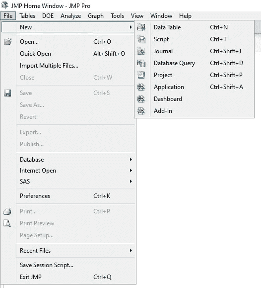

步骤 1:添加新数据集的位置。(图片来自作者)

你会想去**文件>新建>数据表>**

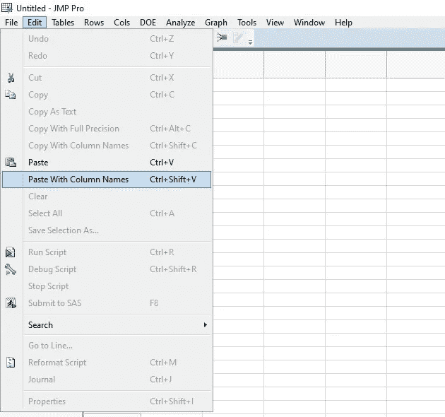

第二步:复制和粘贴数据。进入 JMP。(图片来自作者)

此时，从 excel 中复制数据。T

然后，在 JMP，进入**编辑>和>粘贴列名**

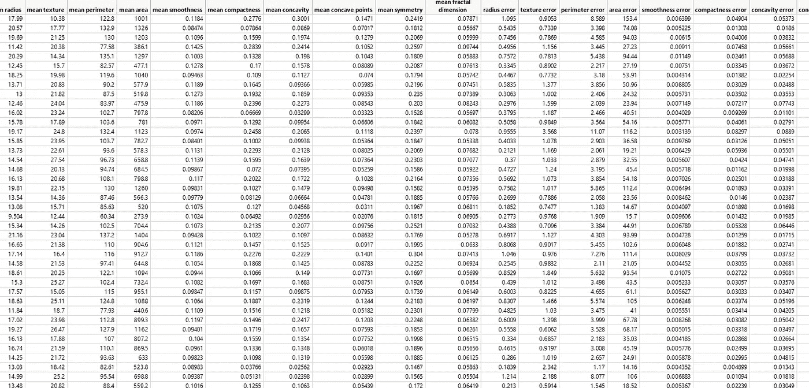

JMP 的数据示例(图片来自作者)

对于这个数据集，我们的目标标签是“标签”列，其中“0”表示“良性”，“1”表示“恶性”。在实际的 PCA 中并不使用这个标签，但是我们希望我们的 PCA 图显示两个不同分类的分组。要在 JMP 执行此操作，请转到 index 列并选择红色向下箭头。从选项中选择**行选择**然后“选择所有**行”。**

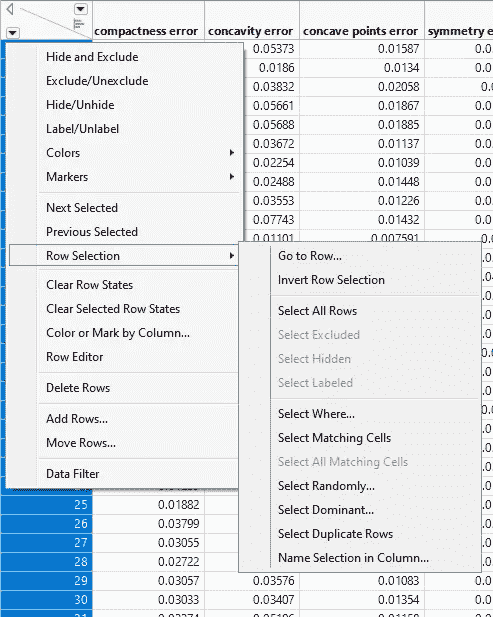

选择所有行(图片来自作者)

一旦选择了所有的行，我们希望通过它们的目标标签来标记它们。在同一选择框中，选择**颜色或按列标记。**

然后，您将希望转到“标签”列，并选择该列来标记所有数据列。

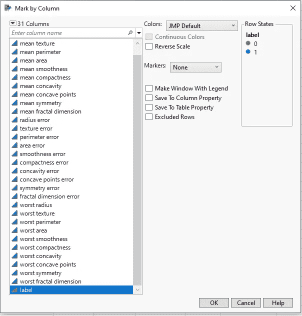

选择“标签”栏(图片来自其他)

现在，我们可以进行 PCA 了！

## 主成分分析示例

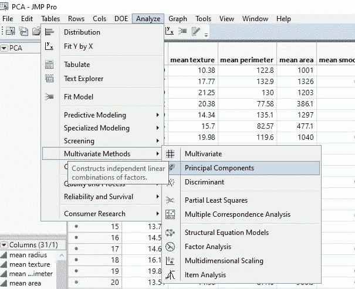

实现 PCA(图片来自作者)

第一步是去

**分析> >多元方法> >主成分**

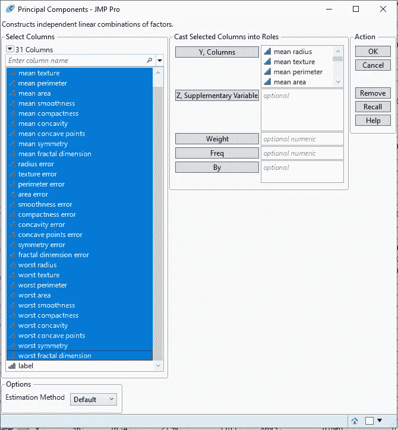

设置 PCA(图片来自作者)

然后，您会想要将所有的特性列输入到 **Y 列**中。不要将标签列添加到 **Y 列**中！。添加完列后，点击**确定。**

## 度量分析

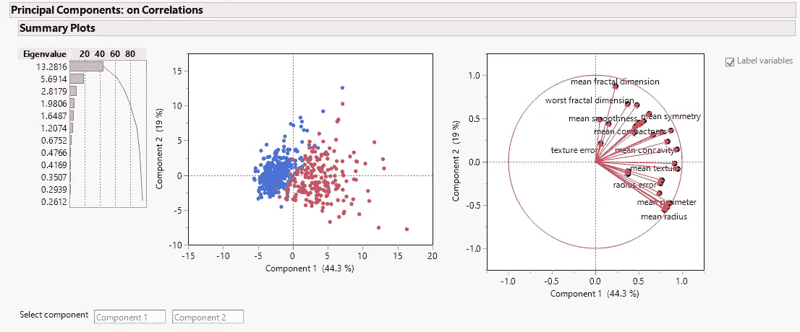

JMP 的输出窗口(图片来自作者)

一旦你进行分析，上面的窗口是 JMP 给出的输出窗口。

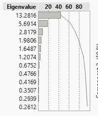

特征值(图片来自作者)

JMP 将首先给出每个主成分的特征值。使用 Kaiser 标准(任何大于 1 的特征值)，我们将保留组件 1-6。使用 Jolliffe 的标准(任何大于 0.7 的特征值)，我们仍然只保留组件 1-6。

其他指标(图片来自作者)

通过单击**主成分:相关性上的向下箭头，可以获取**其他模型指标。另一个需要得到的重要图形是碎石图，可通过选择**碎石图**得到

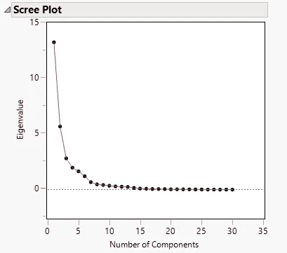

碎石图(图片来自作者)

Scree 图验证了 Kaiser 和 Jolliffe 的标准，即该数据可由 6 个主成分解释。

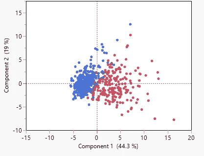

PC 1 与 PC2(图片来自作者)

绘制前两个组成部分，两种类型的肿瘤之间有明显的区别(红色=“良性”，蓝色=“恶性”)。第一个成分解释了数据中 63.40%的方差。

用 python 试试这段代码，你会得到同样的结果(如果我得到足够多的请求，以后的帖子！)

# **结论**

在学习如何用 Python(或者你选择的计算机语言)编码时，JMP 是一个很好的工具，可以用来验证你实现的分析。虽然今天讨论了 JMP 的许多应用，但是 JMP 提供的更多分析功能值得您深入研究。你可能会想，如果我有 JMP，为什么还要费事编码呢？对于任何黑盒程序，用户在接受表面答案时都应该保持谨慎。当使用任何不同的算法函数时，一定要研究该函数实际上为该软件做了什么操作。此外，数据科学家可能需要 JMP 之外的许多功能，以及更多计算能力的必要性。使用编码语言允许在构建模型时对方程的设计和超参数调整进行更多的控制。也就是说，我强烈推荐使用 JMP 来帮助加快你的学习过程，并且在编码时多尝试自己学习一门语言，看看你得到的答案是否正确！

**请在** [**LinkedIn**](https://www.linkedin.com/in/benjamin-mccloskey-169975a8/) **上加我或者随时联系！一如既往，关注我，让我知道你是否希望在未来看到任何内容！感谢阅读！**