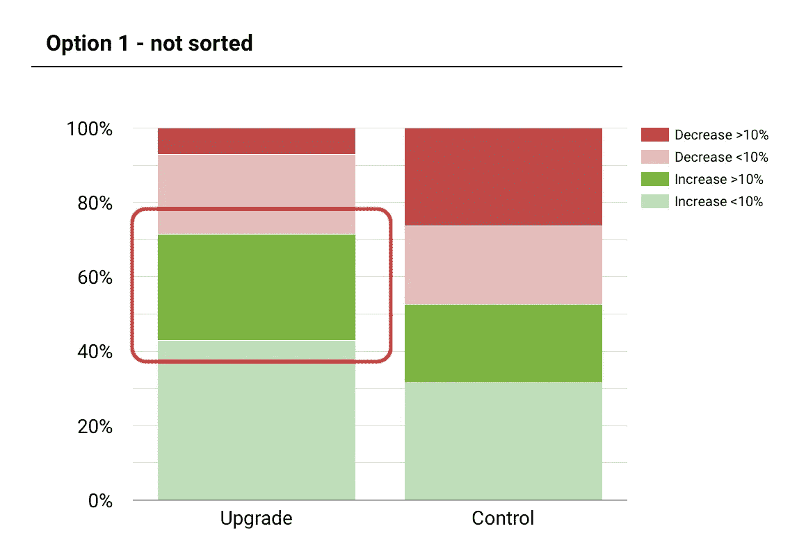
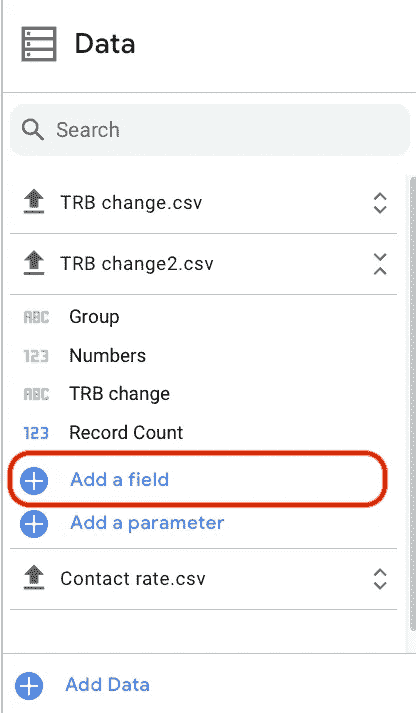
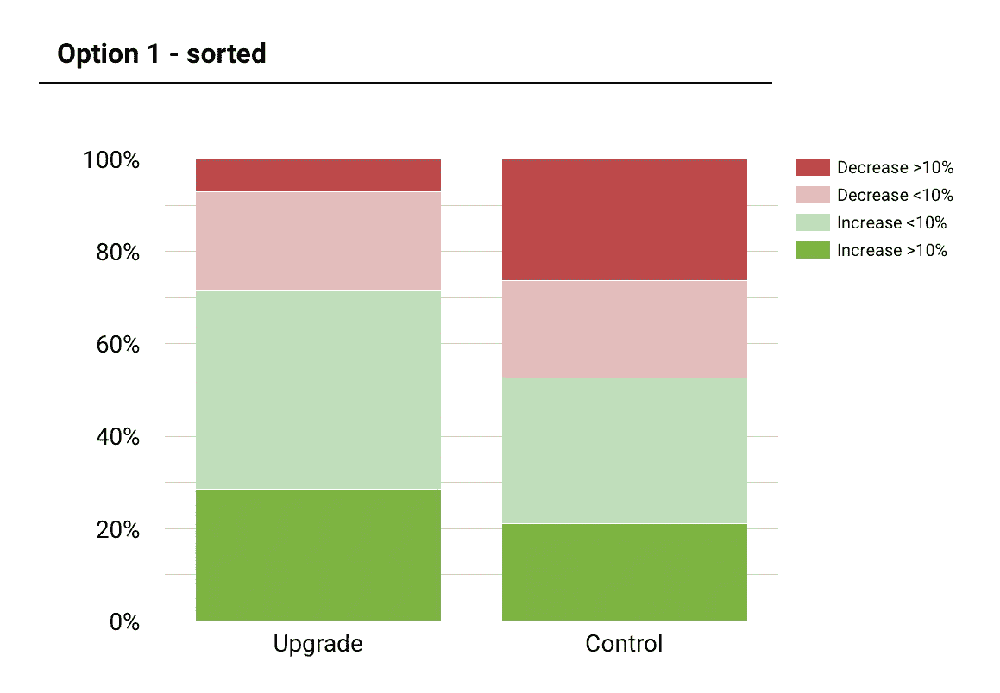
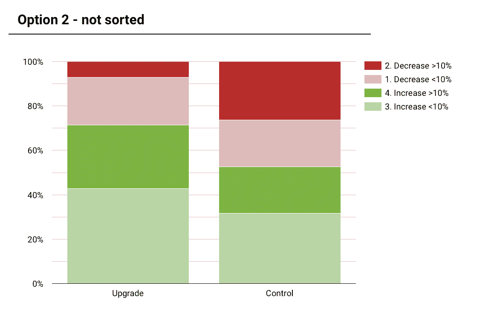
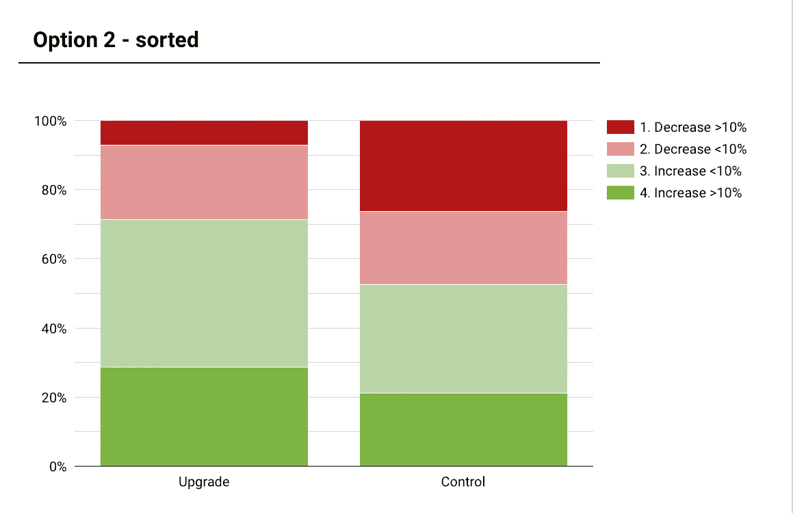

# 如何对 Google Data Studio 图表中的分类数据进行自定义排序？

> 原文：<https://towardsdatascience.com/how-do-you-custom-sort-categorical-data-in-google-data-studio-charts-2dcec2d59e88>

Maksym Kaharlytskyi 在 [Unsplash](https://unsplash.com/s/photos/filing?utm_source=unsplash&utm_medium=referral&utm_content=creditCopyText) 上的照片

## Google Data Studio 中一个缺失特性的几个变通方法

Data studio 是谷歌的一款免费工具，可以让你构建仪表盘和报告。您可以通过各种来源连接数据，包括 BigQuery、MySQL、PostgreSQL、sheets 甚至上传 CSV 文件。一旦你加载了数据，你就可以创建基本的图表、下拉列表、“大数字”框和文本。外观和感觉是“功能性的”，而不是美观的。

有一些功能限制，它与 Looker(也属于 Google now)或 Tableau 不在一个联盟中。公平地说，这是一个免费的产品(无论是构建还是查看)，我必须提醒自己这一点，但它肯定不是我最喜欢的工具。

本周我遇到了一个问题，这个问题本来应该很容易做到，但是我必须找到一个变通办法(这个办法不那么容易找到)。

# 问题是

在 Google Data Studio 中，没有明显的方法可以改变饼图或条形图中分类数据的顺序。默认情况下，使用响应的数量，这在这些是数据顺序的情况下没有意义。

如果你想改变数据在数据工作室图表中的显示顺序，那么这篇文章就是为你准备的！

# 目标

我想制作一个条形图，显示按客户关系平衡变化量细分的客户数量。数据已经准备好，分为以下几类:

*   减少 10%以上
*   减少<10%
*   Increase <10%
*   Increase > 10%

这些数据显然是有顺序的(即它是有序的)。但由于某种原因，Google Data Studio 很难在一个图表中对这些数据进行排序。默认情况下，图表按记录排序。然而，如果“增长> 10%”在图表的底部，阅读图表会容易得多。

作者图片

有两个选项可以解决这个问题，这取决于您希望图表的标签看起来像什么。

# 选项 1

选项 1 不会改变标签的外观。您需要创建一个新字段，并使用 CASE 表达式根据分类变量的名称创建一个数字。

在“数据”窗格中添加一个新字段:

作者图片

大小写的工作方式与 Excel 中的“IF”相同。它评估第一部分，看它是否为真，如果是，那么它将返回一个数字。您为数据中的每个标签写下“何时”。确保放在“然后”后面的数字是您想要的顺序！

作者代码

您将新创建的字段放到排序中，它应该会工作。有时它可能会因聚合方法的不同而混淆，默认情况下，它通常选择“SUM ”,但如果它不起作用，请尝试另一种聚合方法。我的只能正常工作。

这是最终的结果。现在可以更清楚地看到，对照组的余额不太可能增加，而更有可能大幅减少。

作者图片

# 选项 2

第二种选择是改变数据的标签方式，在前面加一个数字，然后按字母顺序排序。数据标签将显示这种标记，因为 Google Data Studio 似乎没有在图表中重新标记变量的功能。

作者图片

要更改数据排序的方式，您可以将想要排序的维度放到“辅助排序”上。

作者图片

这是排序后的样子。此选项的缺点是您可以看到图例中的编号。

作者图片

作为一个免费工具，谷歌数据工作室完成了这项工作，但这些繁琐的事情确实让它感到沮丧。

注:此数据是为了说明问题而合成的。

_________

我喜欢为商业用户写关于数据科学的文章，我热衷于使用数据来提供切实的商业利益。

您可以通过 LinkedIn 与我联系，并通过 Medium 关注我，了解我的最新文章。