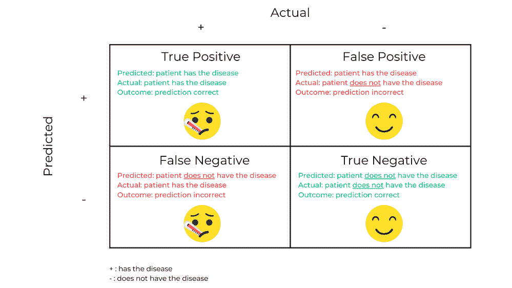
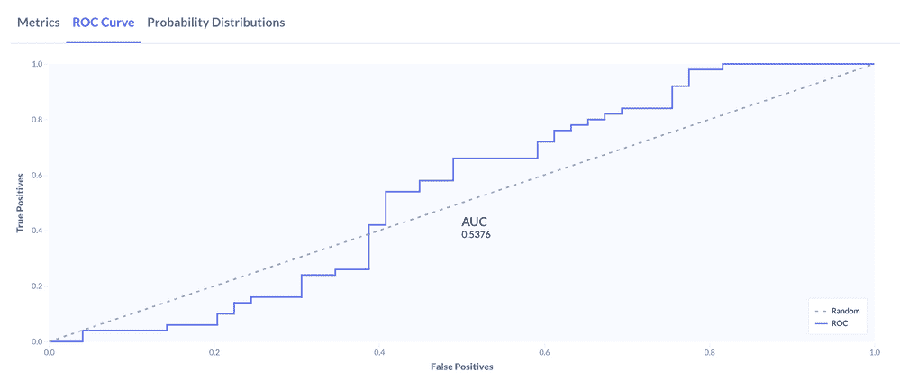

# 你如何知道你的分类模型是好的呢？

> 原文：<https://towardsdatascience.com/how-do-you-know-if-your-classification-model-is-any-good-6977ebc87798>

## 确定您的模型在您的目标环境中是否成功的指导

如果你是机器学习的新手，并且开发了一个分类模型，那么恭喜你！你可能会想，“现在怎么办？”

这是一个很好的问题。

有了 auto ML 技术，模型创建比以往任何时候都更容易。困难在于确定这个模型是否好。在本文中，我将探讨如何确定您的模型是否满足您的业务用例(剧透:这不是非黑即白)。

# 我们谈论的是哪种分类？

在我跳到如何评价你的分类模型之前，我想澄清一下，虽然我在本文中给出的例子都是二元分类，但也有[多类分类](https://www.mygreatlearning.com/blog/multiclass-classification-explained/)的问题。不同的是，在二分类中，目标变量只有两个值，而在多类中，它有两个以上的值。

对于多类模型，我在本文后面谈到的许多度量计算都会稍有变化，所以如果您评估的是这种模型，请确保查找正确的公式。

# 将您的模型与基线进行比较

> “机器学习模型的性能是相对的，关于一个好模型可以达到什么分数的想法只有在其他模型的技能分数的背景下才能理解，这些模型也是根据相同的数据训练的。”——杰森·布朗利，【machinelearningmastery.com 

由于每个机器学习数据集都是不同的，所以成功是主观的。

让评估机器学习模型真正客观的唯一方法是在同一数据集上比较不同的模型。而且，就像科学实验一样，我们需要一个“对照组”实验中的控制组是没有干预的，并且测量结果。这就是基线模型的用武之地。

*来源:*

*你可以认为一个基线模型很少或没有干预。在分类模型中，这将是您对每个观察值猜测出现最多的结果(即模式)的地方。所以…算不上是一个模型。但这是一个有用的基线，因此当您评估您的模型时，假设它检测到欺诈，您可以说，“嘿，我的逻辑回归模型比我随机指定交易为欺诈或非欺诈要好 40%！”(这个随机分配是 ROC 曲线上的“无技能”线，我将在后面更详细地介绍。)*

*另一种建立基线的方法是，在没有机器学习的情况下，看看你的企业目前在做什么。无论是手动检查某些标准，使用公式(如 if/then 语句)，还是其他方式——将该过程的成功率与您的模型进行比较。*

# *确定成功的衡量标准*

*一旦你有了一个基线模型和与之比较的其他模型选项，我们就可以开始讨论成功度量了。你将如何根据基线给你的模型打分？在我们查看性能指标选项之前，有一些注意事项需要记住。*

# *确定风险承受能力*

*你对你的模型犯错误有多满意？现实世界的后果会是什么？*

*当考虑您的用例的风险容忍度时，这些是很好的问题。您的回答可以指导您使用哪些指标来评估模型，以及为它们设置什么阈值。*

*例如，如果你的模型预测某人是否患有疾病，你就非常厌恶风险。与假阴性相关的后果——告诉某人他们没有生病，而实际上他们没有生病——是很严重的。*

*当我们谈论假阴性、真阳性等等时，它会变得令人困惑。(这些值的矩阵甚至被称为*混淆矩阵*——谈谈自我意识。)因此，在我们开始计算性能指标之前，这里有一个快速参考视图，使用与上一段相同的示例:*

**

*作者图片*

# *阶级不平衡*

*在选择度量标准来评估您的模型之前，另一件要确定的事情是[等级不平衡](https://community.alteryx.com/t5/Data-Science/Balancing-Act-Classification-with-Imbalanced-Data/ba-p/841878)。对于目标变量的正实例和负实例，具有平衡类的数据集将包含大约相同数量的观察值。*

*根据您的用例，拥有平衡的类可能不可行。例如，如果您希望您的模型检测垃圾邮件，那么目标变量的正值将意味着该邮件是垃圾邮件。然而，大多数发送的电子邮件都不是垃圾邮件，所以你的数据集必然是不平衡的。不用慌！当你选择一个指标来评估你的模型时，请记住这一点——选择一个对阶级不平衡不太敏感的指标。*

**

**来源:**

# **分类的性能指标**

**下面是一些用于评估分类模型的指标。这不是一个全面的列表，但它涵盖了最常见的指标:**

**[精度](https://developers.google.com/machine-learning/crash-course/classification/accuracy#:~:text=Accuracy%20is%20one%20metric%20for,predictions%20Total%20number%20of%20predictions):模型的精度是正确预测与预测总数的比值。**

*   **何时使用:当你的类是平衡的，并且你想正确地预测两个类的时候。如果您的类不平衡，单独使用准确性会有缺点-如果您的少数类只有很少的观察值，那么即使模型所有这些都是错误的，它仍然可以有很高的准确性分数。**
*   **例如:如果您有一个模型可以预测图像中是包含一只猫还是一只狗，那么您会对这两个类别的正确预测感兴趣，并且一种类型的错误分类不会比另一种类型的错误分类带来更多的风险。准确性是评估该模型的一个好方法。**

**[精度](https://developers.google.com/machine-learning/crash-course/classification/precision-and-recall#precision):模型的精度是真阳性与真阳性和假阳性之和的比值。简单地说，这是正确的目标变量的肯定识别的比例。**

*   **何时使用:当你想减少误报的时候。**
*   **示例:对于垃圾邮件预测模型，误报会给电子邮件收件人带来不良后果，该模型会将普通电子邮件识别为垃圾邮件(误报)，当该电子邮件确实包含有价值的信息时，它会被发送到另一个文件夹。在这种情况下，您可能希望使用精度来评估模型。**

**[召回](https://developers.google.com/machine-learning/crash-course/classification/precision-and-recall#recall):模型的召回率(有时也称为敏感度)是真阳性与真阳性和假阴性之和的比值。**

*   **什么时候使用:当你想最小化假阴性的时候。**
*   **例如:对于疾病预测模型，你真的不想告诉某人他们没有生病(假阴性)，所以你想用回忆来评估你的模型。**

**[曲线下面积(AUC)](https://developers.google.com/machine-learning/crash-course/classification/roc-and-auc#AUC) :该指标测量 ROC 曲线下的面积，ROC 曲线是不同分类阈值下的真阳性和假阳性的图。**

*   **何时使用:当您想要确保您的模型优于无技能模型或者您想要查看模型的整体性能时。**
*   **示例:下图显示了表现不佳模型的 AUC 曲线。虚线描绘了随机猜测(无技能模型)——因此对于这个模型，AUC 为. 54，它的表现仅仅比猜测好一点。**

****

**作者图片**

**[F1 分数](/essential-things-you-need-to-know-about-f1-score-dbd973bf1a3#4c6c):F1 分数衡量一个模特在正面课堂上的表现。这是精确和回忆的调和平均值。**

*   **何时使用:当你对精确度和召回率都感兴趣的时候。它在不平衡数据集上也能很好地工作。**
*   **例如:对于疾病预测模型，你可能会认为在某人生病时告诉他/她没有病*和在他/她好的时候告诉他/她有病*都是不好的结果。由于您希望最大限度地减少这两种情况，F1 分数是评估您的模型的一个不错的选择。**

# **过度拟合和欠拟合**

**在您确定您的模型相对于基线模型表现良好之后，您仍然没有完成！现在，您需要使用测试数据集来评估结果。这通常是通过从训练中拿出一定比例的数据集来完成的，以便您可以使用它来测试您的模型。一种更先进的测试方法是[交叉验证](https://community.alteryx.com/t5/Data-Science/Holdouts-and-Cross-Validation-Why-the-Data-Used-to-Evaluate-your/ba-p/448982)——这种技术使用数据子集进行多次迭代训练和测试，减少了测试只进行一次时出现的一些可变性。**

**如果您的模型在训练数据集上表现非常好，而在测试数据集上表现不太好，那么您就遇到了过度拟合的情况-您的模型与训练数据拟合得如此之好，以至于它无法拟合其他数据集。进行训练、测试和验证分割被认为是最佳实践，有助于防止过度拟合。要了解更多关于测试和验证数据集之间的区别，请查看本文。**

**如果您的模型在训练或测试数据集上表现不佳，则可能存在拟合不足的情况。在丢弃用例之前，看看其他的模型选项是一个好主意。**

# **结论**

**我希望现在你已经知道你的机器学习模型是否是一个好模型。如果您已经意识到您的模型不符合标准，请关注我的下一篇文章，在那里我将讨论如果您的模型不能正常运行该怎么办。**

**特别感谢米内特·波尔西内利、马克·格里斯曼和尼尔·瑞恩。本文原载于[*【community.alteryx.com】*](https://community.alteryx.com/t5/Data-Science/How-Do-You-Know-If-Your-Classification-Model-is-Any-Good/ba-p/1052936)*。***