# Docker 如何在英伟达 GPU、AWS 推理和其他硬件 AI 加速器上运行机器学习

> 原文：<https://towardsdatascience.com/how-docker-runs-machine-learning-on-nvidia-gpus-aws-inferentia-and-other-hardware-ai-accelerators-e076c6eb7802>

## 了解 Docker 如何在 Kubernetes 上简化对 NVIDIA GPUs、AWS 推理和缩放 ML 容器的访问

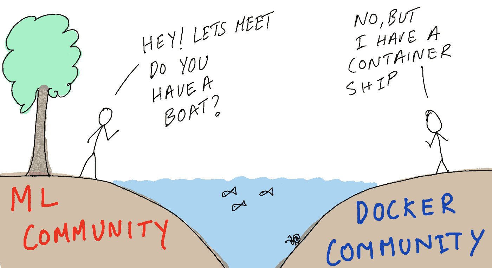

作者插图

如果几年前你告诉我，数据科学家将在他们的日常工作中使用 Docker 容器，我不会相信你。作为更广泛的机器学习(ML)社区的一员，我总是考虑 Docker、Kubernetes、Swarm(还记得吗？)供 IT/运营专家使用的奇特基础设施工具。今天是一个不同的故事，我几乎没有一天不使用 Docker 容器来训练或托管模型。

机器学习开发区别于传统软件开发的一个属性是，它依靠专门的硬件如 GPU、Habana Gaudi、AWS Inferentia 来加速训练和推理。这使得独立于硬件的容器化部署变得非常困难，而这正是容器的主要优势之一。在这篇博文中，我将讨论 Docker 和容器技术是如何发展来应对这一挑战的。我们将讨论:

*   为什么 Docker 已经成为当今机器学习的重要工具，以及它如何解决机器学习的特定挑战
*   Docker 如何访问拥有多种类型处理器(CPU + AI 加速器)的异构系统上的专用硬件资源。
*   不同的人工智能加速器如何扩展 Docker 的硬件访问，以 1/NVIDIA GPU 和 NVIDIA 容器工具包以及 2/ AWS 推理和神经元 SDK 对容器的支持为例
*   如何利用硬件加速节点在 Kubernetes 上扩展 Docker 容器

这篇博文的很大一部分是 motiviation 和“它如何在引擎盖下工作”，但我也包括了如何开始使用 NVIDIA GPUs 上的 Docker 容器或 AWS 上的 AWS 推理工具的演练、链接和截图，因此对于学习者和实践者来说都有一些东西。

# Docker 和机器学习没有一起长大(但他们现在是最好的朋友)

如今，大多数组织使用 Docker 和容器技术来简化开发和部署过程，因为容器化的应用程序是一致的、可移植的，并且保证可再现性。虽然 Docker 容器应该是硬件不可知的和平台不可知的，但是大多数基于机器学习的软件栈是硬件特定的，并且需要访问主机操作系统上的硬件和硬件驱动程序。为了更好地理解这个问题，让我们仔细看看典型的机器学习软件栈的解剖。

## 典型机器学习软件堆栈剖析

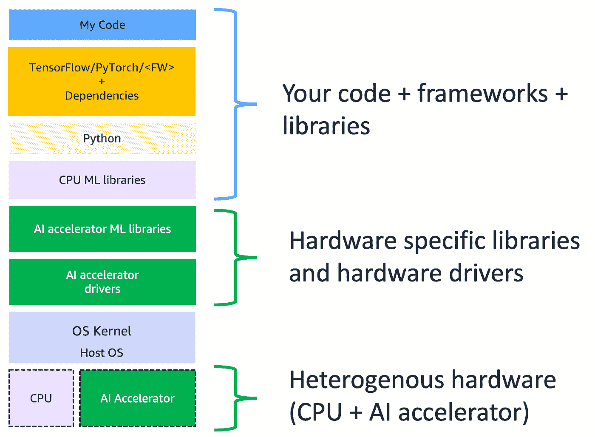

作者插图

上图所示的软件堆栈看起来非常典型。用蓝色花括号显示的顶部包括你的代码、你正在使用的框架、语言和其他底层库。无论您使用什么应用程序、框架或语言，这一部分看起来都是相似的。栈的其余部分是机器学习开始变得独特的地方。绿框是影响便携性的硬件特定组件，它们的作用如下:

*   **AI 加速器 ML 库:**这些是 ML 框架用来在 AI 加速器硬件上实现机器学习训练或推理例程的低级库。他们实现线性代数和其他计算密集型例程，这些例程可以并行化并在 AI 加速器上运行。
*   **人工智能加速器驱动程序:**这些是主机操作系统用来识别和支持人工智能加速器硬件的驱动程序。
*   **AI 加速器**:这是一款专用处理器，旨在加速机器学习计算。机器学习主要由矩阵-矩阵数学运算组成，这些专门的硬件处理器旨在通过利用并行性来加速这些计算。你可以在其他博客文章中阅读更多关于 AI 加速器的内容:1/[AI 加速器指南](/a-complete-guide-to-ai-accelerators-for-deep-learning-inference-gpus-aws-inferentia-and-amazon-7a5d6804ef1c)2/[AI 加速器的演变](/ai-accelerators-machine-learning-algorithms-and-their-co-design-and-evolution-2676efd47179)

拥有一个 CPU +其他类型处理器的系统称为异构系统。异构系统提高了性能和效率，因为有专用于特定任务的处理器，但代价是增加了复杂性。这种复杂性的增加给软件堆栈的可移植性和开发者用户体验带来了挑战。这是 Docker 必须解决的挑战，我们将在下面看到它是如何做到的。

# Docker 如何支持主机设备？

默认情况下，Docker 容器不能访问主机操作系统资源，这是设计使然。Docker 容器旨在提供进程隔离，因此用户必须提供对主机资源(如卷和设备)的显式访问。您可以通过使用`—-devices`参数来做到这一点，但是它带有一些警告。

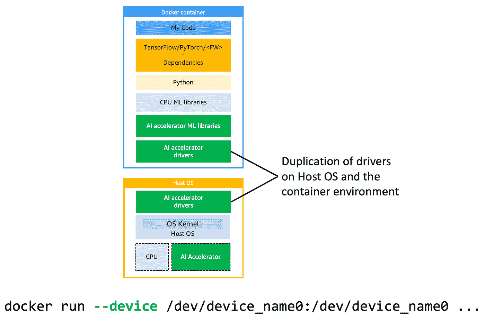

作者插图

一些硬件设备，如 USB 和串行设备，具有在内核空间运行的驱动程序，Docker 必须依赖主机内核并执行系统调用来与设备硬件交互。使用`--device`参数并安装设备，可以在 Docker 容器进程中轻松访问这些设备。然而，其他硬件设备，如一些网卡和人工智能加速器，其驱动程序具有用户空间组件和内核空间模块。在这种情况下，您需要在主机操作系统和 Docker 容器中重复安装驱动程序。

假设您想要启动一个容器进程，并且想要公开一个名为`device_name0`的设备，那么您将运行以下命令:

```
docker run --device /dev/device_name0:/dev/device_name0 …
```

如果`device_name0`同时具有用户空间和内核空间驱动程序组件，那么您还必须在 Docker 容器中安装设备驱动程序，这将复制主机和容器环境中的驱动程序，如本节顶部的插图所示。

这种设置有一些缺点:

*   **增加集装箱尺寸:**集装箱应该是轻便易携带的，而司机通常很大，占据很大空间。例如，最新的 NVIDIA GPU 驱动程序可以在容器中占用 350 到 500 MB 的额外空间。这增加了容器映像下载和实例化时间，并且会影响应用程序的延迟敏感性和用户体验
*   **驱动程序版本不匹配:**为了使该解决方案有效，容器环境和主机操作系统中的驱动程序版本必须匹配。如果它们不同，容器进程可能无法与硬件对话。
*   **设置复杂性:**在容器中安装驱动程序是额外的步骤，你放入容器中的每一个额外的库或软件都会增加额外的复杂性，并且需要进行测试。
*   **便携性下降:** Docker 容器被设计成轻量级、便携和硬件无关的。容器中的驱动程序使它变得笨重、特定于硬件、特定于平台，并且基本上没有 Docker 容器的所有优点。

至少，目标应该是通过一种解决方案来解决这些挑战，这种解决方案不需要在容器内复制设备驱动程序，并允许 Docker 通过多个加速器来固定访问系统上的一些或所有 AI 加速器。现在让我们来看看 Docker 是如何应对这一挑战的。

# 我们如何让 Docker 与专门的机器学习硬件一起工作？

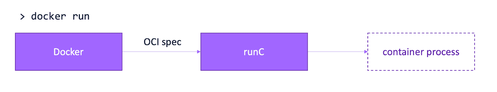

作者插图

我们将从快速概括 Docker 如何运行容器开始。当您使用 Docker CLI 通过`docker run …`启动一个容器进程时，在它最终调用一个非常重要的库`runC`之前，会发生一系列的步骤。

`runC`是一个开放容器倡议(OCI)兼容工具，用于生成和运行容器进程，由 Docker、Podman、CRI-O 和其他流行的容器运行时使用。当您使用 Docker CLI 运行一个容器时，Docker 为`runC`提供了一个符合 OCI 规范的运行时规范文件(在图中显示为“OCI 规范”)和容器的根文件系统，统称为符合 OCI 规范的`Bundle`，后者`runC`将其作为创建和运行容器进程的输入。OCI 规范文件提供了额外的选项，比如启动前和启动后挂钩，以便在创建容器处理之前和之后启动其他进程。硬件提供者可以利用这些钩子将硬件访问注入到容器进程中。让我们看看怎么做。

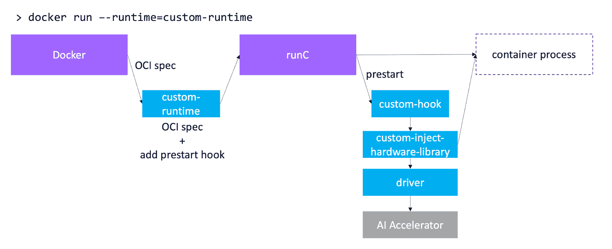

向 Docker 引入 AI 加速器支持的通用模板。作者插图

人工智能加速器提供者可以使用预启动挂钩来扩展`runC`的功能，以通过外部应用程序挂钩到容器的生命周期中。这个外部应用程序通常是一个库，它与硬件驱动程序对话，并在容器进程中公开硬件。上图中的蓝框显示了如何使用 Docker 和`runC`特性向容器进程通告专门的硬件。让我们来看看在 Docker 容器中实现专用硬件支持的通用模板中的组件:

*   **自定义运行时:** Docker 允许你使用`/etc/docker/daemon.json`定义一个自定义运行时。使用定制运行时，您可以截取从 Docker 接收的 OCI 规范，添加一个预启动钩子，并将更新后的规范转发给`runC`。
*   **自定义钩子:** `runC`从自定义运行时接收的规范中读取预启动钩子，并执行自定义钩子。这个定制钩子调用一个或多个特定于硬件的库，这些库可以与硬件驱动程序对话，并在容器进程中公开它
*   **custom-inject-hardware-library:**这个库负责与硬件驱动程序通信，以收集关于硬件和系统中处理器数量的信息。它还负责将硬件设备安装到容器环境中，并使其可用于容器进程中的应用程序。

下面，我们就来看看 Docker 是如何访问 NVIDIA GPUs 和 AWS 推理的。

# 启动 NVIDIA GPU 和 AWS 推理亚马逊 EC2 实例

首先，我们将启动 Amazon EC2 实例来演示 Docker 如何与专用硬件一起工作。遵循这个指南[为机器学习](https://docs.aws.amazon.com/dlami/latest/devguide/launch-from-console.html)启动一个 EC2 实例。对于 NVIDIA GPUs，选择任意大小的 P 或 G 系列实例类型。如果你需要帮助在 AWS 上选择正确的深度学习 GPU，请阅读我的博客文章:

[](/choosing-the-right-gpu-for-deep-learning-on-aws-d69c157d8c86)  

对于 AWS 推理实例，选择 Inf1 实例类型。在这个例子中，我启动了`inf1.2xlarge` (AWS 推理)和`p3.8xlarge` (4 个 NVIDIA V100 GPUs)。

一旦你选择了你的实例类型，你必须选择一个亚马逊机器映像(AMI)，并且[我们将使用 AWS 深度学习 AMI](https://docs.aws.amazon.com/dlami/latest/devguide/appendix-ami-release-notes.html) ，它预装了 GPU 驱动程序、AWS 推理驱动程序、深度学习框架、conda 和其他工具。选择一个具有您工作所需的深度学习框架的正确类型和版本的 AMI，对于这个例子，我将选择 Ubuntu 18.04 的多框架 DLAMI。

启动 Amazon EC2 实例后，您可以在 EC2 控制台上看到它们，并且可以通过 ssh 进入它们来运行您的应用程序。你也可以阅读我在[上的博文为什么要使用 Docker 容器进行机器学习开发？](https://aws.amazon.com/blogs/opensource/why-use-docker-containers-for-machine-learning-development/)了解如何在 EC2 上运行的 Docker 容器中 ssh 和设置 jupyter 服务器。

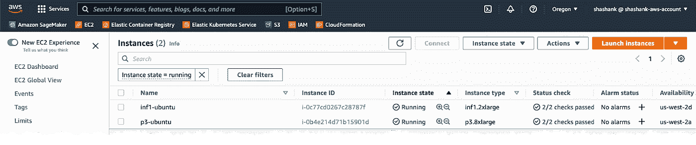

亚马逊 EC2 控制台截图

# 在 Docker 容器中访问 NVIDIA GPUs

NVIDIA 提供了 [NVIDIA Container Toolkit](https://docs.nvidia.com/datacenter/cloud-native/container-toolkit/install-guide.html) ，这是一个工具和库的集合，增加了对 Docker 容器中 GPU 的支持。

```
docker run **--runtime=nvidia --gpus=all** … 
```

当您运行上述命令时，NVIDIA Container Toolkit 会确保系统上的 GPU 在容器进程中是可访问的。由于我们推出了一个带有 AWS 深度学习 AMI 的 Amazon EC2 实例，您不需要安装 NVIDIA Container Toolkit，因为它是预装的。如果您从基础 AMI 开始，请遵循 [NVIDIA Container Toolkit 文档](https://docs.nvidia.com/datacenter/cloud-native/container-toolkit/install-guide.html#supported-platforms)中的安装说明。

## NVIDIA 容器工具包的工作原理

NVIDIA 容器工具包包括`nvidia-container-runtime`、`nvidia-container-runtime-hook`和`libnvidia-container`。让我们来看看这些是如何工作的。

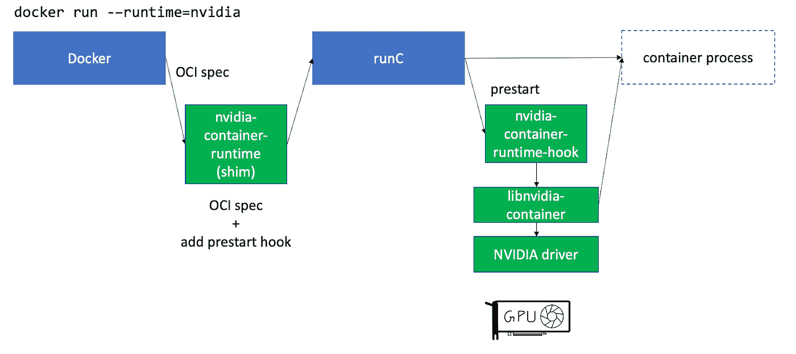

作者插图

NVIDIA Container Toolkit 通过在`/etc/docker/daemon.json`中指定来注册自定义运行时。这个定制运行时是一个 shim，它从 Docker 获取运行时规范，将其修改为预启动钩子规范，并将该规范转发给 runC。

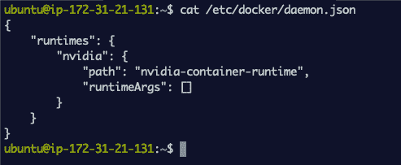

显示 Docker 调用的自定义 nvidia 运行时的屏幕截图

NVIDIA 容器工具包还允许您使用基于文件的配置来配置容器运行时。你可以编辑`/etc/nvidia-container-runtime/config.toml`文件来为你的驱动程序、运行时间、改变默认运行时间、启用调试等指定不同的位置。如果您没有自定义设置，可以保留默认值。

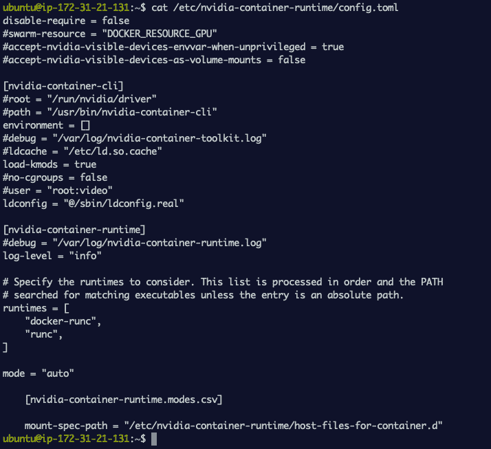

显示 config.toml 的屏幕截图

假设您运行了以下命令

```
docker run --runtime=nvidia --gpus=2 …
```

Docker 接受命令行参数，并将其翻译成符合 OCI 标准的运行时规范。`nvidia-container-runtime`将预启动添加到该规范中，并将其传递给`runC`。接下来，`runC`在修改后的规范中看到预启动挂钩，并在启动容器进程之前调用`nvidia-container-runtime-hook`。`nvidia-container-runtime-hook`查看容器运行时配置，以确定您请求在容器进程中公开什么 GPU 或多少 GPU。接下来，它调用`libnvidia-container`库，该库与 NVIDIA 驱动程序对话，以确定所请求的 GPU 数量(在本例中我们说`--gpus=2`)是否可用，如果可用，它将这些 GPU 设备注入容器。

为了测试 GPU 访问，我将从亚马逊 ECR 上亚马逊托管的深度学习容器[列表中下拉一个 Pytorch 容器。按照该页面中的说明登录 Amazon ECR 并运行`docker pull <IMAGE_NAME>`。然后运行下面的命令来启动容器。](https://github.com/aws/deep-learning-containers/blob/master/available_images.md)

```
docker run -it --rm --runtime=nvidia — gpus=all <IMAGE_NAME/ID> nvidia-smi
```

从输出中我们可以看到，我可以运行`nvidia-smi`这个工具，它查询并显示这个 EC2 实例上所有可用的 4 个 GPU，并且可以从容器内访问。

注意:如果你使用的是最新版本的 Docker 和 NVIDIA 容器工具包，那么`--runtime=nvidia`是可选的

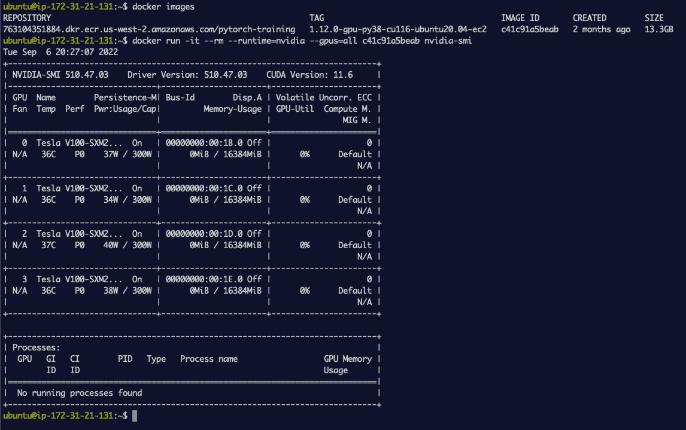

显示在 Docker 容器内运行的 nvidia-smi 输出的屏幕截图，该容器显示所有 GPU

如果您想在容器中只暴露 2 个 GPU，那么您可以简单地指定`–-gpus=2`或枚举您想在容器中使用的两个:

```
docker run -it — rm — runtime=nvidia — gpus=2 <IMAGE_NAME/ID> nvidia-smi# ORdocker run -it — rm — runtime=nvidia — gpus=’”device=0,1"’ <IMAGE_NAME/ID> nvidia-smi
```

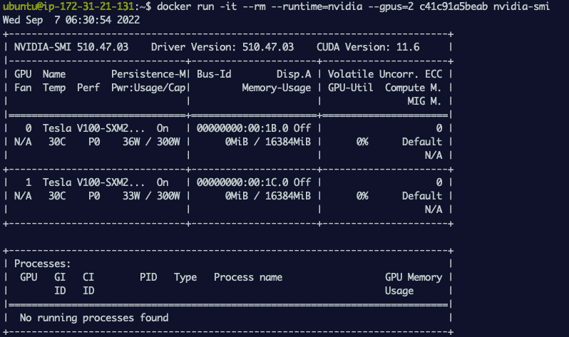

显示 nvidia-smi 在 Docker 容器中运行的输出的屏幕截图，仅显示 2 个 GPU

# 在 Docker 容器中访问 AWS 推理加速器

要准备带有 AWS 推理的 Inf1 Amazon EC2 实例，您可以[按照 AWS 神经元文档中的步骤](https://awsdocs-neuron.readthedocs-hosted.com/en/latest/neuron-deploy/tutorials/tutorial-docker-env-setup.html)安装神经元驱动程序、神经元运行时和一个名为`[oci-add-hooks](https://github.com/awslabs/oci-add-hooks)`的帮助程序库，它有助于添加 OCI 神经元预启动挂钩。

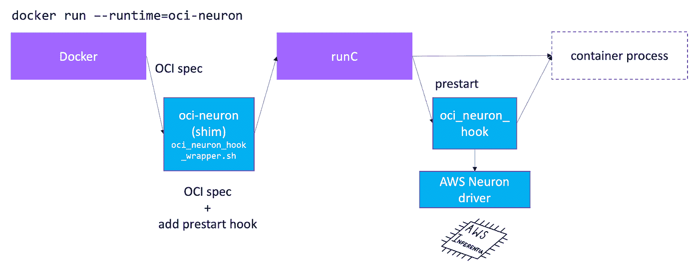

作者插图

## Docker 如何支持 AWS 推理

安装 Neuron SDK 并遵循 Docker 环境设置步骤后，您的系统应该有 oci-neuron-runtime、oci-neuron-hook。让我们来看看它们是如何工作的。

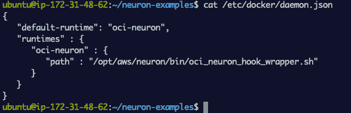

显示神经元运行时的屏幕截图

与 NVIDIA 容器工具包类似，Neuron SDK 通过在`/etc/docker/daemon.json`中指定来注册自定义运行时。从下面的截图可以看出，自定义 Docker 运行时只是一个 shell 脚本。回想一下，定制运行时的作用是简单地拦截对`runC`的调用，修改它以包含一个预启动钩子规范，并用更新后的规范调用`runC`。

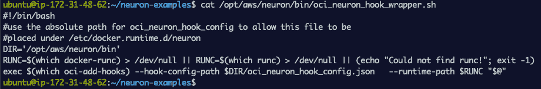

显示神经元挂钩垫片的屏幕截图

咱们打开打开`oci_neuron_hook_wrapper.sh`看看它在干什么:

*   指定到`oci_neuron_hook_config.json`位置的路径，这个 JSON 文件定义了预启动钩子应该调用什么库
*   获取`runC`库的位置
*   使用`[oci-add-hooks](https://github.com/awslabs/oci-add-hooks)`，这个工具可以从一个名为`oci_neuron_hook_config.json`的文件中获取预启动钩子定义，并生成一个更新的运行时规范，并将其传递给`runC`

我们可以打开`oci_neuron_hook_config.json`，你可以看到`oci_neuron_hook`，它是在创建容器进程之前由 runC 调用的库。

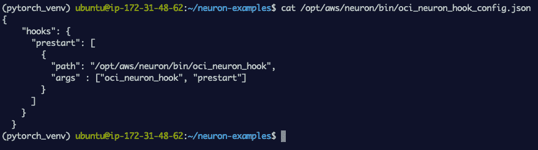

显示挂钩配置的屏幕截图

`oci_neuron_hook`库与 AWS 推理驱动程序对话，以确定请求数量的 AWS 推理设备是否可用，如果可用，它将这些设备注入容器。要在 Docker 中测试 AWS 推理支持，下载下面的 [Docker 文件](https://awsdocs-neuron.readthedocs-hosted.com/en/latest/neuron-deploy/docker-example/Dockerfile-libmode.html#libmode-dockerfile)并运行:

```
docker build . -f Dockerfile.app -t neuron-testdocker images
```

你应该会看到一个神经元测试图像

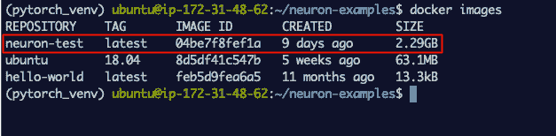

显示测试 neuron 的 docker 图像的屏幕截图

启动集装箱

```
docker run — env — runtime=oci-neuron AWS_NEURON_VISIBLE_DEVICES=”0" neuron-test neuron-ls
```

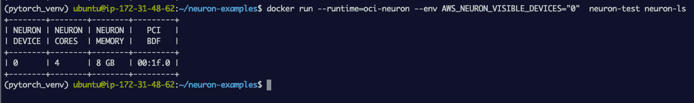

显示在 Docker 容器中运行的 neuron-ls 的输出的屏幕截图

您可以看到，neuron-ls 的输出显示了 Neuron 设备 0，它是在容器进程内部执行的。注意:`–-runtime=oci-neuron`是可选的，因为 neuron 是默认的运行时，如下所示。

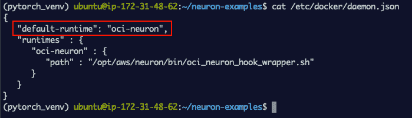

显示神经元运行时为默认运行时的屏幕截图

# Kubernetes 支持 NVIDIA GPUs 和 AWS 推理

到目前为止，我们已经看到 Docker 如何在一个容器内提供对专门硬件(如 NVIDIA GPUs 和 AWS 推理)的访问，这允许更可移植的机器学习代码。下一步自然是弄清楚如何在像 Kubernetes 这样的编排系统上运行这些 Docker 容器，这样就可以运行大规模部署。这个主题值得在博客中详细讨论，但是为了完整起见，我将快速总结一下如何访问 Kubernetes 中的 AI 加速器资源。

对于 NVIDIA 和 AWS 推理，每个 Kubernetes 节点的主机操作系统都必须包括相关的硬件驱动程序、自定义容器运行时和我们之前讨论过的其他库，以便在 Docker 容器中实现专门的硬件支持。启动亚马逊 EKS 集群最简单的方法是使用`[eksctl](https://docs.aws.amazon.com/eks/latest/userguide/getting-started-eksctl.html)` [CLI 工具](https://docs.aws.amazon.com/eks/latest/userguide/getting-started-eksctl.html)。

*   对于 NVIDIA GPUs 节点，指定一个 Amazon 深度学习 AMI 作为`eksctl`中节点的 AMI，因为它预装了 NVIDIA Container Toolkit。
*   对于 AWS 推理节点，`eksctl`工具将自动检测到您有一个带有 AWS 推理的节点，并将使用预装了 Neuron SDK、驱动程序和 Docker 支持库的 Amazon Linux AMIs。

接下来，为了使这些 AI 加速器作为系统资源在 Kubernetes 中可用，你需要部署一个特定于硬件的 [Kubernetes 设备插件](https://kubernetes.io/docs/concepts/extend-kubernetes/compute-storage-net/device-plugins/)。NVIDIA 和 AWS 都提供设备插件，您可以按如下方式应用:

## AWS 推理:

```
kubectl apply -f k8s-neuron-device-plugin.yml
```

您可以从 Neuron SDK 文档中[下载](https://awsdocs-neuron.readthedocs-hosted.com/en/latest/neuron-deploy/tutorials/tutorial-k8s.html#tutorial-k8s-env-setup-for-neuron)这个设备插件，它作为一个`daemonset`运行，并在 pods 中公布要包含的硬件，您可以在清单中的资源下指定 AWS 推理硬件，如下所示:

```
resources:
    limits:
        aws.amazon.com/neuron: 1
```

## NVIDIA GPUs:

```
kubectl apply -f [https://raw.githubusercontent.com/NVIDIA/k8s-device-plugin/v1.12/nvidia-device-plugin.yml](https://raw.githubusercontent.com/NVIDIA/k8s-device-plugin/v1.12/nvidia-device-plugin.yml)
```

该 NVIDIA 设备插件也作为`daemonset`运行，并向 pods 通告硬件，您可以在清单中的资源下指定 NVIDIA GPU 硬件，如下所示:

```
resources:
    limits:
        nvidia.com/gpu: 1
```

你可以在亚马逊 EKS 文档页面上找到更多关于如何开始使用 [AWS 推理](https://docs.aws.amazon.com/eks/latest/userguide/inferentia-support.html)和 [NVIDIA GPU](https://docs.aws.amazon.com/deep-learning-containers/latest/devguide/deep-learning-containers-eks-setup.html#deep-learning-containers-eks-setup-gpu-clusters) 的详细说明。

# 闭幕(对，还有视频！)

希望您喜欢了解 Docker 如何在专用硬件上运行以及如何使用它。如果你喜欢这篇博文，我最近做了一个关于相同主题的演讲，你可能会感兴趣。

关于 Docker 如何在人工智能加速器上运行机器学习的 YouTube 视频

# 谢谢你看完！

如果您觉得这篇文章很有趣，可以考虑在 medium 上关注我，以便在我发布新文章时得到通知。也请查看我在 [medium](https://medium.com/@shashankprasanna) 上的其他博客帖子，或者在 twitter ( [@shshnkp](https://twitter.com/shshnkp) )、 [LinkedIn](https://www.linkedin.com/in/shashankprasanna/) 上关注我，或者在下面留下评论。想让我写一个特定的机器学习主题吗？我很想收到你的来信！