# 反向传播在神经网络中是如何工作的？

> 原文：<https://towardsdatascience.com/how-does-back-propagation-work-in-neural-networks-with-worked-example-bc59dfb97f48>

## 用一个例子演示背景如何在神经网络中工作

神经网络在训练阶段通过参数(权重和偏差)的迭代调整来学习。开始时，参数由随机生成的权重初始化，偏差设置为零。随后，数据通过网络向前传递，以获得模型输出。最后，进行反向传播。模型训练过程通常需要前向传递、反向传播和参数更新的几次迭代。

本文将关注反向传播如何在前向传递之后更新参数(我们已经在[的前一篇文章](/how-neural-networks-actually-work-python-implementation-part-2-simplified-80db0351db45)中介绍了前向传播)。我们将研究一个简单而详细的反向传播的例子。在我们继续之前，让我们看看我们将在这篇文章中使用的数据和架构。

# 数据和架构

本文中使用的数据集包含三个特性，目标类只有两个值— `1`表示通过，而`0`表示失败。目标是将数据点分类到这两个类别中的任何一个，这是一种二元分类的情况。为了让这个例子容易理解，我们将在这篇文章中只使用一个训练例子。

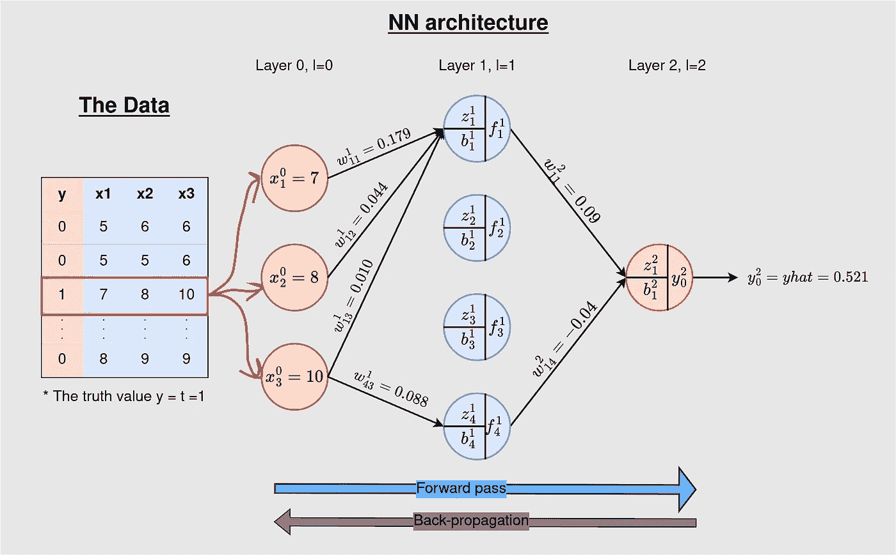

**图 1:** 我们将使用的数据和神经网络架构。我们的训练示例突出显示了其对应的实际值 1。这个 3–4–1 NN 是一个密集连接的网络——当前层中的每个节点都连接到前一层中除输入层以外的所有神经元。然而，我们已经消除了一些连接，使图形不那么杂乱。[向前传递产生 0.521 的输出](/how-neural-networks-actually-work-python-implementation-part-2-simplified-80db0351db45)(来源:作者)。

理解:正向传递允许信息沿一个方向流动—从输入层到输出层，而反向传播则相反—允许数据从输出层反向流动，同时更新参数(权重和偏差)。

**定义:**反向传播是一种监督学习方法，由神经网络用来更新参数，使网络的预测更加准确。参数优化过程是使用一种叫做**梯度下降**的优化算法实现的(这个概念在你阅读时会非常清楚)。

正向传递产生目标(`y`)的损失预测(`yhat`)，该预测由成本函数(E)捕获，该成本函数定义为:

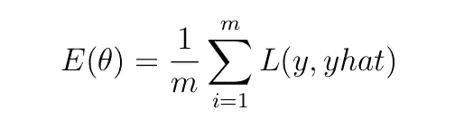

**等式 1:** 成本函数

其中`m`为训练样本数，`L`为模型预测`yhat`而非实际值`y`时产生的误差/损失。目标是最小化成本`E`。这是通过相对于(wrt)参数(权重和参数)对 E 求微分并在梯度的相反方向上调整参数来实现的(这就是为什么优化算法被称为**梯度下降**)。

在本帖中，我们考虑在`1`训练示例(`m=1`)上的反向传播。考虑到这一点，`E`减少到

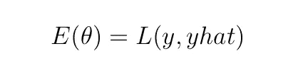

**等式 2:** 一个训练示例的成本函数。

# 选择损失函数 L

损失函数`L`是基于手头的任务定义的。对于分类问题，[交叉熵(也称为对数损失)](/cross-entropy-loss-function-f38c4ec8643e)和铰链损失是合适的损失函数，而均方误差(MSE)和平均绝对误差(MAE)是回归任务的合适损失函数。

二元交叉熵损失是一个适合我们二元分类任务的函数——数据有两类，`0`或`1`。二元交叉熵损失函数可以应用于图 1 的*中的前向传递示例，如下所示*

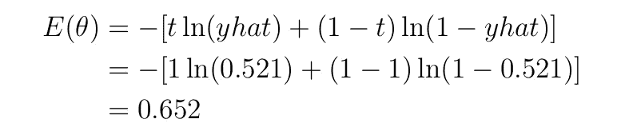

等式 3:应用于我们例子的二元交叉熵损失。

`t=1`是真值标签，`yhat` =0.521 是模型的输出，`ln`是自然对数——以 2 为底的对数。

你可以通过下面的链接了解更多关于交叉熵损失函数的信息。

 [## 交叉熵损失函数

### 在大多数分类问题中用于优化机器学习模型的损失函数…

towardsdatascience.com](/cross-entropy-loss-function-f38c4ec8643e) 

既然我们现在理解了神经网络结构和我们将使用的成本函数，我们可以直接讨论反向传播的步骤。

# 数据和参数

下表显示了`3–4–1` NN 所有层的数据。在`3`-神经元输入端，显示的值来自我们提供给模型用于训练的数据。第二/隐藏层包含我们希望更新的权重(`w`)和偏差(`b`)以及在正向传递期间每个`4`神经元的输出(`f`)。输出包含参数(`w`和`b`)和模型的输出(`yhat` ) —该值实际上是模型训练的每次迭代的模型预测。一次顺传后， `yhat=0.521`。

**图 2** 数据和参数初始化(来源:作者)

# A.更新方程和损失函数

**重要提示:**回想一下上一节:`E(θ)=L(y, yhat)`其中`θ`是我们的参数——权重和偏差。也就是说，`E`是`y`和`yhat`和`yhat=g(wx+b)`的函数，= > `yhat`是`w`和`b`的函数。`x`是数据变量，`g`是激活函数。实际上，`E`是函数`w`和`b`，因此可以对这些参数进行微分。

每一层的参数用以下公式更新

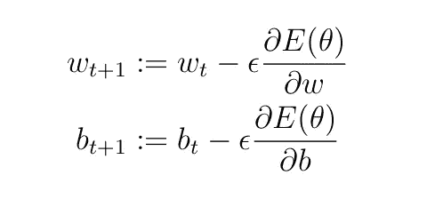

等式 4:更新等式

其中`t`是学习步骤，`ϵ`是学习速率——由用户设置的超参数。它决定了权重和偏差的更新速率。我们会用`ϵ=0.5`(任意选择)。

根据等式`4`，更新量变为

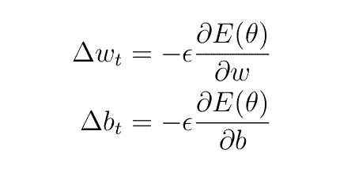

公式 5:更新金额

如前所述，由于我们正在处理二元分类，我们将使用二元交叉熵损失函数，定义为:

等式 6:二元交叉熵损失

我们将在所有层中使用 Sigmoid 激活

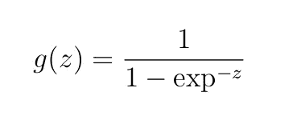

等式 7: Sigmoid 函数。

其中`z=wx+b`是神经元的加权输入加上偏置。

# B.更新输出隐藏层的参数

与正向传递不同，反向推进从输出层向后工作到层`1`。我们需要针对所有层的参数计算导数/梯度。为此，我们必须理解**微分链法则**。

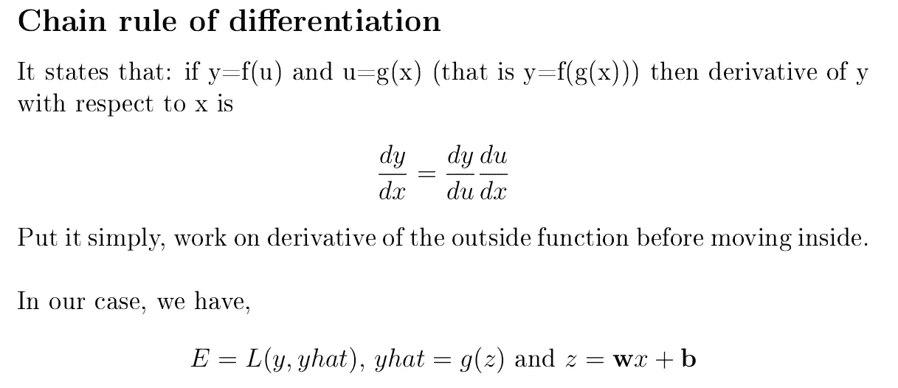

微分链式法则

让我们以更新`w²₁₁`和`b²₁`为例。我们将遵循如下所示的路线。

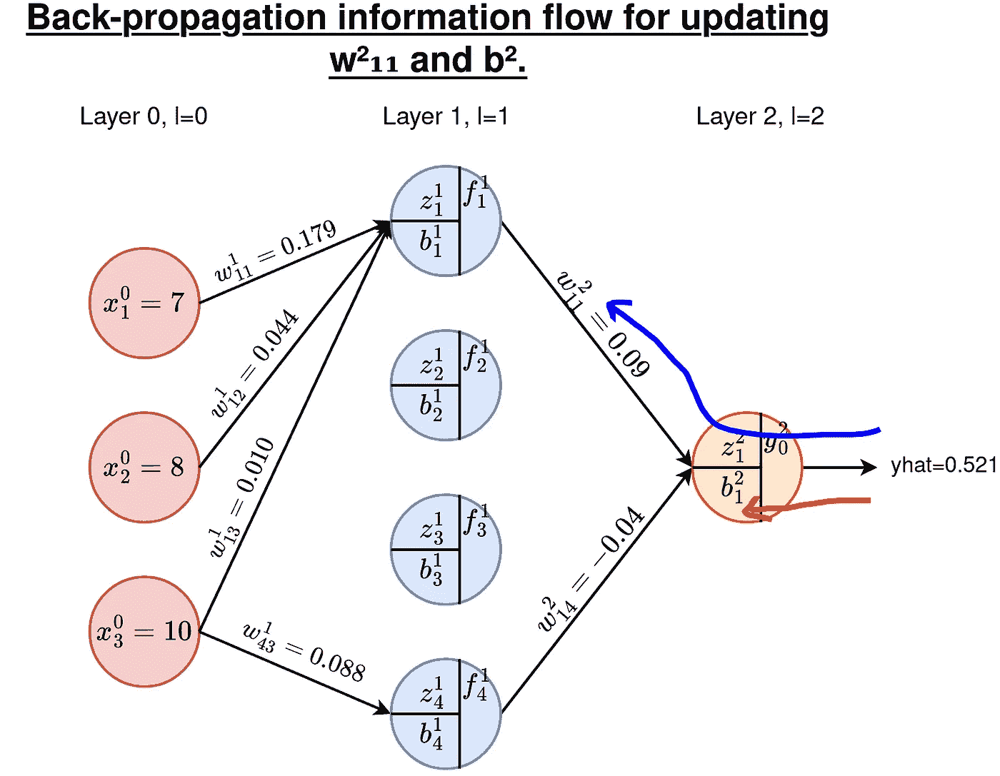

**图 3:** 反向传播信息流(来源:作者)。

## B1。计算重量的导数

根据微分的链式法则，我们有

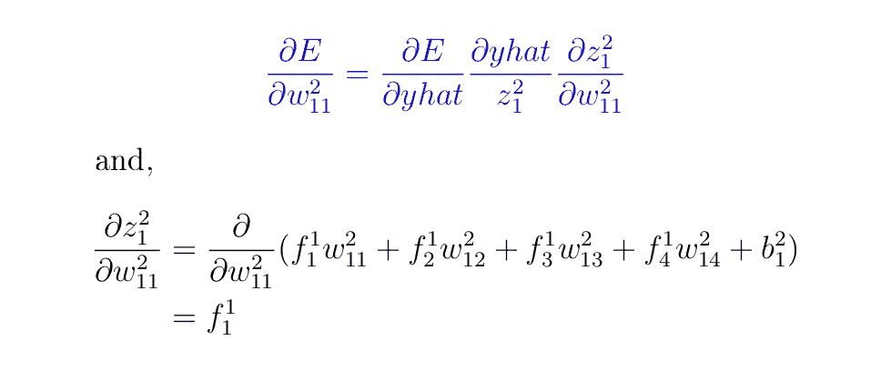

**记住:**当计算上述关于 w·₁₁的导数时，所有其他参数都被视为常数，即 w·₁₂、w·₁₃、w·₁₄和 b·₁.常数的导数是`0`，这就是为什么在上面的导数中删除了一些值。

接下来是 Sigmoid 函数的导数(参见[本文](/derivative-of-sigmoid-and-cross-entropy-functions-5169525e6705)

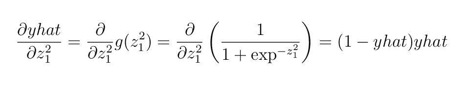

接下来，交叉熵损失函数的导数([参考资料](/derivative-of-sigmoid-and-cross-entropy-functions-5169525e6705)

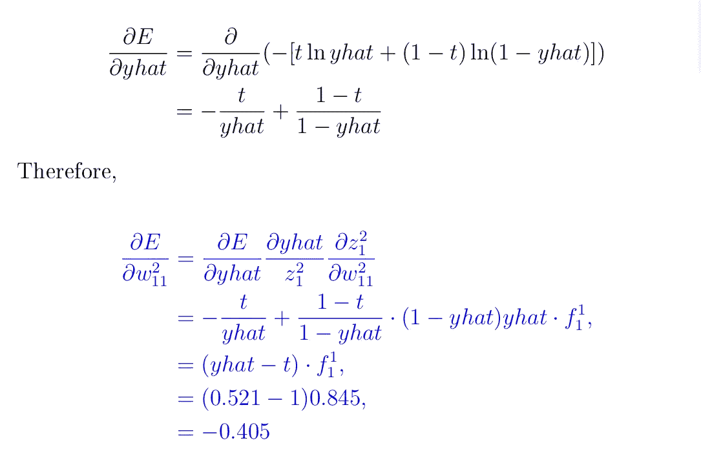

输出层上其他三个权重的导数如下(您可以确认这一点)

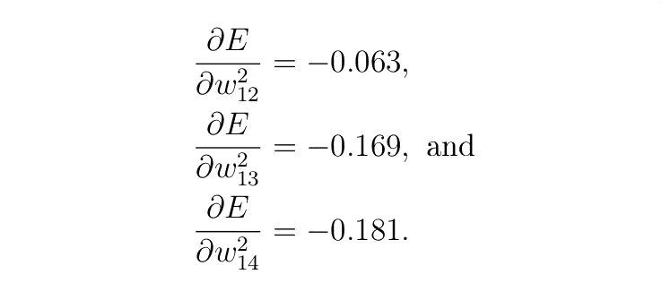

## B2。计算偏差的导数

我们需要计算

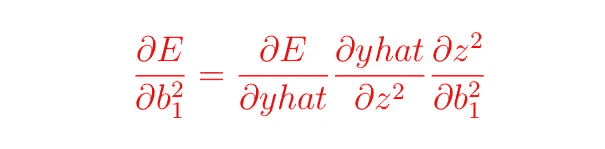

从前面的章节中，我们已经计算了`∂E`和 `∂yhat`，剩下的是

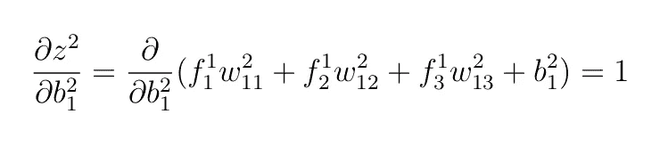

我们使用与之前相同的论点，即除了 b ₁之外的所有其他变量都被视为常数，因此当微分时它们减少`0`。

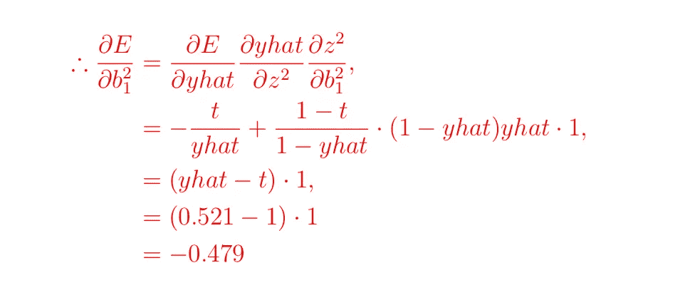

到目前为止，我们已经计算了关于输出-输入层的所有参数的梯度。

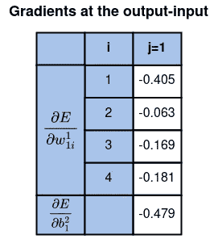

**图 4:** 输出-输入层的梯度(来源:作者)。

此时，我们已经准备好更新输出-输入层的所有权重和偏差。

## B3。更新输出隐藏层的参数

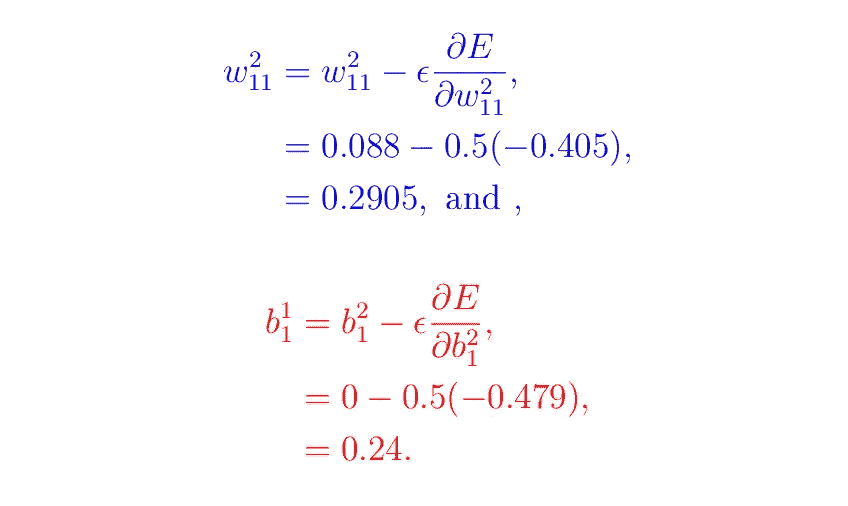

请用同样的方法计算其余的，并在下表中确认它们

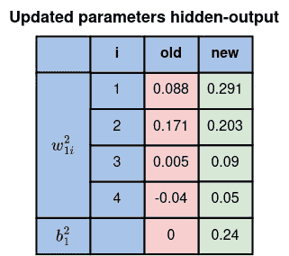

**图 5:** 隐藏输出层的更新参数(来源:作者)

# C.更新隐藏输入层的参数

和以前一样，我们需要 E 关于这些层上所有权重和偏差的导数。我们总共有`4x3=12`个权重要更新，还有`4`个偏差。例如，让我们研究西₄₃和₂.请参见下图中的路线。

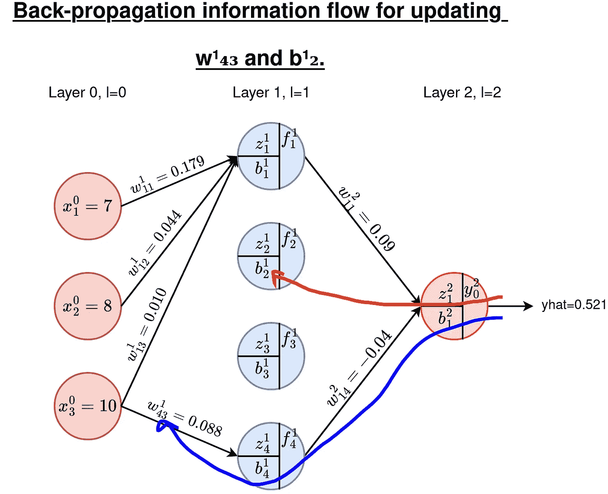

**图 6:** 隐藏输入层的反向传播信息(来源:作者)。

## C1。重量梯度

对于重量，我们需要计算导数(如果下面的等式令人生畏，请遵循图`6`中的路线)

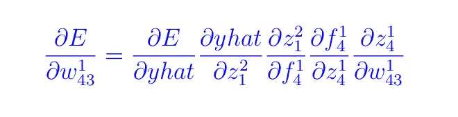

当我们讨论上述每个衍生工具时，请注意以下要点:

*   **在模型输出**(当找到`E`相对于`yhat`的导数时)，我们实际上是在对损失函数进行微分。
*   **在层输出** ( `f`)(这里我们对 wrt `z`进行微分)，我们找到激活函数的导数。
*   在上述两种情况下，对给定神经元的权重或偏差进行微分会产生相同的结果。
*   **加权输入** ( `z`)与我们希望更新的参数(`w`或`b`)不同。在这种情况下，*除了感兴趣的参数*外，所有参数保持不变。

进行与第`B`节相同的过程，我们得到:

*   层的加权输入`1`

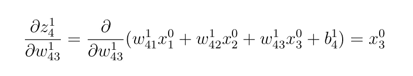

*   应用于第一层的 Sigmoid 激活函数的导数

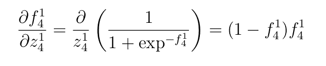

*   输出层的加权输入。`f`-值是隐藏层的输出。

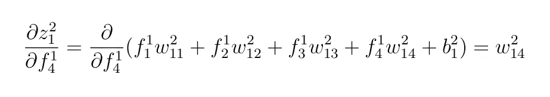

*   应用于最后一层输出的激活函数。

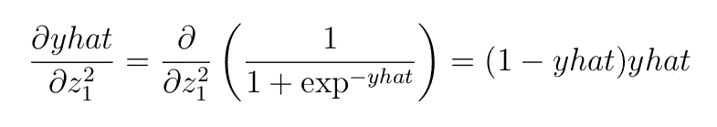

*   二元交叉熵损失函数的导数 wrt 到`yhat`。

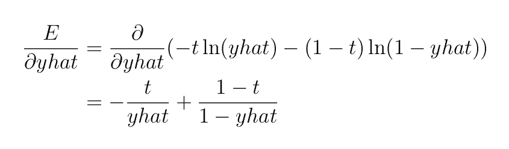

然后，我们可以把所有这些放在一起

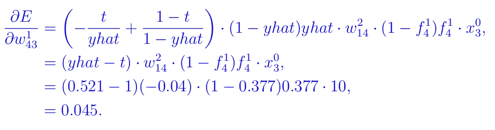

## C2。偏差梯度

使用和以前一样的概念，检查一下，对于₂，我们有

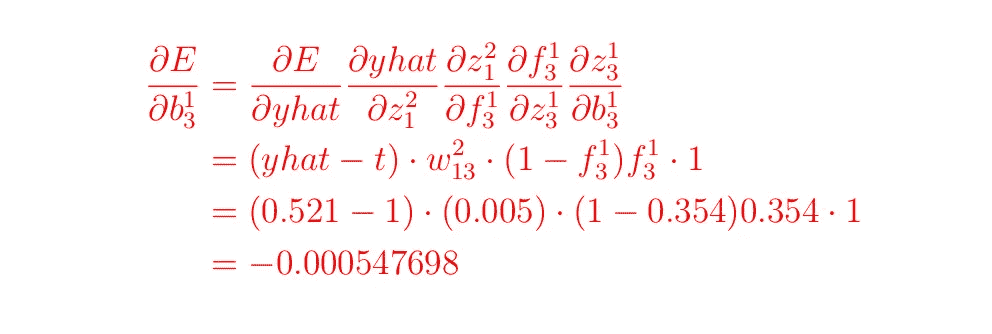

隐藏输入的所有梯度值如下表所示

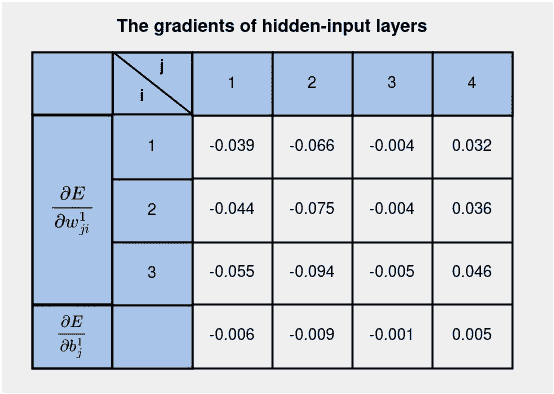

**图 7:** 隐藏输入层的渐变(来源:作者)。

此时，我们已经准备好计算隐藏输入端的更新参数。

## C3。更新隐藏输入的参数

让我们回到更新方程，继续更新₁₃和₃

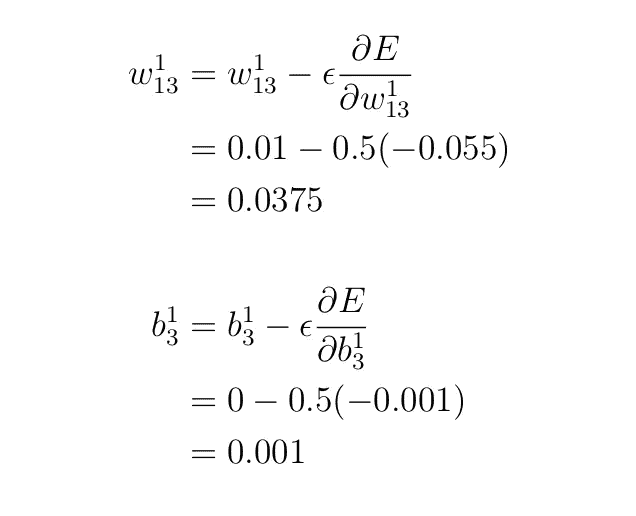

那么，我们需要更新多少参数呢？

我们在隐藏输入层有`4x3=12`权重和 `4x1=4`偏差，在输出隐藏层有`4x1=4` 权重和`1`偏差。总共有 21 个参数。它们被称为**可训练参数**。

隐藏输入层的所有更新参数如下所示

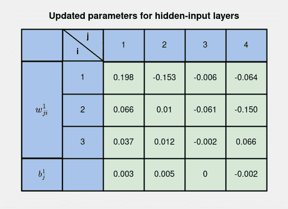

**图 8:** 隐藏输入层的更新参数(来源:作者)。

我们现在已经使用误差反向传播获得了**图 8** 和**图 5** 中所有层的更新参数。用这些更新的参数运行一个正向传递产生一个模型预测，从`0.521`上升到`0.648`的`yhat`。这意味着模型正在学习——经过两次迭代训练后，接近`1`的真实值。其他迭代产生`0.758`、`0.836`、`0.881`、 `0.908`、`0.925`、…(在下一篇文章中，我们将为许多训练示例和迭代实现反向传播和正向传递，您将会看到这一点)。

# 定义

1.  **历元** —一个历元是指整个数据集通过网络一次。这包括正向传递和反向传播的一个实例。
2.  **Bath size** 是同时通过网络的训练样本数。在我们的例子中，我们有一个训练的例子。在我们有一个大数据集的情况下，数据可以通过网络批量传递。
3.  **迭代次数** —使用设定为批量的训练样本，一次迭代等于一次通过。一次传递是正向传递和反向传播。

**例:** 如果我们有 **2000 个训练例**，设置**批量为 20 个**，那么 i *t 需要 100 次迭代才能完成 1 个历元*。

# 结论

在本文中，我们通过一个例子讨论了反向传播。我们已经看到如何使用微分链规则来获得不同方程的梯度——损失函数、激活函数、加权方程和层输出方程。我们还讨论了如何使用损失函数的导数来更新每一层的参数。在下一篇文章(附后)中，我们用 Python 实现了这里学到的概念。

 [## 反向传播如何工作——Python 实现？

### 在 Python 中实现反向传播

towardsdatascience.com](/how-back-propagation-works-a-python-implementation-21004d3b47c6) 

请以每月 5 美元的价格注册成为 medium 会员，以便能够阅读我和其他作者在 Medium 上的所有文章。

你也可以[订阅，当我发表文章时，你可以把我的文章发到你的邮箱里](https://medium.com/subscribe/@kiprono_65591)。

感谢您的阅读，下次再见！！！

# 你可能会发现这些文章很重要

*   [在 Python 中实现前向传播](/how-neural-networks-actually-work-python-implementation-part-2-simplified-80db0351db45)
*   [交叉熵损失函数](/cross-entropy-loss-function-f38c4ec8643e)