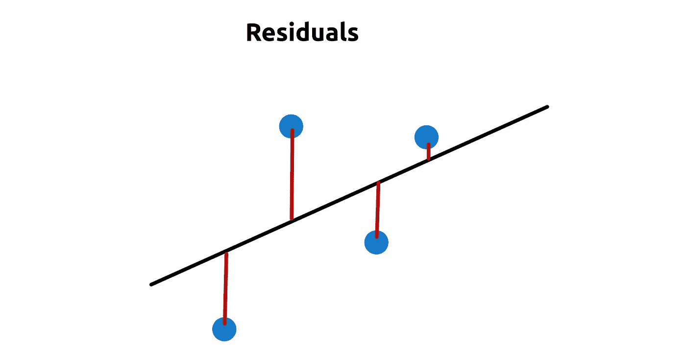
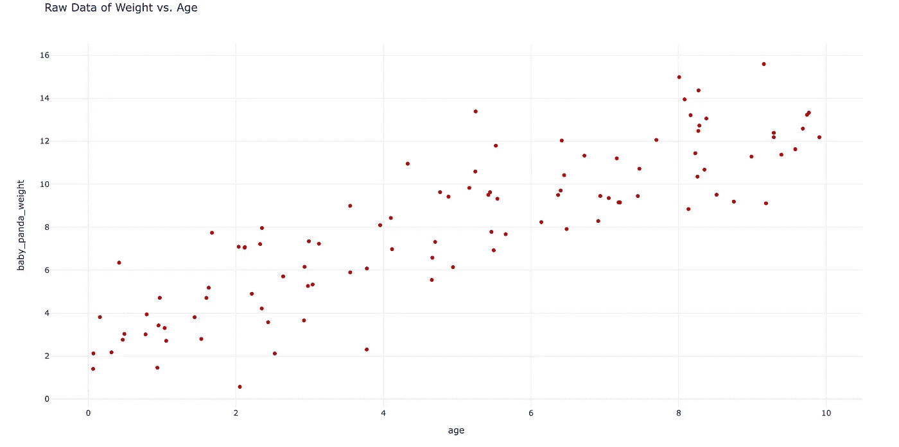
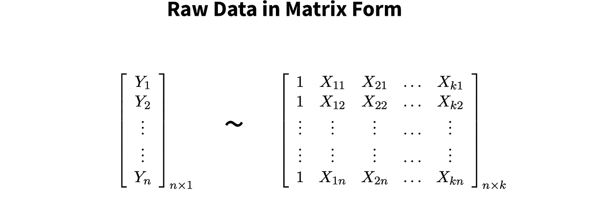
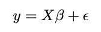
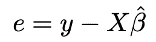
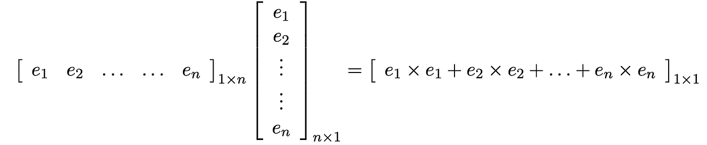
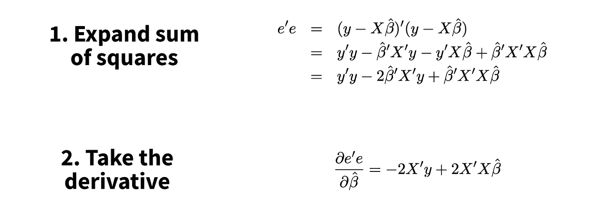
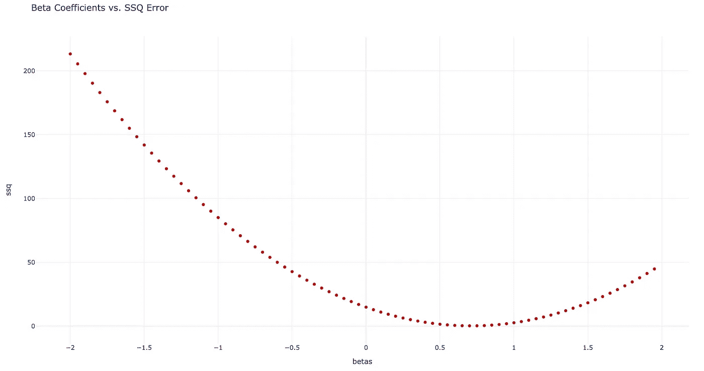

# 线性回归到底是怎么工作的？

> 原文：<https://towardsdatascience.com/how-does-linear-regression-really-work-2387d0f11e8>

## 普通最小二乘法背后的数学和直觉(OLS)

你知道线性回归如何在“保持其他一切不变”的情况下衡量效果吗？或者它如何最小化误差平方和？在这篇文章中，我们将讨论如何，以及更多。


照片由 [Datingscout](https://unsplash.com/@datingscout?utm_source=medium&utm_medium=referral) 在 [Unsplash](https://unsplash.com?utm_source=medium&utm_medium=referral) 上拍摄

我们将利用矩阵代数和 python 来理解正在发生的事情。可能的话，我们会深入。但是，由于主题的复杂性，我们还会链接更多信息的外部资源。

这篇文章的主要来源是斯坦福大学统计课的课堂笔记。

事不宜迟，让我们开始吧…

# 技术 TLDR

普通最小二乘(OLS)线性回归通过最小化残差的平方来拟合数据。为此，我们…

1.  用公式表示线性回归方程的残差。
2.  求残差平方和的导数。
3.  求解上面导数为零的β系数值。

通过平方误差，我们的误差曲线变成一条向上的抛物线。因此，如果我们求解最优解，我们保证会求解全局最小值。

# 1 —但是实际上发生了什么呢？

好了，我们将放慢速度，浏览一些演示，以便真正理解幕后发生的事情。

## 1.1 —线性回归的目的

在本帖中，我们将寻找熊猫宝宝的体重模型(照片用于科学目的)。


[帕斯卡·米勒](https://unsplash.com/@millerthachiller?utm_source=medium&utm_medium=referral)在 [Unsplash](https://unsplash.com?utm_source=medium&utm_medium=referral) 上的照片

我们的自变量的一些例子包括`age`(数字)、`amount of bamboo eaten`(数字)和`whether they had siblings`(布尔)。我们还将添加常量值`1`来计算 y 截距。

甚至在开始之前，为了建立`weight ~ predictors`模型，我们必须做一些基本的假设，比如线性、正态性和同方差。这里有一个关于 OLS 的[假设的非常深入的资源，但是为了简洁，我们不打算覆盖这些假设。](/assumptions-in-ols-regression-why-do-they-matter-9501c800787d)

## 1.2 —数学目标

现在有许多方法来拟合我们的 X 和 y 之间的关系。普通最小二乘法(OLS)是最简单和最常用的方法。它寻求最小化残差平方和。

残差是我们的线性回归线和数据点之间的**距离，如图 1 中的红线所示。**



图 1:残差的可视化(红色)。图片作者。

平方残差是一种测量模型拟合的常用方法，因为它简单，易于数学处理，并且保证为正。在某些情况下，我们可能希望将高估(正残差)与低估(负残差)区别对待，但这本身就是一个完整的主题。

总之，**OLS 的目标是找到使残差最小化的直线的斜率。**


图 2:2D 超平面的例子— [src](https://gist.github.com/lambdalisue/7201028) 。图片作者。

在我们的例子中，我们有多个预测器，所以我们将拟合一个高维超平面，如图 2 所示。很难想象三维以外的任何东西，但希望这个有 3 个轴(独立变量)的例子可以在概念上进一步外推。

太好了！有了这个设置，让我们进入数学。

# 2—OLS 的矩阵代数

我们将假设没有矩阵代数的先验知识。此外，因为许多读者可能熟悉代码，我们将利用 python 来理解矩阵符号。

在开始之前，这里是这篇文章的所有[源代码](https://github.com/mberk06/DS_academic_papers/blob/master/36_math_of_ols.py)。如果需要，请随意使用。

## 步骤 0:设置我们的数据

我们将**创建上面提到的独立变量**。为了确保一定程度的线性，我们将使用这些来*创建*我们的因变量`baby_panda_weight`。

接下来，让我们绘制`age`对`baby_panda_weight`(图 3)来看看我们做得如何。



图 3:使用虚假数据绘制的年龄与体重图。图片作者。

总的来说，剧情上似乎有一种比较线性的关系。

接下来让我们用数学符号做同样的事情(不实际创建真实数据)…



图 4:自变量(X_ij)和因变量(Y_i)的矩阵符号。图片作者。

在图 4 中，每行对应一个独特的观察，每列对应一个变量。矩阵`Y`有一列对应于`baby_panda_weight`，矩阵`X`有 4 列对应于我们的 4 个自变量。

在继续之前，先简单说明一下。python 中的 Pandas 数据框使用相同的结构-列是要素，行是唯一的观察值。然而， [numpy](https://numpy.org/) 数组的默认实现是相反的。

```
import pandas as pda, b = [1,2,3], [4,5,6]numpy_arr = np.array([a, b])
pandas_df = pd.DataFrame(dict(a=a, b=b))numpy_arr.shape         # (2,3)
pandas_df.shape         # (3,2)
```

在 numpy 中工作时，转置数据以返回到一个*行 x 列*形状通常很有帮助。

## 步骤 1:定义优化问题

现在我们有了用矩阵表示的小熊猫数据，让我们用简单的矩阵符号定义 OLS…



图 5:线性回归的最简单公式。作者图片

这里，我们有四个术语。`y`和`X`同上——它们分别是因变量和自变量的向量。但是，我们也添加了两个新术语:beta ( `β`)和 epsilon ( `ε`)。β是我们自变量的线性系数矩阵——它显示了 X 的一个单位变化对 Y 的影响程度。ε是一个误差矩阵——它显示了**我们的预测有多错误**。

现在不要担心翻译。我们稍后再来。

## 第二步:制定残差

酷毙了。现在我们已经定义了我们的术语，让我们开始寻找最好的测试集。

如上所述，贝塔需要**最小化残差平方和**。但是，我们如何计算残差呢？

让我们从 python 开始，然后转到矩阵符号…

```
beta = 1.0true_value = baby_panda_weight
fitted_value = (age * beta)resid = true_value - fitted_value
```

如 python 代码所示，残差就是我们的 ***真实值*减去*拟合值*。相当简单。**



图 6:剩余公式。图片作者。

如图 6 所示，残差也可以写成 **OLS 公式，其中误差项被隔离**。`Xβ`是我们的拟合值，我们的模型预测的值，而`y`是我们的真实值。

## 第三步:平方残差并求和

现在，我们已经得到了我们的残差，让我们平方和求和。平方的目的是让我们能够轻松求解贝塔系数的最佳值，我们将在第 3 节中讨论这一点。

```
sum_of_squares_python_style = np.sum(resid ** 2)
```

在上面的 python 代码中，我们首先对残差求平方，然后求和。这很完美，但是线性代数有另一种方法。

**任何时候你把一个向量乘以它自身的** [**转置**](https://www.youtube.com/watch?v=TZrKrNVhbjI&ab_channel=KhanAcademy) **，你就在计算平方和**。让我们看一个例子…



图 7:矩阵符号中残差平方和。图片作者。

如图 7 所示，向量乘法要求我们转置第一个向量，将其转换为“行”而不是“列”然后，通过等号右边的数学公式，我们得到这个向量的平方和。这个符号可以简化为图 8 中的值。


图 8:残差平方和的矩阵符号，即转置(误差)*误差。图片作者。

## 第四步:求导

到目前为止还好。我们有一个强大的数学方法来确定我们的平方和。

下一步是公式化我们的平方和项相对于β的[导数](https://www.youtube.com/watch?v=N2PpRnFqnqY&ab_channel=KhanAcademy)。我们将在接下来的步骤中了解为什么这是相关的。

```
term_1 = matmul(-2 * x.T, y)
term_2 = matmul(matmul(2 * x.T, x), beta)
derivative = term_1 + term_2
```

上面的 python 代码显示了我们的**残差平方和导数**的公式。如果你想知道我们是如何得到这个公式的，看看下面的矩阵符号…



图 9:我们的 SSQ 残差的导数。图片作者。

出于实用目的，我们不需要知道如何求导，所以我们要移动下一节。但是，你需要知道的是导数代表什么。**导数是直线在给定点的瞬时斜率。**

如果你想了解更多，这里有一个很好的教程，作者是 YouTubers 上最好的数学专家之一。

## 第五步:简化和解决

最后一步，为了找到使误差平方和最小的β值，我们将上述导数设置为零，并求解β(图 10)。


图 10:求解最佳 beta。图片作者。

为了简洁起见，代数步骤被省略了，但是最后一行显示了获得任何 OLS 模型的贝塔系数的公式——就这么简单。

让我们一步一步地完成这个计算…

```
a = matmul(x.T, x)
b = inv(a)
c = matmul(b, x.T)
best_betas = matmul(c, y)best_betas_one_line = matmul(matmul(inv(matmul(x.T, x)), x.T), y)
```

1.  `a`是方差/协方差矩阵。协方差在对角线上，方差在非对角线上。
2.  `b`是这个矩阵的逆矩阵——它本质上允许我们进行除法。
3.  `c`是我们的自变量“除以”方差/协方差矩阵。
4.  `best_betas`是`c`缩放到我们的 y 值。

这种计算背后的直觉是，我们实际上是取 X 和 Y 的协方差，然后除以 X 的方差。**我们分离出 Y 因 X 而变化的程度。**

现在你知道了！使用上面的 python 代码，您可以求解任何 beta 系数。

# 3—OLS 的直觉

现在我们已经理解了数学，让我们更深入地了解它为什么会起作用。

## 3.1-为什么我们知道残差平方和是凸的？

在上面的步骤 5 中，我们求解β，其中导数等于零。通过平方误差，我们保证有一个全局最小值，所以只要导数为零，我们就能最小化误差。

有两种不用证明的方法。

首先，通过对我们的残差求平方，我们产生一个二维抛物线。函数形式为`y=a(x²)`，其中`a`为比例参数。根据定义，抛物线只有一个最优值(最大值或最小值)。

朝下的抛物线要求上式中的`a`为负。然而，因为我们平方所有的残差，T3 就是 T4，我们保证对于β的某个值有一个全局最小值。

其次，让我们用简单的代码做一个简单的线性回归的例子。

```
import numpy as npdef ssq(x, y, beta):
    return np.sum((y - x * beta)**2)x = np.array([4,3,2])
y = np.array([3,2.2,1])betas = np.arange(-2, 2, 0.05)
errors = [ssq(x, y, b) for b in betas]
```

在上面的代码中，我们创建了两个向量，然后为我们的回归系数 beta 尝试了很多可能的值。如果我们绘制不同β值的误差图(图 11)，我们会得到一个向上的抛物线。



图 11:简单的可视化显示 ssq 误差是凸的。图片作者。

在本例中，误差实际上为零，但这并不总是有保证的。但是，通过利用 OLS 有单个最优值(在这种情况下是最小值)的事实，我们知道**我们的最小值的位置是我们的 SSQ 的导数为 0 的地方。**

## 3.2—你应该如何看待贝塔系数？

解释 OLS 系数非常困难。我们来分解一下…

*   每个自变量系数的**大小给出了该变量对因变量影响的大小。**
*   系数(正或负)上的**符号给你效果的方向。**

但是，这里有一些细节，所以我们来看一下每种系数类型的系数解释。

**3.2.1 — Y 轴截距(β0)**

> Y 截距系数(β0) 是 Y 的平均值，所有其他预测值为零。

你可以把β0 当做基线值。请注意，预测值为 0 并不总是有意义——如果我们将`year`作为一个特征包括在内会怎样。我们肯定没有 0 年的熊猫宝宝数据，所以考虑 y 截距是否有解释意义很重要。

示例解释:y 截距系数 400.0 意味着当熊猫的`age`、`amount of bamboo eaten`和`siblings`为 0 时，我们数据集中熊猫的平均体重为 400.0。

**3.2.2 —连续自变量**

> 连续可变系数是在其他因素保持不变的情况下，X 变化一个单位时 Y 均值的预期变化。

连续变量的系数代表`X`一个单位的变化，我们的`Y`应该变化多少。如上所述，数值越大，`Y`相对于`X`的变化就越大。如果符号为正，`Y`将随`X`增加，反之，如果符号为负，`Y`将随`X`减少。

示例解释:`age`上的系数 10.0 表示在其他因素保持不变的情况下，熊猫每年平均生长 10.0 个单位。

**3.2.3 —二元独立变量**

> 二进制可变系数是在其他因素保持不变的情况下，X 变化一个单位时 Y 均值的预期变化。

二进制变量可以用与连续变量相同的方式解释。它们只有两个值:0 或 1。还要注意，我们经常使用一种叫做[一键编码](https://machinelearningmastery.com/why-one-hot-encode-data-in-machine-learning/)的方法，通过几个二进制变量来表示分类变量。

举例解释:系数-4.0 表示如果熊猫宝宝有兄弟姐妹，它的体重平均会减少 4 个单位。

## 互动

变量之间的相互作用是一个更复杂的话题，我们不会涉及，但有很好的资源。这里有一个可靠的[堆栈溢出 post](http://If you would like to go deeper into interpreting coefficients, here's a good stackoverflow post that discusses interactions.) 。

## 3.3——为什么它保持一切不变？

对于我们的最后一部分，让我们来谈谈“保持其他一切不变”的概念

OLS 的一个关键优势是**通过控制所有其他独立变量来隔离给定变量的影响。**

思考这个问题的一个很好的方法是使用残差的概念。实际上，每个预测值在所有其他预测值上回归，只留下残差作为因变量的预测值。让我们看一个例子…

假设我们正在寻找一个模型来确定`age`对`baby_panda_weight`的影响，保持`amount_of_bamboo_eaten`不变。为此，我们可以创建以下模型…

```
baby_panda_weight ~ age + amount_of_bamboo_eaten
```

然而，我们也可以执行以下步骤，并为`age`获得相同的回归系数。

1.  拟合`age ~ amount_of_bamboo_eaten`并计算残差。残差，姑且称之为`R_x`，对应于`age`中**无法用`amount_of_bamboo_eaten`解释的趋势。**
2.  安装`baby_panda_weight ~ amount_of_bamboo_eaten`。残差，姑且称之为`R_y`，对应于`baby_panda_weight`中**无法用`amount_of_bamboo_eaten`解释的趋势。**
3.  安装`R_y ~ B3*R_x`。

**我们剩余值的贝塔系数(** `**B3**` **)将等于我们上面完整模型中** `**age**` **(** `**B1**` **)的贝塔系数。这里有一个 python 中的例子…**

这就是 OLS 保持物质不变的方法。数学中隐含的是将所有其他预测值相对于感兴趣的预测值进行回归的过程。然后，它会寻找与该回归过程的残差相匹配的系数。

很酷吧？

顺便说一下，这就是为什么[多重共线性](https://www.investopedia.com/terms/m/multicollinearity.asp#:~:text=Multicollinearity%20is%20the%20occurrence%20of,in%20a%20multiple%20regression%20model.&text=In%20general%2C%20multicollinearity%20can%20lead,independent%20variables%20in%20a%20model.)是这样一个问题——如果我们将一个变量与另一个非常相似的变量进行回归，残差中就不会留下多少信号。

最后，你可能想知道这种“剩余化”是如何工作的。嗯，我也是所以我写了一个[关于栈交换的问题](https://math.stackexchange.com/questions/4388961/whats-the-intuition-behind-holding-everything-constant-in-ordinary-least-square)。如果你能为线性代数公式如何“剩余化”描述一个直观的解释，那将是惊人的。我也会相应地更新这个帖子。

# 4 —摘要

普通最小二乘回归是最常见的线性建模技术。它速度快，实现简单，易于解释。然而，很少有人真正了解幕后发生的事情。

为了找到最佳β系数，我们将误差公式化为平方和(SSQ)，从而产生一个向上的抛物线。然后，我们求解β的值，其中 SSQ 的导数为 0，表示拐点。该拐点处的β系数保证使平方误差最小。

建立这个模型后，我们可以将系数解释为自变量的一个单位变化引起的因变量的变化，其他一切保持不变。

*感谢阅读！我会再写 14 篇文章，把学术研究带到 DS 行业。查看我的评论，链接到这篇文章的主要来源和一些有用的资源。*