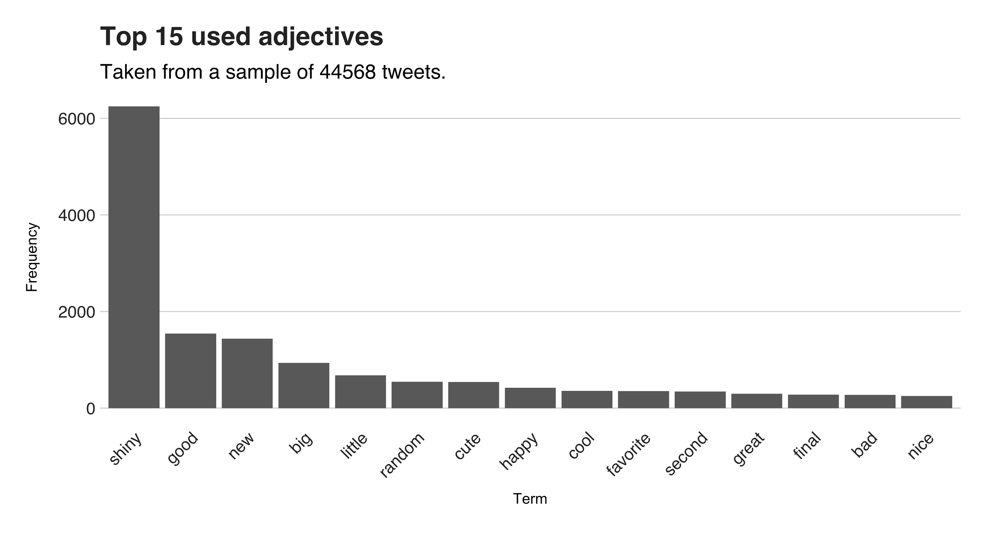
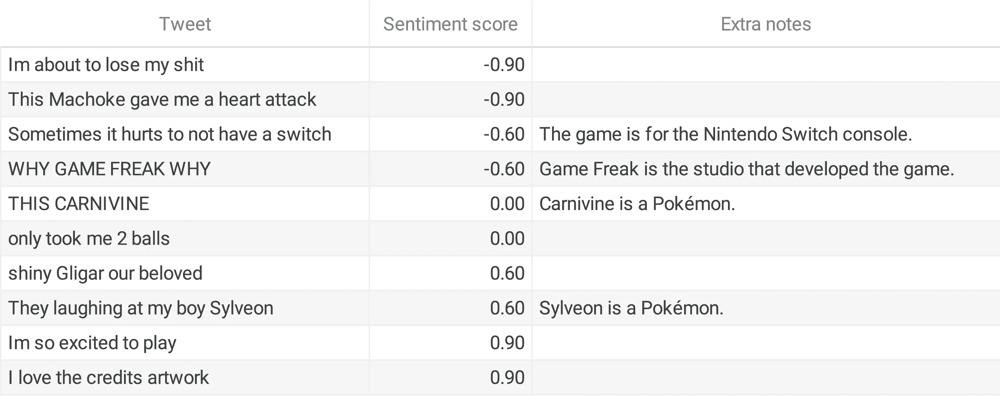
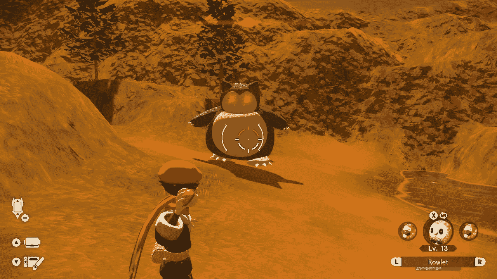
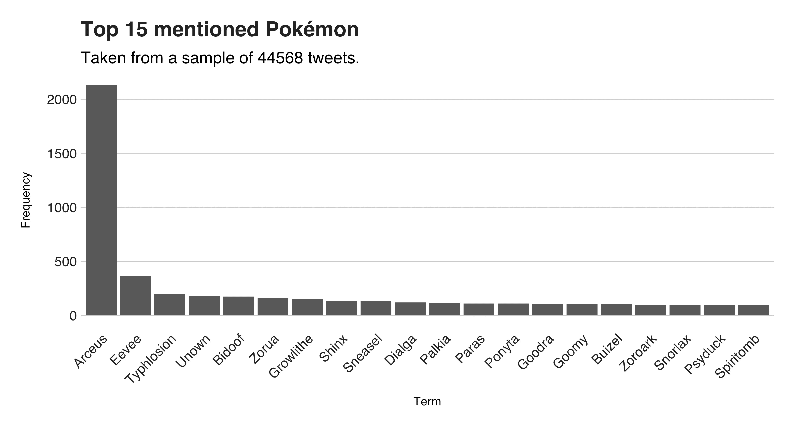
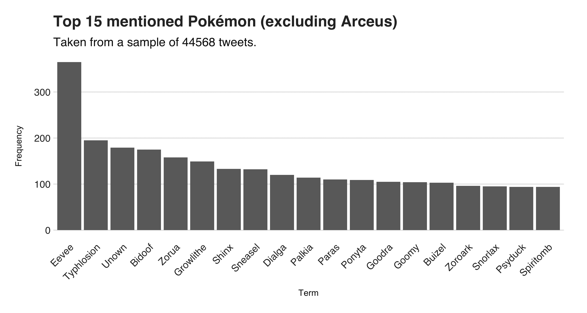

# Twitter 对《口袋妖怪传奇:阿尔宙斯》有什么看法？

> 原文：<https://towardsdatascience.com/how-does-twitter-feel-about-pokemon-legends-arceus-3efa86da3331>

## 使用 spaCy 和谷歌云的自然语言 AI API 理解关于游戏的推文

神奇宝贝社区快乐！或者这是我得到的印象。2022 年 1 月 28 日，名为*神奇宝贝传奇:阿尔宙斯，*的最新神奇宝贝游戏发布。社区接受了这个游戏。他们称之为多年来最具创新性的神奇宝贝，评论是该系列多年来最好的，我在一个月内积累了超过 100 个小时。所以，是的，我印象不错。但是其他玩家喜欢这个游戏吗？此外，他们对此有什么看法？我用数据来回答这些问题。

几年前，神奇宝贝社区很不安。在宣布该系列的前一部《神奇宝贝剑与盾》时，开发商游戏狂报告说，他们不会在游戏中包括所有现有的神奇宝贝。粉丝们不喜欢这样。他们愤怒、悲伤、失望。为了量化这种不适，我收集并分析了一系列推文，包括与游戏相关的标签，结果发现，平均而言，推文略有负面。所以现在，我想抵消那个实验的负面感觉。

我的直觉告诉我粉丝们喜欢这个新游戏。但是我想要更多的证据。所以，我又一次收集了与游戏相关的推文，调查它们的内容是否积极。在这个新的实验中，我使用了自然语言处理(NLP) Python 库 [**spaCy**](https://spacy.io/) ， [**Google Cloud 自然语言 API**](https://cloud.google.com/natural-language) **，**和 **R** 语言来发现推文中最常用的名词和形容词，推文的情绪，以及最常提到的神奇宝贝。在这里，我将展示我的调查结果。

你可以在:[https://github.com/juandes/pokemon-legends-tweets](https://github.com/juandes/pokemon-legends-tweets)找到调查的源代码。

我的游戏副本。我拍的照片。

## 关于数据

我的数据集有 **173296** 条我从 2022 年 2 月 4 日到 2022 年 2 月 27 日收集的推文，标签为#PokemonLEGENDS 或#PokemonLegendsArceus。大多数推文都是转发，所以我清理了数据集，最终得到了 40282 条唯一的推文。尽管如此，你还是会发现类似的垃圾信息，只是有几个词不同。(我本可以使用其他技术来找到这些案例，但最终却违背了它)。

我使用 Python 库 [Tweepy](https://www.tweepy.org/) 收集数据，您可以在链接的存储库中找到我使用的脚本。

## 顶级名词和形容词

spaCy 的功能之一是**词性** (POS)标注，这是一项为文档的每个标记分配语法类别的任务。这些类别的例子——也是我使用的那些——是名词和形容词。作为复习，名词是命名物体(例如，一棵树)、人、动作、感觉以及我们通常称之为“事物”的任何事物的单词，而形容词描述名词，例如，句子“the large tree”中的单词“large”使用 Python 和 spaCy，我写了一个[脚本](https://github.com/juandes/pokemon-legends-tweets/blob/main/scripts/pos_analysis.py)，遍历每条推文，标记它们的术语并统计它们的出现次数。然后，我选择了前 15 名，并在下面的两个图表(图 1 和图 2)中显示出来。

图 1:最常用的 15 个名词。

前 15 个名词是一个不同的组，其中包括一些游戏的机制。其中之一是“阿尔法”，指的是*阿尔法神奇宝贝*，一种新的红眼神奇宝贝，比通常的同类更大更强。提到的其他机制是“爆发”，即在特定位置产生一群相同的神奇宝贝的事件，以及“闪亮/闪亮”，这是一种罕见的神奇宝贝变种，颜色与其常规版本不同。推特用户经常在同一条消息中提到这三种机制，以庆祝和分享他们最近难以捉摸的闪亮阿尔法神奇宝贝，这是一种罕见的神奇宝贝，在爆发期间出现率会增加。在正常情况下，找到闪亮神奇宝贝的机会是 1/4096，但在爆发期间(可能会产生阿尔法神奇宝贝)，这一机会增加到 1/158.2。所以，是的，我可以理解为什么人们会在 Twitter 上展示他们的低概率生物。

图 2:使用最多的 15 个形容词。

最上面的形容词(见上文)是积极的。像“好的”、“可爱的”、“快乐的”、“不错的”和“棒极了”这样的术语传达了一种模糊的温暖感觉。还有“闪亮的”，我们可以用它作为形容词来描述闪亮的神奇宝贝，例如，“神奇宝贝是闪亮的”，而不是用“闪亮的神奇宝贝”这个名字但是在这些快乐的话语中，有一个词很突出——那就是“坏”为了知道到底什么是坏，我搜索了包含这个词的推文。然而，我发现了更多模糊而温暖的评论，而不是仇恨，因为他们没有使用这个词。一些推文惊呼他们多么想要这款游戏或抓住一个闪亮的神奇宝贝，其他人说，“我太差劲了”(在游戏中)，还有一条在庆祝它如何击败了“大坏老板之战”。恭喜你，我的朋友！

一把普通的镰刀(左)和它闪亮的变体(右)。注意粉红色的脖子和较暗的绿色。我拍的照片。

## 情感分析

从上面的形容词，我可以得出结论，人们喜欢这个游戏。但这是一个主观的结论——一个受到我对什么是积极形容词的想法(我在这里有些夸张，但我想找个借口来介绍我的下一个方法)和我在阅读一些推特后所看到的影响的结论。为了解决这种主观性，我使用了一种名为*情感分析的自然语言处理技术。*这种方法用一个数字来衡量每条推文的情绪态度，让我们可以确定它的感觉是消极的、中立的还是积极的。我用来做情绪分析的服务，**谷歌云的自然语言 API** ，给每条推文打分，分数在-1 到 1 之间，其中-1 表示总体负面情绪，0 表示情绪低落或混合，1 表示积极情绪。例如，句子“*我恨你段落*”的得分为-0.9，“*爆发中闪亮的长尾怪手*”的得分为 0.0，以及“*我喜欢这个游戏中的表情 XD* ”的得分为 0.9。

tweet 样本的平均情感值为 **0.141** 。因此，我们可以很快得出结论，许多推文传达了一种积极的感觉——我的直觉是这么说的。(我说“样本”是因为我从数据集中随机选择了 3000 条推文，以加速分数收集过程，还因为我使用的服务不是免费的)。得分中位数为 **0.100** (也偏向正)，第 25 百分位为 **-0.100** ，第 75 百分位为 **0.5** ，标准差为 **0.483** 。在下面的图表中(图 3)，您会发现分数分布的直方图。它显示大多数值落在 0.0 和 0.9 区域，这解释了 0.483 的高标准偏差。或者，简单地说，我们可以说有许多中立和积极的推文，但没有多少负面的。

图 3:推文情感得分直方图。

在进入下一部分之前，我需要说人工智能，因此，NLP 算法，可能会有偏差。因此，我不能肯定地说这些推文确实是积极的。此外，由于许多人工智能系统是在来自维基百科等普通文本的语料库上训练的，而不是来自关于神奇宝贝的推特，我预计会有不准确的情感分数。下表有十条推文和他们的情绪得分；做评委，让我知道你对分数的想法。

一些推文和他们的情绪得分。

一个愤怒的阿尔法·卡比兽看起来并不乐观。我拍的照片。

## 最受欢迎的神奇宝贝

这最后一节是纯粉丝服务。我不会介绍另一种 NLP 技术，也不会提到感受。没有。在这里，我将列出所有推文中被提及次数最多的前 15 个神奇宝贝。跟着我看图 4。

图 4:提到神奇宝贝的前 15 名。

推特上最受欢迎的神奇宝贝是*阿尔宙斯，*有 2131 次提及——几乎是其继任者 *Eevee* 的六倍。但是，考虑到这款游戏是以阿尔宙斯命名的，人们还是认为它会名列榜首。从列表中删除同名的神奇宝贝会产生一个图表(图 5 ), Eevee 以 170 次以上的提及率位居第一，而第二名是 Typhlosion。

图 5:前 15 名被提及的神奇宝贝(不包括阿尔宙斯)。

我的性格和阿尔宙斯。我拍的照片。

## 最后的话

《神奇宝贝传奇:阿尔宙斯》已经上市，大家一致认为这是一款不错的游戏。它目前的 Metascore 是 83(满分 100)，用户评分是 8.3(满分 10)。与之相比，前一个标题的 Metascore 为 73，用户评分为 5.4。除了收视率之外，这款游戏的反响也很积极。这是我在 Reddit、Discord 和 Twitter 上得到的印象。为了检验我的直觉是否正确，我收集了一个推特语料库，并用 NLP 技术对其进行分析，以发现人们对游戏的看法以及他们是如何表达的。

结果是积极的。人们大多在谈论游戏的新功能，并炫耀他们闪亮而巨大的神奇宝贝，使用令人愉快的词语“好”、“可爱”和“快乐”。然后，我使用情感分析服务来量化信息的情感态度，结果再次倾向于积极的一面。

看到社区这么开心真好。