# ELT 计划如何改进数据工程师的根本原因分析

> 原文：<https://towardsdatascience.com/how-elt-schedules-can-improve-root-cause-analysis-for-data-engineers-c3da7cdda7c7>

## 贝叶斯网络和数据停机时间的未来


图片由 Pixabay 提供。

随着现代数据管道复杂性的增加，准确而快速的根本原因分析(RCA)对于解决生产问题变得至关重要。最近，人们对数据工程的 RCA 兴趣大增。然而，这项工作可用的最佳工具和技术仍处于萌芽状态，尚未成形。本文讨论了一种流行的技术——分段分析的局限性。

捕捉现代数据管道的*结构*是超越这种幼稚方法的关键。一种新的方法是将 ELT DAGs 转换为贝叶斯网络，允许我们以条件概率查询的形式对网络提出因果归因问题。像这样的开发是更强大和可扩展的数据工程 RCA 工具的前沿。

*“相关性并不意味着因果关系，但它确实暗示性地摇着眉毛，并在嘴里发出‘看那边’的时候偷偷做手势。”——兰道尔·门罗*

# 数据工程和根本原因分析

“根本原因分析”(RCA)，一个定义问题的基本解释的过程，在软件世界里是一个有点神圣的术语。

在根本原因确定之前，持续的问题不会真正结束。无论您是在处理一个中断的 API 调用、一个无法加载的网站，还是一个出错的指标，确定根本原因始终是解决过程中的基础。在这一点上，工程师可以解释失败的原因，努力发布修复程序，并在未来减轻问题。

在数据可观测性的新领域，RCA 同样重要。让坏数据变好的最快方法是首先理解*为什么*它变坏。毕竟，一旦我们检测到数据是坏的，我们首先想知道的是为什么*。*

为什么在非常重要的营销支出表中，10%的行突然被空值填充？为什么`customer_uuid`字段在应该是唯一的时候突然显示出大量的重复项？

然而，我们数据专业人员开始使用“RCA”来指代在 RCA 工作流中*协助*的工具，而不是*自己执行*任何实际 RCA 的工具。这听起来可能微不足道，但差别是显著的。例如，许多数据质量 RCA 方法使用**分段分析**:识别为事件提供更好背景的负责任的数据段。

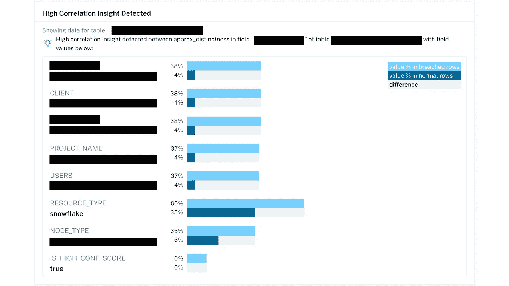

细分分析，以揭示某个客户 ID 在重复事件中被过度代表。有帮助？是的。但是它应该与其他异常分辨率分析结合使用。图片由蒙特卡洛提供。

细分分析是一项出色的**关联**功能，可为数据事件提供更多背景信息。通常，细分分析可能会*向您*指出问题的根本原因。

这可能发生在以下情况:

1.  随叫随到的工程师有很多关于问题表的**上下文**。
2.  分割分析是**稀疏的**——也就是说，它只返回人类可以合理解析的选择相关性。
3.  细分分析是**有意义的**——也就是说，返回的相关性具有实际意义并讲述了一个故事。

在上述案例中，几个客户数据源上的 ELT 作业的上游变化导致我们的机器学习模型的一个重要指标明显偏离基线。分割分析使我们能够将漂移归因于特定的上游变化。

请注意，在细分分析*本身*中没有任何东西可以识别根本原因——一个了解变化的工程师在现场将这些点连接起来。具体来说，请注意，1 个`ACCOUNT_ID`出现在 4%的所有记录中，但是在 38%的记录中出现了异常`importance_scores.`，这个问题只发生在三个具有相同边缘情况集成设置的客户身上，因此我们可以快速回滚到这些环境的最近更改。

# 相关性被打破的地方

但是让我们考虑一个稍微不同的问题。如果不仅仅是这三个客户的 ELT 变更，而是我们的失败影响了整个 ELT 管道，那会怎么样？

如果一个表更新失败，一个错误的 SQL `LEFT JOIN`可能导致几十个下游列同时转向`NULL`。如果下游表中的所有内容都着火了，细分分析对我们没有任何帮助。

我们可能会看到数百个通知，如“字段 X 与字段 Y 100%相关！”——也许这些关联中的一个暗示了真正的根本原因。更有可能的是，你将面对无数的相同上游症状的共病。

然而，这里缺少了更深层次的东西。细分分析假设只看*一个*表就构成了足够的 RCA。然而，在任何现代云数据基础设施中，没有一张表是孤立的。

**表格很少包含自身数据停机的根本原因**。ELT 管道超时，模式被无意中更改，API 功能被弃用。我们在自己关于数据可观测性的数据中看到了这一事实。我们发现我们的“高相关性洞察”功能仅适用于我们捕获的约 4.4%的异常。

数据质量问题发生在环境中，我们依靠数据工程师来了解环境。

使用像细分分析这样的方法，我们将很少的负担转移到 RCA 工具本身，即使我们可以这样做，节省了我们自己的时间和过程中的麻烦。

这就是为什么数据工程团队在缩短解决数据停机时间时需要超越细分分析的原因。

# 案例研究:针对数据停机的上下文 RCA

是时候认真对待数据停机的 RCA 了，这意味着认真对待数据停机的**结构**。

现代数据管道是复杂的、相互依赖的系统，具有上游和下游依赖性。这包括软件、数据和进度依赖，换句话说，就是**血统**。

当数据出错时，管道上游的某些东西——软件、数据或时间表——也会出错。在处理令人烦恼的实时数据问题时，我们经常忘记数据环境是高度结构化的。当谈到对损坏的数据系统进行 RCA 时，我们可以——也应该——利用这一点。

为了具体说明我的观点，让我们看看现代数据管道中的一个具体支柱: **ELT jobs** 。ELT 平台，如 dbt，[使用调度 Dag](https://docs.getdbt.com/terms/dag)—**D**directed**A**cyclic**G**raph 运行数据转换。

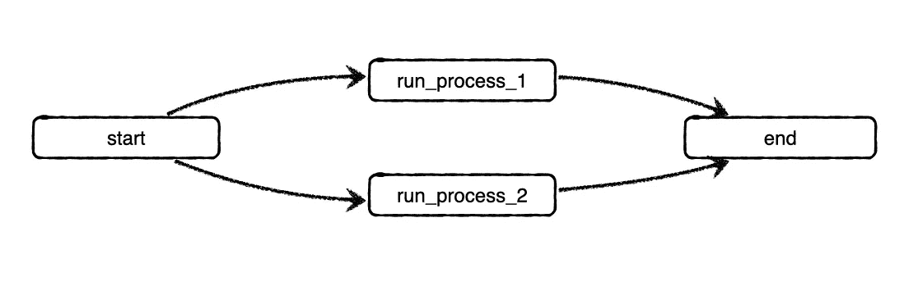

DAG 示例，展示了 dbt 如何在单个作业中模拟上游和下游依赖关系。

Dag 不是任意的数学结构。它们表现出许多简洁的性质(传递闭包、拓扑排序等)。)极大地降低了许多图形算法问题的复杂性(比如寻找最短路径)。

它们也是[贝叶斯网络](/introduction-to-bayesian-networks-81031eeed94e)的结构，强大的计算设备，我们可以用于(真实的)数据停机 RCA。事实上，贝叶斯网络模型的结构比一般的贝叶斯网络更简单！让我们通过一个例子来说明这一点。

# 示例 DAG

让我们通过一个简单的数据停机问题来演示如何操作。下面是一个简化的 DAG，展示了在蒙特卡洛运行的 ELT 计划的一部分:

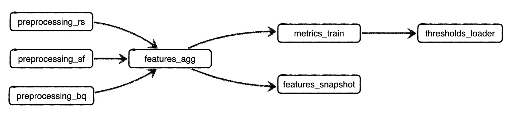

这项工作将一些特征聚合步骤与一个模型训练步骤相结合，然后是一些导出步骤。这是更大的机器学习管道的一部分。注意，`_rs`、`_sf`和`_bq`分别指从红移、雪花和大查询环境中收集的预处理指标。

这是一次运行的相应甘特图:

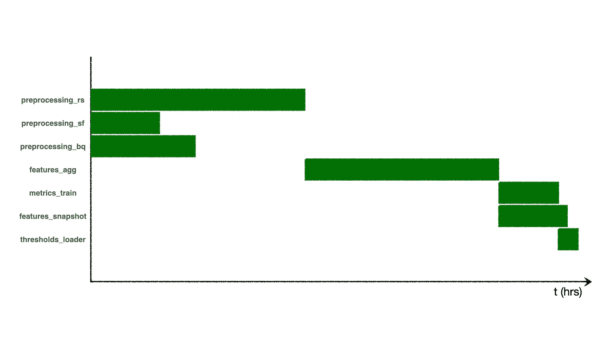

显示 DAG 中所有作业运行时间的甘特图，从 DAG 启动的那一刻开始。

注意到什么有趣的结构了吗？

*   在`preprocessing_`步骤的所有完成之前`features_agg`不能运行，因为那些预处理步骤是 DAG 中的上游依赖项。尽管`preprocessing_sf`很早就完成了这一轮，DAG 的进展仍然受到*瓶颈*的制约，直到`preprocessing_rs`结束。
*   `features_snapshot`比`metrics_train`运行的时间长，但是它*不会*阻碍`thresholds_loader`的开始，因为它不是上游依赖。

# 计算 DAG 的运行时间

通常，数据工程师希望预测整个 DAG 的运行时间，无论是设置 SLA 还是确保指标以一定的节奏更新。如果我们想知道整个 DAG 运行需要多长时间，我们不能只对所有单个作业的运行时间求和。我们也不能取最大运行时间。相反，我们不得不求助于 DAG 的特性。哪些工作是其他工作的上游？哪些工作是瓶颈？

在这种情况下，运行时间将始终作为作业运行时间的函数给出:

```
time(DAG) = MAX(time(preprocessing_rs),
                time(preprocessing_sf),
                time(preprocessing_bq)) +
            time(features_agg) +
            MAX(time(features_snapshot),
                time(metrics_train) + time(thresholds_loader))
```

也许这个等式令人望而生畏，但创建它的规则很简单:

*   如果进程并行发生，取其运行时间的最大值()
*   如果流程按顺序(或“系列”)发生，则取它们运行时间的总和

有了这两条规则，您就可以使用任何 ELT DAG 并构建一个计算其总运行时间的等式。

# 使用调度相关性解决数据新鲜度异常

当 DAG 按时完成时，一切都很好。当然，有趣的情况是当它不。

许多团队定义 SLO 来保证特定的过程在特定的时间完成。我们系统中的这个特定 DAG 每 6 小时运行一次。有时，它会失败或停止，在某些情况下，数据(来自`thresholds_loader`)将在 7 或 8 小时后到达。在这些情况下，我们希望了解*根本原因*—为什么我们的 DAG 表现不如预期？我们需要改变什么来保证更新如期进行？

具体来说，突破 SLO 的 DAG 运行的甘特图可能如下所示:

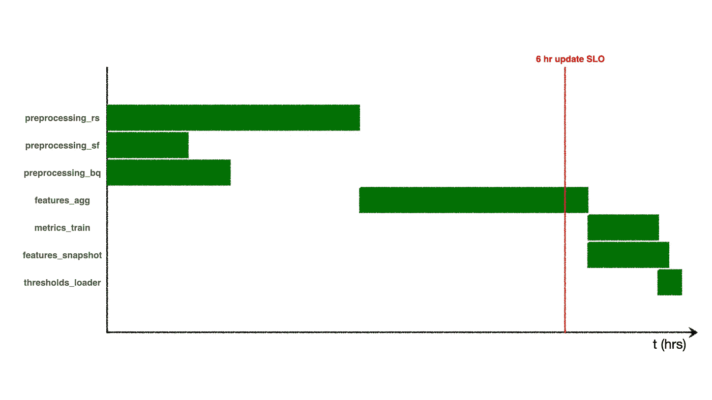

显示花费超过 6 个小时完成的 DAG 运行的甘特图。

或者看起来像这样:

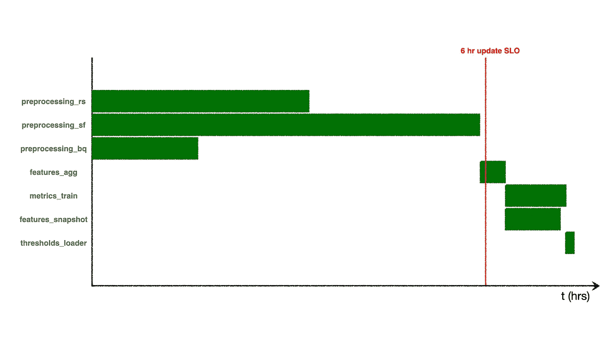

显示不同 DAG 运行时间超过 6 小时的甘特图。有什么不同？

从数学上来说，我们如何说 DAG 用了太长时间是乔布斯的错？

输入贝叶斯网络。我们将再次转向 ELT DAG。我们已经给出了上面`time(DAG)`的等式，它告诉我们总运行时间是作业运行时间的函数。如果我们知道我们感兴趣的特定 DAG 运行的运行时间，这很好。但是一般情况下呢？从概率上来说，我们*预计 DAG 要花多长时间？*

为了进行概率性思考，我们应该求助于贝叶斯网络，这意味着我们需要从我们的 DAG 中创建一个新的 DAG。(不要慌！贝叶斯网络也是 Dag 的一种类型——旨在使用统计和因果推理来回答概率查询的特殊网络。)

为了将我们的 ELT DAG 转化为贝叶斯网络，我们需要将每个作业运行时间不再视为离散值(比如，“43 秒”)，而是视为从运行时间的*分布*中提取的*变量*。

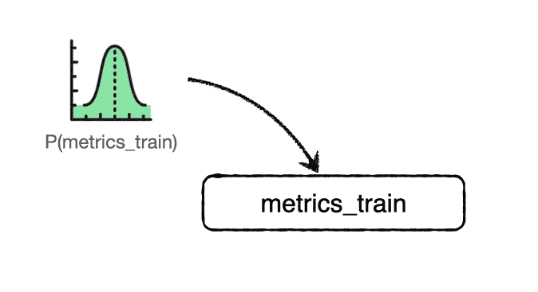

计算过程— *,尤其是处理数据的过程—*—通常需要某种一致的时间来完成，但会有差异。也许你的负载平衡器今天过得很糟糕，或者也许有人用请求轰炸了你的 API。也许红移、雪花或 BigQuery 中的一个有独立的性能问题。

因此，让我们从使所有的运行时间具有概率性开始。现在，每个节点`elt_job`代表一个随机变量，其中`P(elt_job < t)`代表该作业在不到`t`秒内完成的概率。


贝叶斯网络…？

好的…这就是我们的贝叶斯网络？它看起来是不是和我们之前的 ELT DAG 一模一样？

嗯，这个*是*一个合法的贝叶斯网络，但是它根本不是我们 DAG 的恰当表示。为什么？我们实际上已经抛出了一些非常有价值的信息——也就是我们之前发现的关于运行时的两条规则。他们又来了:

*   如果进程并行发生，取其运行时间的最大值()
*   如果流程按顺序(或“系列”)发生，则取它们运行时间的总和

我们能在贝叶斯网络中解释这些规则吗？剧透警告:我们可以，这大大降低了我们网络的复杂性。为此，我们需要发明两种具有简单概率分布的“特殊”节点。首先，对于并行流程，我们将有一个“最大”节点，其概率分布如下:

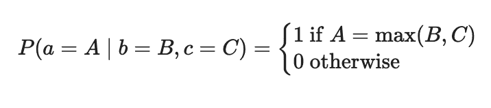

对于顺序流程，我们也有一个“+”节点，概率分布如下:

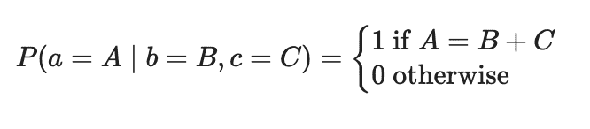

这是否过于学术迂腐？是的。我们是否扩大了“随机”变量的定义？也许吧。但是真正重要的是消除这里的*缺乏*的随机性，因为它使得生成的贝叶斯网络在计算上简单得多。

这是一个使用我们刚刚定义的两个特殊节点的转换贝叶斯网络:

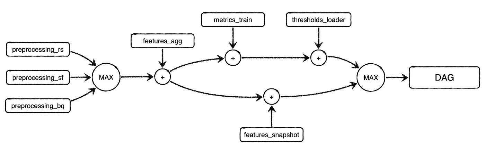

代表 DAG 实际运行时间的贝叶斯网络。

最终节点 DAG 是一个随机变量，其值完全取决于所有作业的概率运行时间(例如变量`features_agg, metrics_train,`等)。)连同所有的求和与最大化。更准确地说，我们知道:

```
P(DAG) = MAX(P(preprocessing_rs),
             P(preprocessing_sf),
             P(preprocessing_bq)) +
         P(features_agg) +
         MAX(P(features_snapshot),
             P(metrics_train) + P(thresholds_loader))
```

这个方程看起来很像离散运行时的方程，除了离散运行时(`time`)已经被每个运行时的概率(`P`)所取代。但是，求和与最大化保持不变，这使得这个方程非常容易处理。

当然，像`P(preprocessing_rs)`这样的发行版不会神奇地从天而降。您必须根据 DAG 本身的有限运行次数来估计这些。这里也有一个[完整的兔子洞](https://en.wikipedia.org/wiki/Probability_distribution_fitting),但是现在让我们假设您可以将正态分布拟合到 ELT DAG 中每个作业的运行时。

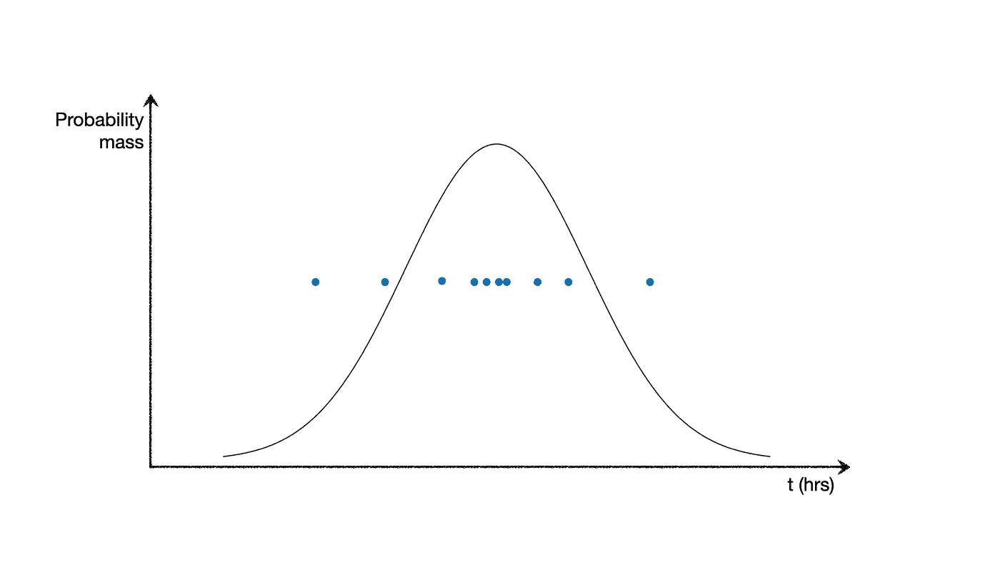

观察到的运行时间(蓝色数据点)的有限集合的拟合正态分布。

所以现在让我们具体点。我们可以看到，我们想问的许多关于 DAG 的问题都可以被公式化为对我们新的贝叶斯网络的查询。

**问**:*DAG 刚刚运行了 7 个小时。这不正常吗？*

**答**:`P(DAG < 7 hours)`值多少？如果这个数字很高——假设是 99%——那么是的！变态！7 小时 DAG 运行时间的可能性为 1%。

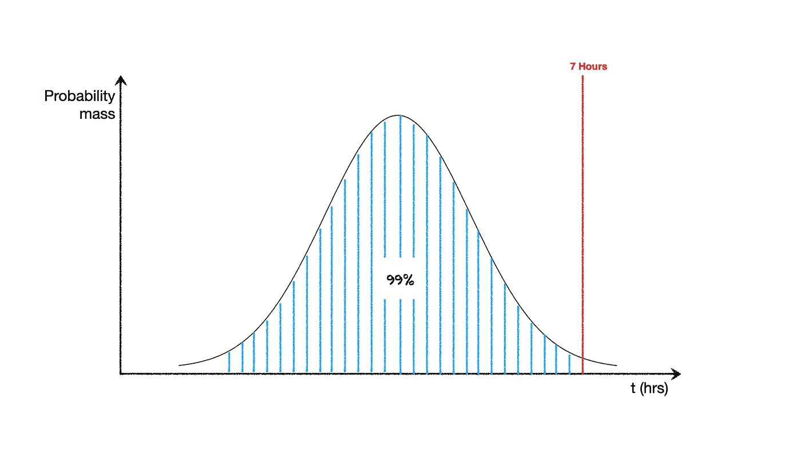

**问**:*features _ snapshot 作业运行时间是否过长？*

**答**:说`features_snapshot`任务及时运行`t`。什么是`P(features_snapshot < t)`？如果这个数字“高”——假设是 80%——那么是的！`t`是一个相当变态的运行时。

**问**:*(RCA 问题):features _ snapshot****对 DAG 运行 7 小时负责吗？到什么程度？***

**答**:什么是`P(DAG < 7 | features_snapshot = t)`？如果这个数字很高，那么即使 features_snapshot 花费`t`秒，DAG 也很可能在 7 小时内完成。如果它很低，那么 DAG 似乎更有可能被这一个作业所瓶颈。如果`P(DAG < 7)`和`P(features_snapshot >= t)`低就更有可能了。尤其可能的是，如果

```
P(DAG < 7 | features_snapshot = E[features_snapshot])
```

很高，这表示如果`features_snapshot`花费了预期的时间，DAG 可能会在不到 7 个小时内完成。

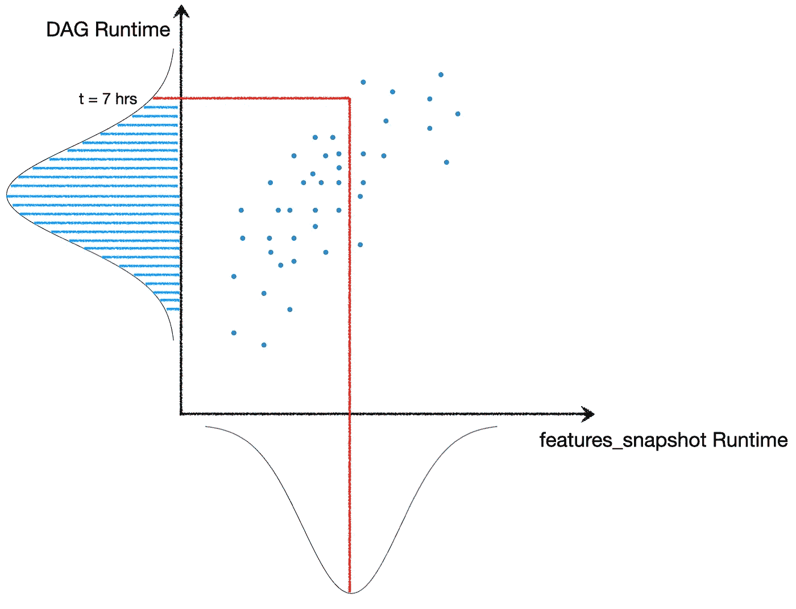

正如我们所看到的，这里要探索的因果织锦是丰富的，即使没有冒险对字段级异常进行因果推断，例如零利率的意外上升或一些关键指标的急剧下降。更重要的是，贝叶斯网络和因果推理允许我们提出关于*实际* RCA 和*数学*的问题，而不是浮现相关的暗示，即人类工程师必须将它们缝合成一个故事。

在我看来，像*这些*这样的领域是数据质量问题 RCA 的真正前沿:深入数据基础设施的独特结构，利用血统，并将软件、数据和调度依赖项视为数据因果推理的一等公民。

数据团队有潜力自动化和扩展大部分数据停机根本原因分析，基于每个表的细分分析不会让我们达到这一目标。

在此之前，祝您没有数据宕机！

*除特别注明外，所有图片均为作者所有。*