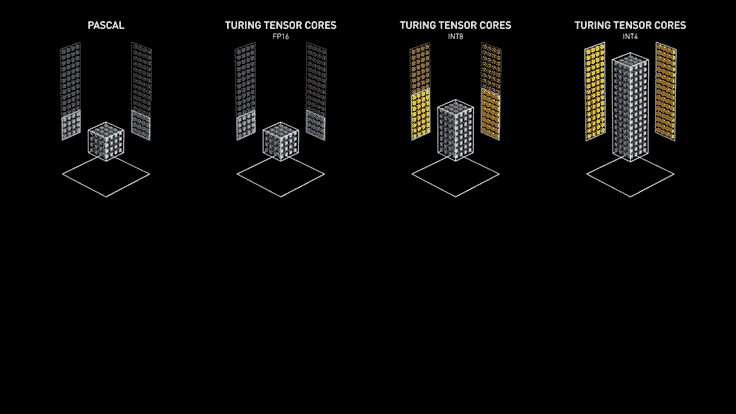
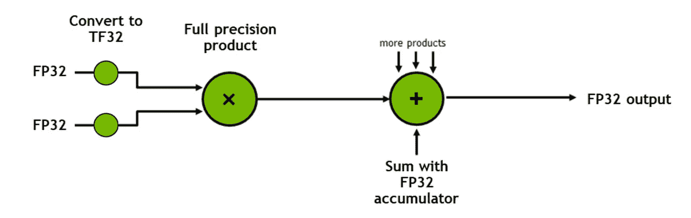
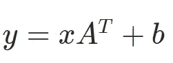
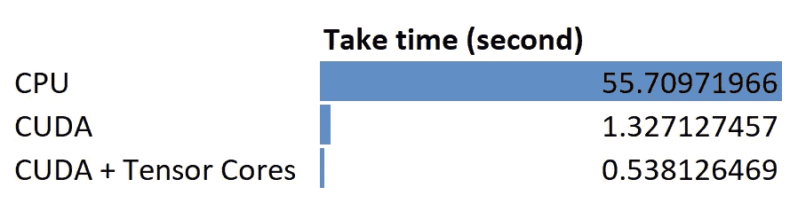

# GPU 计算能有多快

> 原文：<https://towardsdatascience.com/how-fast-gpu-computation-can-be-41e8cff75974>

## Python 和 PyTorch 在 CPU 和 GPU 中的矩阵运算比较

GPU 计算增益比 CPU 快多少？在本文中，我将使用 Python 和 PyTorch 线性变换函数来测试它。

以下是我的一些测试机器规格:

*   CPU:英特尔 i7 6700k (4c/8t)
*   GPU: RTX 3070 TI (6，144 个 CUDA 内核和 192 个张量内核)
*   内存:32G
*   操作系统:Windows 10

## NVIDIA GPU 术语解释

**CUDA** 是计算统一设备架构的缩写。可以用 CUDA 直接访问 NVIDIA GPU 指令集。

不像 DirectX 和 OpenGL 是为了构建游戏引擎而特意设计的，CUDA 不需要用户理解复杂的图形编程语言。

**张量核**是加速矩阵乘法过程的处理单元。

例如，使用 CPU 或 CUDA 将两个 4×4 矩阵相乘涉及 64 次乘法和 48 次加法，每个时钟周期一次运算，而张量核可以在每个时钟周期执行多次运算。



来源:[nvidia.com](https://www.nvidia.com/en-us/data-center/tensor-cores/)

在 Nvidia 开发者的 YouTube 频道的这个视频中有更多关于张量核的介绍。

CUDA 核和张量核是什么关系？张量核心内置于 CUDA 核心中，这些神奇的核心将在满足[特定条件](https://www.youtube.com/watch?v=i8-Jw48Cp8w&ab_channel=NVIDIADeveloper)时被触发。

## 测试方法

GPU 计算只在某些典型场景下比 CPU 快。其他情况下，GPU 中的计算可以比 CPU 慢！

由于 CUDA 在并行矩阵乘法和加法方面的独特优势，它被广泛用于机器学习和深度学习。



来源:[https://developer.nvidia.com/](https://developer.nvidia.com/)

在数学等式中:



PyTorch 的线性函数`torch.nn.Linear`做完全相同的操作。例如，您可以通过以下代码将 2x2 矩阵转换为 2x3 矩阵:

```
import torchin_row,in_f,out_f = 2,2,3
tensor            = torch.randn(in_row,in_f)
l_trans           = torch.nn.Linear(in_f,out_f)
print(l_trans(tensor))
```

## CPU 基线

在测量 GPU 性能之前，我需要从 CPU 设置一个基准性能。

为了减轻芯片的负担，延长运行时间，我增加了 **in_row** 、 **in_f** 和 **out_f** 的数量，还设置了循环操作**10000 次**。

```
import torch
import torch.nn
import timein_row, in_f, out_f = 256, 1024, 2048
loop_times = 10000
```

现在，让我们看看 CPU 完成 10，000 次转换需要多少秒:

```
s       = time.time()
tensor  = torch.randn(in_row, in_f).to('cpu')
l_trans = torch.nn.Linear(in_f, out_f).to('cpu')
for _ in range(loop_times):
    l_trans(tensor)
print('cpu take time:',time.time()-s)
```

结果:

```
cpu take time: **55.70971965789795**
```

我 i7 6700k 用时 55 秒左右，说实话结果还不错。

## 在 GPU 中计算

为了让 GPU 的 CUDA 执行相同的计算，我只需将`.to(‘cpu’)`替换为`.cude()`。此外，考虑到 CUDA 中的操作是异步的，我还需要添加一个同步语句，以确保在所有 CUDA 任务完成后打印所用时间。

```
s       = time.time()
tensor  = torch.randn(in_row, in_f)**.cuda()**
l_trans = torch.nn.Linear(in_f, out_f)**.cuda()**
for _ in range(loop_times):
    l_trans(tensor)**torch.cuda.synchronize()**
print('CUDA take time:',time.time()-s)
```

代码更改突出显示，下面是运行结果:

```
CUDA take time: **1.327127456665039**
```

几乎比运行在 CPU 中的**快 42x** 倍。一个模型在 CPU 需要几天的训练，现在在 GPU 可能只需要几个小时。这真的很快。

## 启用张量核心

CUDA 已经很快了，启用 RTX 3070Ti 的 197 个张量核怎么样？根据这个[视频](https://www.youtube.com/watch?v=9tpLJpqxdE8&ab_channel=NVIDIADeveloper)，在 PyTorch 中，要启用张量核，我需要做的就是把浮点精度从 FP32 降低到 FP16。

```
s       = time.time()
tensor  = torch.randn(in_row, in_f).cuda()**.half()**
layer   = torch.nn.Linear(in_f, out_f).cuda()**.half()**
for _ in range(loop_times):
    layer(tensor)torch.cuda.synchronize()
print('CUDA with tensor cores take time:',time.time()-s)
```

结果:

```
CUDA with tensor cores take time:**0.5381264686584473**
```

另一个 2.6 倍的性能提升。

## 结论

在本文中，我通过在 **CPU、GPU CUDA 和 GPU CUDA +张量核**中调用 PyTorch 线性变换函数来比较线性变换操作。下面是一个总结结果:



图片作者:安德鲁·朱

NVIDIA 的 CUDA 和 Tensor 内核确实让矩阵乘法性能提升了不少。

## 参考链接

1.  [使用图形处理单元(GPU)加速数值计算](http://www.eurorisksystems.com/documents/speed_up_of_numeric_calculations_using_GPU.pdf)
2.  [Nvidia CUDA 核心解释:它们有什么不同？](https://www.techcenturion.com/nvidia-cuda-cores/)
3.  [视频系列:使用张量核心进行深度学习的混合精度训练技术](https://developer.nvidia.com/blog/video-mixed-precision-techniques-tensor-cores-deep-learning/)