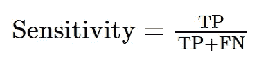
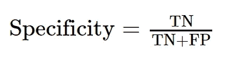
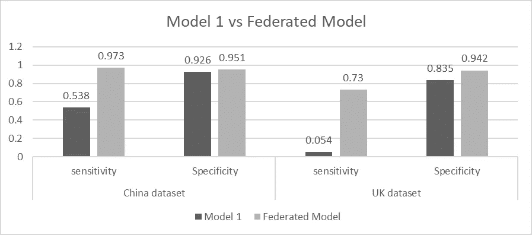
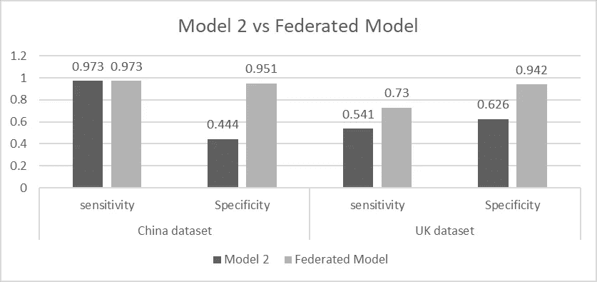
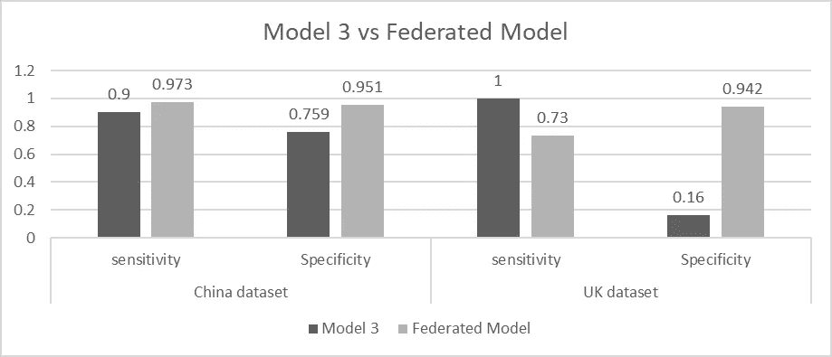
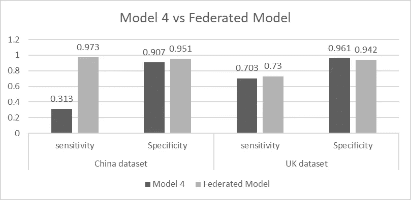

# 联合学习如何推进新冠肺炎诊断

> 原文：<https://towardsdatascience.com/how-federated-learning-advanced-covid-19-diagnosis-6e16b9ecc21f>

# 联合学习如何推进新冠肺炎诊断

## 新冠肺炎人工智能诊断成功案例研究

安妮·斯普拉特在 [Unsplash](https://unsplash.com?utm_source=medium&utm_medium=referral) 上的照片

最近，联合学习被用于大规模优化用于新冠肺炎诊断的机器学习模型。2021 年 12 月，一篇题为*[***推进新冠肺炎诊断与人工智能中的隐私保护合作***](https://www.nature.com/articles/s42256-021-00421-z)*的论文在同行评审期刊《自然机器智能》上发表。本文通过结合全球多个地理位置的新冠肺炎诊断数据，对 Covid 阳性或阴性患者的分类进行了显著改进。**

**关键发现证实了联合学习如何大规模提高新冠肺炎诊断的灵敏度、特异性和曲线下面积(AUC)值。该出版物的最大成就之一是联合学习如何让中国和英国的机构合作，同时保持其数据的私密性和受保护性。**

## **以聚合酶链式反应测试为基准**

**用于诊断新冠肺炎的最常见和最依赖的测试之一是逆转录聚合酶链式反应(RT-PCR)，通常被称为聚合酶链式反应测试。尽管大量使用，检测灵敏度范围从 **0.60 到 0.71(60-71%)**。这导致了大量的假阴性，促使全球的研究人员寻找更准确的替代方法。**

**在将 PCR 测试与不同的机器学习模型和方法进行比较时，灵敏度和特异性是需要考虑的重要值([参见期刊论文，了解关于灵敏度、特异性和准确性的更深入的解释](https://www.ncbi.nlm.nih.gov/pmc/articles/PMC4614595/))。灵敏度通过以下公式获得:**

****

**作者图片**

**在哪里，**

**TP =真阳性**

**FN =假阴性**

**则特异性通过以下公式获得:**

****

**作者图片**

**换句话说，敏感度值越高，模型就越有可能预测出真正的正值。特异性越高，模型就越有可能预测真正的负值。**

**如果一个模型具有很高的准确性，但实现的特异性或敏感性很低，那么该模型将产生不希望的假阴性或假阳性。**

## **为什么联合学习是必要的**

****

**照片由 [Shubham Dhage](https://unsplash.com/@theshubhamdhage?utm_source=medium&utm_medium=referral) 在 [Unsplash](https://unsplash.com?utm_source=medium&utm_medium=referral) 拍摄**

**除了 PCR 测试，计算机断层扫描(CTs)也用于肺部疾病检测。据报道，冠状病毒患者在 CT 扫描中表现出放射性特征，这允许机器学习模型对新冠肺炎阳性患者的分类进行训练。**

**然而，包括来自多个位置的一整套 CT 的数据集似乎是必要的，以在新冠肺炎分类模型中实现更高的保真度。我想到的第一个解决方案是共享所有数据，并根据 CTs 数据集将单个模型训练到新冠肺炎的分类中(在理想情况下，这可能行得通)。**

**然而，隐私问题是阻止这种情况发生的主要障碍之一。英国的 18 家合作医院和中国的 5 家医院之间的联合计划同意在本地训练他们的模型，并将模型的权重共享到共享的联合模型中。**

## **联合学习方法的结果**

**在四个不同的位置收集多个数据集，并用于生成四个模型，用于训练，然后与联合学习方法进行比较。现有的模型能够实现高值的敏感性或特异性，但不能两者兼而有之。这意味着一些模型可以产生良好的阳性结果，但也会将许多阴性 COVID 测试标记为阳性。而其他模型擅长发现阴性，但也会将许多阳性测试标记为阴性(假阴性)。这四个模型是用来自中国和英国的数据集训练的**

**对于中国数据集，联合模型的特异性、敏感性和 AUC 分别达到 95%、97%和 98%。这优于所有四个单独模型的单独结果。此外，对于英国数据集，联合模型的特异性、敏感性和 AUC 分别为 73%、94%和 89%，优于所有本地训练的模型。**

**下面的图片显示了每个独立模型和联合模型之间的比较。可以看出。只有模型 4 与英国数据集的联邦模型相匹配。对于其他模型，我们永远无法同时获得与联邦模型相匹敌的敏感性和特异性。**

****

**作者图片:联邦模型与模型 1**

****

**作者图片:联邦模型与模型 2**

****

**作者图片:联邦模型与模型 3**

****

**作者图片:联邦模型 vs 模型 4**

## **结论**

**相对于孤立的机器学习模型，联合学习已经显示出改进。此外，我们观察到比聚合酶链式反应测试更高的灵敏度。中国和英国数据集为 0.97 和 0.73，而 PCR 测试的范围为 0.61 和[0.71](https://pubs.rsna.org/doi/pdf/10.1148/radiol.2020200432)。**

**尽管联合学习很有效，但我们需要记住什么时候需要使用这种方法。当不同的数据提供者必须遵守严格的隐私政策时，联合学习可以允许一个大型团队与其模型的数据进行协作。我们还需要考虑跨不同位置的数据集是否会为联邦模型提供额外的健壮性。简单来说，如果训练数据集过于相似，我们将不会改进我们的模型。**

**最后，我想留下一篇题为《大规模联合学习:系统设计*的论文的链接。***

***感谢您的阅读，感谢您对本文的任何反馈。你可以在我的 [GitHub 页面](https://github.com/manuelsilverio)上看到我在机器学习方面的公开工作，并随时关注我或通过 [LinkedIn](https://www.linkedin.com/in/manuelsilverio/) 与我联系。***

***关注我的 LinkedIn 页面: [AI 创客](https://www.linkedin.com/company/ai-makers)***