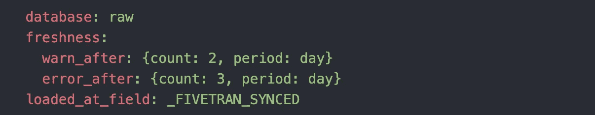
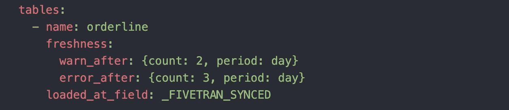
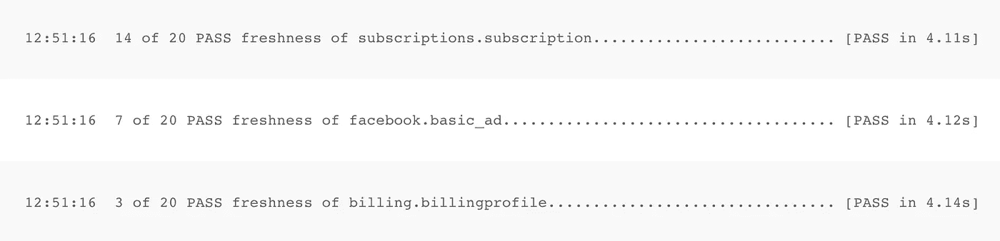

# 你的数据来源有多新鲜？

> 原文：<https://towardsdatascience.com/how-fresh-are-your-data-sources-e8db53cf4653>

## 测试表的新鲜度，并通过 Slack 设置监控


照片由[改善 Nguyễn](https://unsplash.com/@kaizennguyen?utm_source=unsplash&utm_medium=referral&utm_content=creditCopyText) 在 [Unsplash](https://unsplash.com/s/photos/fresh?utm_source=unsplash&utm_medium=referral&utm_content=creditCopyText) 上拍摄

数据的新鲜度是数据质量的一个重要方面。如果数据不是最新的，那么它就是陈旧的。如果你的企业认为它是从最近的数据中获得洞察力，但实际上它是在看一个月前的数据，那就有问题了。

这些见解并不准确。

您的数据模型只有在数据新鲜时才具有洞察力。那么，您如何确保您的数据总是被及时接收？

我最喜欢的方法是对我的数据模型使用 dbt [新鲜度](https://docs.getdbt.com/reference/resource-properties/freshness)测试，特别是对我的源数据进行测试。当您关注最上游的数据源时，您会在源头而不是下游发现问题。它更容易调试，可以节省您的时间。

因此，让我们讨论一下如何在源代码中设置新鲜度测试，以及如何将这些消息发送给 Slack。

# 设置 dbt 新鲜度测试

dbt 使得测试任何表的新鲜度变得非常简单。虽然测试模型的新鲜度可能很重要，但最重要的是确保每天都在获取原始数据源。我遇到过这样的问题，我的数据连接器显示数据已成功获取，但当我执行手动检查时，数据却是陈旧的。

设置提醒将使您不必手动检查数据列中的最新日期。dbt 测试将根据您设置的阈值给出一个警告，然后给出一个失败。

要设置 dbt [源新鲜度](https://docs.getdbt.com/docs/building-a-dbt-project/using-sources#snapshotting-source-data-freshness)，只需导航到 src.yml 文件，在该文件中定义 dbt 源。与`description`或`columns`块类似，在您希望测试新鲜度的源代码下添加一个`freshness`块。您可以在数据库下添加这个块，它会将测试应用到该数据库中的所有表。



src.yml(图片由作者提供)

或者，如果不希望对每个表都运行测试，可以直接在表名下定义它。



src.yml(图片由作者提供)

如果您想使用不同的`warn_after`和`error_after`阈值，您也可以为每个单独的表定义它。

`warn_after`指定在运行 dbt 测试时收到警告之前可以等待的天数。该警告不会出错，但会让您知道在出错之前检查表的新鲜度。

`error_after`指定在失败前可以经过的天数。如果您在数据管道中运行这些测试，此故障将导致您的管道失败。

理想情况下，我们希望知道 dbt 测试何时警告我们表的新鲜度。这样我们就可以在表失效之前采取行动。没有“简单”的方法可以通过 dbt 做到这一点，除非您使用 dbt 云运行您的模型。

最后，您还需要在与`freshness`块相同的缩进位置包含一个`loaded_at_field`块。这告诉 dbt 将哪个日期与测试运行的日期进行比较。如果您使用 Fivetran 来获取数据，您可能希望使用`_FIVETRAN_SYNCED`列。这只是数据连接器最后一次将数据接收到仓库中的日期。

# 使用提督发送时差警报

如果你不熟悉[perfect](/tired-of-airflow-try-this-c51ec26cd29d)，它是一个利用 Python 编写数据管道的数据编排工具。我在 Prefect 内建的`dbt_task()`函数中运行我的 dbt 模型和任何命令。我的新鲜度测试是这样进行的:

```
dbt_source_freshness = dbt_task(command='dbt source freshness', task_args={"name": "dbt tests: source freshness"})
```

我还在任何数据同步时为这些任务设置上游依赖关系。这样，直到我所有的数据连接器都被 Fivetran 同步后，新鲜度测试才会运行。在 Prefect 中设置依赖关系如下所示:

```
dbt_source_freshness.set_upstream(shopify_sync)
```

为了发送 Slack 消息，您需要创建自己的 Python 函数。提督让它变得容易，有一个简单的已经为你建立了。

```
[@task](http://twitter.com/task)(trigger=all_finished, checkpoint=False, log_stdout=True)
def send_slack_alert_on_test(output):
    SlackTask(message=output).run()
```

按照`trigger=all_finished`的规定，当所有上游依赖项都已运行完毕时，该功能将被触发。根据您的使用情况，还有其他触发选项。这个函数将把输入函数的输出作为 Slack 消息发送到您指定的通道。你可以在这里阅读更多关于建立一个完美的网页钩子的内容。

为了让这个函数适合我的用例，我必须对它进行一些定制。首先，我想在输出的每一行中重复一遍，而不是将整个输出作为一条消息发送。我还想只发送警告消息，而不是那些已经通过和失败的消息。为了做到这一点，我遍历了邮件的每一行，只发送了包含“警告新鲜度”的邮件。

```
[@task](http://twitter.com/task)(trigger=all_finished, checkpoint=False, log_stdout=True)
def send_slack_alert_on_test(output):
    for line in output:
        if "WARN freshness" in line:
            SlackTask(message=line).run()
```

我不想发送“失败刷新”消息，因为如果测试失败，完美的任务无论如何都会出错，我已经收到了不同的通知。

我确实遇到了一个需要记住的重要问题。如果您没有在您的`DbtShellTask()`中指定`return_all=True`，那么只有最后一行作为任务的输出返回。最后一行看起来像这样:


作者图片

您希望输出如下所示，这样就可以遍历每一行:



作者图片

添加了这些内容后，您的 shell 任务将如下所示:

```
dbt_task = DbtShellTask(profile_name='madison',
                        log_stdout=True,
                        profiles_dir=DBT_REPO_PATH,
                        environment='prod',
                        return_all=True)
```

现在您已经准备好使用[提督](/tired-of-airflow-try-this-c51ec26cd29d)部署您的 dbt 新鲜度测试和 Slack alert 了！

# 结论

为数据表设置监控是创建可靠数据堆栈的首要步骤之一。这将有助于你在火灾发生前进行扑救，做到积极主动，而不是被动反应。如果你认为一切都会按计划进行，那你就错了。你需要准备好能让你成功的工具，即使你预期会更糟。

对于那些利用 [dbt](https://medium.com/towards-data-science/is-dbt-the-future-of-analytics-d6ff93cbb20c) 并且在您的数据堆栈中没有复杂的数据质量或监控平台的人来说，这是一个很好的解决方案。任何人都可以设置这些测试，只要他们已经在使用 dbt。像这样的步骤只需要很少的前期工作，但是从长远来看，会为你节省很多工作。

要了解更多关于使用 dbt 和改进数据堆栈的技巧，[订阅](https://madisonmae.substack.com/)我的 Learn Analytics 工程简讯。

阅读更多关于数据摄取的信息[最佳实践](/follow-these-best-practices-for-high-quality-data-ingestion-deb9e2a7f6cb)。

[学习](/prevent-data-loss-with-this-free-dbt-package-a676c2e59c97)使用免费的 dbt 包设置数据量警报。