# GANs 如何学习创造力——理解生成性对抗网络的优化功能

> 原文：<https://towardsdatascience.com/how-gans-learn-creativity-478fc1e4cc79>

## 解释流行的 GAN min-max 游戏和模型的总损失

Joshua Woroniecki 在 [Unsplash](https://unsplash.com/s/photos/creativity?utm_source=unsplash&utm_medium=referral&utm_content=creditCopyText) 上的照片

G **生成对抗网络** (GANs)最近在人工智能领域变得非常流行，尤其是在计算机视觉领域。随着 Ian J. Goodfellow 等人[1]的科学文章“生成对抗网络”的介绍，一种用于开发生成模型的强大的新策略出现了，并且自那时起，许多研究和研究项目随之出现，开发了我们现在看到的新应用，例如最新的**DALL-E 2**【2】**或**GLIDE**【3】(*这两种应用都是使用扩散模型开发的，这是生成模型的较新范式。然而，GAN 今天仍然是一种广泛使用的模型，能够解决多种问题***

**但由于一切总是从头开始，在本文中，我将展示大家听说过的**的**原始 GAN 优化函数**的含义和推理，以及它与模型的总损失函数**的差异(您必须知道，根据模型的目的，后来还创建了许多其他变体)**

# **目录**

1.  **[**甘简介**](#5b04)[**甘训练**](#4fea)**
2.  **[**【最小-最大博弈】优化功能**](#5ca5)[**鉴别器损耗功能**](#7d6d)[**优化功能**](#6bb7)[**发电机损耗功能**](#ef58)**
3.  **[**总损耗功能**](#7284)**
4.  **[**结论**](#c007)**
5.  **[**参考文献**](#e3d1)**

# **1.甘斯简介**

**生成对抗网络是一类**深度学习框架，被设计为生成模型**，目的是生成新的复杂数据(输出)，如在之前**从未存在过的图像或音频。****

**为了训练 GAN，我们只需要一组我们想要复制或模仿的数据(图像、音频……)，网络将找出创建新数据的方法，这些数据看起来像我们数据集的例子。**

> **换句话说，我们给模型一些例子作为输入来“获得灵感”,并给它产生新输出的完全自由**

**这种训练过程称为**无监督学习**，在这种过程中，我们只向网络提供 **X** 输入，而不附带任何标签(或期望的输出)。**

**GAN 架构由**两个相互竞争**的网络组成(因此得名“敌对网络”)。通常我们将这些网络称为**发生器****【G】**和**鉴别器(D)** 。生成器的任务是学习从**随机噪声**开始生成数据的函数，而鉴别器要决定生成的数据是否“真实”(这里“真实”是指数据属于我们数据集的例子)，这样我们就可以衡量模型的性能，调整参数。两个网络同时被训练和学习。**

****

**为了说明生成器-鉴别器游戏，我们可以把伪造者想象成试图愚弄侦探或鉴别器的**生成器**(右图由 [Ahnaf Piash](https://unsplash.com/@the_ahnafpiash?utm_source=unsplash&utm_medium=referral&utm_content=creditCopyText) 在 [Unsplash](https://unsplash.com/s/photos/hacker?utm_source=unsplash&utm_medium=referral&utm_content=creditCopyText) 上拍摄)**

## **甘培训**

**GANs 训练有许多不同的变化和修改。然而，如果我们遵循原始论文[1]，普通 GAN 训练循环如下:**

****为**训练迭代次数**做**:**

1.  **从样本分布(即随机噪声 ***z*** )中生成 *m* 个样本(图像、音频……)，我们将其表示为: ***G(z)*****
2.  **从训练数据集中取 *m* 个例子: ***x*****
3.  **将所有示例(生成的和训练的数据集)混合，并将其馈送给鉴别器 ***D*** *。*D 的输出将在 0 和 1 之间，意味着 0 这个例子是假的，1 这个例子是真的**
4.  **测量鉴频器损耗函数并调整参数**
5.  **生成新的 m 实例 **G'(z)****
6.  **将 **G'(z)** 送入鉴别器。测量发电机损耗函数并调整参数。**

****结束****

> ****注**。最近的 GAN 训练方法测量发生器损耗，并在第 4 步中连同鉴别器一起调整其参数，跳过第 5 步和第 6 步，从而节省时间和计算机资源。**

# **2.最优化和损失函数(最小-最大游戏)**

**如果您阅读 GAN 的原始论文，您将获得以下函数，该函数为模型定义了**优化函数**。**

**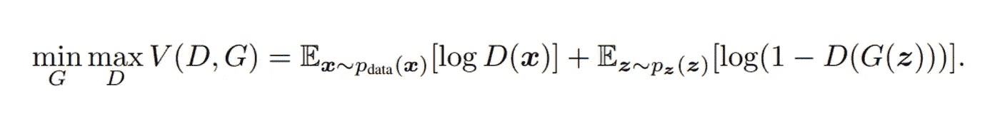**

**GAN 优化功能。截图自原论文《生成性对抗性网络》[1]**

> ****注**。上面的公式是**优化函数**，即两个网络(生成器和鉴别器)都试图优化的表达式。在这种情况下，G 希望最小化它，而 D 的目标是最大化它。但是，**这不是模型的总损失函数**，它告诉我们它的性能。**

**为了理解 mix-max 游戏，我们必须考虑用什么来衡量我们模型的性能，这样网络就可以优化它。由于 GAN 架构由两个同时训练的网络构成，我们必须计算两个指标:**发电机损耗**和**鉴别器损耗**。**

## **鉴别器损失函数**

**根据论文[1]中描述的训练循环，鉴别器从数据集接收一批 *m* 个示例，从生成器接收其他 *m* 个示例，并且**输出一个数字∈ [0，1]** ，这是输入数据属于数据集分布的概率(即数据为“真实”的概率)。**

**在将示例输入鉴别器之前，我们已经知道哪些示例是真实的，哪些是生成的(来自数据集的示例 ***x*** 是真实的，生成器的输出 ***G(z)*** 是生成的)，因此我们可以给它们分配一个标签:y = 0(生成的)，y = 1(真实的)。**

**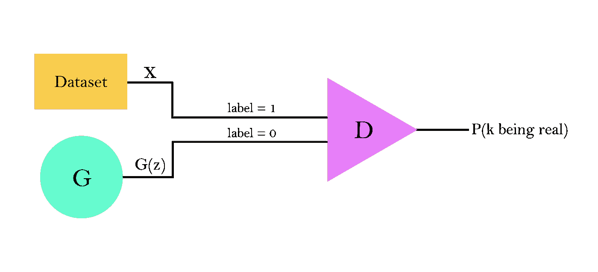**

****图 1** 。GAN 模型的工作流程。注意:k 是指鉴别器的输入，它可以是生成的图像或数据集的一个例子。作者图片**

**现在，我们可以使用**二进制交叉熵**损失函数将鉴别器训练成普通的二进制分类器:**

**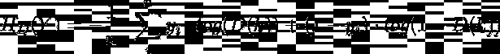**

****n = 2m 时鉴别器(D)的二元交叉熵公式**。yi 表示标签，k 表示输入(生成的和真实的输入)**

**但是，由于这是一个二进制分类器，求和交替出现:
-当输入为实数时，标签 **y = 1** →求和 **∑ = log(D(k))** -当输入生成时，标签 **y = 0** →求和 **∑ = log(1-D(k))****

**因此，我们可以用更简单的形式重写表达式:**

**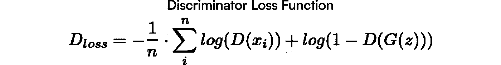**

**现在 **xi 是来自数据集**的真实例子，而 **G(z)是由生成器(G)生成的输出**。因此，我们不是给函数一个单一的输入，而是同时引入两个:D(Xi)和 G(z)。此外，n = m**

## **优化功能**

**我们知道，鉴频器想要最小化它的损耗，因此，它想要最小化上面的公式( *argmin Dloss* )。然而，我们可以通过去掉负号来修改公式。现在，我们必须最大化它，而不是最小化表达式:**

**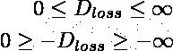**

**以前，要获得 Dloss = 0，我们必须将其最小化。但是现在我们改变了表达式符号，我们必须最大化它以获得- Dloss = 0**

**最后，我们可以操作这些条款:**

**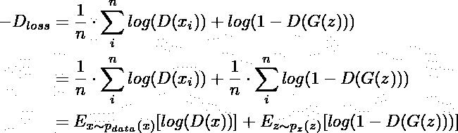**

**- Dloss 的最终表达式。Ex~p(x)表示期望值**

**并重写表达式:**

****

****鉴别器优化功能****

**另一方面，生成器的目标是伪造鉴别器。然后，发生器必须执行与鉴别器相反的操作，并且**找到 V(G，D)** 的最小值。**

**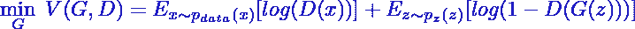**

****发电机优化功能****

**现在我们可以将两个表达式(鉴别器和生成器优化函数)相加，并获得最后一个表达式:**

**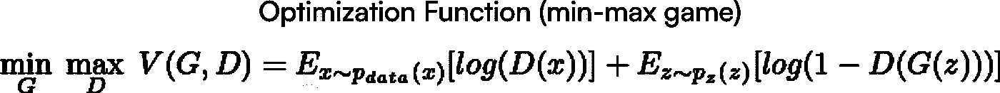**

****最小最大游戏****

**( *Tadaa！*)我们终于得到了优化函数。然而，正如我之前说过的，这不是总损失函数，它告诉我们模型的整体性能。但在此之前，我们需要首先计算发电机损耗:**

## **发电机损耗函数**

**再回头看优化函数，我们看到生成器只参与表达式*E(log(1-D(G(z)))】*的第二项，而第一项保持不变。因此，试图最小化的发电机损耗函数为:**

**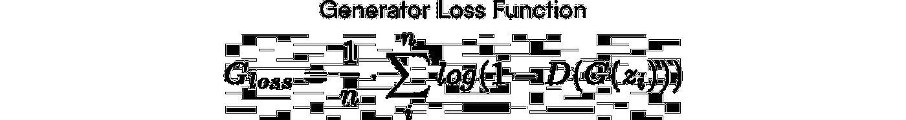**

**然而，我们还没有完成。正如原论文 ***中所解释的，“在学习的早期，当 G 很差的时候，D 可以以很高的置信度拒绝样本，因为它们与训练数据明显不同。”*** 即在训练的初期，鉴别器很容易区分真实图像和生成的图像，因为生成器还没有学会。这种情况下，log(1D(G(z))会饱和，因为 D(G(z))∞0**

**为了避免这种情况，研究人员提出如下: ***“与其训练 G 使 log(1d(G(z))最小化，我们可以训练 G 使 log D(G(z))最大化”*** *。* 这就等于说，不是训练生成器最小化图像是假的概率，而是要最大化图像是真的概率。**

**从本质上讲，两种优化方法是相同的，正如我们在图表中看到的:**

**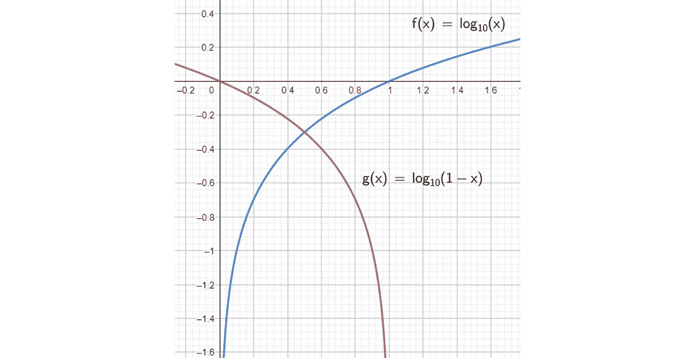**

**在[0，1]范围内最小化 log(1-x)与最大化 log(x)是一样的。作者图片**

**因此，出于我们的目的，我们将使用的发电机损耗函数为:**

****

****非饱和发电机损耗功能**。重要的是要记住，现在 **G 想要最大化这个函数****

> ****注**。实际中，在对发电机损耗函数进行编码时，**通常使用上述公式的负形式**，这样，目标不是使函数最大化，而是使其最小化。从而便于用诸如 Tensorflow 之类的库来调整参数。这对于理解下一节的**总损耗函数**也很重要。**

# **3.总损失函数**

**文中给出了各部件(发生器和鉴别器)的损耗公式，以及模型的优化功能。但是，**我们如何衡量**型号的整体性能呢？**

**只看优化函数并不是一个好的衡量标准，因为正如我们已经看到的，优化函数是鉴频器损耗函数的修改，因此它并不反映发电机的性能(尽管发电机损耗函数是从它派生出来的，但我们只是在该函数中考虑了鉴频器的性能)**

**另一方面，可以考虑增加两个损失函数(鉴别器和发生器),虽然这是一个很好的直觉，但我们需要考虑一些细微差别:**

****1。两个损失函数都必须以最小化或最大化为目标**。**

**否则，相加将反映比应该的误差更高或更低的误差。
举个例子，让我们来看看想要通过 D 最大化的优化函数:**

**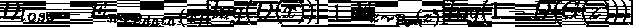**

**和旨在通过 G 最小化的第一发电机损耗函数:**

**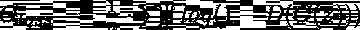**

**当 D 做得很差(低误差)而 G 做得很好(低误差)时，整体性能将产生低误差，这意味着两个网络(G 和 D)都做得很好，尽管我们知道其中一个不是。
此外，如果一个损失的目标是最小化，另一个是最大化，我们就不知道高误差是好是坏。**

> ****注**。如果我们使用以最大化为目标的损失函数，称之为“误差”可能听起来违反直觉，因为“误差”越高，性能越好。然而，我们也可以使用对数标度来转换它，例如 log(1+“误差”)**

****2。为了建立总损失函数，单个损失必须在相同的数值范围内****

**现在让我们以我们讨论的第一个鉴别器损耗(二元交叉熵)为例:**

**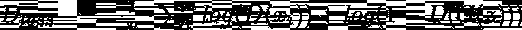**

**以及在最后一点中使用的先前的发电机损耗函数:**

****

**现在两个函数都满足目标最小化的条件。然而，鉴频器损耗在[0，+∞]范围内，而发电机损耗输出值在(-∞，0)范围内。将这两个函数相加等同于减去发生器损耗，因此我们说总损耗是没有发生器影响的鉴频器损耗(即 E(log(D(xi))，其中 E 表示期望值)，这是不正确的。**

**然而，我们还有另一个加法组合。**如果我们加上第一个鉴频器损耗和修正发电机损耗的负形式会怎么样？****

**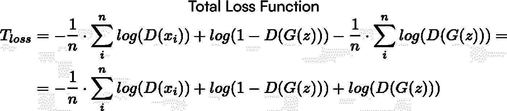**

****GAN 模型的总损失函数**。这个函数告诉我们模型的整体性能**

**(*万岁！*)这是 GAN 总损耗函数。然而，万一你不相信我，让我们检查它是否满足性质。**

**✅ 1.我们知道，Dloss 旨在最小化，负形式的修正发电机损耗也旨在最小化。**

**✅ 2.Dloss 输出范围[0，+∞)内的值，结果是负的修正发电机损耗也将值映射到相同的范围内。**

**因此，我们增加了相同类别的误差，并因此计算了我们模型的总损失函数。**

# **4.结论**

**总结本文的主要要点:**

1.  **甘优化函数(也叫极小极大博弈)和模型的总损失是不同的概念:
    **极小极大优化≠总损失****
2.  **优化函数的来源来自于**二进制交叉熵**(其反过来是鉴别器损耗)，并且还从其导出发电机损耗函数。**
3.  **发电机损耗函数在实践中被修改，使得对数不饱和。并且这种修改对于计算模型的总损失函数也是有用的。**
4.  ****总损失函数= Dloss +光泽度**。然而，并不是所有的公式都可以使用，我们需要考虑两个关键点:
    -两个单独的损失函数都必须以最小化或最大化为目标。
    -各项损失必须在相同的数值范围内**

**我希望你喜欢这篇文章，它对你有所帮助。请不吝赐教。欢迎任何反馈或更正**

# **5.参考**

****[***生成性对抗性网络***](https://arxiv.org/abs/1406.2661) 。伊恩·古德菲勒等人，2014 年****

******【2】**[***层次文本——有条件的图像生成带剪辑潜影* (DALL-E 2 纸)**](https://cdn.openai.com/papers/dall-e-2.pdf) 。OpenAI 2022****

******【3】**[**GLIDE:利用文本引导的扩散模型实现真实感图像生成和编辑**](https://arxiv.org/pdf/2112.10741.pdf) 。****