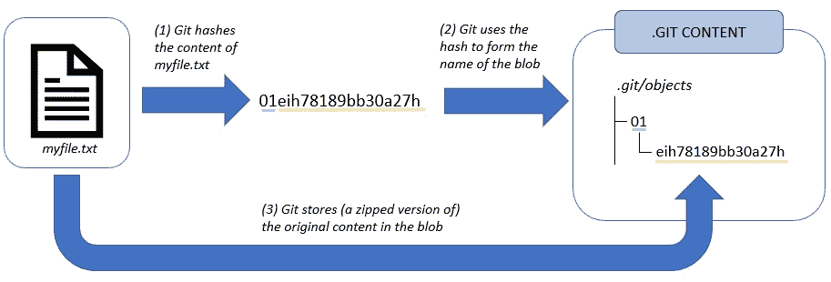
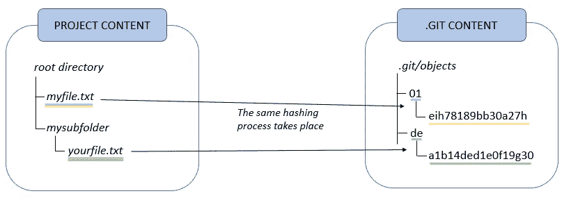
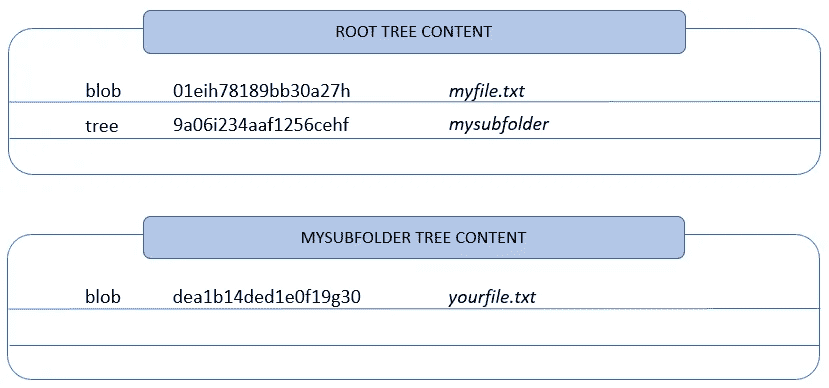
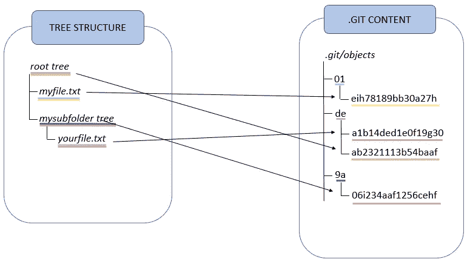
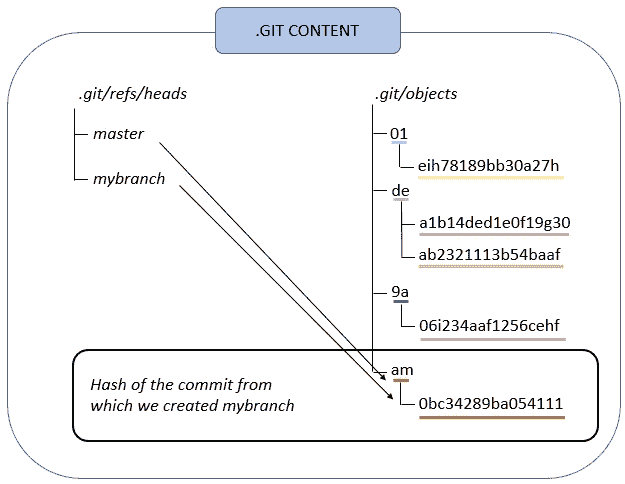
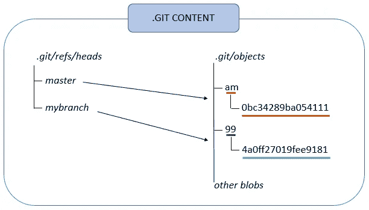
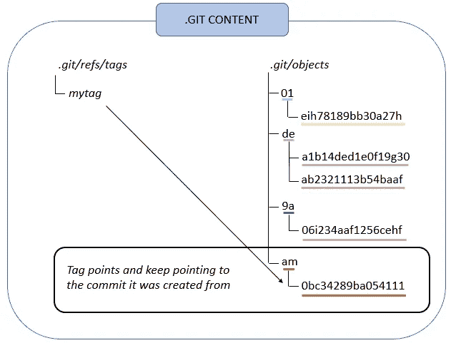
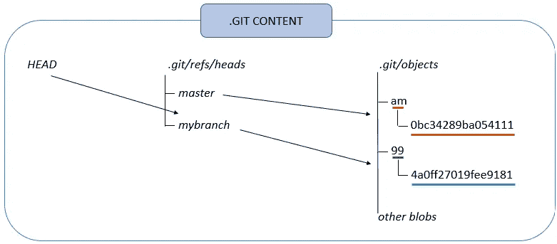

# Git 的真实工作方式

> 原文：<https://towardsdatascience.com/how-git-truly-works-cd9c375966f6>

## 深入了解 Git 的内部知识并掌握它

照片由[扬西·敏](https://unsplash.com/@yancymin?utm_source=medium&utm_medium=referral)在 [Unsplash](https://unsplash.com?utm_source=medium&utm_medium=referral) 上拍摄

# #简介

Git 无疑是现代软件开发的主要**基石之一。它是协调开发人员工作的必备工具箱，并成为多年来开源运动的基本引擎。简单来说，截至 2021 年 11 月，Git 的主要存储库管理器 GitHub 报告称有超过 7300 万开发人员和超过 2 亿个**存储库。

有几个程序员每天都和 Git 打交道，并且共同应用关键概念。在本次讲座中，我们将 ***进行下一步*** ，深入探究 Git 的内部结构和基本基础。什么是分支？什么是头？合并一个分支意味着什么？今天，我们将回答这些问题和其他问题。

*在我们开始之前，我要特别感谢拉朱·甘地，他通过精彩的讲座“Git next steps”帮助我完成了这篇文章，该讲座可以在*[*O ' Reilly*](https://www.oreilly.com/live-events/git-next-steps/0636920457459/0636920057583/)*上找到。他清晰完整的解释是我灵感的源泉。*

# #基础

Blobs、树和提交是 Git 数据结构的主要组成部分。正如一所房子是由砖块建造的，或者一个图形是由边和节点组成的，这些元素构成了 Git 的基础。

为了理解这些，让我们从一个例子开始。假设我们创建了一个空的存储库。当我们启动命令 *git init* 时，git 会自动创建一个名为*的隐藏文件夹。git* 用于存放内部零件。

## **斑点**

现在，假设我们创建一个名为 *myfile.txt* 的文件，并使用命令 *git add myfile.txt.* 将其添加到我们的存储库中

当我们执行这个操作时，Git 创建一个 **blob** ，一个位于子文件夹*中的文件。git/objects* **存储 *myfile.txt、*的内容**，不包含的任何相关元数据(如创建时间戳、作者等)。因此，**创建 blob 就像存储文件**内容的图片。

blob 的名称**与其内容**的散列相关。一旦内容被散列，前两个字符用于在*中创建一个子文件夹。git/objects* ，而散列的剩余字符构成了 blob 的名称。

总之，当向 Git 添加文件时，会发生以下步骤:

1.  Git 获取文件的内容并对其进行哈希处理
2.  Git 在*中创建一个 blob。git/objects* 文件夹。哈希的前两个字符用于在该路径中创建子文件夹。在其中，Git 创建了一个 blob，其名称由哈希的剩余字符组成。
3.  Git 将原始文件的内容(它的压缩版本)存储在 blob 中。

创建 blob 时 Git 执行的过程的描述(图片由作者提供)

请注意，如果我们有一个名为 *myfile.txt* 的文件和另一个名为 *ourfile.txt、*的文件，并且这两个文件**共享相同的内容，则它们具有相同的散列值**，因此它们存储在同一个 blob 中。

还要注意，如果我们稍微修改 *myfile.txt* 并将其重新添加到存储库中，Git 会执行相同的过程，因为内容发生了变化，所以会创建一个新的 blob。

## 树

假设现在我们在存储库中创建了一个名为*子文件夹的子文件夹。*我们还可以在这个子文件夹中创建一个名为 *yourfile.txt* 的文件，并将其添加到存储库中。这样做的时候，Git 根据我们在上一段中定义的过程为 *yourfile.txt* 创建一个新的 blob。

Git 散列第二个名为 yourfile.txt 的文件，该文件存储在文件夹中。git/objects(图片由作者提供)

此时，我们用命令 *git commit 提交 *myfile.txt* 和 *yourfile.txt* 。*这样做时，Git 采取了两个步骤:

*   它创建了存储库的根树
*   它创建了**提交**

让我们专注于第一步。那么，什么是根树呢？一个**根树存储了整个库**的文件和文件夹的结构。它是一个文件，包含对存储库中包含的每个 blob 或子文件夹的引用，**以递归方式构建**。

根树的每一行引用一个斑点或其他子树**，这些子树又以相同的方式引用其他斑点或其他子树**。因此，树**相当于目录**:正如我们可以从目录中访问*文件和子文件夹一样，我们也可以从树*中访问*blob 和子树。*

与 mysubfolder 相关的根树和子树的内容(图片由作者提供)

一旦 Git 创建了根树和所有相关的子树，它就执行我们上面描述的相同的散列和存储操作。更准确地说，它**对每棵树**进行散列，并使用前两个字符在*中创建一个子文件夹。git/objects* 而剩余的散列字符形成保存文件的名称。因此，从这个过程中，我们得到了与数据结构中树的数量一样多的新文件。

Git 散列根树和与 mysubfolder 相关的子树，两者都存储在文件夹中。git/objects(图片由作者提供)

## 犯罪

当运行命令 *git commit* 时，第二步是创建提交。提交内容存储在一个文件中，该文件包含与根树、父提交(如果有)相关的信息，以及一些元数据，如提交者的姓名和电子邮件以及提交消息。

提交文件包含对根树的散列、作者和提交者、提交时间戳(在本例中为 163267988)、父提交(在本例中为空，因为这是我们的第一次提交)和提交消息(作者的图像)的引用

一旦创建了提交文件，Git 就对其内容进行散列，并使用散列名称将内容存储在一个新文件中，与上面完全一样(前两个字符构成了*中的子文件夹名称)。git/objects* ，而哈希的剩余部分构成了实际的名称)。

到目前为止所有树、提交和 blobs 的结构(图片由作者提供)

那就是。恭喜你，你刚刚意识到 Git 是如何构造的。现在，有了这些概念，定义 branch、tag、head 和 merge 的概念就非常简单了！

# #砖块

## 分支

分支被命名为提交的引用。例如，当创建一个名为 *mybranch* 的新分支时(以命令 *git checkout -b mybranch* 为例)，Git 在路径*中生成一个新文件。git/refs/heads* 命名为 *mybranch。*这个文件的内容**是创建分支**的提交的散列。

最初，master 和 mybranch 都指向同一个提交(作者图片)

然后，当我们在 *mybranch* 上提交时，Git 执行之前定义的操作(它创建根树并提交文件)，然后**用新的提交散列**更新分支的文件。

执行新的提交，并且用文件 mybranch 的内容对其进行更新。文件 mybranch 现在指向新的提交(作者图片)

因此，**分支是跟踪提交的文件**，并且这些文件的内容在我们执行的每次提交时都被更新。

## 标签

标签是对特定提交的永久引用。例如，当我们创建一个名为 *mytag* 的新标签时(使用命令*Git tag mytag*),*Git 在路径*中生成一个新文件。git/refs/tags* 命名为 *mytag。*和分支的情况一样，这个文件包含创建标签的提交的散列。*

*然而，当我们继续我们的工作并在同一个(或其他)分支上提交时，标记文件没有更新，并且**继续指向从**创建它的特定提交。与分支文件不同，**标签在执行新提交**时不会移动。*

**

*执行了新的提交，但文件 mytag 没有更新(作者图片)*

## ***头***

*HEAD 在 Git 中执行一些任务:*

*   *这是 git 如何知道哪个提交被检出的**，所以当我们执行 *git 分支*时，Git 查看 HEAD 以知道我们在哪个分支上。***
*   *它引用下一个提交的父提交，所以 HEAD 指向的提交将是下一个提交的父提交。回想一下，当我们执行提交时，**父提交存储在提交文件**中。*

*如果我们在主分支上，HEAD 引用这个分支。如果我们打开头文件，我们会看到“ref: refs/heads/master”。相反，如果我们切换到分支 *mybranch* 并打开*中的头文件。git* 文件夹我们看到:“ref: refs/heads/mybranch”。因此，HEAD 并不直接指向一个提交，而是指向一个分支，该分支又指向那个分支上最近的提交。通过这种方式，Git 跟踪哪个提交当前被签出。*

**

*我们在树枝上。HEAD 指向文件 mybranch，它又指向一个特定的提交。与分支主文件相关的文件主文件指向另一个提交文件(作者图片)*

*当我们在一个分支上执行提交时，Git 读取头文件的内容，而**写入作为父提交**引用的提交。从这个意义上说，HEAD(间接)提供了下一个提交的父提交。*

**

*提交文件的内容。HEAD(间接)提供父提交(图片由作者提供)*

*现在，在 Git 中，我们可以检查到以前的提交，并从那里开始进行更改。这种模式称为**“分离模式”**。在这种情况下， **HEAD 直接指向提交，而不是指向分支**。请注意，这可能很危险，因为我们有丢失新提交的风险。事实上，在执行了提交之后，如果我们检查到一个分支，我们就不能再回到这个新的提交**，因为它没有被任何分支**引用！这就是为什么当我们处于分离模式时，在提交任何变更之前创建一个新的分支总是一个好的实践的原因！*

## *合并*

*Merge 允许连接两个或多个提交。有两种类型的合并:*

*   *第一种发生在两个分支分叉的时候。Git 创建了一个有两个父母的孩子。第一个父级是我们所在的分支，而第二个父级是将要合并的分支。提交文件将有两个父节点，HEAD 被移动到新的子节点。*
*   *第二种情况发生在两个分支没有分叉，但实际上一个分支是另一个分支的延续。在这种情况下，合并被称为快进合并，它不是真正的合并，因为**没有冲突**。在这种情况下，Git 只是将 HEAD 和当前分支移动到从要合并的分支指向的同一个提交。*

*就是这样。恭喜你走了这么远！希望你喜欢这篇文章！到目前为止，您应该已经很好地理解了 Git 是如何工作的。有问题请随时评论！*

*回头见，保持黄金！:)*